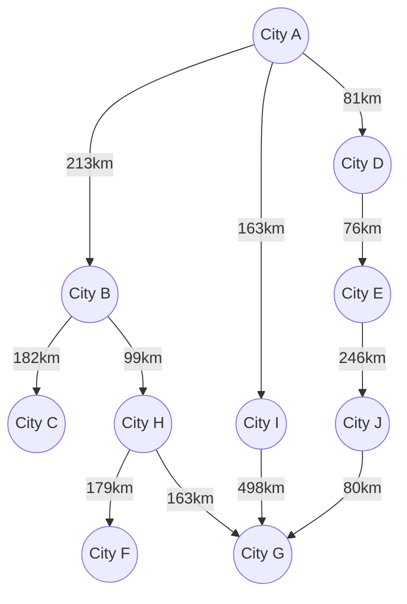
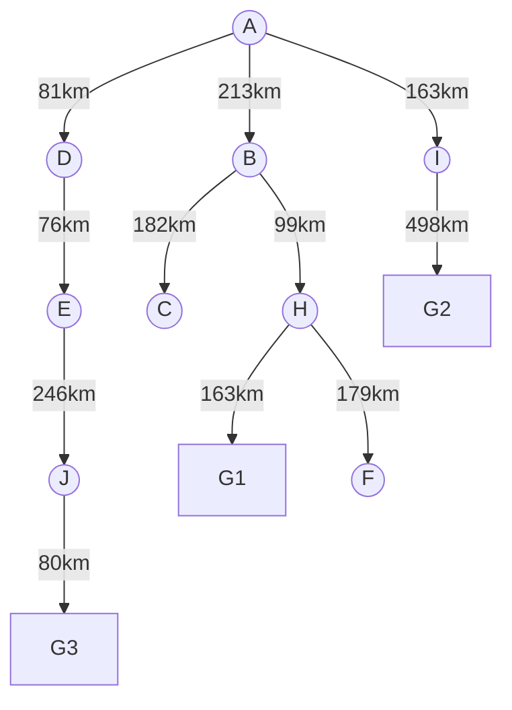

## Simple Agent and Uninfomed search

```mermaid
graph TD
    CityA((City A))
    CityB((City B))
    CityC((City C))
    CityD((City D))
    CityE((City E))
    CityF((City F))
    CityG((City G))
    CityH((City H))
    CityI((City I))
    CityJ((City J))

    CityA -- 81km --> CityD
    CityA -- 213km --> CityB
    CityA -- 163km --> CityI
    CityB -- 182km --> CityC
    CityB -- 99km --> CityH
    CityD -- 76km --> CityE
    CityE -- 246km --> CityJ
    CityH -- 163km --> CityG
    CityH -- 179km --> CityF
    CityI -- 498km --> CityG
    CityJ -- 80km --> CityG
```

## Convert Directed Graph to Tree

```mermaid
graph TD
    A((A))
    B((B))
    C((C))
    D((D))
    E((E))
    F((F))
    H((H))
    I((I))
    J((J))

    A -->|81km| D
    A -->|213km| B
    A -->|163km| I
    B -->|182km| C
    B -->|99km| H
    D -->|76km| E
    E -->|246km| J
    H -->|163km| G1
    H -->|179km| F
    I -->|498km| G2
    J -->|80km| G3
```