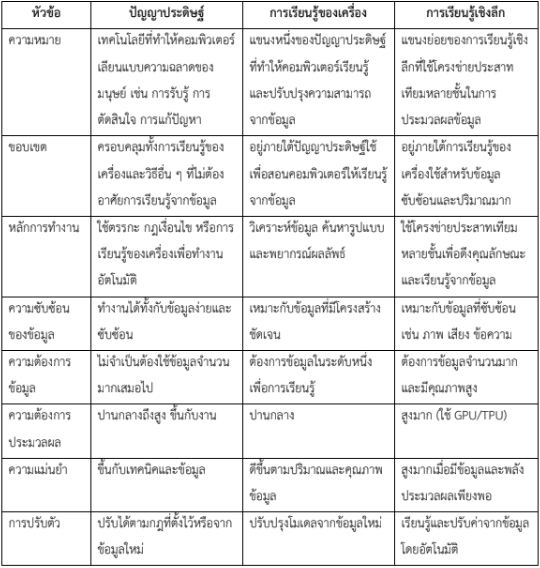

# คำศัพท์สำคัญในการค้นหา (Search Algorithms)

## การแบ่งประเภทของการค้นหา

- **Uninformed Search** - การค้นหาแบบไม่มีข้อมูล คือ การค้นหาที่ไม่มีความรู้เพิ่มเติมเกี่ยวกับปัญหา นอกจากคำอธิบายปัญหาเท่านั้น
  - **BFS (Breadth-First Search)** - การค้นหาแบบกว้างก่อนลึก คือ ค้นหาทุกโหนดในระดับความลึกเดียวกันก่อนไปยังระดับถัดไป
  - **DFS (Depth-First Search)** - การค้นหาแบบลึกก่อนกว้าง คือ ค้นหาตามเส้นทางจนสุดก่อนย้อนกลับมาลองเส้นทางอื่น
  - **UCS (Uniform Cost Search)** - การค้นหาแบบต้นทุนสม่ำเสมอ คือ ค้นหาโดยขยายโหนดที่มีต้นทุนน้อยที่สุดก่อนเสมอ

- **Informed Search** - การค้นหาแบบมีข้อมูล คือ การค้นหาที่มีข้อมูลเพิ่มเติมเกี่ยวกับปัญหา ทำให้สามารถค้นหาได้อย่างมีประสิทธิภาพมากขึ้น
  - **A* Search** - อัลกอริทึม A* คือ การค้นหาที่ใช้ทั้งต้นทุนที่ใช้มาแล้วและค่าประมาณต้นทุนที่เหลือ (f = g + h)
  - **Greedy Best-First Search** - การค้นหาแบบละโมบ คือ การค้นหาที่เลือกโหนดที่คาดว่าจะใกล้เป้าหมายที่สุดก่อนเสมอ

## อัลกอริทึมการค้นหาแบบไม่มีข้อมูล (Uninformed Search Algorithms)

- **Uniform Cost Search (UCS)** - การค้นหาที่ใช้ต้นทุน (cost) ของเส้นทางเป็นเกณฑ์ในการเลือกเส้นทางที่จะขยายต่อไป
  - ใช้โครงสร้างข้อมูลแบบ priority queue ในการจัดการกับเส้นทาง
  - เหมาะสำหรับปัญหาที่มีต้นทุนแตกต่างกันในแต่ละเส้นทาง
  - มีความสมบูรณ์ (completeness) และให้ผลลัพธ์เป็นเส้นทางที่ดีที่สุด (optimal)
  - เป็นการประยุกต์ของอัลกอริทึม Dijkstra สำหรับปัญหาการค้นหาเส้นทาง

- **Depth-Limited Search (DLS)** - การค้นหาแบบจำกัดความลึก คือ DFS ที่กำหนดขีดจำกัดความลึกสูงสุด เพื่อป้องกันการค้นหาไปไม่สิ้นสุด
  
- **Iterative Deepening Search (IDS)** - การค้นหาแบบเพิ่มความลึกทีละขั้น คือ การทำ DLS โดยค่อยๆ เพิ่มขีดจำกัดความลึกทีละระดับ

- **Bidirectional Search** - การค้นหาแบบสองทิศทาง คือ การค้นหาพร้อมกันจากจุดเริ่มต้นและจุดหมาย และเชื่อมเส้นทางเมื่อพบกัน

## อัลกอริทึมการค้นหาแบบมีข้อมูล (Informed Search Algorithms)

- **Heuristic Function** - ฟังก์ชันฮิวริสติก คือ ฟังก์ชันที่ให้ค่าประมาณของต้นทุนที่น้อยที่สุดจากโหนดปัจจุบันไปยังเป้าหมาย

- **Admissible Heuristic** - ฮิวริสติกที่ยอมรับได้ คือ ฮิวริสติกที่ไม่ประมาณต้นทุนสูงเกินความเป็นจริง ทำให้ A* ให้ผลลัพธ์เป็นเส้นทางที่ดีที่สุด

- **Manhattan Distance** - ระยะแมนฮัตตัน คือ ฮิวริสติกที่คำนวณระยะทางโดยการเดินตามแกน x และแกน y (|x1-x2| + |y1-y2|)

- **Diagonal Distance** - ระยะทางแนวทแยง คือ ฮิวริสติกที่อนุญาตการเคลื่อนที่แนวทแยง โดยคำนวณจากการเคลื่อนที่แนวทแยงและแนวตรง

- **Euclidean Distance** - ระยะยูคลิด คือ ฮิวริสติกที่คำนวณระยะทางเส้นตรงระหว่างสองจุดในพื้นที่แบบยูคลิด (√((x1-x2)² + (y1-y2)²))

## คุณสมบัติและแนวคิดสำคัญ

- **Optimal Path** - เส้นทางที่ดีที่สุด คือ เส้นทางที่มีต้นทุนต่ำที่สุดจากจุดเริ่มต้นไปยังเป้าหมาย

- **Completeness** - ความสมบูรณ์ คือ คุณสมบัติของอัลกอริทึมที่รับประกันว่าจะพบเป้าหมายถ้ามีเส้นทางไปยังเป้าหมายนั้น

- **Time Complexity** - ความซับซ้อนเชิงเวลา คือ การวัดว่าอัลกอริทึมใช้เวลามากขึ้นอย่างไรเมื่อขนาดของปัญหาเพิ่มขึ้น

- **Space Complexity** - ความซับซ้อนเชิงพื้นที่ คือ การวัดว่าอัลกอริทึมใช้หน่วยความจำมากขึ้นอย่างไรเมื่อขนาดของปัญหาเพิ่มขึ้น

- **Evaluation Function (f)** - ฟังก์ชันประเมินค่า ในอัลกอริทึม A* คือ f(n) = g(n) + h(n) โดย g(n) เป็นต้นทุนที่ใช้มาแล้ว และ h(n) เป็นค่าประมาณต้นทุนที่เหลือ

