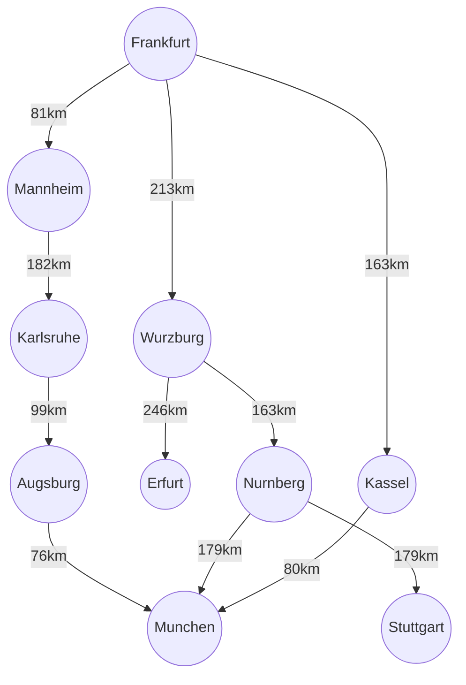
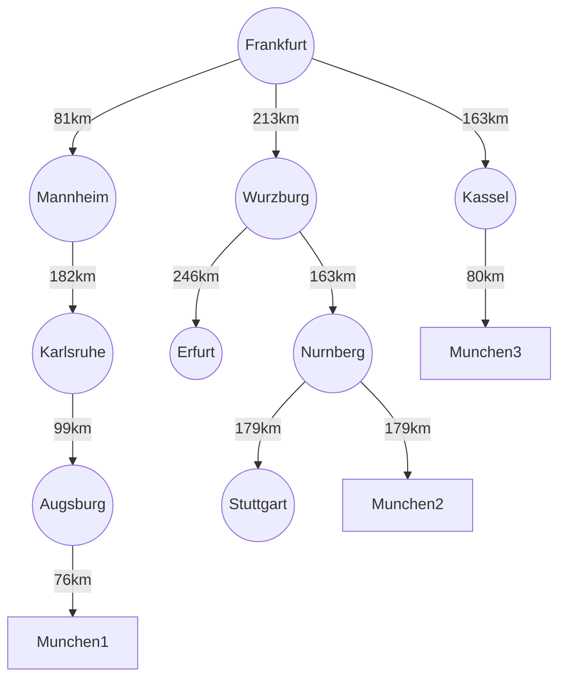

## Simple Agent and Uninfomed search task3.1 && Task3.3



- graph python breadth-first search
```python
graph = {
    'Frankfurt': ['Mannheim', 'Wurzburg', 'Kassel'],
    'Mannheim': ['Karlsruhe'],
    'Karlsruhe': ['Augsburg'],
    'Augsburg': ['Munchen'],
    'Wurzburg': ['Erfurt', 'Nurnberg'],
    'Erfurt': [],
    'Nurnberg': ['Stuttgart', 'Munchen'],
    'Stuttgart': [],
    'Kassel': ['Munchen']
}
visited = []
queue = []

def bfs(visit, graph, node):
    visited.append(node)
    queue.append(node)

    while queue:
        m = queue.pop(0)
        print(m, end=" ")

        for neighbour in graph[m]:
            if neighbour not in visited:
                visited.append(neighbour)
                queue.append(neighbour)

print("Following is the Breadth-First Search")
bfs(visited, graph, 'Frankfurt')
```

- graph python depth-first search
```python
graph = {
    'Frankfurt': ['Mannheim', 'Wurzburg', 'Kassel'],
    'Mannheim': ['Karlsruhe'],
    'Karlsruhe': ['Augsburg'],
    'Augsburg': ['Munchen'],
    'Wurzburg': ['Erfurt', 'Nurnberg'],
    'Erfurt': [],
    'Nurnberg': ['Stuttgart', 'Munchen'],
    'Stuttgart': [],
    'Kassel': ['Munchen']
}

visited = set()

def dfs(visited, graph, node):
    if node not in visited:
        print(node)
        visited.add(node)
        for neighbour in graph[node]:
            dfs(visited, graph, neighbour)

print("Following is the Depth-First Search")
dfs(visited, graph, 'Frankfurt')
```

- graph python uniform-cost search
```python
import heapq
import networkx as nx
import matplotlib.pyplot as plt

def uniform_cost_search(graph, start, goal):
    priority_queue = [(0, start)]
    visited = {start: (0, None)}  

    while priority_queue:
        current_cost, current_node = heapq.heappop(priority_queue)
        if current_node == goal:
            return current_cost, reconstruct_path(visited, start, goal)
        
        for neighbor, cost in graph[current_node]:
            total_cost = current_cost + cost

            if neighbor not in visited or total_cost < visited[neighbor][0]:
                visited[neighbor] = (total_cost, current_node)
                heapq.heappush(priority_queue, (total_cost, neighbor))
    return None

def reconstruct_path(visited, start, goal):

    path = []
    current = goal
    while current is not None:
        path.append(current)
        current = visited[current][1]
    path.reverse()
    return path

def visualize_graph(graph, path=None):
    G = nx.DiGraph()

    for node, edges in graph.items():
        for neighbor, cost in edges:
            G.add_edge(node, neighbor, weight=cost)
    pos = nx.spring_layout(G)

    plt.figure(figsize=(10, 6))
    nx.draw(G, pos, with_labels=True, node_color='lightblue', node_size=2000,font_size=15,font_weight='bold', edge_color='gray')
    labels = nx.get_edge_attributes(G, 'weight')
    nx.draw_networkx_edge_labels(G, pos, edge_labels=labels, font_color=12)

    if path:

        path_edges = list(zip(path, path[1:]))
        nx.draw_networkx_edges(G, pos, edgelist=path_edges, edge_color='red', width=2.5)

    plt.title("Uniform Cost Search Path Visualization")
    plt.show()

graph = {
    'Frankfurt': [('Mannheim', 81), ('Wurzburg', 213), ('Kassel', 163)],
    'Mannheim': [('Karlsruhe', 182)],
    'Karlsruhe': [('Augsburg', 99)],
    'Augsburg': [('Munchen', 76)],
    'Wurzburg': [('Erfurt', 246), ('Nurnberg', 163)],
    'Erfurt': [],
    'Nurnberg': [('Stuttgart', 179), ('Munchen', 179)],
    'Stuttgart': [],
    'Kassel': [('Munchen', 80)]
}
start_node = 'Frankfurt'
goal_node = 'Munchen'
result = uniform_cost_search(graph, start_node, goal_node)

if result:
    total_cost, path = result
    print(f"Least cost from {start_node} to {goal_node}: {'->'.join(path)} with total cost {total_cost}")
    visualize_graph(graph, path)
else:
    print(f"No path found from {start_node} to {goal_node}")
```        
#
## Convert Directed Graph to Tree


#

## Autonomous Planting Drone Simulation Task3.2
```python 
import random
import time # จำลองเวลาในการทำงาน

# --- Environment Class (ปรับปรุงให้ซับซ้อนขึ้น) ---
class PlantingEnvironment:
    def __init__(self, width=100, height=100):
        self.width = width
        self.height = height
        # สภาพแวดล้อมจำลอง: แผนที่ 2 มิติ
        # ค่าในแผนที่: 0=สะอาด, 1=สกปรก (ต้องการปลูก), 2=มีสิ่งกีดขวาง
        self.grid = [[0 for _ in range(width)] for _ in range(height)]
        self.seed_stock = 100 # จำนวนเมล็ดพันธุ์เริ่มต้นที่สถานี
        self.charging_station_location = (0, 0) # ตำแหน่งสถานีชาร์จ/เติมเมล็ด

        # สุ่มกำหนดพื้นที่ที่ต้องการปลูก (สกปรก) และสิ่งกีดขวาง
        self._initialize_grid()

    def _initialize_grid(self):
        # สุ่มพื้นที่สกปรก (ต้องการปลูก)
        for _ in range(self.width * self.height // 10): # ประมาณ 10% ของพื้นที่
            x, y = random.randint(0, self.width - 1), random.randint(0, self.height - 1)
            self.grid[y][x] = 1

        # สุ่มสิ่งกีดขวาง (เช่น ต้นไม้ใหญ่, ก้อนหิน)
        for _ in range(self.width * self.height // 20): # ประมาณ 5% ของพื้นที่
            x, y = random.randint(0, self.width - 1), random.randint(0, self.height - 1)
            self.grid[y][x] = 2

    def get_percept_at(self, x, y, drone_altitude=5):
        # จำลองการรับรู้ของ Sensor ที่ตำแหน่ง (x,y) และความสูง (drone_altitude)
        # ข้อมูลที่ Agent รับรู้จะซับซ้อนกว่าแค่ "สกปรก" หรือ "สะอาด"
        percept = {
            'location_x': x,
            'location_y': y,
            'altitude': drone_altitude,
            'soil_moisture': random.uniform(0.1, 0.9), # ค่าความชื้นดิน (0.1 = แห้ง, 0.9 = เปียก)
            'temperature': random.uniform(15, 35), # อุณหภูมิ
            'wind_speed': random.uniform(0, 10), # ความเร็วลม
            'obstacle_detected': False, # จาก Lidar/Radar
            'ground_condition': 'unknown', # สภาพดินจาก Multi-spectral camera
            'has_existing_vegetation': False, # มีพืชเดิมหรือไม่
            'is_target_for_planting': (self.grid[y][x] == 1) # พื้นที่นี้ต้องการปลูกหรือไม่
        }

        # ตรวจสอบสิ่งกีดขวางจาก grid (จำลอง)
        if self.grid[y][x] == 2:
            percept['obstacle_detected'] = True

        # จำลองความชื้นดินและสภาพดินตามความต้องการปลูก
        if percept['is_target_for_planting']:
            if random.random() < 0.7: # 70% ของพื้นที่ที่ต้องการปลูกจะมีสภาพดี
                 percept['soil_moisture'] = random.uniform(0.5, 0.8) # ชื้นพอเหมาะ
                 percept['ground_condition'] = 'good_for_planting'
            else:
                 percept['soil_moisture'] = random.uniform(0.2, 0.4) # แห้งไป
                 percept['ground_condition'] = 'dry'

        # จำลองการตรวจจับพืชเดิม
        if random.random() < 0.2: # 20% ที่จะมีพืชเดิม
            percept['has_existing_vegetation'] = True

        return percept

    def plant_seed(self, x, y):
        if self.grid[y][x] == 1:
            self.grid[y][x] = 0 # เปลี่ยนสถานะเป็นปลูกแล้ว
            self.seed_stock -= 1
            print(f"    [Environment] Seed planted at ({x},{y}). Remaining seeds: {self.seed_stock}")
            return True
        return False

    def recharge_drone(self):
        print("    [Environment] Drone is recharging...")
        time.sleep(2) # จำลองเวลาชาร์จ
        return 100 # แบตเตอรี่เต็ม

    def refill_seeds(self):
        print("    [Environment] Drone is refilling seeds...")
        time.sleep(1) # จำลองเวลาเติมเมล็ด
        self.seed_stock += 50 # เติมเมล็ดเพิ่ม (สมมติเติม 50 เมล็ด)
        return self.seed_stock


# --- AutonomousPlantingDrone Class ---
class AutonomousPlantingDrone:
    def __init__(self, env: PlantingEnvironment):
        self.env = env
        self.current_x = env.width // 2 # เริ่มต้นกลางแผนที่
        self.current_y = env.height // 2
        self.battery_level = 100 # แบตเตอรี่เต็ม (0-100%)
        self.onboard_seed_count = 10 # จำนวนเมล็ดที่บรรทุกได้จำกัด
        self.performance_score = 0
        self.planted_locations = set() # เก็บตำแหน่งที่ปลูกแล้ว

        print(f"Drone initialized at ({self.current_x},{self.current_y}) with {self.onboard_seed_count} seeds.")

    def _move_to(self, target_x, target_y):
        # จำลองการเคลื่อนที่
        distance = abs(self.current_x - target_x) + abs(self.current_y - target_y)
        battery_cost_per_unit = 0.5 # สมมติว่าเคลื่อนที่ 1 หน่วยใช้แบต 0.5%
        self.battery_level -= (distance * battery_cost_per_unit)
        self.current_x = target_x
        self.current_y = target_y
        print(f"  Drone moved to ({self.current_x},{self.current_y}). Battery: {self.battery_level:.1f}%")

    def _is_valid_location(self, x, y):
        return 0 <= x < self.env.width and 0 <= y < self.env.height

    def _perform_planting(self, x, y):
        if self.onboard_seed_count > 0:
            print(f"  Attempting to plant at ({x},{y})...")
            # จำลองกลไกการเตรียมหลุม/ฝังเมล็ด
            print("    [Actuator] Preparing ground...")
            time.sleep(0.5)
            if self.env.plant_seed(x, y):
                self.onboard_seed_count -= 1
                self.performance_score += 1 # เพิ่มคะแนนเมื่อปลูกสำเร็จ
                self.planted_locations.add((x,y))
                print(f"    [Actuator] Seed released. Onboard seeds left: {self.onboard_seed_count}")
                print(f"    [Performance] Planted successfully. Score: {self.performance_score}")
                return True
            else:
                print("    [Actuator] Failed to plant: Location already planted or no target.")
        else:
            print("    [Actuator] No seeds left onboard. Need to refill.")
        return False

    def run(self, max_steps=50):
        print("--- Starting Drone Operation ---")
        for step in range(max_steps):
            print(f"\n--- Step {step + 1} ---")

            # 1. Percept (การรับรู้)
            # โดรนรับรู้สภาพแวดล้อมรอบตัว
            percept = self.env.get_percept_at(self.current_x, self.current_y)
            print(f"  Percept at ({self.current_x},{self.current_y}):")
            for key, value in percept.items():
                print(f"    - {key}: {value}")
            print(f"  Battery: {self.battery_level:.1f}%, Onboard Seeds: {self.onboard_seed_count}")

            # 2. Decide (การตัดสินใจ) - ตรรกะแบบ Simple Reflex (Rule-based)
            action = None

            # Rule 1: แบตเตอรี่ต่ำมาก? กลับฐานไปชาร์จ
            if self.battery_level < 20:
                print("  [Decision] Battery low. Returning to base for recharge.")
                self._move_to(self.env.charging_station_location[0], self.env.charging_station_location[1])
                self.battery_level = self.env.recharge_drone()
                self.onboard_seed_count = self.env.refill_seeds() # เติมเมล็ดด้วย
                action = 'recharge_and_refill'
            # Rule 2: เมล็ดหมด? กลับฐานไปเติมเมล็ด
            elif self.onboard_seed_count == 0:
                print("  [Decision] No seeds left. Returning to base to refill.")
                self._move_to(self.env.charging_station_location[0], self.env.charging_station_location[1])
                self.onboard_seed_count = self.env.refill_seeds()
                action = 'refill_seeds'
            # Rule 3: ตรวจเจอสิ่งกีดขวาง? เลี้ยวหลบ
            elif percept['obstacle_detected']:
                print("  [Decision] Obstacle detected. Avoiding.")
                # จำลองการเคลื่อนที่หลบ (เช่น ขยับไป 1 ช่องข้างๆ)
                new_x, new_y = self.current_x, self.current_y
                if self._is_valid_location(new_x + 1, new_y) and self.env.grid[new_y][new_x + 1] != 2:
                    new_x += 1
                elif self._is_valid_location(new_x - 1, new_y) and self.env.grid[new_y][new_x - 1] != 2:
                    new_x -= 1
                elif self._is_valid_location(new_x, new_y + 1) and self.env.grid[new_y + 1][new_x] != 2:
                    new_y += 1
                else: # ถ้าหลบไม่ได้จริงๆ ให้ข้ามไป
                    print("    Cannot move to avoid obstacle effectively, skipping this spot.")
                    action = 'skip_obstacle'

                if action != 'skip_obstacle':
                    self._move_to(new_x, new_y)
                    action = 'avoid_obstacle'

            # Rule 4: สภาพเหมาะสมและเป็นเป้าหมายในการปลูก และยังไม่เคยปลูกที่นี่? ทำการปลูก
            elif percept['is_target_for_planting'] and \
                 percept['soil_moisture'] >= 0.5 and \
                 not percept['has_existing_vegetation'] and \
                 (self.current_x, self.current_y) not in self.planted_locations: # ตรวจสอบว่าปลูกแล้วหรือยัง
                print("  [Decision] Conditions suitable for planting!")
                self._perform_planting(self.current_x, self.current_y)
                action = 'plant'
            # Rule 5: ไม่มีอะไรต้องทำที่นี่? เคลื่อนที่ไปหาพื้นที่อื่น
            else:
                print("  [Decision] Current location not ideal for planting or already planted/clean. Moving to explore.")
                # จำลองการเคลื่อนที่แบบสุ่มเพื่อค้นหาพื้นที่ใหม่
                next_x, next_y = self.current_x + random.choice([-1, 0, 1]), self.current_y + random.choice([-1, 0, 1])
                if not self._is_valid_location(next_x, next_y) or (next_x, next_y) == (self.current_x, self.current_y):
                    next_x, next_y = random.randint(0, self.env.width - 1), random.randint(0, self.env.height - 1) # สุ่มไปที่อื่นถ้าชนขอบ

                self._move_to(next_x, next_y)
                action = 'explore'

            self.battery_level -= 0.1 # แบตเตอรี่ลดลงเล็กน้อยทุก step
            if self.battery_level <= 0:
                print("--- Drone ran out of battery! ---")
                break

        print("\n--- Drone Operation Finished ---")
        print(f"Final Performance Score: {self.performance_score}")
        print(f"Total planted locations: {len(self.planted_locations)}")
        print(f"Remaining seeds in environment: {self.env.seed_stock}")


# --- การรันจำลอง ---
if __name__ == "__main__":
    env = PlantingEnvironment(width=20, height=20) # สร้างสภาพแวดล้อม 20x20
    drone = AutonomousPlantingDrone(env)
    drone.run(max_steps=100) # ให้โดรนทำงาน 100 ขั้นตอน
```