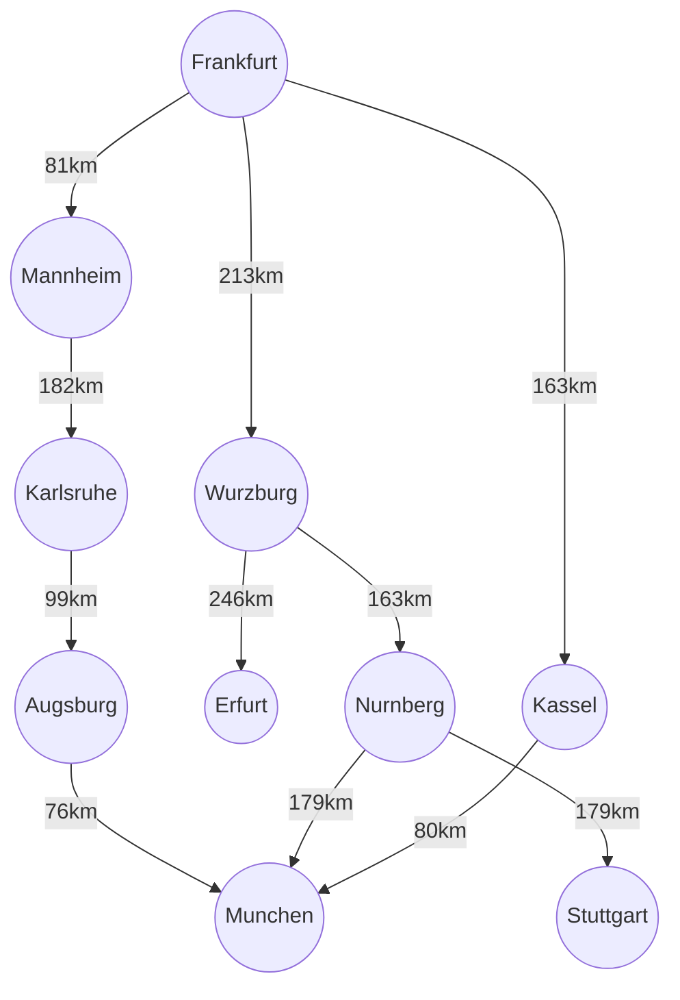
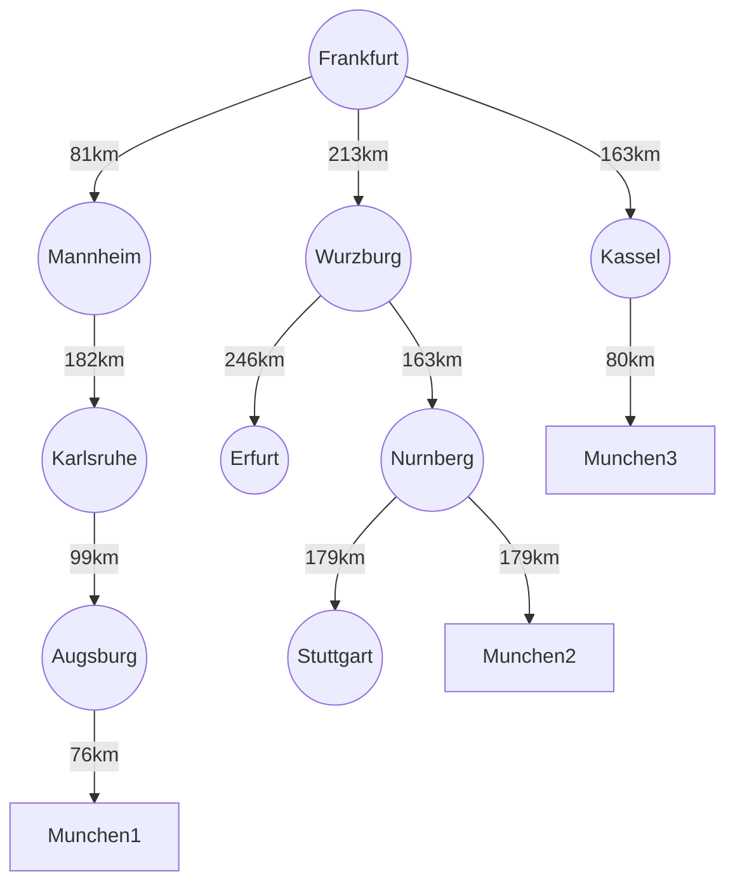

## Simple Agent and Uninfomed search



- graph python breadth-first search
```python
graph = {
    'Frankfurt': ['Mannheim', 'Wurzburg', 'Kassel'],
    'Mannheim': ['Karlsruhe'],
    'Karlsruhe': ['Augsburg'],
    'Augsburg': ['Munchen'],
    'Wurzburg': ['Erfurt', 'Nurnberg'],
    'Erfurt': [],
    'Nurnberg': ['Stuttgart', 'Munchen'],
    'Stuttgart': [],
    'Kassel': ['Munchen']
}
visited = []
queue = []

def bfs(visit, graph, node):
    visited.append(node)
    queue.append(node)

    while queue:
        m = queue.pop(0)
        print(m, end=" ")

        for neighbour in graph[m]:
            if neighbour not in visited:
                visited.append(neighbour)
                queue.append(neighbour)

print("Following is the Breadth-First Search")
bfs(visited, graph, 'Frankfurt')
```

- graph python depth-first search
```python
graph = {
    'Frankfurt': ['Mannheim', 'Wurzburg', 'Kassel'],
    'Mannheim': ['Karlsruhe'],
    'Karlsruhe': ['Augsburg'],
    'Augsburg': ['Munchen'],
    'Wurzburg': ['Erfurt', 'Nurnberg'],
    'Erfurt': [],
    'Nurnberg': ['Stuttgart', 'Munchen'],
    'Stuttgart': [],
    'Kassel': ['Munchen']
}

visited = set()

def dfs(visited, graph, node):
    if node not in visited:
        print(node)
        visited.add(node)
        for neighbour in graph[node]:
            dfs(visited, graph, neighbour)

print("Following is the Depth-First Search")
dfs(visited, graph, 'Frankfurt')
```

- graph python uniform-cost search
```python
import heapq
import networkx as nx
import matplotlib.pyplot as plt

def uniform_cost_search(graph, start, goal):
    priority_queue = [(0, start)]
    visited = {start: (0, None)}  

    while priority_queue:
        current_cost, current_node = heapq.heappop(priority_queue)
        if current_node == goal:
            return current_cost, reconstruct_path(visited, start, goal)
        
        for neighbor, cost in graph[current_node]:
            total_cost = current_cost + cost

            if neighbor not in visited or total_cost < visited[neighbor][0]:
                visited[neighbor] = (total_cost, current_node)
                heapq.heappush(priority_queue, (total_cost, neighbor))
    return None

def reconstruct_path(visited, start, goal):

    path = []
    current = goal
    while current is not None:
        path.append(current)
        current = visited[current][1]
    path.reverse()
    return path

def visualize_graph(graph, path=None):
    G = nx.DiGraph()

    for node, edges in graph.items():
        for neighbor, cost in edges:
            G.add_edge(node, neighbor, weight=cost)
    pos = nx.spring_layout(G)

    plt.figure(figsize=(10, 6))
    nx.draw(G, pos, with_labels=True, node_color='lightblue', node_size=2000,font_size=15,font_weight='bold', edge_color='gray')
    labels = nx.get_edge_attributes(G, 'weight')
    nx.draw_networkx_edge_labels(G, pos, edge_labels=labels, font_color=12)

    if path:

        path_edges = list(zip(path, path[1:]))
        nx.draw_networkx_edges(G, pos, edgelist=path_edges, edge_color='red', width=2.5)

    plt.title("Uniform Cost Search Path Visualization")
    plt.show()

graph = {
    'Frankfurt': [('Mannheim', 81), ('Wurzburg', 213), ('Kassel', 163)],
    'Mannheim': [('Karlsruhe', 182)],
    'Karlsruhe': [('Augsburg', 99)],
    'Augsburg': [('Munchen', 76)],
    'Wurzburg': [('Erfurt', 246), ('Nurnberg', 163)],
    'Erfurt': [],
    'Nurnberg': [('Stuttgart', 179), ('Munchen', 179)],
    'Stuttgart': [],
    'Kassel': [('Munchen', 80)]
}
start_node = 'Frankfurt'
goal_node = 'Munchen'
result = uniform_cost_search(graph, start_node, goal_node)

if result:
    total_cost, path = result
    print(f"Least cost from {start_node} to {goal_node}: {'->'.join(path)} with total cost {total_cost}")
    visualize_graph(graph, path)
else:
    print(f"No path found from {start_node} to {goal_node}")
```        
#
## Convert Directed Graph to Tree

