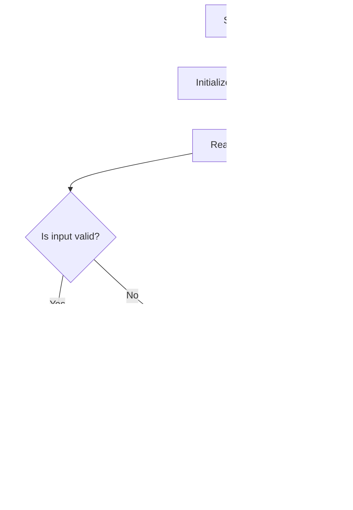
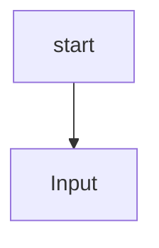

```mermaid
graph TD
    A[Start] --> B[Initialize variables]
    B --> C[Read input]
    C --> D{Is input valid?}
    D -- Yes --> E[Process input]
    D -- No --> F[Display error message]
    F --> C
    E --> G[Display result]
    G --> H[End]
    E --> I[Check for more input]
    I -- Yes --> C
    I -- No --> H
```

```mermaid
graph TD
    A[start]-->B
    B[Input]
```