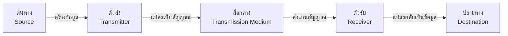
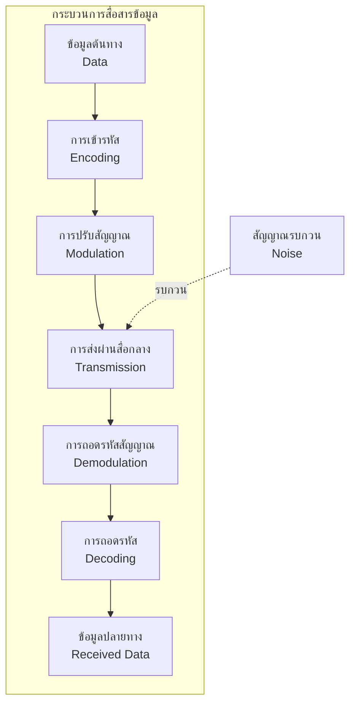
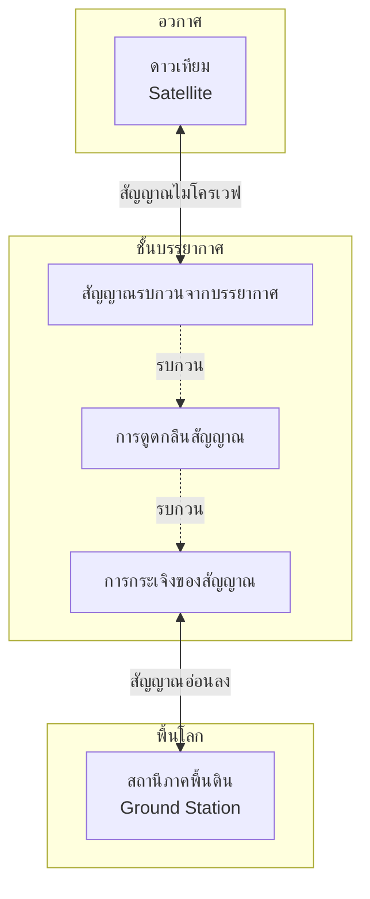
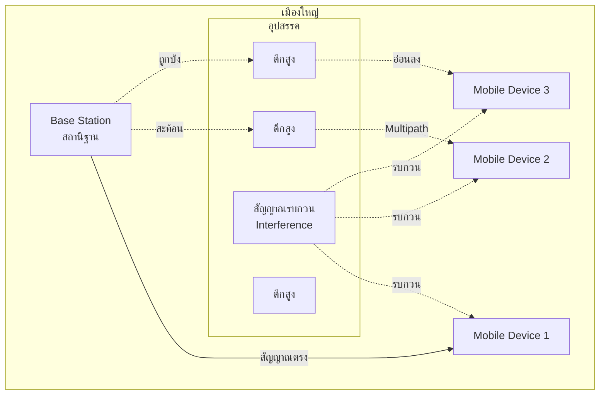
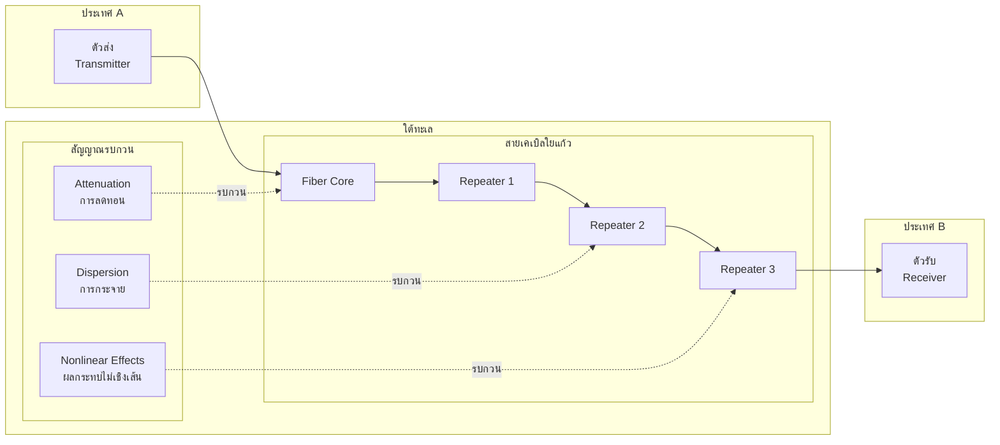
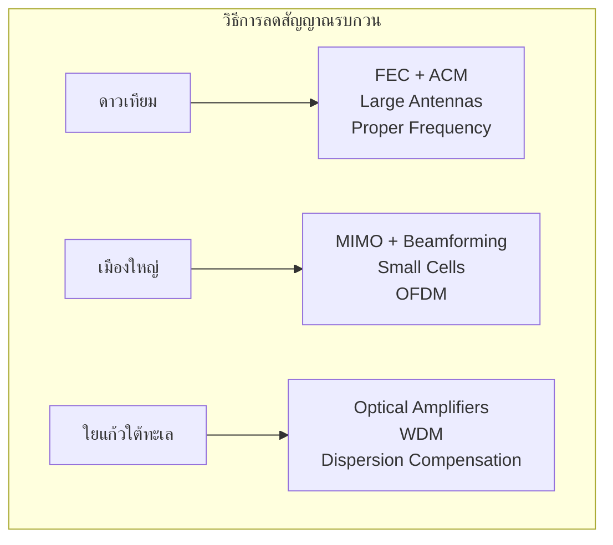

# คำตอบโจทย์ปัญหา Computer Network

## 1 ระบบสื่อสารข้อมูล

### 1.1 องค์ประกอบพื้นฐานของระบบสื่อสารข้อมูล

ระบบสื่อสารข้อมูลประกอบด้วย 5 องค์ประกอบหลัก ที่มีความสัมพันธ์กันในการส่งข้อมูลจากต้นทางไปยังปลายทาง

#### รายละเอียดองค์ประกอบและความสัมพันธ์:

1. **ต้นทาง (Source/Sender)**
   - เป็นจุดเริ่มต้นของข้อมูล
   - สร้างข้อมูลที่ต้องการส่ง (ข้อความ, รูปภาพ, เสียง, วิดีโอ)
   - ตัวอย่าง: คอมพิวเตอร์, โทรศัพท์, กล้อง

2. **ตัวส่ง (Transmitter)**
   - แปลงข้อมูลจากต้นทางให้อยู่ในรูปแบบสัญญาณที่เหมาะสมสำหรับการส่งผ่านสื่อกลาง
   - ทำหน้าที่เข้ารหัส (Encoding) และปรับสัญญาณ (Modulation)
   - ตัวอย่าง: Network Interface Card (NIC), Modem

3. **สื่อกลาง (Transmission Medium)**
   - เป็นเส้นทางที่สัญญาณเดินทางจากตัวส่งไปยังตัวรับ
   - แบ่งเป็น 2 ประเภท:
     - **มีการนำทาง (Guided)**: สายทองแดง, สายใยแก้วนำแสง
     - **ไม่มีการนำทาง (Unguided)**: คลื่นวิทยุ, ไมโครเวฟ, ดาวเทียม

4. **ตัวรับ (Receiver)**
   - รับสัญญาณจากสื่อกลาง
   - แปลงสัญญาณกลับเป็นข้อมูลที่เข้าใจได้
   - ทำหน้าที่ถอดรหัส (Decoding) และกรองสัญญาณรบกวน
   - ตัวอย่าง: Network Interface Card (NIC), Modem

5. **ปลายทาง (Destination/Receiver)**
   - จุดสิ้นสุดของการสื่อสาร
   - รับข้อมูลที่ถูกแปลงกลับมาแล้วเพื่อนำไปใช้งาน
   - ตัวอย่าง: คอมพิวเตอร์, โทรศัพท์, จอแสดงผล

#### ความสัมพันธ์ระหว่างองค์ประกอบ:

---

### 1.2 วิเคราะห์ผลกระทบของสัญญาณรบกวนและวิธีการลดผลกระทบ

#### สถานการณ์ที่ 1: การส่งข้อมูลระหว่างดาวเทียมกับสถานีภาคพื้นดิน

**ผลกระทบของสัญญาณรบกวน:**
- การดูดกลืนและกระเจิงของสัญญาณจากชั้นบรรยากาศ (Atmospheric Absorption & Scattering)
- ความล่าช้าในการส่งสัญญาณ (Propagation Delay) ประมาณ 240-280 มิลลิวินาที
- การรบกวนจากรังสีคอสมิก (Cosmic Radiation)
- การเปลี่ยนแปลงของสภาพอากาศ (ฝน, เมฆ) ทำให้สัญญาณอ่อนลง
- ผลดอปเปลอร์ (Doppler Effect) จากการเคลื่อนที่ของดาวเทียม

**วิธีการลดผลกระทบที่เหมาะสม:**

1. **ใช้ Forward Error Correction (FEC)**
   - เพิ่มข้อมูลซ้ำซ้อน (Redundancy) เพื่อตรวจจับและแก้ไขข้อผิดพลาดได้ทันที
   - ลด Retransmission ที่ใช้เวลานาน

2. **ใช้เทคนิค Adaptive Coding and Modulation (ACM)**
   - ปรับเปลี่ยนรูปแบบการเข้ารหัสและการปรับสัญญาณตามสภาพของช่องสัญญาณ
   - เมื่อสัญญาณดีใช้ modulation ที่ซับซ้อน เมื่อสัญญาณแย่ใช้ modulation ที่เรียบง่าย

3. **ใช้จานรับส่งสัญญาณขนาดใหญ่ (Large Dish Antennas)**
   - เพิ่มกำลังรับส่งสัญญาณ (Gain)
   - ลดสัญญาณรบกวนจากแหล่งอื่น

4. **ใช้ความถี่ที่เหมาะสม**
   - ใช้ C-band (4-8 GHz) หรือ Ku-band (12-18 GHz)
   - หลีกเลี่ยงความถี่ที่ดูดกลืนโดยน้ำและออกซิเจนในบรรยากาศ

5. **Interleaving และ Scrambling**
   - กระจายข้อมูลเพื่อลดผลกระทบของ Burst Error

---

#### สถานการณ์ที่ 2: การสื่อสารไร้สายในเมืองใหญ่ที่มีตึกสูงหนาแน่น

**ผลกระทบของสัญญาณรบกวน:**
- **Multipath Fading**: สัญญาณสะท้อนจากตึกและสิ่งกีดขวางทำให้สัญญาณมาถึงปลายทางหลายเส้นทาง
- **Shadow Fading**: ตึกสูงบังสัญญาณทำให้สัญญาณอ่อนลงหรือขาดหาย
- **Inter-Cell Interference**: การรบกวนระหว่าง Cell ที่อยู่ใกล้กัน
- **Co-Channel Interference**: การใช้ความถี่เดียวกันในพื้นที่ใกล้เคียง
- **Doppler Shift**: จากการเคลื่อนที่ของอุปกรณ์มือถือ

**วิธีการลดผลกระทบที่เหมาะสม:**

1. **MIMO (Multiple-Input Multiple-Output)**
   - ใช้หลายเสาอากาศทั้งฝั่งส่งและรับ
   - ใช้ประโยชน์จาก Multipath แทนที่จะถือว่าเป็นปัญหา
   - เพิ่มความเร็วและความน่าเชื่อถือ

2. **Beamforming**
   - มุ่งสัญญาณไปยังผู้รับโดยตรง
   - ลดสัญญาณรบกวนไปยัง Cell อื่น
   - เพิ่มความแรงของสัญญาณ

3. **Small Cell Deployment**
   - ติดตั้งสถานีฐานขนาดเล็กหนาแน่น (Femtocell, Picocell)
   - ลดระยะทางการส่งสัญญาณ
   - เพิ่มความจุของเครือข่าย

4. **OFDM (Orthogonal Frequency-Division Multiplexing)**
   - แบ่งสัญญาณออกเป็นหลายความถี่ย่อย
   - ทนทานต่อ Multipath Fading
   - ใช้ใน 4G LTE และ 5G NR

5. **Adaptive Power Control**
   - ปรับกำลังส่งตามสภาพสัญญาณ
   - ลดการรบกวนระหว่าง Cell

6. **Frequency Reuse Planning**
   - วางแผนการใช้ความถี่ให้ห่างกันเพียงพอ
   - ลด Inter-Cell Interference

7. **Diversity Techniques**
   - **Space Diversity**: ใช้หลายเสาอากาศห่างกัน
   - **Frequency Diversity**: ส่งข้อมูลซ้ำในความถี่ต่างกัน
   - **Time Diversity**: ส่งข้อมูลซ้ำในเวลาต่างกัน

---

#### สถานการณ์ที่ 3: การส่งข้อมูลผ่านสายใยแก้วนำแสงใต้ทะเล

**ผลกระทบของสัญญาณรบกวน:**

1. **Attenuation (การลดทอน)**
   - สัญญาณอ่อนลงตามระยะทาง
   - ในใยแก้วประมาณ 0.2-0.3 dB/km ที่ 1550 nm

2. **Chromatic Dispersion (การกระจายเชิงสี)**
   - ความยาวคลื่นต่างกันเดินทางด้วยความเร็วต่างกัน
   - ทำให้สัญญาณเบลอ (Pulse Broadening)

3. **Polarization Mode Dispersion (PMD)**
   - โหมดโพลาไรเซชันต่างกันเดินทางด้วยความเร็วต่างกัน

4. **Nonlinear Effects**
   - **Self-Phase Modulation (SPM)**
   - **Cross-Phase Modulation (XPM)**
   - **Four-Wave Mixing (FWM)**

5. **สัญญาณรบกวนจากสิ่งแวดล้อม**
   - แรงดันจากน้ำทะเลลึก
   - อุณหภูมิที่เปลี่ยนแปลง
   - กระแสน้ำและแผ่นดินไหว

**วิธีการลดผลกระทบที่เหมาะสม:**

1. **Optical Amplifiers (EDFA - Erbium-Doped Fiber Amplifier)**
   - ติดตั้งทุกๆ 40-100 กม.
   - ขยายสัญญาณแสงโดยตรงโดยไม่ต้องแปลงเป็นสัญญาณไฟฟ้า
   - ลดต้นทุนและเพิ่มประสิทธิภาพ

2. **Dispersion Compensation**
   - **Dispersion Compensating Fiber (DCF)**: ใยแก้วที่มี dispersion ตรงข้าม
   - **Fiber Bragg Grating (FBG)**: กระจกสะท้อนแสงเฉพาะความยาวคลื่น
   - **Digital Signal Processing (DSP)**: ประมวลผลสัญญาณดิจิทัลเพื่อแก้ไข dispersion

3. **WDM (Wavelength Division Multiplexing)**
   - ส่งหลายความยาวคลื่นในเส้นใยเดียว
   - เพิ่มความจุโดยไม่ต้องวางเคเบิลเพิ่ม
   - DWDM สามารถส่งได้มากกว่า 100 ช่องสัญญาณ

4. **Forward Error Correction (FEC)**
   - ตรวจจับและแก้ไขข้อผิดพลาดโดยไม่ต้อง Retransmission
   - ใช้ Reed-Solomon หรือ LDPC Codes

5. **Coherent Detection และ Digital Signal Processing**
   - ใช้เทคนิค Advanced Modulation (QPSK, 16-QAM, 64-QAM)
   - ประมวลผลสัญญาณดิจิทัลเพื่อแก้ไข Impairments
   - เพิ่มประสิทธิภาพการใช้แบนด์วิดท์

6. **การป้องกันทางกายภาพ**
   - เคเบิลมีโครงสร้างหลายชั้นป้องกัน
   - มีเกราะป้องกันจากความเสียหายทางกล
   - ฝังลึกใต้พื้นทะเลเพื่อหลีกเลี่ยงสมอเรือและอุปกรณ์ประมง

7. **Redundancy และ Protection Switching**
   - มีเส้นทางสำรอง (Backup Path)
   - สลับเส้นทางอัตโนมัติเมื่อเกิดขัดข้อง
   - ระบบตรวจสอบและซ่อมบำรุงต่อเนื่อง

---

## สรุปเปรียบเทียบวิธีการลดสัญญาณรบกวนในแต่ละสถานการณ์

| สถานการณ์ | ประเภทสัญญาณรบกวนหลัก | เทคนิคที่เหมาะสมที่สุด | เหตุผล |
|-----------|------------------------|----------------------|--------|
| **ดาวเทียม - พื้นดิน** | Atmospheric, Propagation Delay, Cosmic | FEC, Large Antennas, ACM | ระยะไกลมาก ไม่สามารถ Retransmit ได้ง่าย |
| **เมืองใหญ่** | Multipath, Shadow Fading, Interference | MIMO, Beamforming, Small Cells | หนาแน่น มีสิ่งกีดขวางมาก ต้องการความจุสูง |
| **ใยแก้วใต้ทะเล** | Attenuation, Dispersion, Nonlinear | Optical Amplifiers, WDM, DSP | ระยะไกลมาก ความจุสูง ความเสถียรสูง |

---

### หลักการสำคัญในการเลือกวิธีการลดสัญญาณรบกวน

1. **พิจารณาลักษณะของสัญญาณรบกวน**
   - Random Noise → FEC, Diversity
   - Systematic Errors → Equalization, Compensation

2. **พิจารณาข้อจำกัดของระบบ**
   - Bandwidth → Efficient Coding
   - Power → Amplification, Better Modulation
   - Latency → FEC แทน ARQ

3. **พิจารณาความคุ้มค่า (Cost-Benefit)**
   - ลงทุนในโครงสร้างพื้นฐาน vs. เทคโนโลยีการประมวลผล
   - ต้นทุนการดำเนินงาน vs. ประสิทธิภาพ

4. **พิจารณาความยืดหยุ่นในอนาคต**
   - สามารถอัพเกรดได้
   - รองรับการเติบโตของทราฟฟิก
