# คำตอบโจทย์ปัญหา Computer Network - ข้อ 2

## 2 ชุดโปรโตคอล TCP/IP

### 2.1 ความสำคัญของชุดโปรโตคอล TCP/IP ในบริบทของอินเทอร์เน็ตของสรรพสิ่ง (IoT)

อินเทอร์เน็ตของสรรพสิ่ง (Internet of Things - IoT) คือระบบที่เชื่อมโยงอุปกรณ์ต่างๆ เข้าด้วยกันผ่านอินเทอร์เน็ต ทำให้สามารถสื่อสารและแลกเปลี่ยนข้อมูลกันได้ ชุดโปรโตคอล TCP/IP มีบทบาทสำคัญอย่างยิ่งในระบบนิเวศ IoT

#### โครงสร้างชุดโปรโตคอล TCP/IP สำหรับ IoT

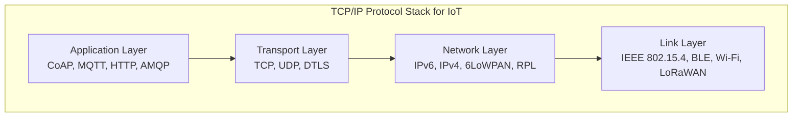
```mermaid
graph TB
    subgraph "TCP/IP Protocol Stack for IoT"
        A[Application Layer<br/>CoAP, MQTT, HTTP, AMQP]
        T[Transport Layer<br/>TCP, UDP, DTLS]
        N[Network Layer<br/>IPv6, IPv4, 6LoWPAN, RPL]
        L[Link Layer<br/>IEEE 802.15.4, BLE, Wi-Fi, LoRaWAN]
    end
    
    A --> T
    T --> N
    N --> L
    
    %% style A fill:#ffd93d
    %% style T fill:#6bcf7f
    %% style N fill:#4d96ff
    %% style L fill:#ff6b9d
```

#### ความสำคัญของ TCP/IP ใน IoT

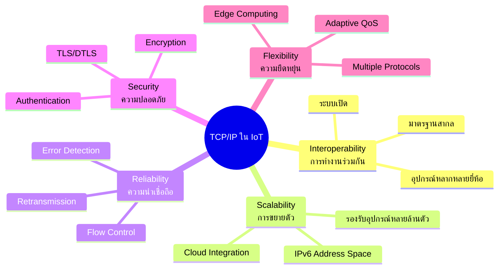
```mermaid
mindmap
  root((TCP/IP ใน IoT))
    Interoperability<br/>การทำงานร่วมกัน
      มาตรฐานสากล
      อุปกรณ์หลากหลายยี่ห้อ
      ระบบเปิด
    Scalability<br/>การขยายตัว
      รองรับอุปกรณ์หลายล้านตัว
      IPv6 Address Space
      Cloud Integration
    Reliability<br/>ความน่าเชื่อถือ
      Error Detection
      Retransmission
      Flow Control
    Security<br/>ความปลอดภัย
      TLS/DTLS
      Authentication
      Encryption
    Flexibility<br/>ความยืดหยุ่น
      Multiple Protocols
      Adaptive QoS
      Edge Computing
```

#### 1. **Interoperability (การทำงานร่วมกันได้)**

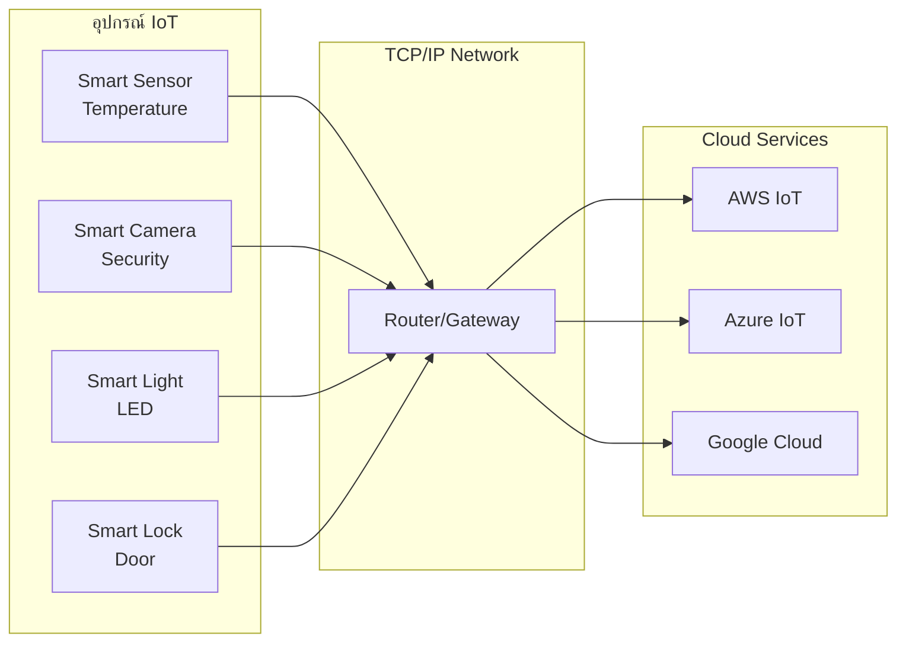
```mermaid
flowchart LR
    subgraph Devices["อุปกรณ์ IoT"]
        S1[Smart Sensor<br/>Temperature]
        S2[Smart Camera<br/>Security]
        S3[Smart Light<br/>LED]
        S4[Smart Lock<br/>Door]
    end
    
    subgraph Network["TCP/IP Network"]
        R[Router/Gateway]
    end
    
    subgraph Cloud["Cloud Services"]
        C1[AWS IoT]
        C2[Azure IoT]
        C3[Google Cloud]
    end
    
    S1 & S2 & S3 & S4 --> R
    R --> C1 & C2 & C3
    
    %% style R fill:#4d96ff
```

**ความสำคัญ:**
- TCP/IP เป็นมาตรฐานสากลที่ทุกอุปกรณ์รู้จัก
- อุปกรณ์จากผู้ผลิตต่างกันสามารถสื่อสารกันได้
- ไม่ต้องพึ่งพาโปรโตคอลเฉพาะของผู้ผลิต (Vendor-specific)
- ลดต้นทุนในการพัฒนาและบำรุงรักษา

#### 2. **Scalability (ความสามารถในการขยายตัว)**

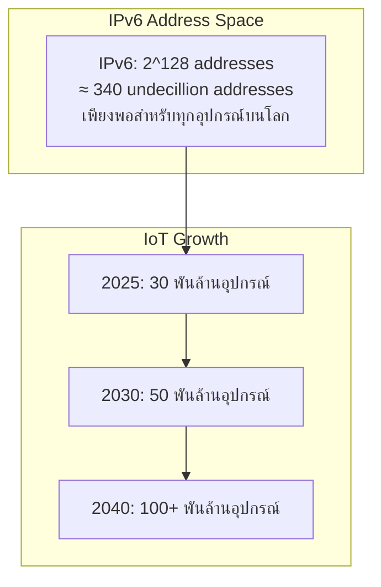
```mermaid
graph TB
    subgraph "IPv6 Address Space"
        I6["IPv6: 2^128 addresses<br/>≈ 340 undecillion addresses<br/>เพียงพอสำหรับทุกอุปกรณ์บนโลก"]
    end
    
    subgraph "IoT Growth"
        G1[2025: 30 พันล้านอุปกรณ์]
        G2[2030: 50 พันล้านอุปกรณ์]
        G3[2040: 100+ พันล้านอุปกรณ์]
    end
    
    I6 --> G1 --> G2 --> G3
    
    %% style I6 fill:#4d96ff
    %% style G3 fill:#ffd93d
```

**ความสำคัญ:**
- IPv6 ให้ที่อยู่เพียงพอสำหรับอุปกรณ์ IoT หลายพันล้านเครื่อง
- รองรับการเติบโตของอุปกรณ์ในอนาคต
- ไม่ต้องใช้ NAT ทำให้การสื่อสาร end-to-end ง่ายขึ้น
- 6LoWPAN ช่วยให้อุปกรณ์ที่มีทรัพยากรจำกัดใช้ IPv6 ได้

#### 3. **Reliability (ความน่าเชื่อถือ)**

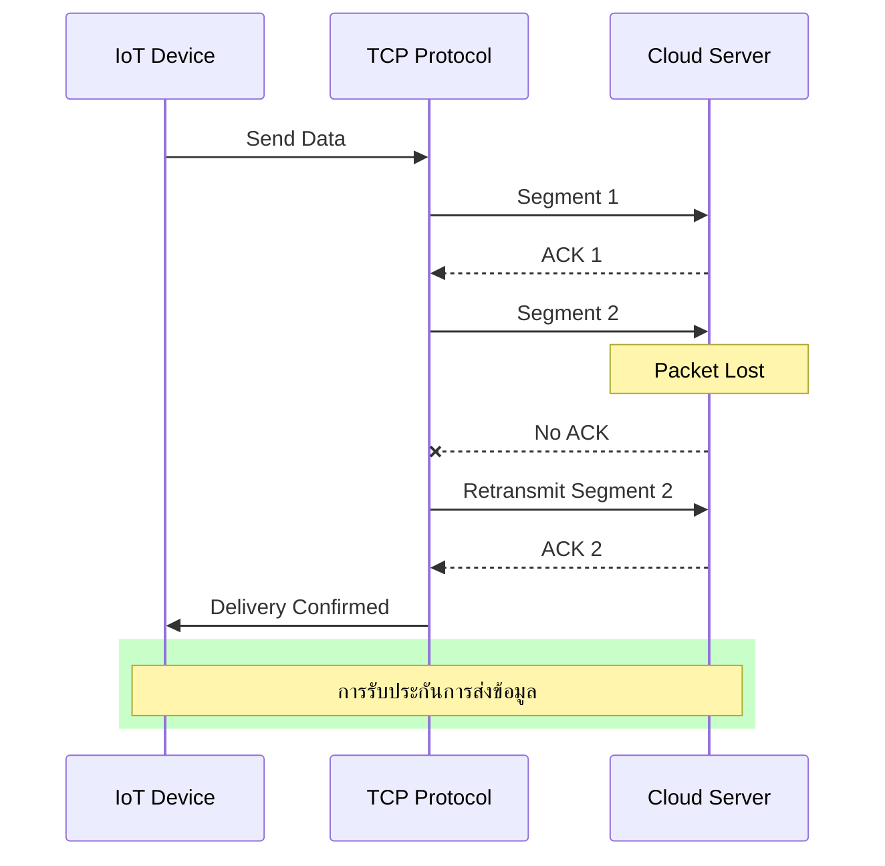
```mermaid
sequenceDiagram
    participant IoT as IoT Device
    participant TCP as TCP Protocol
    participant Server as Cloud Server
    
    IoT->>TCP: Send Data
    TCP->>Server: Segment 1
    Server-->>TCP: ACK 1
    TCP->>Server: Segment 2
    Note over Server: Packet Lost
    Server--xTCP: No ACK
    TCP->>Server: Retransmit Segment 2
    Server-->>TCP: ACK 2
    TCP->>IoT: Delivery Confirmed
    
    rect rgb(200, 255, 200)
    Note over IoT,Server: การรับประกันการส่งข้อมูล
    end
```

**ความสำคัญ:**
- TCP รับประกันการส่งข้อมูลถึงปลายทาง
- มีกลไก Error Detection และ Correction
- Flow Control ป้องกันการ Overflow
- สำคัญสำหรับข้อมูลที่ต้องการความถูกต้อง 100%

#### 4. **Security (ความปลอดภัย)**

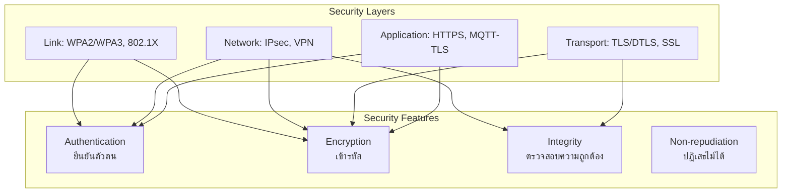
```mermaid
graph TB
    subgraph "Security Layers"
        A1[Application: HTTPS, MQTT-TLS]
        T1[Transport: TLS/DTLS, SSL]
        N1[Network: IPsec, VPN]
        L1[Link: WPA2/WPA3, 802.1X]
    end
    
    subgraph "Security Features"
        F1[Authentication<br/>ยืนยันตัวตน]
        F2[Encryption<br/>เข้ารหัส]
        F3[Integrity<br/>ตรวจสอบความถูกต้อง]
        F4[Non-repudiation<br/>ปฏิเสธไม่ได้]
    end
    
    A1 --> F1 & F2
    T1 --> F2 & F3
    N1 --> F1 & F2 & F3
    L1 --> F1 & F2
    
    %% style F2 fill:#ff6b6b
```

**ความสำคัญ:**
- TLS/DTLS เข้ารหัสการสื่อสารเพื่อป้องกันการดักฟัง
- IPsec ป้องกันการโจมตีระดับเครือข่าย
- Authentication ป้องกันอุปกรณ์ปลอม
- สำคัญมากสำหรับ IoT ที่เกี่ยวข้องกับข้อมูลส่วนตัวและความปลอดภัย

#### 5. **Flexibility (ความยืดหยุ่น)**

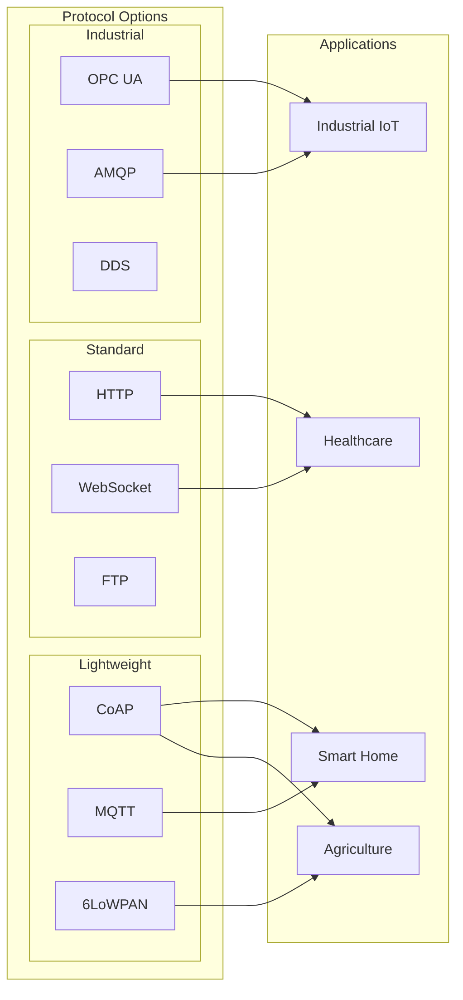
```mermaid
graph LR
    subgraph "Protocol Options"
        subgraph "Lightweight"
            L1[CoAP]
            L2[MQTT]
            L3[6LoWPAN]
        end
        
        subgraph "Standard"
            S1[HTTP]
            S2[WebSocket]
            S3[FTP]
        end
        
        subgraph "Industrial"
            I1[OPC UA]
            I2[AMQP]
            I3[DDS]
        end
    end
    
    subgraph "Applications"
        A1[Smart Home]
        A2[Industrial IoT]
        A3[Healthcare]
        A4[Agriculture]
    end
    
    L1 & L2 --> A1
    S1 & S2 --> A3
    I1 & I2 --> A2
    L1 & L3 --> A4
    
    %% style L1 fill:#a8dadc
    %% style L2 fill:#a8dadc
    %% style I1 fill:#f4a261
    %% style I2 fill:#f4a261
```

**ความสำคัญ:**
- มีโปรโตคอลหลากหลายให้เลือกตามความเหมาะสม
- CoAP และ MQTT เหมาะสำหรับอุปกรณ์ที่มีทรัพยากรจำกัด
- HTTP/HTTPS เหมาะสำหรับการเชื่อมต่อกับ Web Services
- สามารถปรับแต่ง QoS ตามความต้องการ

#### 6. **Cloud Integration (การเชื่อมต่อกับ Cloud)**

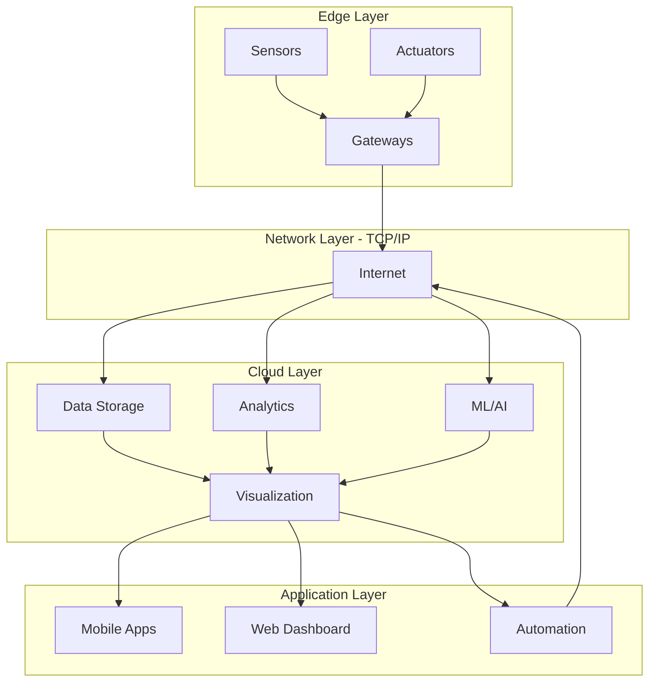
```mermaid
flowchart TB
    subgraph Edge["Edge Layer"]
        E1[Sensors]
        E2[Actuators]
        E3[Gateways]
    end
    
    subgraph Network["Network Layer - TCP/IP"]
        N1[Internet]
    end
    
    subgraph Cloud["Cloud Layer"]
        C1[Data Storage]
        C2[Analytics]
        C3[ML/AI]
        C4[Visualization]
    end
    
    subgraph Application["Application Layer"]
        A1[Mobile Apps]
        A2[Web Dashboard]
        A3[Automation]
    end
    
    E1 & E2 --> E3
    E3 --> N1
    N1 --> C1 & C2 & C3
    C1 & C2 & C3 --> C4
    C4 --> A1 & A2 & A3
    A3 --> N1
    
    %% style N1 fill:#4d96ff
    %% style C2 fill:#ffd93d
    %% style C3 fill:#ffd93d
```

**ความสำคัญ:**
- TCP/IP ทำให้ IoT สามารถเชื่อมต่อกับ Cloud Services ได้โดยตรง
- รองรับ Big Data Analytics และ Machine Learning
- Edge Computing สามารถทำงานร่วมกับ Cloud ได้อย่างมีประสิทธิภาพ
- Remote Management และ Monitoring

#### 7. **Standardization และ Ecosystem**

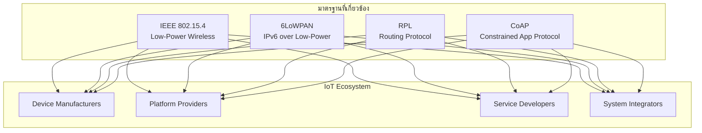
```mermaid
graph TB
    subgraph Standards["มาตรฐานที่เกี่ยวข้อง"]
        S1[IEEE 802.15.4<br/>Low-Power Wireless]
        S2[6LoWPAN<br/>IPv6 over Low-Power]
        S3[RPL<br/>Routing Protocol]
        S4[CoAP<br/>Constrained App Protocol]
    end
    
    subgraph Ecosystem["IoT Ecosystem"]
        E1[Device Manufacturers]
        E2[Platform Providers]
        E3[Service Developers]
        E4[System Integrators]
    end
    
    S1 & S2 & S3 & S4 --> E1 & E2 & E3 & E4
    
    %% style S2 fill:#4d96ff
    %% style S4 fill:#6bcf7f
```

---

### 2.2 เปรียบเทียบการทำงานของ TCP และ UDP ในสถานการณ์ต่างๆ

#### ภาพรวมการเปรียบเทียบ TCP vs UDP

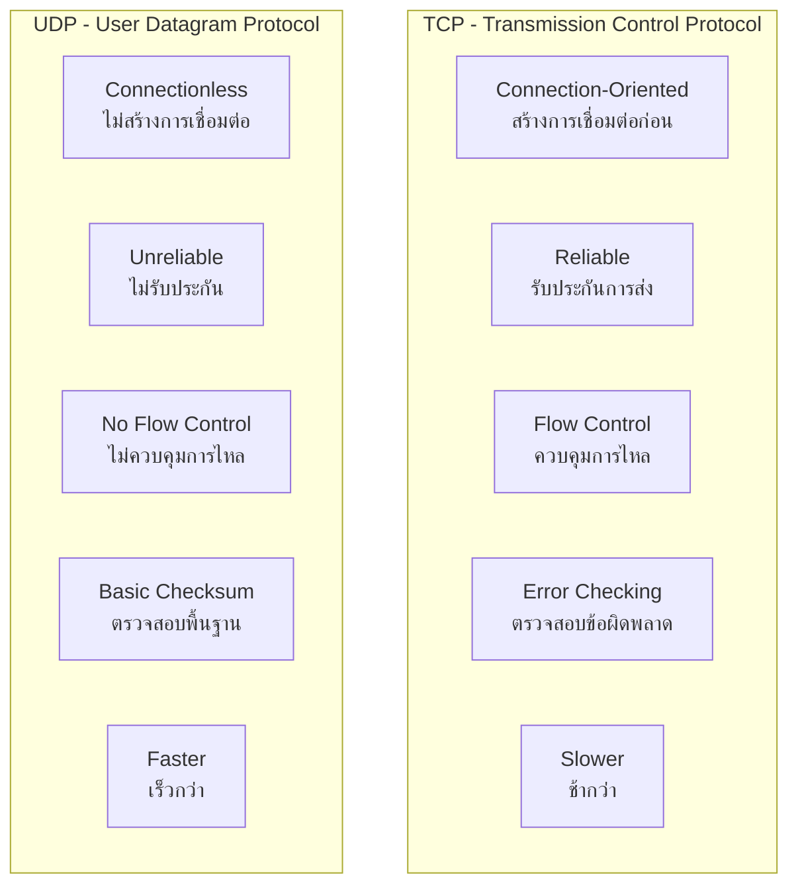
```mermaid
graph TB
    subgraph "TCP - Transmission Control Protocol"
        T1[Connection-Oriented<br/>สร้างการเชื่อมต่อก่อน]
        T2[Reliable<br/>รับประกันการส่ง]
        T3[Flow Control<br/>ควบคุมการไหล]
        T4[Error Checking<br/>ตรวจสอบข้อผิดพลาด]
        T5[Slower<br/>ช้ากว่า]
    end
    
    subgraph "UDP - User Datagram Protocol"
        U1[Connectionless<br/>ไม่สร้างการเชื่อมต่อ]
        U2[Unreliable<br/>ไม่รับประกัน]
        U3[No Flow Control<br/>ไม่ควบคุมการไหล]
        U4[Basic Checksum<br/>ตรวจสอบพื้นฐาน]
        U5[Faster<br/>เร็วกว่า]
    end
    
    %% style T2 fill:#6bcf7f
    %% style T3 fill:#6bcf7f
    %% style U5 fill:#ffd93d
```

#### การทำงานของ TCP

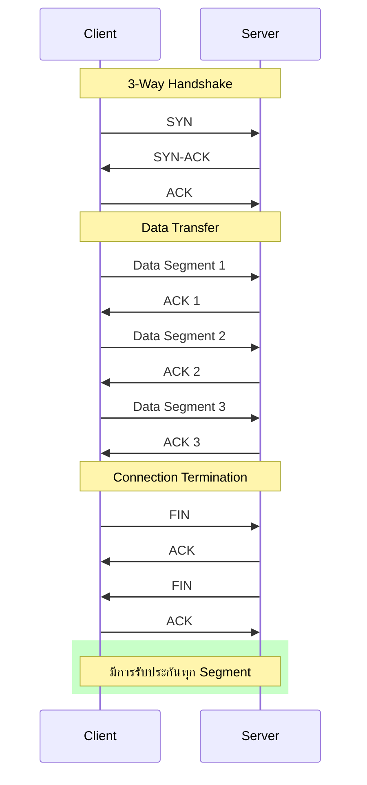
```mermaid
sequenceDiagram
    participant Client
    participant Server
    
    Note over Client,Server: 3-Way Handshake
    Client->>Server: SYN
    Server->>Client: SYN-ACK
    Client->>Server: ACK
    
    Note over Client,Server: Data Transfer
    Client->>Server: Data Segment 1
    Server->>Client: ACK 1
    Client->>Server: Data Segment 2
    Server->>Client: ACK 2
    Client->>Server: Data Segment 3
    Server->>Client: ACK 3
    
    Note over Client,Server: Connection Termination
    Client->>Server: FIN
    Server->>Client: ACK
    Server->>Client: FIN
    Client->>Server: ACK
    
    rect rgb(200, 255, 200)
    Note over Client,Server: มีการรับประกันทุก Segment
    end
```

#### การทำงานของ UDP

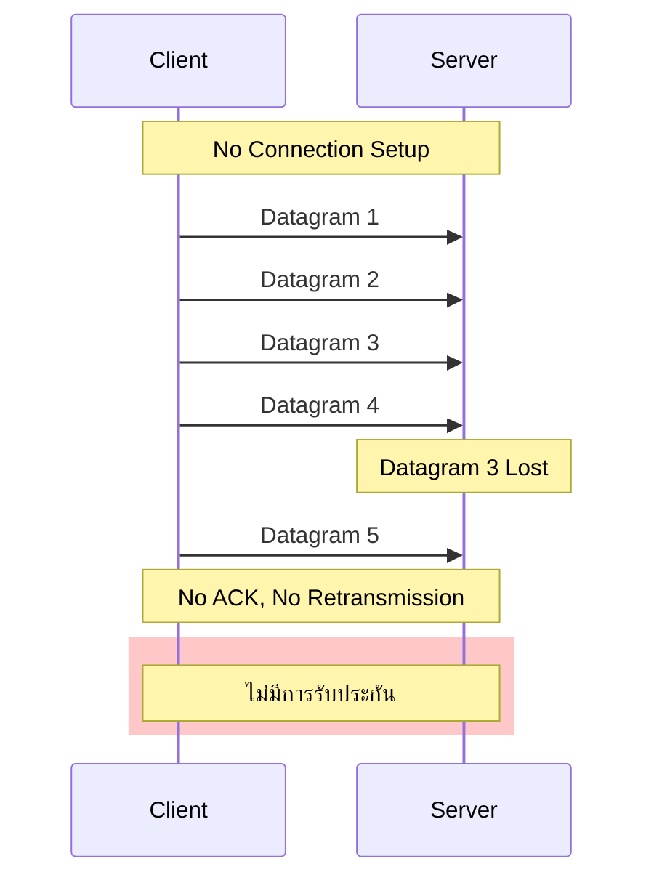
```mermaid
sequenceDiagram
    participant Client
    participant Server
    
    Note over Client,Server: No Connection Setup
    
    Client->>Server: Datagram 1
    Client->>Server: Datagram 2
    Client->>Server: Datagram 3
    Client->>Server: Datagram 4
    Note over Server: Datagram 3 Lost
    Client->>Server: Datagram 5
    
    Note over Client,Server: No ACK, No Retransmission
    
    rect rgb(255, 200, 200)
    Note over Client,Server: ไม่มีการรับประกัน
    end
```

---

### สถานการณ์ที่ 1: การสตรีมวิดีโอสด (Live Video Streaming)

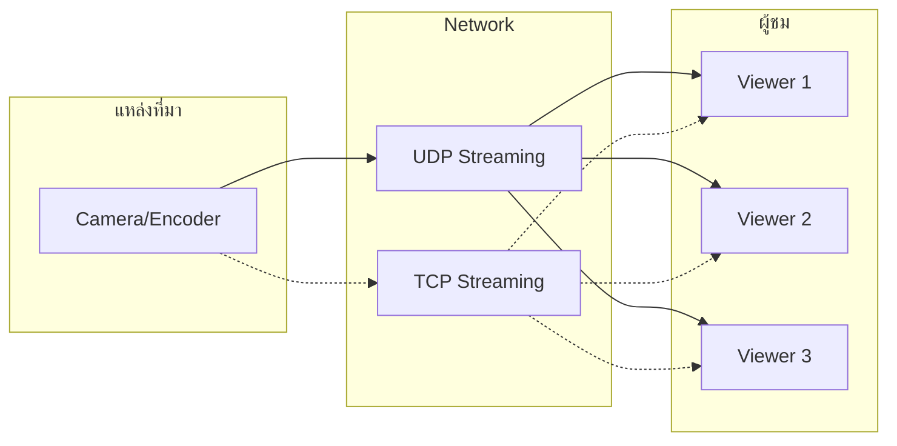
```mermaid
flowchart LR
    subgraph Source["แหล่งที่มา"]
        C[Camera/Encoder]
    end
    
    subgraph Network["Network"]
        direction TB
        U[UDP Streaming]
        T[TCP Streaming]
    end
    
    subgraph Viewers["ผู้ชม"]
        V1[Viewer 1]
        V2[Viewer 2]
        V3[Viewer 3]
    end
    
    C --> U
    C -.-> T
    U --> V1 & V2 & V3
    T -.-> V1 & V2 & V3
    
    %% style U fill:#ffd93d
    %% style T fill:#e0e0e0
```

#### การใช้ UDP ในการสตรีมวิดีโอสด

**ข้อดีของ UDP:**

1. **Low Latency (ความหน่วงต่ำ)**
   ```
   UDP: 50-150 ms
   TCP: 200-500 ms (หรือมากกว่า)
   ```
   - ไม่มี 3-way handshake
   - ไม่มีการรอ ACK
   - ส่งข้อมูลต่อเนื่องทันที

2. **No Head-of-Line Blocking**
   - ถ้า packet หายไป ไม่ block packets ตัวอื่น
   - สำคัญสำหรับ real-time streaming

3. **Multicast Support**
   ```mermaid
   graph TB
       S[Streaming Server]
       S -->|1 Stream| R[Router]
       R -->|Replicate| V1[Viewer 1]
       R -->|Replicate| V2[Viewer 2]
       R -->|Replicate| V3[Viewer 3]
       
       style S fill:#ffd93d
   ```
   - ส่ง 1 stream ไปหลายคนพร้อมกัน
   - ประหยัด Bandwidth

4. **Efficiency**
   - Header เล็ก (8 bytes vs TCP 20+ bytes)
   - ไม่มี overhead จากการจัดการ connection

**ข้อเสียของ UDP:**

1. **Packet Loss**
   - ภาพ/เสียงสะดุด (glitch)
   - ต้องใช้ FEC (Forward Error Correction) เพิ่มเติม

2. **No Congestion Control**
   - อาจทำให้เครือข่ายติดขัด
   - ต้องใช้ application-level control

3. **No Quality Guarantee**
   - คุณภาพไม่คงที่
   - ขึ้นกับสภาพเครือข่าย

**เทคนิคที่ใช้ร่วมกับ UDP:**

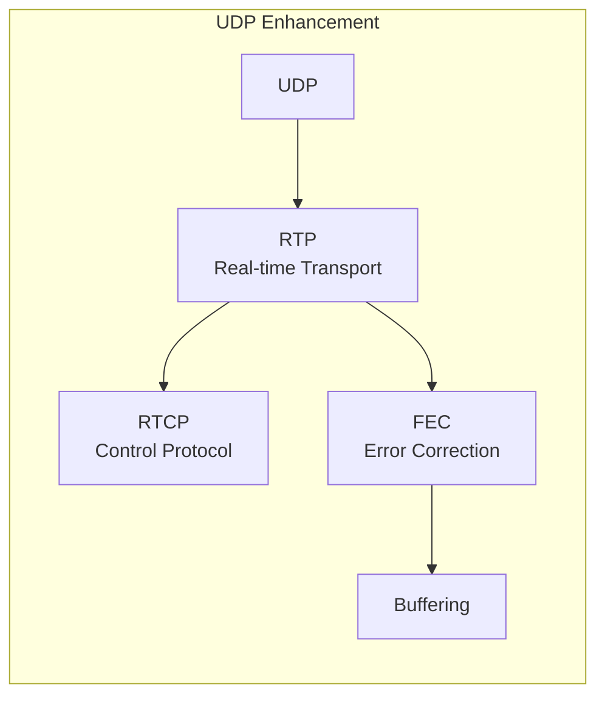
```mermaid
graph LR
    subgraph "UDP Enhancement"
        U[UDP]
        R[RTP<br/>Real-time Transport]
        R2[RTCP<br/>Control Protocol]
        F[FEC<br/>Error Correction]
        B[Buffering]
    end
    
    U --> R --> R2
    R --> F --> B
    
    %% style U fill:#ffd93d
    %% style F fill:#6bcf7f
```

#### การใช้ TCP ในการสตรีมวิดีโอสด

**ข้อดีของ TCP:**

1. **Reliability**
   - รับประกันข้อมูลถึงครบ
   - ไม่เสีย frame

2. **Adaptive Bitrate**
   - ปรับคุณภาพตามแบนด์วิดท์
   - ใช้กับ HLS, DASH

3. **Firewall Friendly**
   - ผ่าน firewall ได้ง่าย
   - ใช้ HTTP/HTTPS (port 80/443)

**ข้อเสียของ TCP:**

1. **High Latency**
   - การรอ retransmission
   - Head-of-line blocking

2. **Buffering**
   - ต้อง buffer มาก
   - เพิ่ม delay

3. **Not Suitable for Real-time**
   - ความหน่วงสูงเกินไป
   - ไม่เหมาะกับ live interaction

#### สรุปการใช้งาน

| คุณสมบัติ      | UDP                    | TCP                 |
| ----------- | ---------------------- | ------------------- |
| Latency     | ⭐⭐⭐⭐⭐ ต่ำมาก (50-150 ms) | ⭐⭐ สูง (200-500+ ms) |
| Quality     | ⭐⭐⭐ ไม่คงที่              | ⭐⭐⭐⭐ คงที่ดี           |
| Efficiency  | ⭐⭐⭐⭐⭐ สูง               | ⭐⭐⭐ ปานกลาง         |
| Reliability | ⭐⭐ ต่ำ                   | ⭐⭐⭐⭐⭐ สูงมาก         |
| Scalability | ⭐⭐⭐⭐⭐ Multicast        | ⭐⭐ Unicast only     |

**คำแนะนำ:**
- **ใช้ UDP + RTP/RTCP** สำหรับ live streaming ที่ต้องการ low latency
- **ใช้ TCP + HLS/DASH** สำหรับ streaming ที่ยอมรับ delay ได้ เน้นคุณภาพ

---

### สถานการณ์ที่ 2: การโอนไฟล์ขนาดใหญ่ (Large File Transfer)

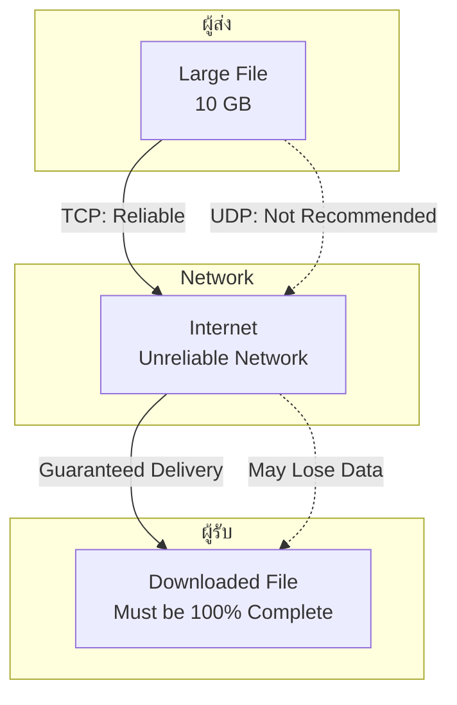
```mermaid
flowchart TB
    subgraph Sender["ผู้ส่ง"]
        F[Large File<br/>10 GB]
    end
    
    subgraph Network["Network"]
        N[Internet<br/>Unreliable Network]
    end
    
    subgraph Receiver["ผู้รับ"]
        D[Downloaded File<br/>Must be 100% Complete]
    end
    
    F -->|TCP: Reliable| N
    N -->|Guaranteed Delivery| D
    
    F -.->|UDP: Not Recommended| N
    N -.->|May Lose Data| D
    
    %% style F fill:#4d96ff
    %% style D fill:#6bcf7f
```

#### การใช้ TCP ในการโอนไฟล์ขนาดใหญ่

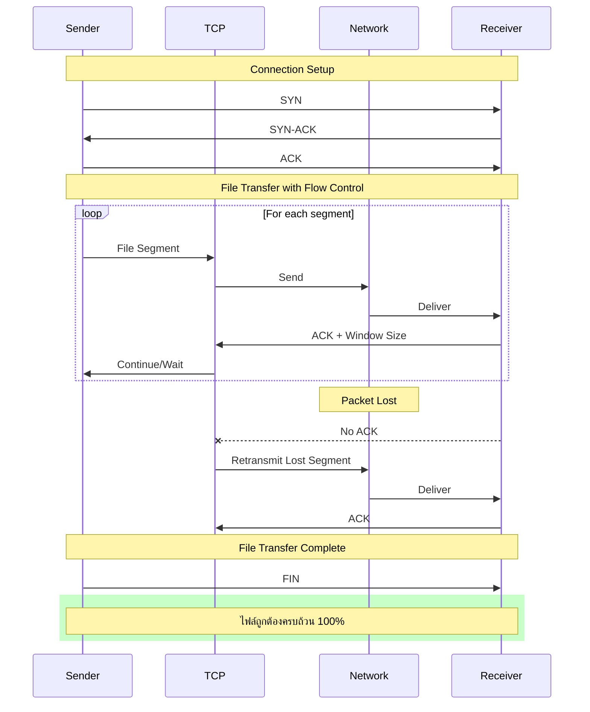
```mermaid
sequenceDiagram
    participant Sender
    participant TCP
    participant Network
    participant Receiver
    
    Note over Sender,Receiver: Connection Setup
    Sender->>Receiver: SYN
    Receiver->>Sender: SYN-ACK
    Sender->>Receiver: ACK
    
    Note over Sender,Receiver: File Transfer with Flow Control
    loop For each segment
        Sender->>TCP: File Segment
        TCP->>Network: Send
        Network->>Receiver: Deliver
        Receiver->>TCP: ACK + Window Size
        TCP->>Sender: Continue/Wait
    end
    
    Note over Network: Packet Lost
    Receiver--xTCP: No ACK
    TCP->>Network: Retransmit Lost Segment
    Network->>Receiver: Deliver
    Receiver->>TCP: ACK
    
    Note over Sender,Receiver: File Transfer Complete
    Sender->>Receiver: FIN
    
    rect rgb(200, 255, 200)
    Note over Sender,Receiver: ไฟล์ถูกต้องครบถ้วน 100%
    end
```

**ข้อดีของ TCP สำหรับการโอนไฟล์:**

1. **Reliability (ความน่าเชื่อถือ)**
   ```mermaid
   graph LR
       S[Start] --> C[Checksum]
       C --> E{Error?}
       E -->|Yes| R[Retransmit]
       E -->|No| A[ACK]
       R --> C
       A --> N[Next Segment]
       
       style A fill:#6bcf7f
       style R fill:#ffd93d
   ```
   - รับประกัน 100% ว่าข้อมูลถึงครบถ้วน
   - Checksum ตรวจสอบความถูกต้อง
   - Automatic retransmission เมื่อเกิด error

2. **In-Order Delivery (ส่งตามลำดับ)**
   ```
   File: A B C D E
   Network: A C B E D (out of order)
   TCP: A B C D E (reordered)
   ```
   - Sequence number ทำให้จัดเรียงข้อมูลได้
   - สำคัญสำหรับไฟล์ที่ต้องการความถูกต้อง

3. **Flow Control (ควบคุมการไหล)**
   ```mermaid
   sequenceDiagram
       participant Fast as Fast Sender
       participant Slow as Slow Receiver
       
       Fast->>Slow: Data (Window=10)
       Slow->>Fast: ACK (Window=5)
       Note over Fast: Reduce sending rate
       Fast->>Slow: Data (Window=5)
       Slow->>Fast: ACK (Window=8)
       Note over Fast: Increase sending rate
       
       rect rgb(200, 255, 200)
       Note over Fast,Slow: ปรับตามความเร็วของผู้รับ
       end
   ```
   - Sliding window ป้องกัน buffer overflow
   - Receiver ควบคุมอัตราการส่ง

4. **Congestion Control (ควบคุมความแออัด)**
   ```mermaid
   graph TB
       subgraph "TCP Congestion Control"
           S[Slow Start]
           C[Congestion Avoidance]
           F[Fast Recovery]
           R[Fast Retransmit]
       end
       
       S -->|Threshold| C
       C -->|Packet Loss| F
       F -->|3 Dup ACKs| R
       R --> C
       
       style C fill:#6bcf7f
   ```
   - ปรับอัตราการส่งตามสภาพเครือข่าย
   - ป้องกันเครือข่ายล่ม

5. **Resume Capability (รองรับการต่อ)**
   - สามารถต่อการโอนได้เมื่อขาดหาย
   - ใช้กับ FTP, HTTP Range Requests

**ข้อเสียของ TCP:**

1. **Overhead**
   - Header ใหญ่ (20-60 bytes)
   - Connection setup/teardown
   - ACK packets

2. **Slower than UDP**
   - รอ ACK
   - Retransmission delay

3. **Head-of-Line Blocking**
   - packet หนึ่งหายทั้ง stream หยุด

**Protocol ที่ใช้ TCP:**

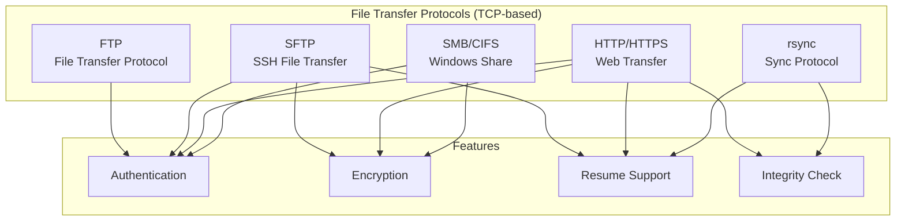
```mermaid
graph TB
    subgraph "File Transfer Protocols (TCP-based)"
        FTP[FTP<br/>File Transfer Protocol]
        SFTP[SFTP<br/>SSH File Transfer]
        HTTP[HTTP/HTTPS<br/>Web Transfer]
        SMB[SMB/CIFS<br/>Windows Share]
        RSYNC[rsync<br/>Sync Protocol]
    end
    
    subgraph Features
        F1[Authentication]
        F2[Encryption]
        F3[Resume Support]
        F4[Integrity Check]
    end
    
    FTP --> F1
    SFTP --> F1 & F2 & F3
    HTTP --> F1 & F2 & F3 & F4
    SMB --> F1 & F2
    RSYNC --> F3 & F4
    
    %% style SFTP fill:#6bcf7f
    %% style HTTP fill:#6bcf7f
```

#### การใช้ UDP ในการโอนไฟล์ขนาดใหญ่

**ทำไมไม่แนะนำ UDP:**

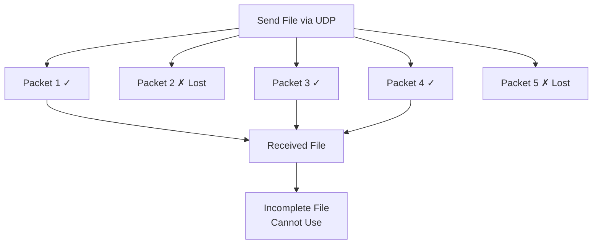
```mermaid
graph TB
    S[Send File via UDP]
    S --> P1[Packet 1 ✓]
    S --> P2[Packet 2 ✗ Lost]
    S --> P3[Packet 3 ✓]
    S --> P4[Packet 4 ✓]
    S --> P5[Packet 5 ✗ Lost]
    
    R[Received File]
    P1 --> R
    P3 --> R
    P4 --> R
    
    R --> I[Incomplete File<br/>Cannot Use]
    
    %% style P2 fill:#ff6b6b
    %% style P5 fill:#ff6b6b
    %% style I fill:#ff6b6b
```

**ข้อเสียของ UDP:**

1. **No Reliability**
   - ไม่รับประกันการส่งข้อมูล
   - ต้องสร้าง reliability layer เอง

2. **No Flow Control**
   - อาจส่งเร็วเกินไป
   - ทำให้ receiver ล้น

3. **Out-of-Order**
   - ต้องจัดเรียงเอง
   - ซับซ้อน

**กรณีที่ใช้ UDP ได้:**

แม้ UDP ไม่เหมาะสำหรับการโอนไฟล์ทั่วไป แต่มีโปรโตคอลที่สร้างมา reliability layer บน UDP:

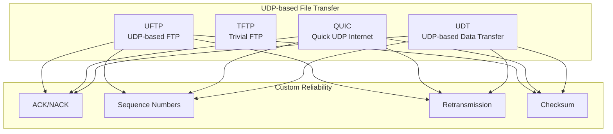
```mermaid
graph TB
    subgraph "UDP-based File Transfer"
        UFTP[UFTP<br/>UDP-based FTP]
        TFTP[TFTP<br/>Trivial FTP]
        QUIC[QUIC<br/>Quick UDP Internet]
        UDT[UDT<br/>UDP-based Data Transfer]
    end
    
    subgraph "Custom Reliability"
        R1[ACK/NACK]
        R2[Sequence Numbers]
        R3[Retransmission]
        R4[Checksum]
    end
    
    UFTP & QUIC & UDT --> R1 & R2 & R3 & R4
    
    %% style QUIC fill:#ffd93d
```

**QUIC Protocol (UDP-based)**
- พัฒนาโดย Google
- Reliability + Speed
- ใช้ใน HTTP/3
- 0-RTT connection establishment

#### การเปรียบเทียบประสิทธิภาพ

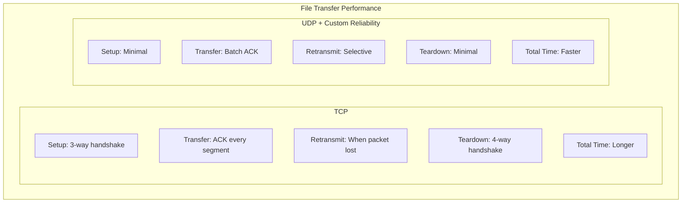
```mermaid
graph TB
    subgraph "File Transfer Performance"
        subgraph "TCP"
            T1[Setup: 3-way handshake]
            T2[Transfer: ACK every segment]
            T3[Retransmit: When packet lost]
            T4[Teardown: 4-way handshake]
            T5[Total Time: Longer]
        end
        
        subgraph "UDP + Custom Reliability"
            U1[Setup: Minimal]
            U2[Transfer: Batch ACK]
            U3[Retransmit: Selective]
            U4[Teardown: Minimal]
            U5[Total Time: Faster]
        end
    end
    
    %% style T5 fill:#ffd93d
    %% style U5 fill:#6bcf7f
```

#### สรุปการใช้งาน

| คุณสมบัติ           | TCP   | UDP (Pure) | UDP + Reliability Layer |
| ---------------- | ----- | ---------- | ----------------------- |
| Reliability      | ⭐⭐⭐⭐⭐ | ⭐          | ⭐⭐⭐⭐                    |
| Speed            | ⭐⭐⭐   | ⭐⭐⭐⭐⭐      | ⭐⭐⭐⭐                    |
| Complexity       | ⭐⭐⭐   | ⭐⭐⭐⭐⭐      | ⭐⭐                      |
| File Integrity   | ⭐⭐⭐⭐⭐ | ⭐          | ⭐⭐⭐⭐⭐                   |
| Standard Support | ⭐⭐⭐⭐⭐ | ⭐⭐         | ⭐⭐⭐                     |

**คำแนะนำ:**
- **ใช้ TCP (FTP/SFTP/HTTP)** สำหรับการโอนไฟล์ทั่วไป - เชื่อถือได้ มีมาตรฐาน
- **ใช้ UDP + Custom Protocol** เฉพาะกรณีพิเศษที่ต้องการความเร็วสูงมาก
- **ใช้ QUIC/HTTP3** เทคโนโลยีใหม่ที่ผสมข้อดีทั้งสอง

---

### สถานการณ์ที่ 3: การเล่นเกมออนไลน์แบบเรียลไทม์ (Real-time Online Gaming)

```mermaid
flowchart TB
    subgraph Players["ผู้เล่น"]
        P1[Player 1<br/>Action: Move Forward]
        P2[Player 2<br/>Action: Shoot]
        P3[Player 3<br/>Action: Jump]
    end
    
    subgraph Server["Game Server"]
        GS[Game State<br/>Update 60 times/sec]
    end
    
    subgraph Network["Network Requirements"]
        L[Low Latency<br/>< 50 ms]
        H[High Frequency<br/>60-120 updates/sec]
        R[Some Packet Loss OK]
    end
    
    P1 & P2 & P3 <-->|UDP| Server
    Server --> L & H & R
    
    %% style GS fill:#ffd93d
    %% style L fill:#ff6b6b
```

#### ความต้องการของเกมออนไลน์

```mermaid
mindmap
  root((Online Gaming))
    Latency<br/>ความหน่วง
      < 20 ms: Perfect
      20-50 ms: Great
      50-100 ms: Playable
      > 150 ms: Unplayable
    Update Rate<br/>อัตราการอัพเดท
      30 Hz: Minimum
      60 Hz: Standard
      120 Hz: Competitive
      240 Hz: Pro Gaming
    Bandwidth<br/>แบนด์วิดท์
      FPS: 50-150 Kbps
      MOBA: 30-100 Kbps
      MMO: 10-50 Kbps
    Reliability<br/>ความน่าเชื่อถือ
      Critical: Player actions
      Important: Game state
      Optional: Cosmetics
```

#### การใช้ UDP ในเกมออนไลน์

```mermaid
sequenceDiagram
    participant P as Player
    participant C as Client
    participant S as Server
    participant O as Other Players
    
    Note over P,O: Game Loop (60 times/second)
    
    loop Every 16.67 ms
        P->>C: Input (W,A,S,D)
        C->>S: Position Update (UDP)
        Note over S: Process
        S->>O: Broadcast State (UDP)
        O->>O: Interpolate Position
        Note over C: Render Frame
    end
    
    Note over C,S: Packet Lost
    C->>S: Position Update
    Note over S: Packet Lost (No problem)
    C->>S: Next Position Update
    S->>O: Latest State
    
    rect rgb(255, 240, 200)
    Note over P,O: การอัพเดทต่อเนื่อง ไม่รอ ACK
    end
```

**ข้อดีของ UDP สำหรับเกมออนไลน์:**

1. **Ultra Low Latency (ความหน่วงต่ำมาก)**
   ```
   UDP: 10-30 ms
   TCP: 50-150 ms
   ```
   - ไม่มี connection setup
   - ไม่รอ ACK
   - ส่งทันที

2. **No Head-of-Line Blocking**
   ```mermaid
   graph LR
       subgraph "TCP Problem"
           T1[Packet 1] --> T2[Packet 2 Lost]
           T2 -.-> T3[Packet 3 Blocked]
           T2 -.-> T4[Packet 4 Blocked]
       end
       
       subgraph "UDP Solution"
           U1[Packet 1] --> U2[Packet 2 Lost]
           U2 --> U3[Packet 3 ✓]
           U2 --> U4[Packet 4 ✓]
       end
       
       style T2 fill:#ff6b6b
       style T3 fill:#ffcccc
       style T4 fill:#ffcccc
       style U3 fill:#6bcf7f
       style U4 fill:#6bcf7f
   ```
   - Packet หายไม่ block packet อื่น
   - เกมยังเล่นต่อได้

3. **Old Data is Useless**
   ```
   Time 0: Player at (10, 20)
   Time 1: Player at (11, 21) [Lost]
   Time 2: Player at (12, 22)
   
   → Use latest position (12, 22)
   → No need to retransmit (11, 21)
   ```
   - ข้อมูลเก่าไม่มีประโยชน์
   - ใช้ข้อมูลใหม่ล่าสุด

4. **High Frequency Updates**
   ```mermaid
   graph TB
       subgraph "Update Frequency"
           U60[60 Hz<br/>Every 16.67 ms]
           U120[120 Hz<br/>Every 8.33 ms]
           U240[240 Hz<br/>Every 4.17 ms]
       end
       
       U60 --> U120 --> U240
       
       style U240 fill:#ffd93d
   ```
   - ส่งข้อมูลบ่อยๆ
   - ไม่มี overhead จาก ACK

5. **Smaller Packets**
   ```
   UDP Header: 8 bytes
   TCP Header: 20-60 bytes
   
   For 60 Hz updates:
   UDP: 480 bytes/sec overhead
   TCP: 1200-3600 bytes/sec overhead
   ```

**ข้อเสียของ UDP:**

1. **Packet Loss**
   ```mermaid
   graph LR
       C[Client]
       S[Server]
       
       C -->|Update 1 ✓| S
       C -.->|Update 2 ✗| S
       C -->|Update 3 ✓| S
       C -.->|Update 4 ✗| S
       C -->|Update 5 ✓| S
       
       style S fill:#ffd93d
   ```
   - ตัวละครกระตุก (jitter)
   - ต้องใช้เทคนิค Interpolation/Extrapolation

2. **Out-of-Order**
   - ต้องใช้ sequence number
   - Ignore old packets

3. **No Congestion Control**
   - ต้อง implement เอง
   - Adaptive sending rate

**เทคนิคที่ใช้กับ UDP ในเกม:**

```mermaid
graph TB
    subgraph "Game Networking Techniques"
        subgraph "Prediction"
            P1[Client-side Prediction]
            P2[Dead Reckoning]
            P3[Extrapolation]
        end
        
        subgraph "Correction"
            C1[Server Reconciliation]
            C2[Entity Interpolation]
            C3[Lag Compensation]
        end
        
        subgraph "Optimization"
            O1[Delta Compression]
            O2[Interest Management]
            O3[Priority Systems]
        end
    end
    
    P1 --> C1
    P2 --> C2
    P3 --> C2
    
    %% style P1 fill:#ffd93d
    %% style C2 fill:#6bcf7f
```

**1. Client-Side Prediction**
```mermaid
sequenceDiagram
    participant Player
    participant Client
    participant Server
    
    Player->>Client: Press W (Move Forward)
    Client->>Client: Predict Movement Immediately
    Note over Client: Show movement NOW
    Client->>Server: Send Input
    Server->>Server: Process
    Server->>Client: Confirm Position
    Client->>Client: Reconcile if Different
    
    rect rgb(200, 255, 200)
    Note over Player,Client: ผู้เล่นรู้สึกว่าตอบสนองทันที
    end
```

**2. Entity Interpolation**
```
Current Time: 100ms
Received Position A at 80ms: (10, 20)
Received Position B at 100ms: (15, 25)

Interpolate:
Position at 90ms = (12.5, 22.5)
```

**3. Lag Compensation**
```mermaid
graph LR
    subgraph "Server Rewind"
        S1[Current State]
        S2[Rewind to Player's Time]
        S3[Check Hit]
        S4[Apply Damage]
    end
    
    S1 --> S2 --> S3 --> S4
    
    %% style S3 fill:#ffd93d
```

**4. Delta Compression**
```
Full Update: Position (x,y,z), Rotation (r,p,y), Health, Ammo
= 200 bytes

Delta Update: Only changed values
Position.x changed: +2
Health changed: -10
= 20 bytes (90% reduction)
```

#### การใช้ TCP ในเกมออนไลน์

```mermaid
sequenceDiagram
    participant Player
    participant TCP
    participant Server
    
    Player->>TCP: Move Forward
    TCP->>Server: Send
    Server->>TCP: ACK
    Note over TCP: Wait for ACK<br/>Adds 50ms delay
    TCP->>Player: Confirm
    
    Note over Server: Packet Lost
    Player->>TCP: Shoot
    TCP--xServer: Lost
    TCP->>TCP: Wait for timeout
    TCP->>Server: Retransmit
    Server->>TCP: ACK
    Note over TCP: Total delay: 200ms
    TCP->>Player: Update
    
    rect rgb(255, 200, 200)
    Note over Player,Server: ความหน่วงสูง ไม่ smooth
    end
```

**ข้อเสียของ TCP สำหรับเกมออนไลน์:**

1. **High Latency**
   - 3-way handshake
   - รอ ACK ทุกครั้ง
   - รู้สึกได้ชัดเจน (lag)

2. **Head-of-Line Blocking**
   ```
   Packet 1: Position at T=0
   Packet 2: Position at T=16ms [LOST]
   Packet 3: Position at T=32ms [BLOCKED]
   Packet 4: Position at T=48ms [BLOCKED]
   
   → Game freezes until Packet 2 retransmitted
   ```

3. **Retransmission of Useless Data**
   - Position เก่าไม่มีประโยชน์
   - แต่ TCP ต้อง retransmit

4. **Slower Response**
   - ผู้เล่นรู้สึกว่าเกมไม่ตอบสนอง
   - ประสบการณ์แย่

**กรณีที่ใช้ TCP ได้:**

```mermaid
graph TB
    subgraph "Turn-Based Games"
        T1[Chess]
        T2[Card Games]
        T3[Strategy Games]
    end
    
    subgraph "Non-Critical Data"
        N1[Chat Messages]
        N2[Inventory Updates]
        N3[Achievement Unlocks]
        N4[Login/Authentication]
    end
    
    subgraph "Characteristics"
        C1[Latency Not Critical]
        C2[Data Must Be Reliable]
        C3[Low Update Frequency]
    end
    
    T1 & T2 & T3 --> C1 & C2 & C3
    N1 & N2 & N3 & N4 --> C2
    
    %% style C1 fill:#6bcf7f
    %% style C2 fill:#6bcf7f
```

#### การใช้โปรโตคอลแบบผสม (Hybrid Approach)

เกมสมัยใหม่มักใช้ทั้ง UDP และ TCP:

```mermaid
graph TB
    subgraph "Game Network Architecture"
        subgraph "UDP Channel"
            U1[Player Positions]
            U2[Player Actions]
            U3[Projectile Positions]
            U4[Game State Updates]
        end
        
        subgraph "TCP Channel"
            T1[Chat Messages]
            T2[Item Purchases]
            T3[Quest Updates]
            T4[Login/Auth]
        end
        
        subgraph "Server"
            S[Game Server]
        end
    end
    
    U1 & U2 & U3 & U4 --> S
    T1 & T2 & T3 & T4 --> S
    
    %% style U1 fill:#ffd93d
    %% style U2 fill:#ffd93d
    %% style U3 fill:#ffd93d
    %% style U4 fill:#ffd93d
    %% style T1 fill:#6bcf7f
    %% style T2 fill:#6bcf7f
```

**ตัวอย่างเกมและการใช้โปรโตคอล:**

| ประเภทเกม                            | โปรโตคอลหลัก | เหตุผล                   |
| ------------------------------------ | ----------- | ----------------------- |
| **FPS** (Counter-Strike, Valorant)   | UDP         | Latency < 20ms critical |
| **MOBA** (League of Legends, Dota 2) | UDP         | 30-60ms latency needed  |
| **MMO** (World of Warcraft)          | TCP + UDP   | Mixed requirements      |
| **Battle Royale** (Fortnite, PUBG)   | UDP         | 100 players real-time   |
| **Racing** (Forza, Gran Turismo)     | UDP         | High-speed precision    |
| **Turn-Based** (Hearthstone)         | TCP         | Latency not critical    |

#### การวัดประสิทธิภาพ

```mermaid
graph TB
    subgraph "Performance Metrics"
        subgraph "Latency"
            L1[< 20ms: Excellent]
            L2[20-50ms: Good]
            L3[50-100ms: Acceptable]
            L4[> 100ms: Poor]
        end
        
        subgraph "Packet Loss"
            P1[< 1%: Excellent]
            P2[1-3%: Good]
            P3[3-5%: Acceptable]
            P4[> 5%: Poor]
        end
        
        subgraph "Jitter"
            J1[< 5ms: Excellent]
            J2[5-20ms: Good]
            J3[20-50ms: Acceptable]
            J4[> 50ms: Poor]
        end
    end
    
    %% style L1 fill:#6bcf7f
    %% style P1 fill:#6bcf7f
    %% style J1 fill:#6bcf7f
    %% style L4 fill:#ff6b6b
    %% style P4 fill:#ff6b6b
    %% style J4 fill:#ff6b6b
```

#### สรุปการใช้งาน

| คุณสมบัติ                | UDP             | TCP           |
| --------------------- | --------------- | ------------- |
| Latency               | ⭐⭐⭐⭐⭐ < 20ms    | ⭐⭐ 50-150ms   |
| Responsiveness        | ⭐⭐⭐⭐⭐ Immediate | ⭐⭐ Delayed    |
| Packet Loss Tolerance | ⭐⭐⭐⭐ Can handle | ⭐⭐⭐⭐⭐ None    |
| Data Integrity        | ⭐⭐⭐ Good enough | ⭐⭐⭐⭐⭐ Perfect |
| Update Rate           | ⭐⭐⭐⭐⭐ 60-240 Hz | ⭐⭐ Limited    |
| Player Experience     | ⭐⭐⭐⭐⭐ Smooth    | ⭐⭐ Laggy      |

**คำแนะนำ:**
- **ใช้ UDP** สำหรับข้อมูล real-time (position, actions, game state)
- **ใช้ TCP** สำหรับข้อมูลสำคัญ (chat, inventory, authentication)
- **ใช้ Hybrid Approach** สำหรับเกมสมัยใหม่

---

## สรุปเปรียบเทียบทั้ง 3 สถานการณ์

```mermaid
graph TB
    subgraph "สรุปการเลือกใช้ TCP vs UDP"
        subgraph "Live Streaming"
            S1[UDP + RTP/RTCP]
            S1R[✓ Low Latency<br/>✓ Multicast<br/>⚠ Some Packet Loss OK]
        end
        
        subgraph "File Transfer"
            S2[TCP + FTP/HTTP]
            S2R[✓ 100% Reliability<br/>✓ File Integrity<br/>⚠ Slower OK]
        end
        
        subgraph "Online Gaming"
            S3[UDP + Custom Protocol]
            S3R[✓ Ultra Low Latency<br/>✓ High Frequency<br/>⚠ Use Latest Data]
        end
    end
    
    S1 --> S1R
    S2 --> S2R
    S3 --> S3R
    
    %% style S1 fill:#ffd93d
    %% style S2 fill:#6bcf7f
    %% style S3 fill:#ff6b9d
```

### ตารางสรุปเปรียบเทียบ

| การใช้งาน                 | โปรโตคอลที่แนะนำ | Latency ที่ยอมรับได้ | Packet Loss ที่ยอมรับได้ | Bandwidth | เหตุผล                             |
| ------------------------ | ------------- | ---------------- | -------------------- | --------- | --------------------------------- |
| **Live Video Streaming** | **UDP** + RTP | 50-200 ms        | 0.1-1%               | สูง        | Real-time, Multicast, FEC         |
| **Large File Transfer**  | **TCP**       | 100-1000 ms      | 0%                   | สูง        | Reliability, Integrity            |
| **Online Gaming**        | **UDP**       | < 50 ms          | 1-3%                 | ต่ำ-ปานกลาง | Ultra Low Latency, High Frequency |

### หลักการตัดสินใจ

```mermaid
flowchart TD
    Start[ต้องการส่งข้อมูล] --> Q1{ข้อมูลต้องถูกต้อง 100%?}
    Q1 -->|ใช่| Q2{Latency สำคัญมาก?}
    Q1 -->|ไม่| Q3{Real-time?}
    
    Q2 -->|ใช่| QUIC[QUIC/HTTP3]
    Q2 -->|ไม่| TCP[TCP]
    
    Q3 -->|ใช่| Q4{Latency < 50ms?}
    Q3 -->|ไม่| TCP2[TCP]
    
    Q4 -->|ใช่| UDP[UDP]
    Q4 -->|ไม่| TCPS[TCP + Optimization]
    
    style TCP fill:#6bcf7f
    style UDP fill:#ffd93d
    style QUIC fill:#4d96ff
```

### ข้อควรพิจารณาเพิ่มเติม

1. **Network Conditions (สภาพเครือข่าย)**
   - เครือข่ายเสถียร → TCP หรือ UDP ก็ได้
   - เครือข่ายไม่เสถียร → TCP (สำหรับ reliability), UDP + FEC (สำหรับ real-time)

2. **Application Requirements (ความต้องการของแอปพลิเคชัน)**
   - ความถูกต้องสำคัญที่สุด → TCP
   - ความเร็วสำคัญที่สุด → UDP
   - ทั้งสองสำคัญ → Hybrid หรือ QUIC

3. **Resource Constraints (ข้อจำกัดของทรัพยากร)**
   - CPU จำกัด → UDP (น้อยกว่า overhead)
   - Bandwidth จำกัด → ขึ้นกับ use case
   - Memory จำกัด → UDP (ไม่ต้อง buffer มาก)

4. **Development Complexity (ความซับซ้อนในการพัฒนา)**
   - TCP → ง่าย มี library เยอะ
   - UDP → ซับซ้อน ต้อง implement reliability เอง
   - QUIC → ปานกลาง มี library ใหม่ๆ

---

## สรุป

ชุดโปรโตคอล TCP/IP มีความสำคัญอย่างยิ่งต่อ IoT และระบบสื่อสารสมัยใหม่ การเลือกใช้ TCP หรือ UDP ขึ้นอยู่กับความต้องการเฉพาะของแอปพลิเคชัน:

- **TCP**: เมื่อความถูกต้องและความครบถ้วนของข้อมูลสำคัญที่สุด
- **UDP**: เมื่อความเร็วและ latency ต่ำสำคัญที่สุด และยอมรับ packet loss ได้บ้าง
- **Hybrid/QUIC**: เมื่อต้องการทั้งความเร็วและความน่าเชื่อถือ
