# คำตอบโจทย์ปัญหา Computer Network - ข้อ 3

## 3 การส่งข้อมูลแบบแอนะล็อกและดิจิทัล

### 3.1 วิเคราะห์ความเหมาะสมของการใช้การส่งข้อมูลแบบแอนะล็อกและดิจิทัล

#### ความเข้าใจพื้นฐานเกี่ยวกับการส่งข้อมูลแบบแอนะล็อกและดิจิทัล

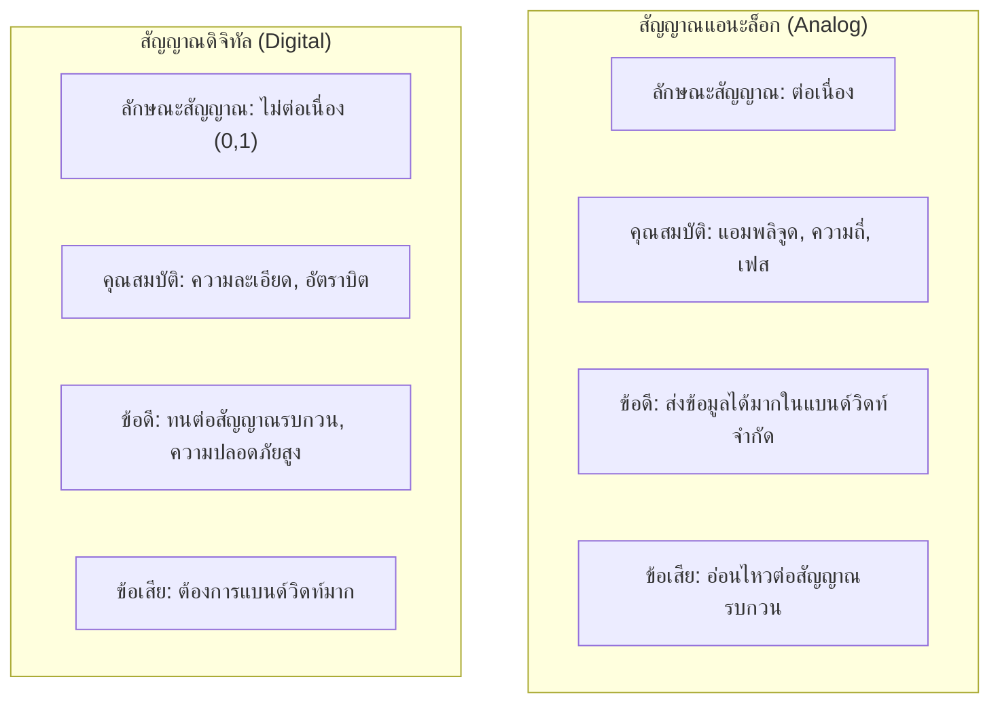

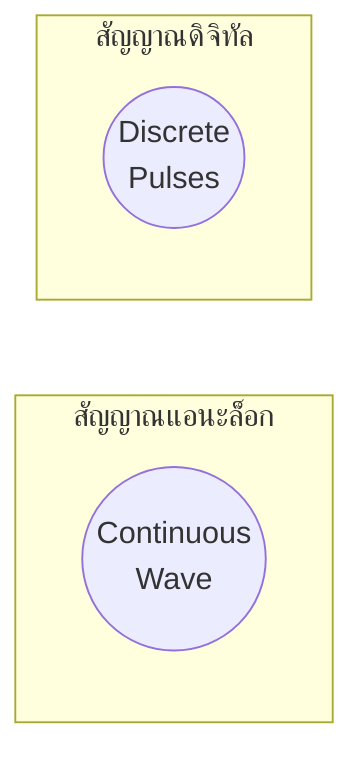

#### ภาพเปรียบเทียบสัญญาณแอนะล็อกและดิจิทัล

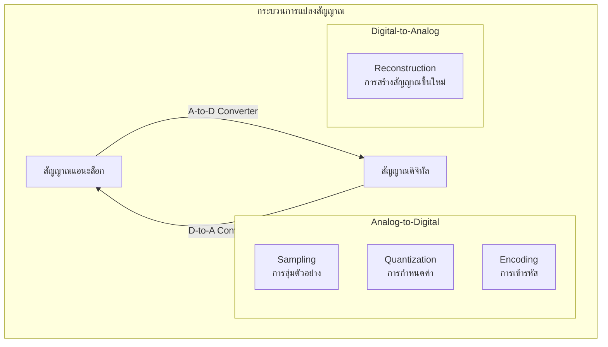

### 3.1.1 ระบบโทรศัพท์มือถือ 5G

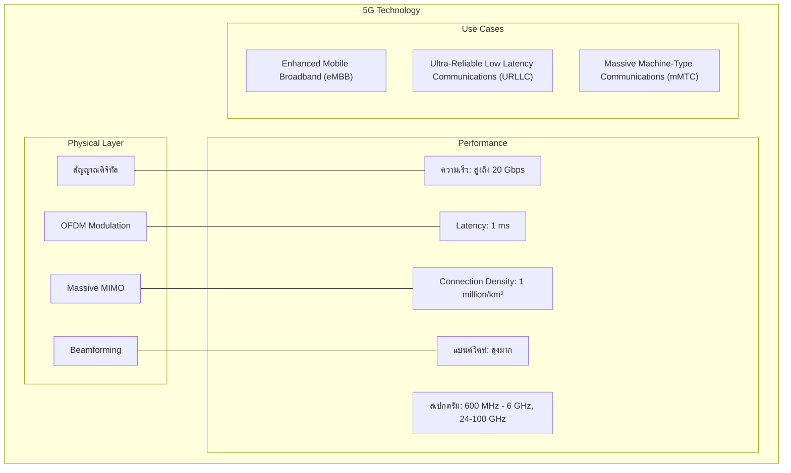

**การวิเคราะห์ความเหมาะสม: ระบบโทรศัพท์มือถือ 5G ควรใช้การส่งข้อมูลแบบดิจิทัล**

**เหตุผลสนับสนุน:**

1. **ความต้องการแบนด์วิดท์และความจุสูง**
   - 5G ต้องการส่งข้อมูลความเร็วสูงถึง 20 Gbps
   - การใช้สัญญาณดิจิทัลกับเทคนิค QAM (Quadrature Amplitude Modulation) ทำให้ส่งข้อมูลได้มากในย่านความถี่จำกัด
   - เทคนิคดิจิทัลอย่าง OFDM (Orthogonal Frequency Division Multiplexing) ช่วยเพิ่มประสิทธิภาพการใช้สเปกตรัม

2. **ความทนทานต่อสัญญาณรบกวนและความน่าเชื่อถือ**
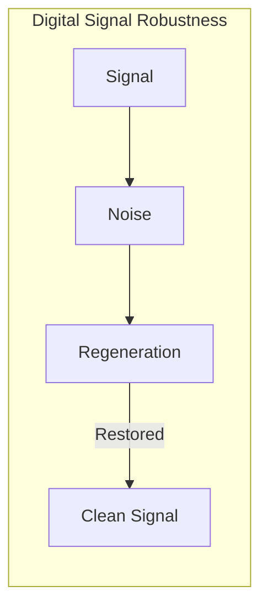
   - สัญญาณดิจิทัลสามารถฟื้นฟูได้ที่สถานีฐาน (base station) และ repeaters
   - ระบบ 5G ต้องรองรับการเชื่อมต่อที่เชื่อถือได้สูงสำหรับบริการที่สำคัญ (critical services)
   - Error detection และ correction ทำได้มีประสิทธิภาพมากกว่าในระบบดิจิทัล

3. **การประมวลผลสัญญาณขั้นสูง**
   - เทคโนโลยี Massive MIMO ต้องใช้ Digital Signal Processing (DSP)
   - Beamforming ที่แม่นยำต้องอาศัยการประมวลผลดิจิทัล
   - ความยืดหยุ่นในการจัดสรรทรัพยากรคลื่นความถี่

4. **การรวมกับเครือข่ายข้อมูลที่มีอยู่**
   - เครือข่ายหลัก (Core Network) ทั้งหมดเป็นดิจิทัล
   - IP-based (Internet Protocol) ต้องการสัญญาณดิจิทัล
   - รองรับการเชื่อมต่อกับระบบคลาวด์และโครงสร้างพื้นฐาน IT

5. **ประสิทธิภาพพลังงาน**
   - การประมวลผลสัญญาณดิจิทัลใช้พลังงานน้อยกว่าในอุปกรณ์สมัยใหม่
   - สำคัญสำหรับอุปกรณ์พกพาที่ใช้แบตเตอรี่

### 3.1.2 การส่งสัญญาณโทรทัศน์ผ่านดาวเทียม


**การวิเคราะห์ความเหมาะสม: การส่งสัญญาณโทรทัศน์ผ่านดาวเทียมควรใช้การส่งข้อมูลแบบดิจิทัล แต่มีประวัติการใช้แบบแอนะล็อกมาก่อน**

**เหตุผลสนับสนุนการใช้สัญญาณดิจิทัล:**

1. **คุณภาพภาพและเสียงที่ดีกว่า**
```mermaid
   flowchart LR
       subgraph "Digital vs Analog TV Quality"
           A[Analog: NTSC/PAL/SECAM] -->|480i/576i| AQ[Lower Resolution]
           D[Digital: DVB/ATSC] -->|1080p/4K| DQ[Higher Resolution]
       end
       
    %%    style A fill:#ff9999
    %%    style AQ fill:#ffcc99
    %%    style D fill:#99ccff
    %%    style DQ fill:#99ff99
   ```
   - สัญญาณดิจิทัล (DVB-S/DVB-S2) รองรับความละเอียดสูงได้ดีกว่า (HD, 4K, 8K)
   - ไม่มีปัญหาภาพซ้อน (ghosting) หรือสัญญาณรบกวน (snow)
   - คุณภาพเสียงดีขึ้น (surround sound, multiple audio tracks)

2. **การใช้แบนด์วิดท์อย่างมีประสิทธิภาพ**
   - การบีบอัดข้อมูลแบบดิจิทัล (MPEG-2, MPEG-4/H.264, HEVC/H.265) ช่วยเพิ่มจำนวนช่อง
   - ทรานสปอนเดอร์ (transponder) เดียวสามารถส่งหลายช่องรายการ
   - ประหยัดค่าใช้จ่ายในการส่งสัญญาณผ่านดาวเทียม

3. **บริการมัลติมีเดียเพิ่มเติม**
   - Electronic Program Guide (EPG)
   - Interactive TV, Video on Demand
   - บริการข้อมูลเสริม (แหล่งข้อมูล, คำบรรยายใต้ภาพ, หลายภาษา)

4. **ความเชื่อถือได้และความทนทานต่อสัญญาณรบกวน**
```mermaid
   graph LR
       subgraph "Signal Interference"
           AS[Analog Signal] -->|Interference| AD[Degraded Picture]
           DS[Digital Signal] -->|Interference| DE{Error Correction}
           DE -->|Successful| DG[Perfect Picture]
           DE -->|Failed| DL["Signal Loss<br/>Digital Cliff"]
       end
       
%%     <!-- style AS fill:#ff9999
%% style AD fill:#ff6666
%% style DS fill:#99ccff
%% style DG fill:#99ff99
%% style DL fill:#ff6666 -->
   ```
   - การเข้ารหัสแก้ไขข้อผิดพลาด (FEC - Forward Error Correction) ช่วยรักษาคุณภาพสัญญาณ
   - ทนทานต่อสัญญาณรบกวนจากสภาพอากาศและการรบกวนทางแม่เหล็กไฟฟ้า
   - แต่มี "Digital Cliff Effect" คือภาพจะหายทั้งหมดเมื่อสัญญาณอ่อนมาก

**เหตุผลที่มีการใช้แอนะล็อกในอดีต:**

1. **ความเข้ากันได้กับอุปกรณ์เก่า**
   - ทีวีรุ่นเก่าไม่สามารถรับสัญญาณดิจิทัลได้โดยตรง
   - การเปลี่ยนผ่านต้องใช้เวลาและต้นทุนสูง

2. **การลดทอนสัญญาณแบบเกรเดียนท์**
   - สัญญาณแอนะล็อกคุณภาพลดลงแบบค่อยเป็นค่อยไปเมื่อมีการรบกวน
   - สัญญาณดิจิทัลจะมีปัญหา "all or nothing" (digital cliff)

3. **ความคุ้นเคยและการยอมรับของผู้ใช้**
   - ผู้ชมคุ้นเคยกับระบบแอนะล็อก
   - ไม่ต้องการอุปกรณ์เพิ่มเติม (set-top box)

**บทสรุป:** ปัจจุบันและอนาคตของการส่งสัญญาณโทรทัศน์ผ่านดาวเทียมควรเป็นดิจิทัลอย่างชัดเจน เนื่องจากข้อดีที่เหนือกว่ามาก และในปัจจุบันมีการเปลี่ยนไปใช้มาตรฐาน DVB-S2 และ DVB-S2X ที่มีประสิทธิภาพสูงขึ้น

### 3.1.3 ระบบเซ็นเซอร์ตรวจวัดอุณหภูมิในโรงงานอุตสาหกรรม

```mermaid
graph TD
    subgraph "Industrial Temperature Sensing System"
        subgraph "Sensors"
            S1[Temperature Sensor 1]
            S2[Temperature Sensor 2]
            S3[Temperature Sensor n]
        end
        
        subgraph "Signal Processing"
            SP1[Signal Conditioning]
            SP2[A/D Conversion]
            SP3[Filtering]
        end
        
        subgraph "Control System"
            C1[Programmable Logic Controller]
            C2[SCADA System]
            C3[Automation Control]
        end
        
        subgraph "Interfaces"
            I1[HMI Display]
            I2[Data Logging]
            I3[Alerts & Alarms]
        end
        
        S1 & S2 & S3 -->|Analog| SP1 --> SP2 -->|Digital| SP3 --> C1 --> C2 & C3
        C2 --> I1 & I2 & I3
    end
    
    %% style S1 fill:#ff9999
    %% style S2 fill:#ff9999
    %% style S3 fill:#ff9999
    %% style SP1 fill:#ff9999
    %% style SP2 fill:#ffcc99
    %% style SP3 fill:#99ccff
    %% style C1 fill:#99ccff
    %% style C2 fill:#99ccff
```

**การวิเคราะห์ความเหมาะสม: ระบบเซ็นเซอร์ตรวจวัดอุณหภูมิควรใช้การตรวจวัดแบบแอนะล็อกที่ต้นทาง และแปลงเป็นดิจิทัลเพื่อประมวลผลและจัดเก็บ**

**เหตุผลสนับสนุนการใช้แอนะล็อกที่ต้นทาง:**

1. **ธรรมชาติของการวัดอุณหภูมิ**
```mermaid
   graph LR
       subgraph "Temperature Sensor Types"
           T1[Thermocouple]
           T2[RTD<br/>Resistance Temperature Detector]
           T3[Thermistor]
           T4[Semiconductor]
       end
       
       T1 & T2 & T3 & T4 -->|Generate| A[Analog Signal<br/>Voltage/Current]
       
%%       style T1 fill:#ff9999
%% style T2 fill:#ff9999
%% style T3 fill:#ff9999
%% style T4 fill:#ff9999
%% style A fill:#ff9999
   ```
   - เซ็นเซอร์อุณหภูมิส่วนใหญ่ (เช่น Thermocouple, RTD, Thermistor) ให้สัญญาณแอนะล็อกโดยธรรมชาติ
   - อุณหภูมิเป็นปรากฏการณ์ต่อเนื่อง ไม่ได้เปลี่ยนแปลงแบบดิจิทัล
   - ความละเอียดและความแม่นยำสูงที่ช่วงอุณหภูมิกว้าง

2. **ความแม่นยำและความละเอียด**
   - การวัดแบบแอนะล็อกสามารถตรวจจับการเปลี่ยนแปลงอุณหภูมิเล็กๆ ได้
   - สามารถให้ค่าต่อเนื่องไม่ใช่เพียงระดับเป็นขั้นๆ (discrete steps)
   - สำคัญในกระบวนการที่ต้องการความแม่นยำสูง เช่น การผลิตยา, เซมิคอนดักเตอร์

**เหตุผลสนับสนุนการแปลงเป็นดิจิทัลเพื่อประมวลผล:**

1. **การประมวลผลและการวิเคราะห์ข้อมูล**
```mermaid
   graph TB
       subgraph "Signal Path"
           A[Analog Sensor] -->|mV/mA| C[Signal Conditioning]
           C -->|V/mA| ADC[Analog-to-Digital<br/>Converter]
           ADC -->|Digital Value| P[Processing]
           P --> S[Storage]
           P --> D[Display]
           P --> AL[Alarms]
           P --> N[Network]
       end
       
%%       style A fill:#ff9999
%% style C fill:#ff9999
%% style ADC fill:#ffcc99
%% style P fill:#99ccff
%% style S fill:#99ccff
%% style D fill:#99ccff
%% style AL fill:#99ccff
%% style N fill:#99ccff
   ```
   - ระบบ PLC, SCADA และ DCS ทำงานด้วยข้อมูลดิจิทัล
   - การประมวลผลทางสถิติ, การตรวจจับแนวโน้ม, การแจ้งเตือนทำได้ง่ายกว่าในรูปแบบดิจิทัล
   - Big Data และ Machine Learning ต้องการข้อมูลดิจิทัล

2. **การส่งข้อมูลในระยะไกลและเครือข่าย**
   - สัญญาณดิจิทัลทนทานต่อสัญญาณรบกวนในการส่งระยะไกล
   - โปรโตคอลอุตสาหกรรม เช่น Modbus, Profibus, Ethernet/IP ใช้การสื่อสารแบบดิจิทัล
   - การเชื่อมต่อกับ IoT และ Cloud platform

3. **การจัดเก็บและการติดตามข้อมูลย้อนหลัง**
   - สามารถเก็บข้อมูลเป็นระยะเวลานานโดยไม่สูญเสียความแม่นยำ
   - การบีบอัดข้อมูลทำได้มีประสิทธิภาพ
   - การตรวจสอบย้อนหลัง (audit trail) สำหรับการควบคุมคุณภาพ

4. **ความยืดหยุ่นในการใช้งาน**
   - ปรับเทียบและตั้งค่าได้จากซอฟต์แวร์ ไม่ต้องปรับแต่งฮาร์ดแวร์
   - เปลี่ยนช่วงการวัดและหน่วยได้ง่าย
   - ทำ multi-parameter monitoring จากเซ็นเซอร์เดียวกัน

**ระบบไฮบริด (Hybrid) ที่เหมาะสมที่สุด:**

```mermaid
flowchart LR
    subgraph "Optimal Industrial Temperature Sensing"
        S[Temperature Sensor] -->|Analog| SC[Signal Conditioning]
        SC -->|Conditioned Analog| ADC[A/D Converter]
        ADC -->|Digital| PLC[Programmable<br/>Logic Controller]
        PLC --> SCADA[SCADA/HMI]
        PLC --> DB[Database]
        PLC --> NW[Network/Cloud]
    end
    
    %% style S fill:#ff9999
    %% style SC fill:#ff9999
    %% style ADC fill:#ffcc99
    %% style PLC fill:#99ccff
    %% style SCADA fill:#99ccff
    %% style DB fill:#99ccff
    %% style NW fill:#99ccff
```

1. **ใช้แอนะล็อกที่เซ็นเซอร์และการปรับสภาพสัญญาณ (Signal Conditioning)**
   - การวัดอุณหภูมิโดยตรงด้วยเซ็นเซอร์แอนะล็อก
   - การขยายสัญญาณ (Amplification) และกรอง (Filtering) ในรูปแบบแอนะล็อก

2. **แปลงเป็นดิจิทัลให้ใกล้เซ็นเซอร์มากที่สุด**
   - แปลงสัญญาณแอนะล็อกเป็นดิจิทัลด้วย ADC ความละเอียดสูง (16-24 bit)
   - ลดสัญญาณรบกวนจากการส่งสัญญาณแอนะล็อกระยะไกล
   - Smart Transmitter รวม ADC ไว้ในตัวเซ็นเซอร์

3. **ประมวลผลและจัดการข้อมูลในรูปแบบดิจิทัล**
   - ระบบควบคุม PLC/DCS ดิจิทัล
   - การแสดงผลและการเก็บประวัติข้อมูลในรูปแบบดิจิทัล
   - การวิเคราะห์และการแจ้งเตือนโดยซอฟต์แวร์

**บทสรุป:** ระบบเซ็นเซอร์ตรวจวัดอุณหภูมิในโรงงานอุตสาหกรรมที่เหมาะสมที่สุดควรเป็นระบบไฮบริด โดยใช้การตรวจวัดแอนะล็อกที่ต้นทาง และแปลงเป็นดิจิทัลโดยเร็วที่สุดเพื่อการประมวลผล จัดเก็บ และแสดงผล

---

### 3.2 ผลกระทบของการลดทอนและการบิดเบือนของสัญญาณต่อคุณภาพการสื่อสารข้อมูล และแนวทางการแก้ไข

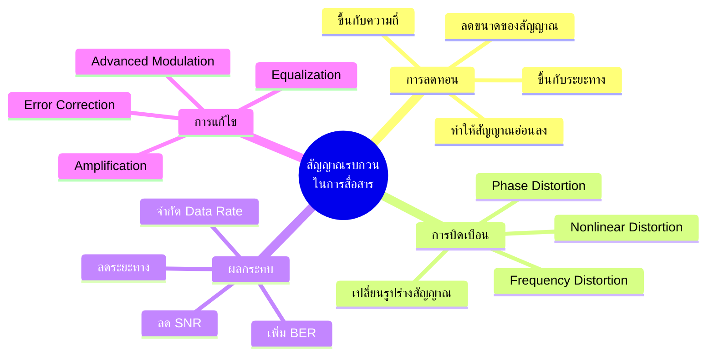

#### 3.2.1 การลดทอนของสัญญาณ (Signal Attenuation)

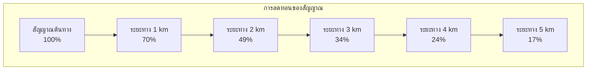

**ผลกระทบต่อคุณภาพการสื่อสาร:**

1. **ลดอัตราส่วนสัญญาณต่อสัญญาณรบกวน (SNR - Signal-to-Noise Ratio)**
   ```
   SNR = 10 * log10(Psignal / Pnoise) dB
   ```
   - เมื่อสัญญาณอ่อนลง แต่สัญญาณรบกวนคงที่ ทำให้ SNR ลดลง
   - SNR ต่ำทำให้ความผิดพลาดในการสื่อสารเพิ่มขึ้น

2. **เพิ่มอัตราความผิดพลาดบิต (BER - Bit Error Rate)**
   - ตัวรับสัญญาณแยกแยะระหว่าง 0 กับ 1 ได้ยากขึ้น
   - อาจทำให้ข้อมูลเสียหายหรือสูญหาย

3. **จำกัดระยะทางการสื่อสาร**
   - สัญญาณเดินทางไกลไม่ได้เพราะอ่อนเกินไป
   - ต้องใช้ repeater หรือ amplifier

4. **ลดอัตราการส่งข้อมูล**
   - สัญญาณที่อ่อนลงทำให้ต้องใช้การเข้ารหัสที่ทนทานมากขึ้น แต่ส่งข้อมูลได้น้อยลง
   - เชื่อมต่อช้าลงเพื่อรักษาความน่าเชื่อถือ

**สาเหตุของการลดทอน:**

1. **ระยะทาง**
   - สัญญาณลดลงตามกฎ Inverse Square Law
   - เพิ่มขึ้นตามระยะทางการเดินทาง

2. **คุณสมบัติของตัวกลาง**
   - ในสายเคเบิล: ความต้านทาน, capacitance, inductance
   - ในอากาศ: การดูดซับโดยอนุภาคในบรรยากาศ, ความชื้น, ฝน

3. **ความถี่ของสัญญาณ**
   - ความถี่สูงมักลดทอนเร็วกว่า
   - ความถี่ต่างกันลดทอนไม่เท่ากัน

#### 3.2.2 การบิดเบือนของสัญญาณ (Signal Distortion)

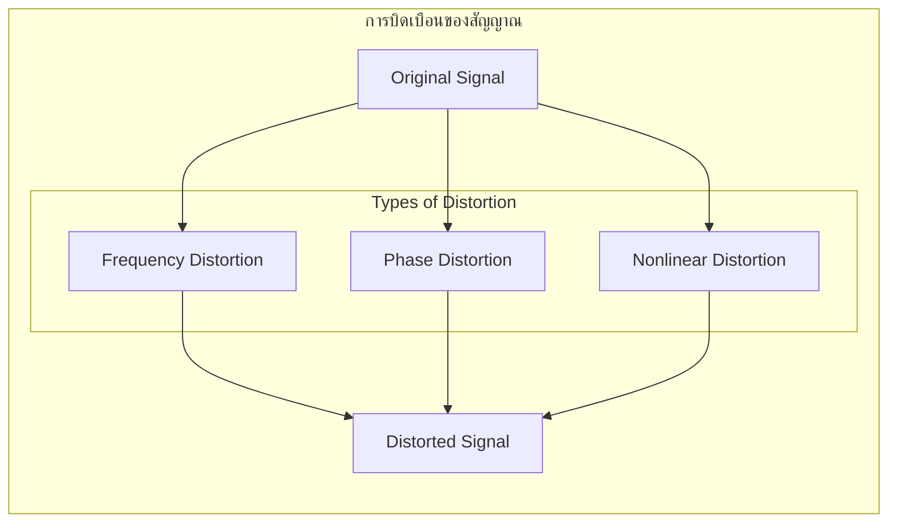

**ประเภทของการบิดเบือน:**

1. **การบิดเบือนความถี่ (Frequency Distortion)**
   - ความถี่ต่างๆ ในสัญญาณถูกลดทอนไม่เท่ากัน
   - ทำให้สเปกตรัมของสัญญาณเปลี่ยนแปลง
   - เสียงอาจฟังไม่ชัด ภาพอาจผิดเพี้ยน

2. **การบิดเบือนเฟส (Phase Distortion)**
```mermaid
   graph TB
       subgraph "Phase Distortion Effect"
           S1[Original Signal<br/>Component 1] & S2[Original Signal<br/>Component 2]
           S1 & S2 --> C[Combined Signal]
           P1[Phase Shifted<br/>Component 1] & P2[Phase Shifted<br/>Component 2]
           P1 & P2 --> D[Distorted Signal]
       end
%%        style S1 fill:#99ff99
%% style S2 fill:#99ff99
%% style C fill:#99ff99
%% style P1 fill:#ffcc99
%% style P2 fill:#ffcc99
%% style D fill:#ff9999
      
   ```
   - องค์ประกอบความถี่ต่างๆ มีการเปลี่ยนแปลงเฟสไม่เท่ากัน
   - ทำให้รูปร่างของสัญญาณเปลี่ยนไป
   - สำคัญมากในการสื่อสารดิจิทัลที่ใช้การปรับเฟส

3. **การบิดเบือนไม่เชิงเส้น (Nonlinear Distortion)**
   - เกิดจากอุปกรณ์ที่มีการตอบสนองไม่เป็นเชิงเส้น
   - ทำให้เกิดฮาร์มอนิกหรือความถี่แปลกปลอม
   - เสียงแตก (clipping) หรือมีเสียงแทรก

**ผลกระทบต่อคุณภาพการสื่อสาร:**

1. **สัญญาณระหว่างสัญลักษณ์รบกวนกัน (ISI - Inter-Symbol Interference)**
```mermaid
   graph TB
       subgraph "Inter-Symbol Interference"
           O[Original Bits<br/>0 1 0 1 0]
           T[Transmitted Pulses]
           R[Received Pulses<br/>Overlapping]
           D[Detected Bits<br/>0 1 ? 1 0]
       end
       
       O --> T --> R --> D
       
%%        style O fill:#99ff99
%% style R fill:#ff9999
%% style D fill:#ffcc99
   ```
   - สัญลักษณ์หนึ่งส่งผลกระทบต่อสัญลักษณ์ถัดไป
   - ทำให้อ่านค่าผิดพลาด
   - จำกัดอัตราเร็วในการส่งข้อมูลสูงสุด

2. **ลดประสิทธิภาพการปรับสัญญาณ (Modulation)**
   - ในการปรับสัญญาณขั้นสูง (เช่น QAM) การบิดเบือนทำให้แยกแยะสถานะต่างๆ ได้ยาก
   - ลดจำนวน bits ที่ส่งได้ต่อสัญลักษณ์

3. **การขยายขอบเขตความถี่ (Spectral Spreading)**
   - การบิดเบือนทำให้ต้องใช้แบนด์วิดท์มากขึ้น
   - อาจรบกวนช่องสัญญาณข้างเคียง

**สาเหตุของการบิดเบือน:**

1. **คุณสมบัติของตัวกลางที่ไม่เป็นอุดมคติ**
   - ตัวเก็บประจุและตัวเหนี่ยวนำแฝงในสายสัญญาณ
   - การสะท้อนและการกระเจิงในการสื่อสารไร้สาย

2. **ข้อจำกัดของอุปกรณ์**
   - ความถี่ตอบสนองที่ไม่เรียบของเครื่องส่งและเครื่องรับ
   - การทำงานในช่วงไม่เชิงเส้นของอุปกรณ์ขยายสัญญาณ

3. **Multipath Propagation**
   - สัญญาณเดินทางหลายเส้นทางถึงเครื่องรับในเวลาต่างกัน
   - ทำให้เกิดการรวมกันแบบทั้งเสริมและหักล้าง

#### 3.2.3 แนวทางการแก้ไขที่เหมาะสมสำหรับระบบการสื่อสารความเร็วสูง

```mermaid
graph TB
    subgraph "แนวทางการแก้ไข"
        subgraph "การลดทอน"
            A1[Signal Amplification]
            A2[Low-loss Media]
            A3[Repeaters]
        end
        
        subgraph "การบิดเบือน"
            D1[Equalizers]
            D2[Predistortion]
            D3[Adaptive Filtering]
        end
        
        subgraph "ทั้งสองปัญหา"
            B1[Error Correction Codes]
            B2[Advanced Modulation]
            B3[MIMO Technology]
            B4[DSP Techniques]
        end
    end
    
    %% style A1 fill:#99ff99
    %% style A2 fill:#99ff99
    %% style A3 fill:#99ff99
    %% style D1 fill:#ffcc99
    %% style D2 fill:#ffcc99
    %% style D3 fill:#ffcc99
    %% style B1 fill:#99ccff
    %% style B2 fill:#99ccff
    %% style B3 fill:#99ccff
```

##### 1. **การแก้ไขปัญหาการลดทอนของสัญญาณ**

**1.1 การขยายสัญญาณ (Amplification)**

- **วิธีการ:** ใช้เครื่องขยายสัญญาณ (amplifiers) เพื่อชดเชยการลดทอน
- **ข้อดี:** เพิ่ม SNR, ขยายระยะทางการสื่อสาร
- **ข้อควรระวัง:** ต้องระวังการขยายสัญญาณรบกวน, การบิดเบือน
- **เทคโนโลยี:** Low Noise Amplifiers (LNA), Distributed Amplification

**1.2 การใช้สื่อนำสัญญาณที่มีการลดทอนต่ำ**
- **วิธีการ:** เลือกใช้สื่อที่มีการลดทอนต่ำ เช่น ใยแก้วนำแสง
- **ข้อดี:** ลดความจำเป็นในการขยายสัญญาณ, ลดสัญญาณรบกวน
- **ตัวอย่าง:** Single-mode fiber, Low-loss coaxial cable

**1.3 การใช้ Repeaters และ Regenerators**

- **วิธีการ:** วางอุปกรณ์ทวนสัญญาณตามระยะทาง
- **ข้อดี:** ฟื้นฟูสัญญาณก่อนจะอ่อนเกินไป
- **เทคโนโลยี:** 
  - Analog repeaters: ขยายสัญญาณทั้งหมด
  - Digital regenerators: แปลงกลับเป็นสัญญาณดิจิทัลใหม่ ลดการสะสมของสัญญาณรบกวน

**1.4 การส่งพลังงานที่เหมาะสม**
- **วิธีการ:** ปรับกำลังส่งให้เหมาะกับระยะทางและสภาพแวดล้อม
- **ข้อดี:** ประหยัดพลังงาน, ลดการรบกวนระบบอื่น
- **เทคโนโลยี:** Adaptive Power Control

##### 2. **การแก้ไขปัญหาการบิดเบือนของสัญญาณ**

**2.1 การใช้ Equalizers**
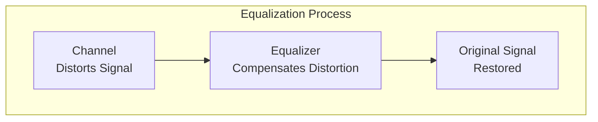
- **วิธีการ:** ใช้วงจรที่มีการตอบสนองตรงข้ามกับการบิดเบือน
- **ประเภท:**
  - Fixed Equalizers: ออกแบบสำหรับช่องสัญญาณที่รู้ลักษณะแน่นอน
  - Adaptive Equalizers: ปรับตัวตามการเปลี่ยนแปลงของช่องสัญญาณ
  - Decision Feedback Equalizers (DFE): ใช้การตัดสินใจก่อนหน้าช่วยแก้ไข ISI

**2.2 การชดเชยล่วงหน้า (Predistortion)**

- **วิธีการ:** บิดเบือนสัญญาณล่วงหน้าในทิศทางตรงข้ามกับที่ช่องสัญญาณจะบิดเบือน
- **ข้อดี:** แก้ไขการบิดเบือนก่อนจะเกิด
- **การใช้งาน:** แก้ไขการบิดเบือนไม่เชิงเส้นในเครื่องขยายกำลังส่ง

**2.3 การกรองแบบปรับตัว (Adaptive Filtering)**
- **วิธีการ:** ใช้อัลกอริทึมปรับตัวเพื่อกำจัดการบิดเบือนที่เปลี่ยนแปลงตามเวลา
- **ข้อดี:** ทำงานได้ในสภาพแวดล้อมที่เปลี่ยนแปลง
- **อัลกอริทึม:** LMS (Least Mean Square), RLS (Recursive Least Square)

**2.4 การชดเชย Multipath**
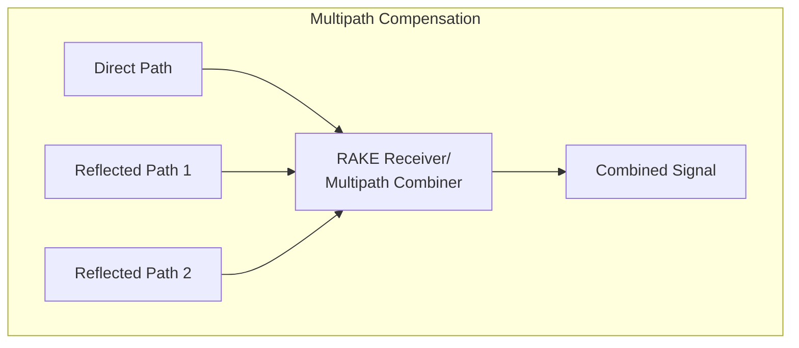
- **วิธีการ:** ใช้เทคนิคเช่น RAKE receivers หรือ OFDM
- **ข้อดี:** เปลี่ยน multipath จากปัญหาเป็นประโยชน์
- **เทคโนโลยี:** CDMA, OFDM, MIMO

##### 3. **เทคนิคขั้นสูงสำหรับระบบการสื่อสารความเร็วสูง**

**3.1 การเข้ารหัสแก้ไขข้อผิดพลาด (Forward Error Correction - FEC)**
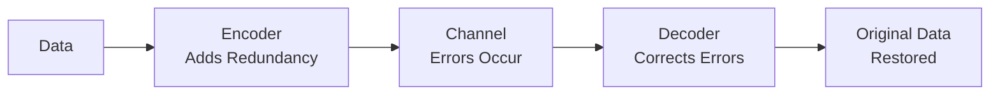
- **วิธีการ:** เพิ่มบิตซ้ำซ้อนเพื่อตรวจจับและแก้ไขข้อผิดพลาด
- **ประเภท:** 
  - Block Codes: Reed-Solomon, BCH, LDPC
  - Convolutional Codes: Viterbi decoding
  - Turbo Codes และ LDPC: ประสิทธิภาพเกือบถึงขีดจำกัดของ Shannon
- **ข้อดี:** เพิ่มความน่าเชื่อถือโดยไม่ต้องส่งซ้ำ

**3.2 เทคนิคการปรับสัญญาณขั้นสูง (Advanced Modulation)**
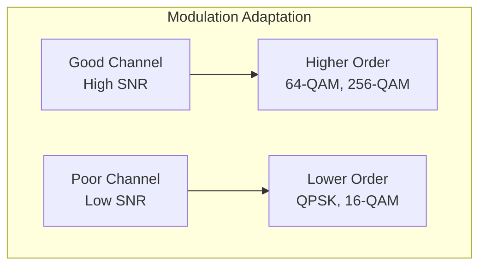
- **วิธีการ:** เลือกรูปแบบการปรับสัญญาณตามคุณภาพช่องสัญญาณ
- **เทคนิค:** 
  - Adaptive Modulation and Coding (AMC)
  - Higher order QAM (256-QAM, 1024-QAM)
  - Spatial Modulation
- **ข้อดี:** เพิ่มประสิทธิภาพการใช้แบนด์วิดท์

**3.3 เทคโนโลยี MIMO (Multiple-Input Multiple-Output)**
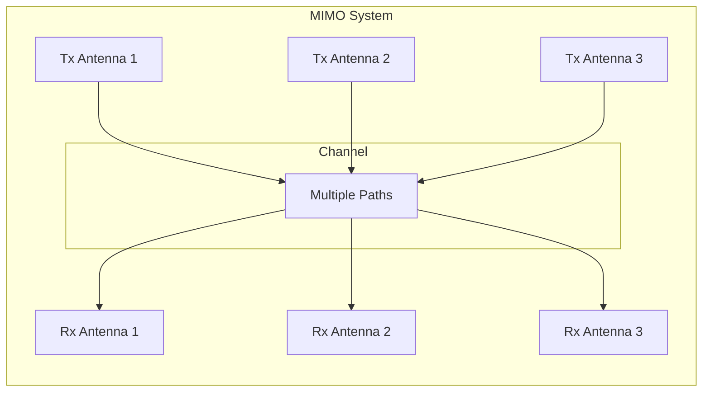
- **วิธีการ:** ใช้หลายเสาอากาศทั้งในฝั่งส่งและรับ
- **ประโยชน์:**
  - Spatial Diversity: ลดผลกระทบจาก fading
  - Spatial Multiplexing: เพิ่มความจุโดยส่งข้อมูลต่างกันผ่านเสาอากาศต่างกัน
  - Beamforming: มุ่งพลังงานไปยังทิศทางเฉพาะ
- **ข้อดี:** เพิ่มความเร็วและความน่าเชื่อถือโดยไม่ต้องเพิ่มแบนด์วิดท์

**3.4 เทคนิคการประมวลผลสัญญาณดิจิทัล (DSP Techniques)**
- **วิธีการ:** ใช้อัลกอริทึมประมวลผลสัญญาณขั้นสูง
- **เทคนิค:**
  - Carrier Recovery and Synchronization
  - Channel Estimation
  - Interference Cancellation
  - Maximum Likelihood Detection
- **ข้อดี:** เพิ่มประสิทธิภาพทั้งระบบ

**3.5 การสื่อสารความเร็วสูงโดยใช้ใยแก้วนำแสง**
```mermaid
flowchart LR
    L[Laser<br/>Source] --> M[Modulator] --> F[Fiber Optic] --> OA[Optical<br/>Amplifier] --> F2[Fiber Optic] --> R[Receiver]
    
    %% style L fill:#99ff99
    %% style OA fill:#99ff99
    %% style F fill:#99ccff
    %% style F2 fill:#99ccff
```
- **วิธีการ:** ใช้เทคโนโลยีเชิงแสงขั้นสูง
- **เทคนิค:**
  - WDM (Wavelength Division Multiplexing): หลายความยาวคลื่นในเส้นใยเดียว
  - Coherent Detection: เพิ่มความไวและความสามารถในการเลือกความถี่
  - Digital Signal Processing: ชดเชย dispersion และ nonlinearity
  - Advanced Modulation Formats: QAM, QPSK สำหรับการสื่อสารเชิงแสง
- **ข้อดี:** ความเร็วสูงมาก (Tbps) และการลดทอนต่ำ

---

#### สรุปกลยุทธ์การแก้ไขปัญหาสำหรับระบบการสื่อสารความเร็วสูง

```mermaid
mindmap
  root((ระบบสื่อสาร<br/>ความเร็วสูง))
    การออกแบบพื้นฐาน
      เลือกสื่อที่เหมาะสม
      ออกแบบโครงข่ายเหมาะสม
      ระบบจ่ายกำลังที่ดี
    การปรับปรุงการส่งสัญญาณ
      Pre-emphasis/De-emphasis
      การชดเชย Impedance
      การขยายสัญญาณเชิงเส้น
    การแก้ไขการลดทอน
      Signal Boosters
      Repeaters/Amplifiers
      แบ่งเป็นเซกเมนต์ที่สั้นลง
    การแก้ไขการบิดเบือน
      Equalizers
      ตัวกรองปรับตัวได้
      การชดเชยล่วงหน้า
    เทคโนโลยีขั้นสูง
      MIMO
      Advanced DSP
      FEC Codes
      Coherent Detection
    การบริหารทรัพยากร
      Cognitive Radio
      Dynamic Spectrum Access
      Adaptive Modulation
```

**1. กลยุทธ์เชิงป้องกัน**
- การออกแบบระบบที่มีความทนทาน (robust) ตั้งแต่แรก
- การเลือกสื่อกลางและอุปกรณ์ที่เหมาะสมกับความต้องการ
- การคำนวณและวางแผน link budget อย่างรอบคอบ

**2. กลยุทธ์เชิงปรับตัว**
- ระบบที่สามารถตรวจสอบและปรับตัวตามสภาพช่องสัญญาณ
- อัลกอริทึมที่สามารถเรียนรู้และแก้ไขปัญหาได้อัตโนมัติ
- การปรับเปลี่ยนพารามิเตอร์ตามเวลาจริง

**3. กลยุทธ์เชิงเทคโนโลยี**
- การรวมเทคโนโลยีหลายด้านเข้าด้วยกัน
- การพัฒนาอัลกอริทึมและเทคนิคการประมวลผลสัญญาณใหม่ๆ
- การใช้ประโยชน์จากพลังของการประมวลผลดิจิทัล

บทสรุป: การแก้ไขปัญหาการลดทอนและการบิดเบือนของสัญญาณในระบบการสื่อสารความเร็วสูงต้องใช้วิธีการแบบบูรณาการ โดยผสมผสานทั้งเทคนิคเชิงอนาล็อกและดิจิทัล รวมถึงการออกแบบทั้งระบบอย่างเหมาะสม ในยุคปัจจุบันที่มีการประมวลผลสัญญาณดิจิทัลที่ทรงพลัง เราสามารถชดเชยผลกระทบต่างๆ ได้มากขึ้น ทำให้ระบบสื่อสารความเร็วสูงมีประสิทธิภาพและน่าเชื่อถือมากขึ้น