# คำตอบโจทย์ปัญหา Computer Network - ข้อ 4

## 4 สื่อกลางในการส่งข้อมูล

### 4.1 วิเคราะห์ข้อดีข้อเสียของสื่อกลางแบบมีการนำทางและไม่มีการนำทางในโครงการเมืองอัจฉริยะ (Smart City)

#### ความเข้าใจพื้นฐานเกี่ยวกับสื่อกลาง

สื่อกลางในการสื่อสารข้อมูลแบ่งออกเป็น 2 ประเภทหลัก:

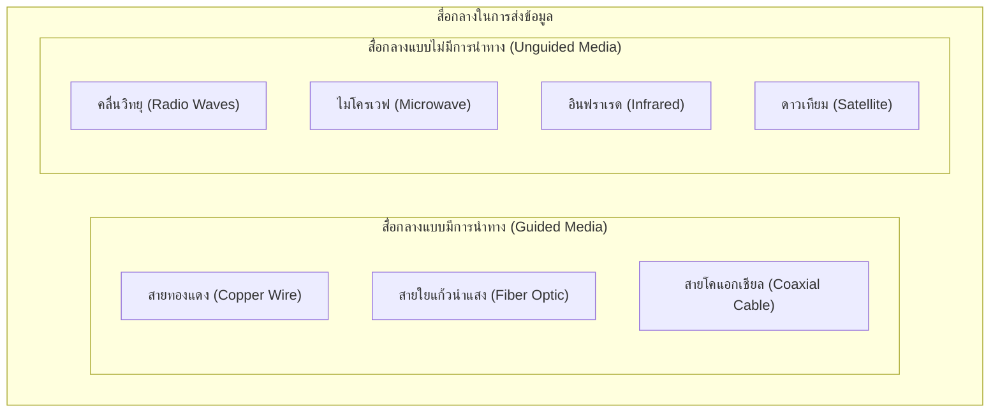

#### ภาพรวมเมืองอัจฉริยะ (Smart City)

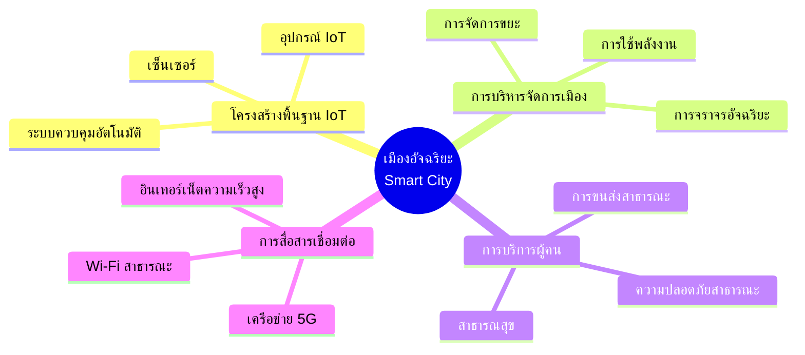

เมืองอัจฉริยะต้องการโครงสร้างพื้นฐานการสื่อสารที่มีประสิทธิภาพ รองรับการเชื่อมต่ออุปกรณ์จำนวนมาก และต้องมีความเสถียร เพื่อให้บริการดิจิทัลต่างๆ ทำงานได้อย่างต่อเนื่องและมีประสิทธิภาพ

### 4.1.1 การวิเคราะห์สื่อกลางแบบมีการนำทาง (Guided Media)

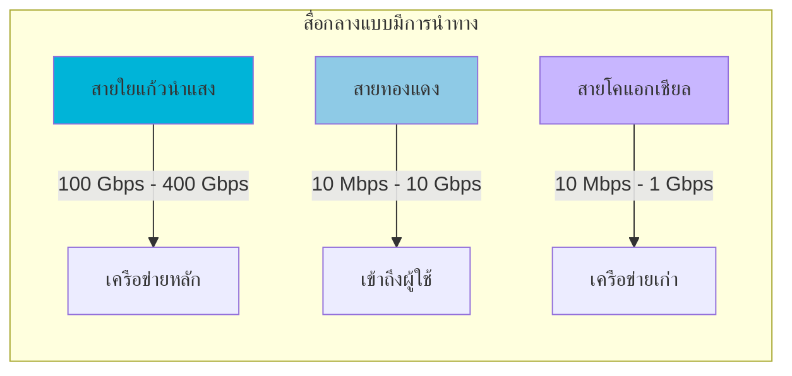

#### 1. สายใยแก้วนำแสง (Fiber Optic)

**ข้อดี:**

1. **แบนด์วิดท์สูงมาก**
   - รองรับความเร็วสูงถึง 100 Tbps ในทางทฤษฎี
   - ปัจจุบันใช้งานจริงที่ 100 Gbps - 400 Gbps
   - รองรับการใช้งานในอนาคต

2. **ความปลอดภัยสูง**
   ```mermaid
   graph LR
       subgraph "ความปลอดภัยของสายใยแก้ว"
           T[ข้อมูลเป็นแสง] --> N[ไม่แพร่กระจายคลื่นแม่เหล็กไฟฟ้า]
           N --> S[ยากต่อการดักจับ]
           S --> H[ความปลอดภัยสูง]
       end
       
       style T fill:#00b4d8
       style H fill:#6bcf7f
   ```
   - ไม่มีการแพร่กระจายสัญญาณออกนอกสาย
   - ยากต่อการดักจับสัญญาณโดยไม่ถูกตรวจพบ

3. **ระยะทางไกล**
   - สัญญาณเดินทางได้ไกลถึง 100 กม. โดยไม่ต้องใช้อุปกรณ์ขยายสัญญาณ
   - เหมาะสำหรับการเชื่อมต่อระยะไกลระหว่างพื้นที่ในเมือง

4. **ไม่มีการรบกวนทางไฟฟ้า (EMI)**
   - ทนทานต่อสัญญาณรบกวนทางแม่เหล็กไฟฟ้า
   - เหมาะสำหรับพื้นที่อุตสาหกรรมที่มีอุปกรณ์ไฟฟ้าหนาแน่น

5. **ขนาดและน้ำหนักเล็ก**
   - สามารถเดินสายได้ง่าย
   - สามารถรวมหลายเส้นเข้าด้วยกัน

**ข้อเสีย:**

1. **ต้นทุนสูง**
   - ค่าติดตั้งแพง
   - อุปกรณ์เชื่อมต่อราคาสูง

2. **ความเปราะบาง**
   - เปราะและเสียหายง่าย
   - ต้องระมัดระวังในการติดตั้งและบำรุงรักษา

3. **ติดตั้งยาก**
   - ต้องการผู้เชี่ยวชาญในการติดตั้งและเชื่อมต่อ
   - การซ่อมแซมใช้เวลานาน

4. **Splicing และเชื่อมต่อ**
   - เชื่อมต่อ (splicing) ยุ่งยาก
   - ต้องการอุปกรณ์พิเศษ

#### 2. สายทองแดง (Copper Wire) - UTP/STP

**ข้อดี:**

1. **ราคาถูก**
   - ต้นทุนต่ำกว่าใยแก้วนำแสง
   - อุปกรณ์เชื่อมต่อราคาไม่แพง

2. **ติดตั้งง่าย**
   ```mermaid
   graph LR
       subgraph "การติดตั้งสายทองแดง"
           I[ติดตั้งง่าย] --> T[ไม่ต้องใช้เครื่องมือซับซ้อน]
           T --> S[ช่างทั่วไปติดตั้งได้]
           S --> M[ซ่อมบำรุงง่าย]
       end
       
       style I fill:#8ecae6
       style M fill:#6bcf7f
   ```
   - ไม่ต้องการความเชี่ยวชาญเฉพาะทาง
   - ซ่อมแซมได้ง่าย

3. **รองรับอุปกรณ์เดิม**
   - อุปกรณ์ส่วนใหญ่รองรับการเชื่อมต่อแบบสายทองแดง
   - ไม่ต้องเปลี่ยนอุปกรณ์ปลายทาง

4. **จ่ายไฟผ่านสายได้ (PoE)**
   - สามารถจ่ายไฟผ่านสาย Ethernet ให้อุปกรณ์ได้
   - เหมาะสำหรับกล้อง IP, จุดกระจายสัญญาณ Wi-Fi

**ข้อเสีย:**

1. **ความเร็วและระยะทางจำกัด**
   - ความเร็วสูงสุด 10 Gbps (10GBASE-T)
   - ระยะทางสูงสุด 100 เมตร

2. **รบกวนทางไฟฟ้า (EMI)**
   - ได้รับผลกระทบจากสัญญาณรบกวนทางแม่เหล็กไฟฟ้า
   - ประสิทธิภาพลดลงในพื้นที่มีคลื่นรบกวนสูง

3. **ความปลอดภัยต่ำกว่า**
   - สัญญาณสามารถถูกดักจับได้ง่ายกว่า
   - มีการแพร่กระจายคลื่นแม่เหล็กไฟฟ้า

4. **เสื่อมสภาพ**
   - ทนทานต่อสภาพแวดล้อมได้น้อยกว่าใยแก้ว
   - อายุการใช้งานสั้นกว่า

#### 3. สายโคแอกเชียล (Coaxial Cable)

**ข้อดี:**
- ทนต่อสัญญาณรบกวนได้ดีกว่าสาย UTP/STP
- แบนด์วิดท์ปานกลาง (1 Gbps)
- ราคาไม่แพงมาก

**ข้อเสีย:**
- เทคโนโลยีเก่า ใช้น้อยลงในระบบเครือข่ายปัจจุบัน
- น้ำหนักมากและติดตั้งยุ่งยาก
- ความเร็วและระยะทางด้อยกว่าใยแก้วนำแสง

### 4.1.2 การวิเคราะห์สื่อกลางแบบไม่มีการนำทาง (Unguided Media)

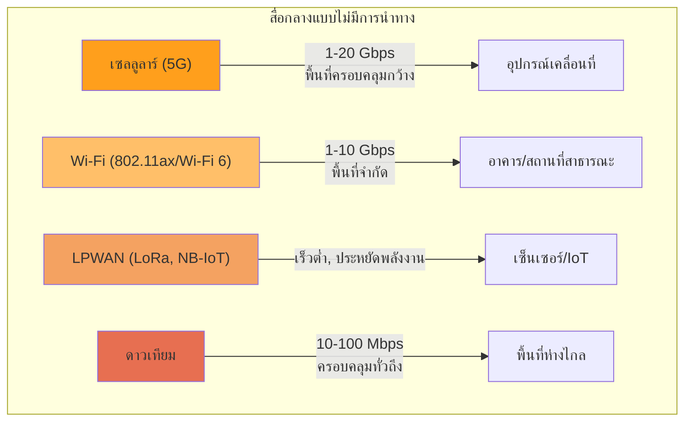

#### 1. เครือข่ายเซลลูลาร์ (5G)

**ข้อดี:**

1. **การเข้าถึงไร้สาย**
   ```mermaid
   graph LR
       subgraph "ความสามารถในการเข้าถึง 5G"
           M[อุปกรณ์เคลื่อนที่] --> B[Base Station]
           B --> C[เครือข่าย Core]
           
           style M fill:#ff9f1c
           style B fill:#ff9f1c
       end
   ```
   - ไม่ต้องเดินสายถึงผู้ใช้แต่ละคน
   - รองรับผู้ใช้จำนวนมากในพื้นที่กว้าง

2. **ความเร็วสูง (5G)**
   - ความเร็วสูงสุด 10-20 Gbps
   - ความหน่วงต่ำ (1-10 ms)
   - รองรับการใช้งานแอปพลิเคชั่นที่ต้องการความเร็วสูง

3. **Massive IoT Connection**
   - รองรับการเชื่อมต่ออุปกรณ์จำนวนมาก (1 ล้านอุปกรณ์/ตร.กม.)
   - เหมาะสำหรับเซ็นเซอร์จำนวนมากในเมืองอัจฉริยะ

4. **การปรับใช้รวดเร็วกว่า**
   - ไม่ต้องขุดถนนหรือเดินสาย
   - เหมาะสำหรับการขยายโครงข่ายรวดเร็ว

**ข้อเสีย:**

1. **การรบกวนและสัญญาณแปรปรวน**
   - สัญญาณอาจถูกบล็อกด้วยสิ่งกีดขวาง
   - คุณภาพสัญญาณไม่สม่ำเสมอ

2. **การรักษาความปลอดภัย**
   - ข้อมูลส่งผ่านอากาศ เสี่ยงต่อการดักจับ
   - ต้องการการเข้ารหัสเพิ่มเติม

3. **ความจำกัดด้านแบนด์วิดท์**
   - แบนด์วิดท์ร่วมกันระหว่างผู้ใช้หลายคน
   - อาจมีปัญหาคอขวดในช่วงใช้งานสูง

4. **ต้นทุนโครงสร้างพื้นฐาน**
   - ต้องการสถานีฐานจำนวนมาก
   - ค่าใช้จ่ายในการขอใบอนุญาตคลื่นความถี่

#### 2. Wi-Fi (802.11ax/Wi-Fi 6)

**ข้อดี:**
- ติดตั้งง่าย ราคาไม่แพง
- รองรับอุปกรณ์ที่มีอยู่แล้วเกือบทั้งหมด
- ความเร็วสูง (1-10 Gbps)
- เหมาะสำหรับพื้นที่สาธารณะ, อาคาร

**ข้อเสีย:**
- ระยะทางจำกัด (30-100 เมตร)
- รองรับจำนวนผู้ใช้จำกัด
- สัญญาณรบกวนง่าย
- ความปลอดภัยต่ำกว่าระบบ Cellular

#### 3. LPWAN (LoRaWAN, Sigfox, NB-IoT)

**ข้อดี:**
- ประหยัดพลังงานมาก (แบตเตอรี่อายุ 5-10 ปี)
- ระยะทางไกล (2-15 กม.)
- รองรับอุปกรณ์จำนวนมาก
- ต้นทุนต่ออุปกรณ์ต่ำ

**ข้อเสีย:**
- ความเร็วต่ำ (0.3-100 Kbps)
- เหมาะกับข้อมูลขนาดเล็กเท่านั้น
- ความหน่วงสูง (ไม่เหมาะกับการควบคุมแบบเรียลไทม์)

#### 4. การสื่อสารผ่านดาวเทียม

**ข้อดี:**
- ครอบคลุมพื้นที่กว้าง (ทั่วประเทศหรือทั่วโลก)
- เข้าถึงพื้นที่ห่างไกล
- ไม่ต้องการโครงสร้างพื้นฐานภาคพื้นดินมาก

**ข้อเสีย:**
- ต้นทุนสูง
- ความหน่วงสูง (500+ ms)
- ความเร็วจำกัด
- ผลกระทบจากสภาพอากาศ

### 4.1.3 การวิเคราะห์เปรียบเทียบสำหรับโครงการเมืองอัจฉริยะ

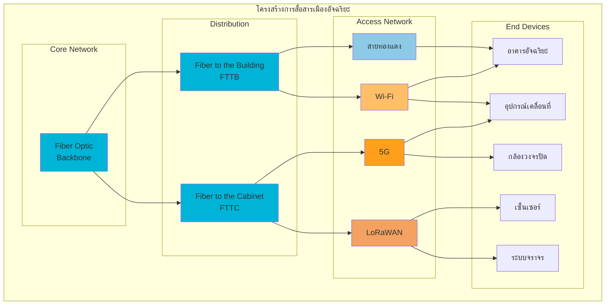

#### การเปรียบเทียบสำหรับการใช้งานในเมืองอัจฉริยะ

| พารามิเตอร์ | สื่อกลางแบบมีการนำทาง | สื่อกลางแบบไม่มีการนำทาง |
|----------|----------------------|------------------------|
| **ความเร็ว** | สูงมาก (100+ Gbps สำหรับใยแก้ว) | ปานกลาง-สูง (10-20 Gbps สำหรับ 5G) |
| **ความเสถียร** | สูงมาก | ปานกลาง (ขึ้นกับสภาพแวดล้อม) |
| **ความน่าเชื่อถือ** | สูงมาก | ปานกลาง |
| **ความปลอดภัย** | สูง | ปานกลาง |
| **ความยืดหยุ่น** | ต่ำ (ติดตั้งถาวร) | สูง (เคลื่อนย้ายได้) |
| **ระยะเวลาติดตั้ง** | นาน | รวดเร็ว |
| **ต้นทุนการติดตั้ง** | สูง | ปานกลาง |
| **ความครอบคลุม** | จำกัดตามการเดินสาย | กว้างตามสถานีฐาน |
| **การขยายในอนาคต** | ยุ่งยาก (ต้องเดินสายเพิ่ม) | ง่าย (เพิ่มสถานีฐาน) |
| **การบำรุงรักษา** | ยุ่งยาก | ง่ายกว่า |

#### แนวทางการตัดสินใจเลือกสื่อกลางสำหรับเมืองอัจฉริยะ

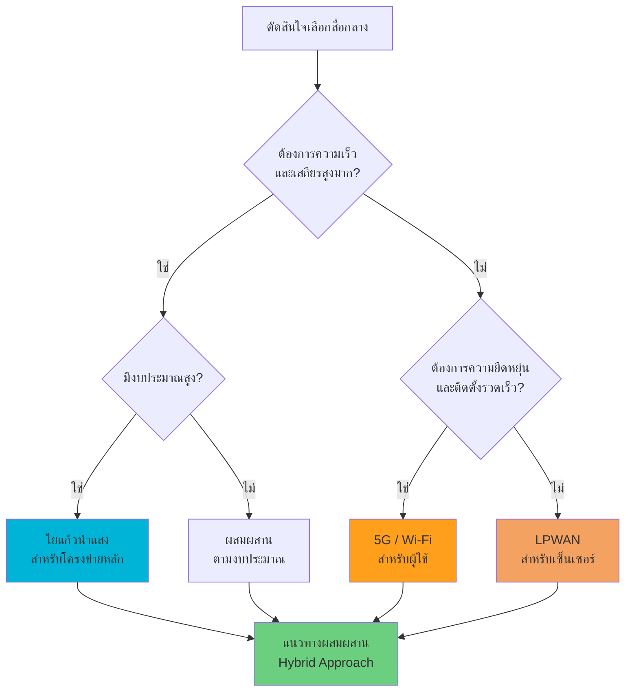

### แนวทางที่เหมาะสมสำหรับเมืองอัจฉริยะ: แนวทางแบบผสมผสาน (Hybrid Approach)

ในการพัฒนาโครงสร้างพื้นฐานการสื่อสารสำหรับเมืองอัจฉริยะ แนวทางที่เหมาะสมที่สุดคือการใช้สื่อกลางแบบผสมผสาน โดยใช้ข้อดีของแต่ละประเภทมาเสริมกัน:

#### 1. โครงข่ายหลัก (Core Network)
- **ใช้สื่อกลางแบบมีการนำทาง: สายใยแก้วนำแสง**
- เชื่อมต่อศูนย์ข้อมูล (Data Center) และสถานีฐานหลัก
- รองรับการส่งข้อมูลปริมาณมหาศาลด้วยความเร็วและความน่าเชื่อถือสูง

#### 2. โครงข่ายกระจาย (Distribution Network)
- **ใช้สื่อกลางแบบมีการนำทาง: สายใยแก้วนำแสงถึงอาคาร (FTTB) หรือถึงตู้กระจายสัญญาณ (FTTC)**
- เชื่อมต่อระหว่างโครงข่ายหลักกับเครือข่ายเข้าถึง (Access Network)
- ใช้ FTTB สำหรับอาคารสำคัญ และ FTTC สำหรับพื้นที่ทั่วไป

#### 3. โครงข่ายเข้าถึง (Access Network)
- **ใช้สื่อกลางแบบผสมผสาน:**
  - **5G:** สำหรับผู้ใช้ทั่วไป อุปกรณ์เคลื่อนที่ และบริการที่ต้องการความเร็วสูง
  - **Wi-Fi:** สำหรับพื้นที่สาธารณะ อาคาร และสถานที่ให้บริการ
  - **LPWAN (LoRaWAN, NB-IoT):** สำหรับเซ็นเซอร์และอุปกรณ์ IoT ที่ใช้พลังงานต่ำ
  - **สายทองแดง (UTP/STP):** สำหรับเชื่อมต่อภายในอาคารที่มีอยู่เดิม

#### 4. ระบบสำรอง (Backup System)
- **การสื่อสารผ่านดาวเทียม:** ใช้เป็นระบบสำรองในกรณีฉุกเฉิน
- **Microwave Links:** ใช้เชื่อมต่อระหว่างจุดที่เดินสายยาก

#### ข้อเสนอแนะการใช้งานตามประเภทบริการ

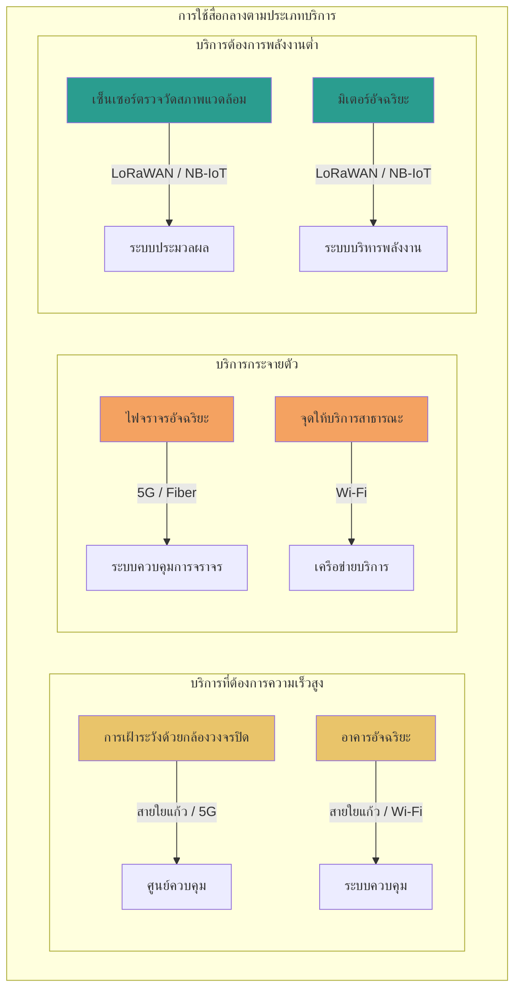

---

### 4.2 ออกแบบระบบสื่อสารสำหรับการเชื่อมต่อระหว่างสำนักงานใหญ่กับสาขาย่อยในต่างจังหวัด

#### 4.2.1 ข้อพิจารณาหลักในการออกแบบ

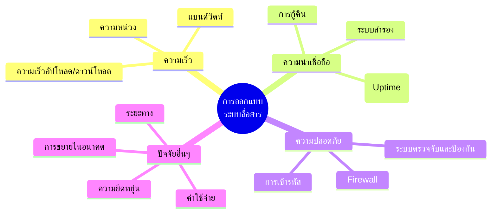

#### 4.2.2 โทโปโลยีเครือข่าย

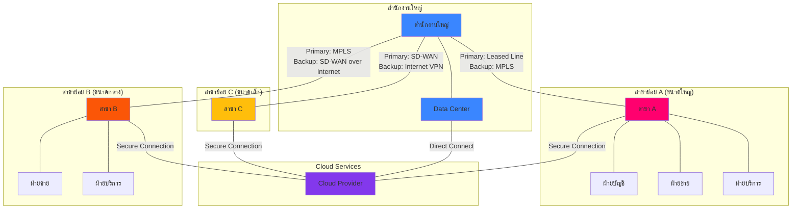

#### 4.2.3 การออกแบบระบบสื่อสารโดยละเอียด

##### 1. การเชื่อมต่อระหว่างสำนักงานใหญ่กับศูนย์ข้อมูล (Data Center)

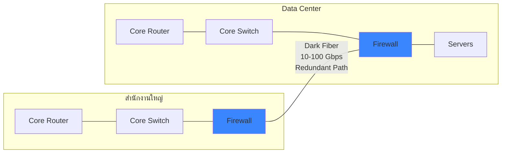

**เทคโนโลยีที่เลือกใช้:** Dark Fiber (เส้นใยแก้วนำแสงเฉพาะ)

**เหตุผล:**
- **ความเร็ว:** รองรับแบนด์วิดท์สูงมาก (10-100 Gbps)
- **ความน่าเชื่อถือ:** เป็นเส้นทางเฉพาะ ไม่ใช้ร่วมกับผู้อื่น
- **ความปลอดภัย:** ข้อมูลไม่ผ่านเครือข่ายสาธารณะ
- **ความยืดหยุ่น:** สามารถปรับเปลี่ยนโปรโตคอลและความเร็วได้ตามต้องการ

##### 2. การเชื่อมต่อระหว่างสำนักงานใหญ่กับสาขาย่อย A (ขนาดใหญ่)

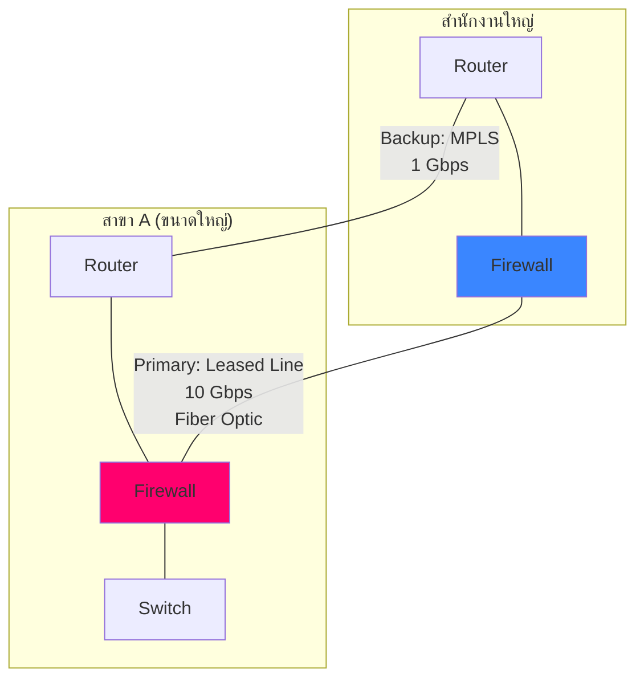

**เทคโนโลยีที่เลือกใช้:** 
1. **Primary:** Leased Line (เช่าสายใยแก้วนำแสงโดยตรง)
2. **Backup:** MPLS (Multi-Protocol Label Switching)

**เหตุผล:**
- **ความเร็ว:** 
  - Primary: 10 Gbps รองรับการใช้งานข้อมูลจำนวนมาก
  - Backup: 1 Gbps เพียงพอสำหรับการสำรองข้อมูลสำคัญ
- **ความน่าเชื่อถือ:** มีระบบสำรอง ช่วยให้มีความต่อเนื่องในการทำงาน
- **ความปลอดภัย:** ทั้ง Leased Line และ MPLS มีการแยกทราฟิกจากเครือข่ายอินเทอร์เน็ตทั่วไป

##### 3. การเชื่อมต่อระหว่างสำนักงานใหญ่กับสาขาย่อย B (ขนาดกลาง)

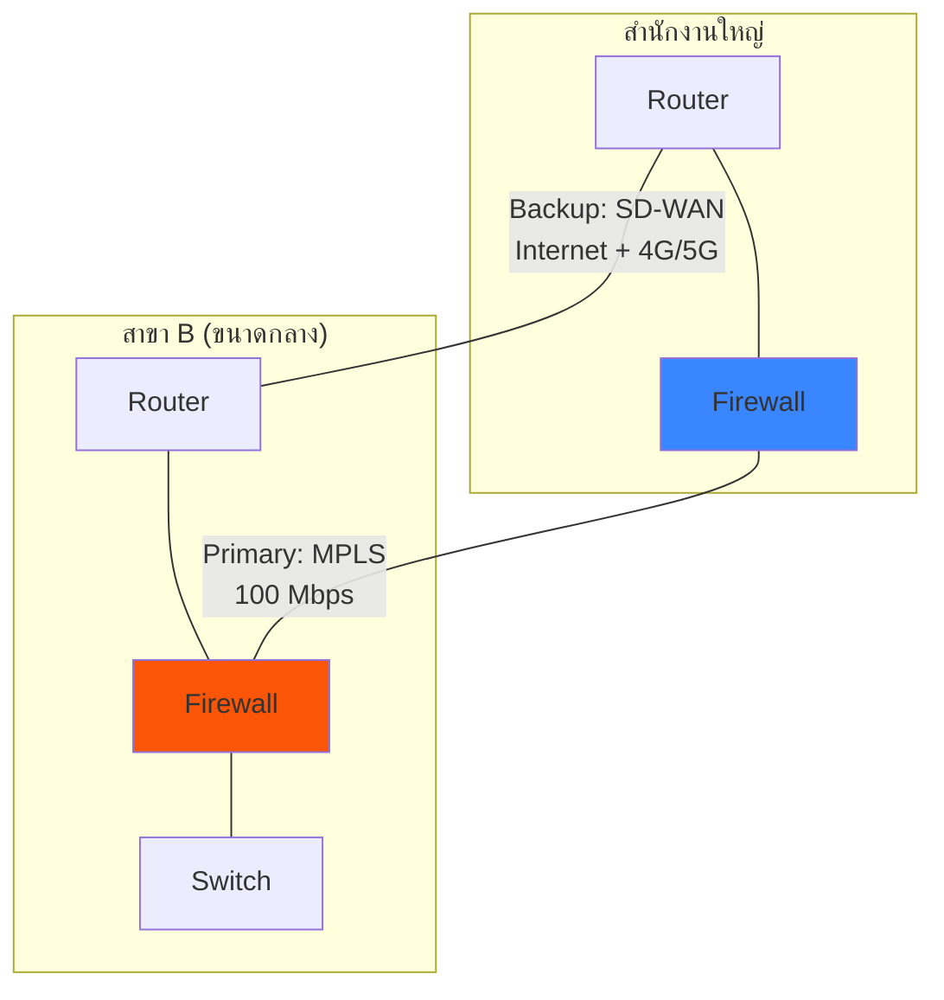

**เทคโนโลยีที่เลือกใช้:** 
1. **Primary:** MPLS (Multi-Protocol Label Switching)
2. **Backup:** SD-WAN over Internet (รวมการเชื่อมต่ออินเทอร์เน็ตหลายเส้นทาง)

**เหตุผล:**
- **ความเร็ว:** 
  - Primary: 100 Mbps เพียงพอสำหรับการใช้งานประจำวัน
  - Backup: SD-WAN รวมเส้นทางหลายเส้น (เช่น Fiber Internet + 4G/5G)
- **ความน่าเชื่อถือ:** SD-WAN ช่วยให้สามารถใช้เส้นทางหลายเส้นทางพร้อมกัน เพิ่มเสถียรภาพ
- **ความปลอดภัย:** SD-WAN มีการเข้ารหัสข้อมูล End-to-End
- **ต้นทุน:** ประหยัดค่าใช้จ่ายกว่าการใช้ Leased Line

##### 4. การเชื่อมต่อระหว่างสำนักงานใหญ่กับสาขาย่อย C (ขนาดเล็ก)

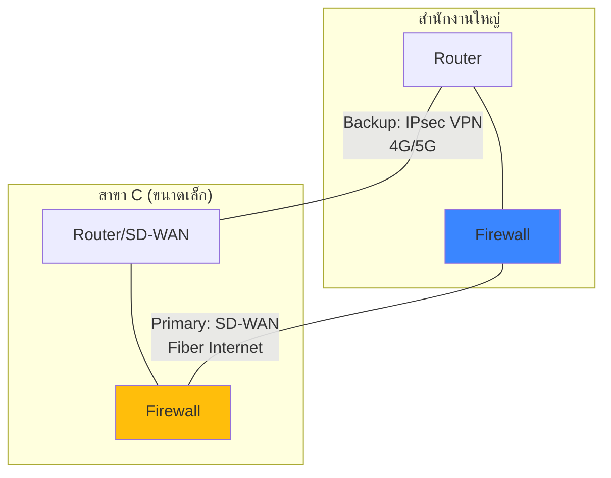

**เทคโนโลยีที่เลือกใช้:** 
1. **Primary:** SD-WAN over Fiber Internet
2. **Backup:** IPsec VPN over 4G/5G

**เหตุผล:**
- **ความเร็ว:** 
  - Primary: ความเร็วขึ้นกับอินเทอร์เน็ตท้องถิ่น (50-300 Mbps)
  - Backup: ความเร็ว 4G/5G (20-100 Mbps)
- **ความน่าเชื่อถือ:** มีระบบสำรองในกรณีที่อินเทอร์เน็ตหลักมีปัญหา
- **ความปลอดภัย:** ใช้การเข้ารหัส IPsec และนโยบายความปลอดภัยของ SD-WAN
- **ต้นทุน:** ประหยัดที่สุดเมื่อเทียบกับทางเลือกอื่น เหมาะสำหรับสาขาขนาดเล็ก

##### 5. การเชื่อมต่อกับ Cloud Services

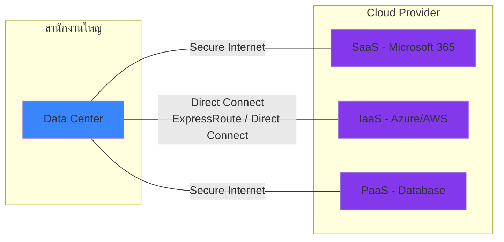

**เทคโนโลยีที่เลือกใช้:** 
1. **AWS Direct Connect / Azure ExpressRoute** สำหรับการเชื่อมต่อกับ Cloud หลัก
2. **Secure Internet** สำหรับบริการ SaaS อื่นๆ

**เหตุผล:**
- **ความเร็ว:** การเชื่อมต่อโดยตรงกับผู้ให้บริการ Cloud ทำให้มีความเร็วและประสิทธิภาพสูง
- **ความน่าเชื่อถือ:** เส้นทางเฉพาะไม่ผ่านอินเทอร์เน็ตสาธารณะ
- **ความปลอดภัย:** การเชื่อมต่อแบบ Private ช่วยเพิ่มความปลอดภัย

#### 4.2.4 การรักษาความปลอดภัยของระบบสื่อสาร

```mermaid
graph TB
    subgraph "ระบบรักษาความปลอดภัย"
        subgraph "การป้องกันที่ขอบเครือข่าย"
            FW[Next-Gen Firewall]
            IPS[Intrusion Prevention]
            WAF[Web Application Firewall]
        end
        
        subgraph "การเข้ารหัสข้อมูล"
            E1[TLS 1.3]
            E2[IPsec]
            E3[MACsec]
        end
        
        subgraph "การบริหารจัดการ"
            M1[Zero Trust]
            M2[Identity Management]
            M3[SIEM]
        end
    end
    
    style FW fill:#e63946
    style IPS fill:#e63946
    style WAF fill:#e63946
    style E2 fill:#457b9d
    style M1 fill:#1d3557
```

**มาตรการรักษาความปลอดภัยหลัก:**

1. **การป้องกันที่ขอบเครือข่าย:**
   - Next-Generation Firewall ที่สำนักงานทุกแห่ง
   - Intrusion Prevention System (IPS) สำหรับป้องกันการโจมตี
   - Web Application Firewall สำหรับแอปพลิเคชันเว็บ

2. **การเข้ารหัสข้อมูล:**
   - IPsec VPN สำหรับการเชื่อมต่อผ่านอินเทอร์เน็ต
   - MACsec (802.1AE) สำหรับการเข้ารหัสระดับ Layer 2
   - TLS 1.3 สำหรับแอปพลิเคชันและบริการ

3. **การบริหารจัดการและตรวจสอบ:**
   - ใช้แนวคิด Zero Trust (ไม่เชื่อใจอุปกรณ์ใดโดยอัตโนมัติ)
   - ระบบจัดการตัวตน (Identity Management) และสิทธิ์
   - SIEM (Security Information and Event Management) สำหรับติดตามเหตุการณ์

#### 4.2.5 ตารางสรุปการออกแบบ

| การเชื่อมต่อ | เทคโนโลยีหลัก | เทคโนโลยีสำรอง | ความเร็ว | สื่อกลาง | เหตุผล |
|------------|-------------|--------------|---------|---------|--------|
| **สำนักงานใหญ่ - Data Center** | Dark Fiber | Dark Fiber (เส้นทางสำรอง) | 10-100 Gbps | สายใยแก้วนำแสง | ต้องการความเร็วและความน่าเชื่อถือสูงสุด |
| **สำนักงานใหญ่ - สาขา A** | Leased Line | MPLS | 10 Gbps / 1 Gbps | สายใยแก้วนำแสง | ปริมาณข้อมูลสูง ต้องการความน่าเชื่อถือสูง |
| **สำนักงานใหญ่ - สาขา B** | MPLS | SD-WAN over Internet | 100 Mbps / 50+ Mbps | สายใยแก้ว + คลื่นวิทยุ | สมดุลระหว่างประสิทธิภาพและต้นทุน |
| **สำนักงานใหญ่ - สาขา C** | SD-WAN | IPsec VPN over 4G/5G | 50-300 Mbps / 20+ Mbps | สายใยแก้ว + คลื่นวิทยุ | คุ้มค่าสำหรับสาขาขนาดเล็ก |
| **สำนักงานใหญ่ - Cloud** | Direct Connect | Internet VPN | 1-10 Gbps | สายใยแก้วนำแสง | ความเร็ว ความน่าเชื่อถือ และความปลอดภัย |

#### 4.2.6 แนวทางการนำไปใช้และการขยายในอนาคต

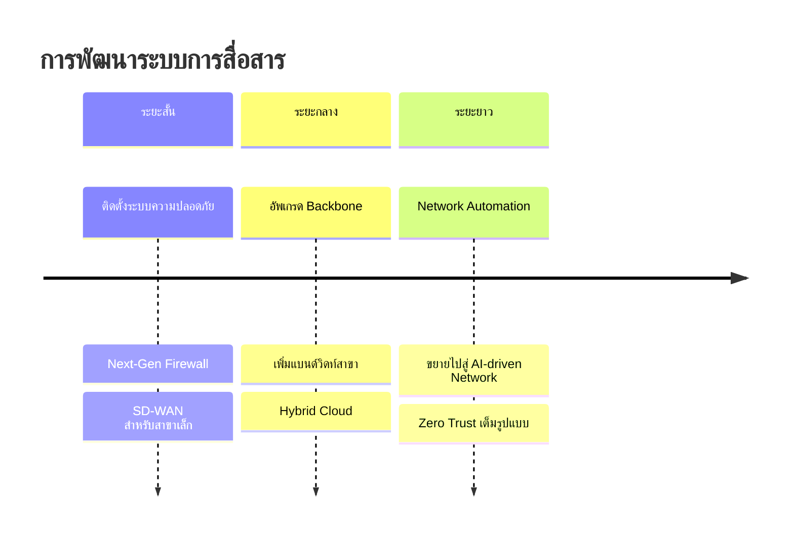

**แนวทางการขยายในอนาคต:**

1. **เพิ่มประสิทธิภาพ:**
   - อัพเกรดแบนด์วิดท์ตามความต้องการที่เพิ่มขึ้น
   - ปรับใช้เทคโนโลยีใหม่ เช่น SD-WAN ในทุกสาขา

2. **เพิ่มความน่าเชื่อถือ:**
   - เพิ่มเส้นทางสำรองสำหรับทุกการเชื่อมต่อ
   - ใช้เทคโนโลยีแบบ Active-Active แทน Active-Standby

3. **เพิ่มความปลอดภัย:**
   - นำ Zero Trust Architecture มาใช้อย่างเต็มรูปแบบ
   - เพิ่มการตรวจจับและตอบสนองอัตโนมัติ

4. **เพิ่มความยืดหยุ่น:**
   - ใช้ Network Function Virtualization (NFV)
   - เตรียมพร้อมสำหรับการรองรับเทคโนโลยีใหม่ เช่น 6G, Wi-Fi 7

---

## สรุป

การเลือกสื่อกลางที่เหมาะสมสำหรับการสื่อสารข้อมูลเป็นปัจจัยสำคัญในความสำเร็จของโครงการโครงสร้างพื้นฐานเครือข่าย ทั้งในบริบทของเมืองอัจฉริยะและการเชื่อมต่อระหว่างสำนักงาน

### สำหรับเมืองอัจฉริยะ (Smart City)
- **แนวทางแบบผสมผสาน (Hybrid Approach)** เป็นทางเลือกที่เหมาะสมที่สุด
- **สื่อกลางแบบมีการนำทาง (สายใยแก้วนำแสง)** เป็นหัวใจของโครงข่ายหลักเพื่อรองรับข้อมูลจำนวนมหาศาล
- **สื่อกลางแบบไม่มีการนำทาง (5G, Wi-Fi, LPWAN)** มีบทบาทสำคัญในการเข้าถึงผู้ใช้และอุปกรณ์ IoT จำนวนมาก
- การออกแบบต้องคำนึงถึงการขยายตัวในอนาคตและการเปลี่ยนแปลงทางเทคโนโลยี

### สำหรับการเชื่อมต่อระหว่างสำนักงานใหญ่กับสาขาย่อย
- **การออกแบบแบบเป็นลำดับชั้น (Hierarchical Design)** โดยพิจารณาขนาดและความสำคัญของแต่ละสาขา
- **ความน่าเชื่อถือ** มีความสำคัญสูงสุด จึงต้องมีระบบสำรองสำหรับทุกการเชื่อมต่อ
- **ความปลอดภัย** ต้องได้รับการออกแบบตั้งแต่เริ่มต้น ไม่ใช่เป็นเพียงส่วนเสริมภายหลัง
- **ความยืดหยุ่นและการขยายตัว** สำคัญต่อการรองรับการเติบโตและเทคโนโลยีใหม่ในอนาคต

การผสมผสานสื่อกลางทั้งแบบมีการนำทางและไม่มีการนำทาง พร้อมคำนึงถึงปัจจัยด้านความเร็ว ความน่าเชื่อถือ และความปลอดภัย จะช่วยให้ได้ระบบการสื่อสารที่มีประสิทธิภาพสูงสุดและคุ้มค่าทางงบประมาณ