# คำตอบโจทย์ปัญหา Computer Network - ข้อ 5

## 5 การเข้ารหัสสัญญาณและการตรวจสอบแก้ไขข้อผิดพลาด

### 5.1 เปรียบเทียบเทคนิคการเข้ารหัสสัญญาณดิจิทัล NRZ และ Manchester Coding

#### ความเข้าใจพื้นฐานเกี่ยวกับการเข้ารหัสสัญญาณดิจิทัล

การเข้ารหัสสัญญาณดิจิทัล (Digital Signal Encoding) เป็นกระบวนการแปลงข้อมูลดิจิทัล (0 และ 1) ให้เป็นสัญญาณไฟฟ้าที่สามารถส่งผ่านสื่อกลางได้อย่างมีประสิทธิภาพ

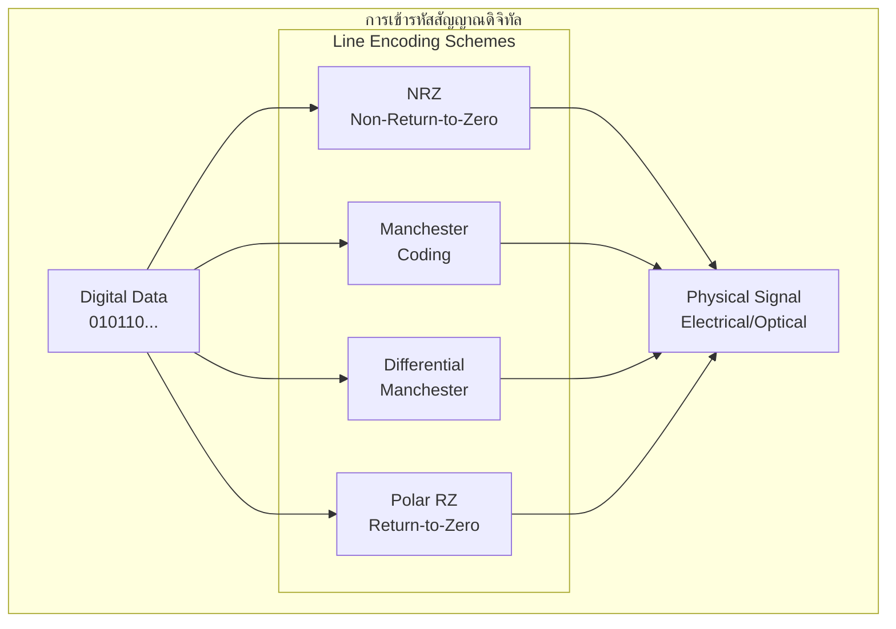

#### 5.1.1 NRZ (Non-Return-to-Zero) Encoding

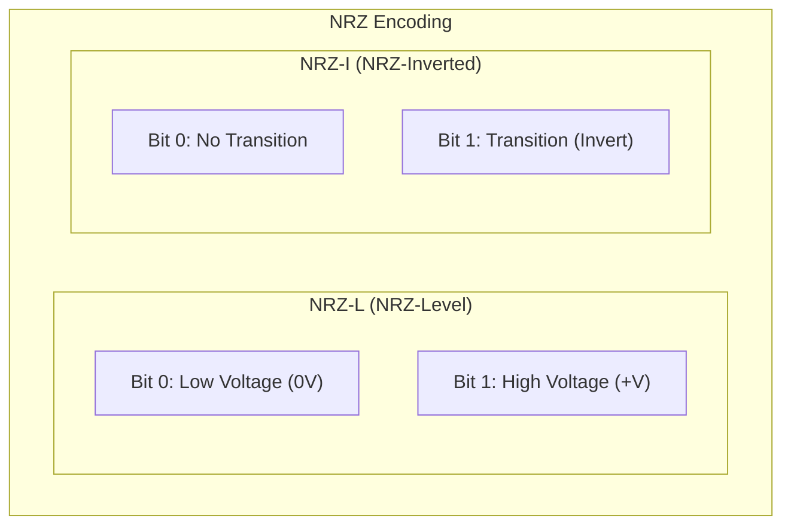

**ลักษณะของ NRZ:**

1. **NRZ-L (NRZ-Level):**
   - Bit 0 = แรงดันต่ำ (Low voltage)
   - Bit 1 = แรงดันสูง (High voltage)
   - ไม่มีการเปลี่ยนแปลงระดับแรงดันกลางช่วงบิต

2. **NRZ-I (NRZ-Inverted):**
   - Bit 0 = ไม่มีการเปลี่ยนแปลงระดับแรงดัน
   - Bit 1 = มีการเปลี่ยนแปลงระดับแรงดัน (transition)

**แสดงสัญญาณ NRZ:**

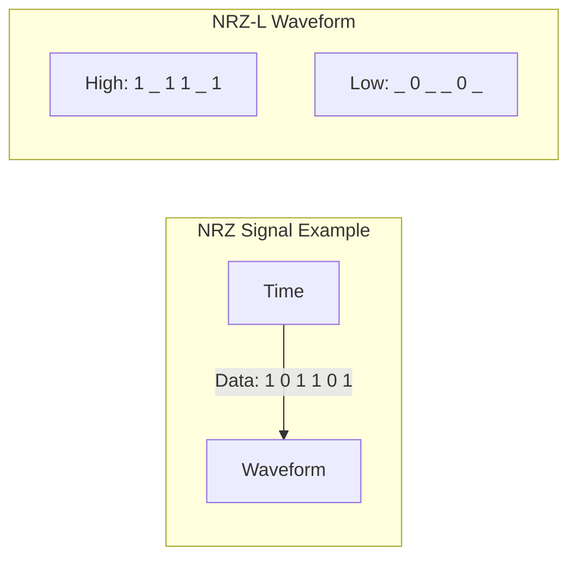

**ข้อดีของ NRZ:**

1. **ประสิทธิภาพการใช้แบนด์วิดท์สูง**
   ```
   Bandwidth Efficiency = 1 bit/Hz
   
   สำหรับข้อมูล 1 Mbps:
   ความถี่พื้นฐาน = 500 kHz
   แบนด์วิดท์ที่ต้องการ = 1 MHz
   ```
   - ใช้แบนด์วิดท์น้อยที่สุดเมื่อเทียบกับเทคนิคอื่น
   - สามารถส่งข้อมูลได้เร็วในแบนด์วิดท์จำกัด

2. **ความเรียบง่าย**
   - วงจรเข้ารหัสและถอดรหัสง่าย
   - ต้นทุนการผลิตต่ำ
   - ใช้พลังงานน้อย

3. **การตรวจจับระดับแรงดัน**
   - ง่ายต่อการแยกแยะระหว่าง 0 และ 1
   - ไม่ต้องการการประมวลผลซับซ้อน

**ข้อเสียของ NRZ:**

1. **ปัญหาการซิงโครไนซ์ (Clock Recovery)**
```mermaid
   graph LR
       subgraph "Synchronization Problem"
           D1[Data: 000000] -->|"No transitions"| P[Problem]
           P --> L[Lost Clock Sync]
       end
       
    %%    style P fill:#ff6666
    %%    style L fill:#ff6666
   ```
   - เมื่อมีบิต 0 หรือ 1 ติดต่อกันหลายบิต ไม่มี transition
   - ผู้รับไม่สามารถซิงโครไนซ์นาฬิกาได้
   - อาจทำให้นับจำนวนบิตผิด

2. **DC Component**
   - มีองค์ประกอบ DC (ความถี่ 0 Hz) ในสัญญาณ
   - ปัญหาในการส่งผ่าน transformer หรือ capacitor
   - อาจทำให้เกิด baseline wander

3. **ความไวต่อการรบกวน**
   - การเปลี่ยนแปลงเล็กน้อยของระดับแรงดันอาจทำให้แปลความหมายผิด
   - ไม่มีกลไกในตัวเพื่อตรวจจับข้อผิดพลาด

#### 5.1.2 Manchester Coding

```mermaid
graph TB
    subgraph "Manchester Coding Principle"
        MC1["Bit 0: High-to-Low Transition"]
        MC2["Bit 1: Low-to-High Transition"]
        MC3["Transition occurs at middle of bit period"]
    end
    
    subgraph "Benefits"
        B1[Self-Synchronizing]
        B2[No DC Component]
        B3[Error Detection]
    end
    
    MC1 & MC2 & MC3 --> B1 & B2 & B3
    
    %% style MC1 fill:#99ccff
    %% style MC2 fill:#99ccff
    %% style MC3 fill:#99ccff
    %% style B1 fill:#99ff99
```

**ลักษณะของ Manchester Coding:**

1. **การเข้ารหัส:**
   - Bit 0 = การเปลี่ยนแปลงจากสูงไปต่ำ (High-to-Low) ตรงกลางช่วงบิต
   - Bit 1 = การเปลี่ยนแปลงจากต่ำไปสูง (Low-to-High) ตรงกลางช่วงบิต

2. **Differential Manchester:**
   - Bit 0 = มีการเปลี่ยนแปลงที่จุดเริ่มต้นของบิต
   - Bit 1 = ไม่มีการเปลี่ยนแปลงที่จุดเริ่มต้นของบิต
   - ทุกบิตมีการเปลี่ยนแปลงตรงกลางเสมอ

**แสดงสัญญาณ Manchester:**

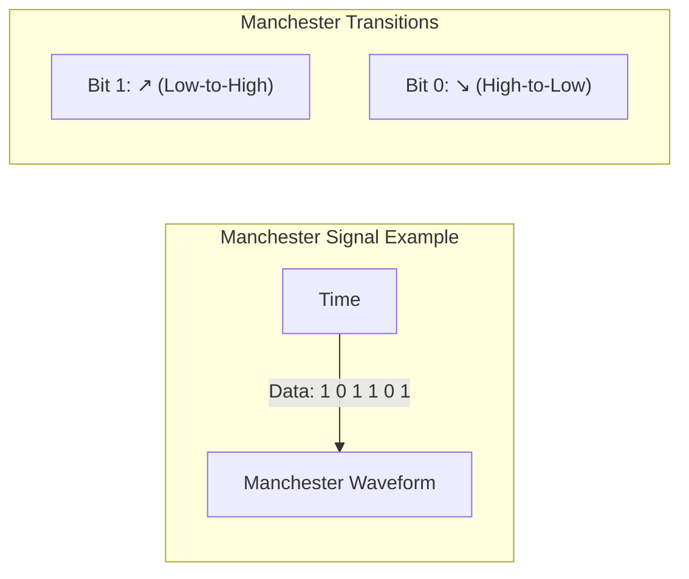

**ข้อดีของ Manchester Coding:**

1. **Self-Synchronizing (การซิงโครไนซ์อัตโนมัติ)**
```mermaid
   flowchart LR
       subgraph "Clock Recovery"
           E[Every Bit] -->|"Has Transition"| C[Clock Signal]
           C --> S[Perfect Sync]
       end
       
    %%    style S fill:#99ff99
   ```
   - ทุกบิตมีการเปลี่ยนแปลงเสมอ
   - ผู้รับสามารถกู้คืนสัญญาณนาฬิกาได้อัตโนมัติ
   - ไม่มีปัญหาการสูญเสียการซิงโครไนซ์

2. **ไม่มี DC Component**
   - จำนวน transition ขึ้นและลงเท่ากัน
   - ค่าเฉลี่ยของสัญญาณเป็น 0
   - เหมาะสำหรับการส่งผ่าน AC coupling

3. **การตรวจจับข้อผิดพลาดขั้นพื้นฐาน**
   - หากไม่มี transition ในช่วงบิต แสดงว่ามีข้อผิดพลาด
   - สามารถตรวจจับ encoding violation ได้

4. **ความทนทานต่อสัญญาณรบกวน**
   - การตรวจจับขึ้นอยู่กับทิศทางของ transition ไม่ใช่ระดับแรงดัน
   - ทนทานต่อ noise และ baseline wander

**ข้อเสียของ Manchester Coding:**

1. **ประสิทธิภาพการใช้แบนด์วิดท์ต่ำ**
   ```
   Bandwidth Efficiency = 0.5 bit/Hz
   
   สำหรับข้อมูล 1 Mbps:
   ความถี่พื้นฐาน = 1 MHz
   แบนด์วิดท์ที่ต้องการ = 2 MHz
   ```
   - ต้องการแบนด์วิดท์เป็น 2 เท่าของ NRZ
   - จำกัดความเร็วในการส่งข้อมูล

2. **ความซับซ้อนในการประมวลผล**
   - ต้องการวงจรที่ซับซ้อนกว่าในการ encode/decode
   - ต้องใช้นาฬิกาที่เร็วเป็น 2 เท่า

3. **การใช้พลังงานสูงกว่า**
   - มี transition มากกว่า NRZ
   - ใช้พลังงานในการสลับสถานะมากกว่า

#### 5.1.3 การเปรียบเทียบโดยละเอียด

```mermaid
graph TB
    subgraph "การเปรียบเทียบ NRZ vs Manchester"
        subgraph "Bandwidth Efficiency"
            BE1["NRZ: 1 bit/Hz ⭐⭐⭐⭐⭐"]
            BE2["Manchester: 0.5 bit/Hz ⭐⭐"]
        end
        
        subgraph "Clock Recovery"
            CR1["NRZ: Poor ⭐"]
            CR2["Manchester: Excellent ⭐⭐⭐⭐⭐"]
        end
        
        subgraph "Noise Immunity"
            NI1["NRZ: Fair ⭐⭐"]
            NI2["Manchester: Good ⭐⭐⭐⭐"]
        end
        
        subgraph "Implementation"
            IM1["NRZ: Simple ⭐⭐⭐⭐⭐"]
            IM2["Manchester: Complex ⭐⭐⭐"]
        end
    end
    
    %% style BE1 fill:#99ff99
    %% style CR2 fill:#99ff99
    %% style NI2 fill:#99ccff
    %% style IM1 fill:#99ccff
```

| ลักษณะ                     | NRZ                                   | Manchester                     |
| ------------------------- | ------------------------------------- | ------------------------------ |
| **Bandwidth Efficiency**  | 1 bit/Hz (ดีที่สุด)                       | 0.5 bit/Hz (ใช้แบนด์วิดท์ 2 เท่า)   |
| **Clock Recovery**        | ยาก (ไม่มี transition เมื่อมีบิตเดียวกันต่อกัน) | ง่าย (มี transition ทุกบิต)        |
| **DC Component**          | มี (ปัญหาใน AC coupling)                | ไม่มี (เหมาะกับ AC coupling)      |
| **Error Detection**       | ไม่มี                                   | มีขั้นพื้นฐาน (violation detection) |
| **Noise Immunity**        | ปานกลาง                               | ดี (ขึ้นกับ transition direction)  |
| **Power Consumption**     | ต่ำ                                     | สูงกว่า (transition มาก)         |
| **Implementation Cost**   | ต่ำ                                     | สูงกว่า                          |
| **Transmission Distance** | จำกัด (sync problem)                    | ไกลกว่า (self-sync)             |

#### 5.1.4 สถานการณ์ที่เหมาะสมในการใช้งาน

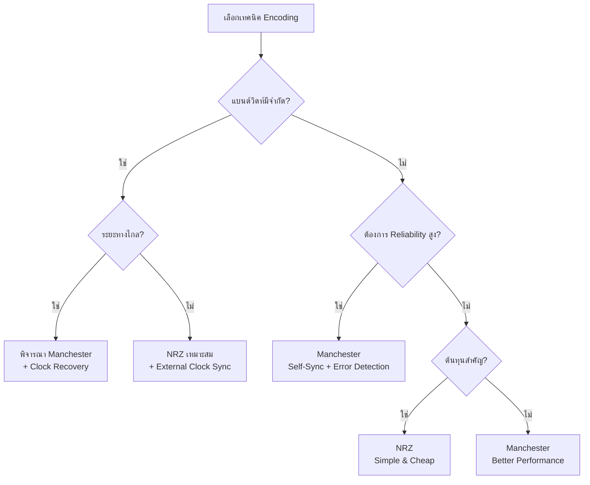

**NRZ เหมาะสำหรับ:**

1. **การสื่อสารความเร็วสูง**
   - เมื่อแบนด์วิดท์มีจำกัด
   - ต้องการส่งข้อมูลให้ได้มากที่สุด
   - เช่น: การส่งข้อมูลในระบบคอมพิวเตอร์ (RAM, CPU bus)

2. **ระยะทางสั้น**
   - การสื่อสารภายในบอร์ดวงจร
   - มีสัญญาณนาฬิกาจากภายนอก (external clock)
   - เช่น: PCIe, SATA (บางโหมด)

3. **แอปพลิเคชันที่ต้นทุนสำคัญ**
   - ระบบ embedded ที่มีข้อจำกัดด้านต้นทุน
   - อุปกรณ์ใช้พลังงานต่ำ
   - เช่น: Serial interfaces ใน microcontrollers

4. **ข้อมูลที่มี transition ธรรมชาติ**
   - ข้อมูลที่ผ่านการ scrambling แล้ว
   - ข้อมูลที่รับประกันว่าไม่มีบิตเดียวกันติดต่อกันนาน

**Manchester เหมาะสำหรับ:**

1. **เครือข่าย LAN แบบดั้งเดิม**
```mermaid
   graph LR
       E1[10BASE5<br/>Thick Ethernet] --> M[Manchester]
       E2[10BASE2<br/>Thin Ethernet] --> M
       E3[10BASE-T<br/>Twisted Pair] --> M
       
    %%    style E1 fill:#99ccff
    %%    style E2 fill:#99ccff
    %%    style E3 fill:#99ccff
   ```
   - 10 Mbps Ethernet (IEEE 802.3)
   - เหมาะกับการส่งข้อมูลผ่านสาย coaxial และ twisted pair
   - ช่วยแก้ปัญหา ground loop และ baseline wander

2. **การสื่อสารระยะไกล**
   - สายสัญญาณยาวที่ไม่มีสัญญาณนาฬิกาแยก
   - ระบบ point-to-point ที่ต้องการความน่าเชื่อถือ
   - เช่น: RS-485 Manchester, เซ็นเซอร์ระยะไกล

3. **สภาพแวดล้อมที่มีสัญญาณรบกวนสูง**
   - โรงงานอุตสาหกรรมที่มีมอเตอร์และเครื่องจักรจำนวนมาก
   - สายสัญญาณที่อยู่ใกล้สายไฟฟ้า
   - ระบบในรถยนต์ (automotive)

4. **ระบบ RFID และ NFC**
```mermaid
   graph LR
       R[RFID Reader] -->|Manchester| T[RFID Tag]
       N1[NFC Device 1] -->|Manchester| N2[NFC Device 2]
       
    %%    style R fill:#99ccff
    %%    style T fill:#99ccff
    %%    style N1 fill:#99ccff
    %%    style N2 fill:#99ccff
   ```
   - ISO 14443 (NFC) ใช้ Modified Manchester
   - ISO 18000-6C (UHF RFID) ใช้ PIE encoding (คล้าย Manchester)

5. **ระบบที่ต้องการ Clock Recovery**
   - การส่งข้อมูลแบบ Serial ที่ไม่มีสาย Clock แยก
   - ระบบที่ต้องการลดจำนวนสายสัญญาณ
   - เช่น: บางรูปแบบของ CAN bus, LIN bus

#### 5.1.5 เทคนิคการปรับปรุงและทางเลือกอื่น

```mermaid
graph TB
    subgraph "Advanced Encoding Techniques"
        subgraph "Improved NRZ"
            NRZI[NRZI<br/>NRZ Inverted]
            SC[Scrambled NRZ<br/>with PRBS]
        end
        
        subgraph "Improved Manchester"
            DM[Differential<br/>Manchester]
            MM[Miller<br/>Encoding]
        end
        
        subgraph "Modern Alternatives"
            B8B10[8B/10B Encoding]
            PAM4[PAM4 Signaling]
            QAM[QAM Modulation]
        end
    end
    
    %% style NRZI fill:#ffcccc
    %% style SC fill:#ffcccc
    %% style DM fill:#ccddff
    %% style MM fill:#ccddff
    %% style B8B10 fill:#ccffcc
    %% style PAM4 fill:#ccffcc
    %% style QAM fill:#ccffcc
```

**การปรับปรุง NRZ:**

1. **NRZI (NRZ Inverted)**
   - ลด DC component โดยการ invert ตาม pattern
   - ใช้ใน USB, SATA

2. **Scrambling**
   - ผสมข้อมูลกับ PRBS (Pseudo-Random Binary Sequence)
   - รับประกันการมี transition เพียงพอ
   - ใช้ใน SONET/SDH

**การปรับปรุง Manchester:**

1. **Differential Manchester**
   - ดีกว่า Manchester ธรรมดาในการต้านทาน noise
   - ใช้ใน Token Ring

2. **Miller Encoding**
   - รูปแบบหนึ่งของ Manchester
   - ใช้ใน magnetic tape storage

**เทคนิคสมัยใหม่:**

1. **8B/10B Encoding**
   - แปลง 8 bits เป็น 10 bits
   - รับประกัน DC balance และ transition เพียงพอ
   - ใช้ใน Gigabit Ethernet, Fibre Channel, PCI Express

2. **PAM4 (4-level Pulse Amplitude Modulation)**
   - ส่ง 2 bits ต่อ symbol
   - เพิ่มประสิทธิภาพแบนด์วิดท์
   - ใช้ใน 100G/400G Ethernet

---

### 5.2 ความสำคัญของ CRC และ FEC ในระบบ 5G และการสื่อสารดาวเทียม

#### ภาพรวมการตรวจสอบและแก้ไขข้อผิดพลาด

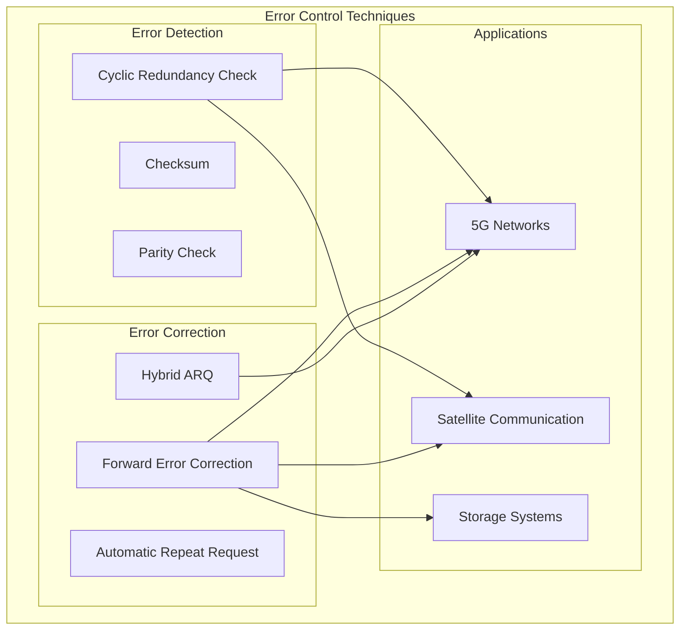

#### 5.2.1 Cyclic Redundancy Check (CRC)

CRC เป็นเทคนิคการตรวจจับข้อผิดพลาดที่มีประสิทธิภาพสูง ใช้หลักการทางคณิตศาสตร์ของ polynomial arithmetic

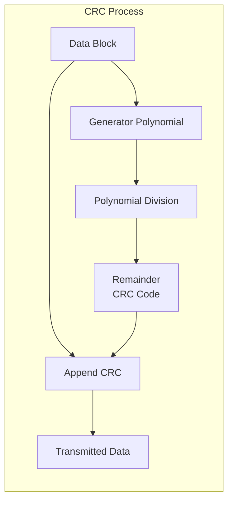

**หลักการทำงานของ CRC:**

1. **การสร้าง CRC Code:**
   ```
   ข้อมูล: M(x) = x^7 + x^3 + x^1
   Generator: G(x) = x^3 + x + 1
   
   Step 1: ใส่ศูนย์ท้าย M(x) เป็นจำนวน degree ของ G(x)
   M'(x) = x^(7+3) + x^(3+3) + x^(1+3) = x^10 + x^6 + x^4
   
   Step 2: หาร M'(x) ด้วย G(x)
   Remainder R(x) = x^2 + x
   
   Step 3: ข้อมูลที่ส่ง = M'(x) + R(x)
   ```

2. **การตรวจสอบ:**
   - ผู้รับหารข้อมูลที่ได้รับด้วย Generator Polynomial เดียวกัน
   - หากไม่มีข้อผิดพลาด remainder จะเป็น 0
   - หากมีข้อผิดพลาด remainder จะไม่เป็น 0

**Generator Polynomial ที่ใช้กันทั่วไป:**

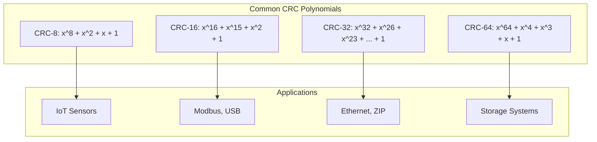

**ข้อดีของ CRC:**

1. **ประสิทธิภาพการตรวจจับสูง**
   - ตรวจจับ single-bit errors ได้ 100%
   - ตรวจจับ double-bit errors ได้ 100%
   - ตรวจจับ burst errors ได้มากกว่า 99.99%

2. **Implementation ที่มีประสิทธิภาพ**
   - สามารถใช้ lookup table หรือ shift register
   - คำนวณได้เร็วด้วย hardware หรือ software

3. **Overhead ต่ำ**
   - CRC-32 ใช้เพียง 32 bits สำหรับข้อมูลขนาดใหญ่
   - ประสิทธิภาพดีเมื่อเทียบกับ overhead

**ข้อจำกัดของ CRC:**

1. **ตรวจจับเท่านั้น ไม่แก้ไข**
   - ต้องการ retransmission เมื่อพบข้อผิดพลาด
   - ไม่เหมาะกับช่องสัญญาณที่มี error rate สูง

2. **Burst Error ยาว**
   - อาจตรวจไม่พบ burst error ที่ยาวกว่า CRC length

#### 5.2.2 Forward Error Correction (FEC)

FEC เป็นเทคนิคที่เพิ่มข้อมูลซ้ำซ้อน (redundancy) เพื่อให้ผู้รับสามารถตรวจจับและแก้ไขข้อผิดพลาดได้โดยไม่ต้องขอข้อมูลใหม่

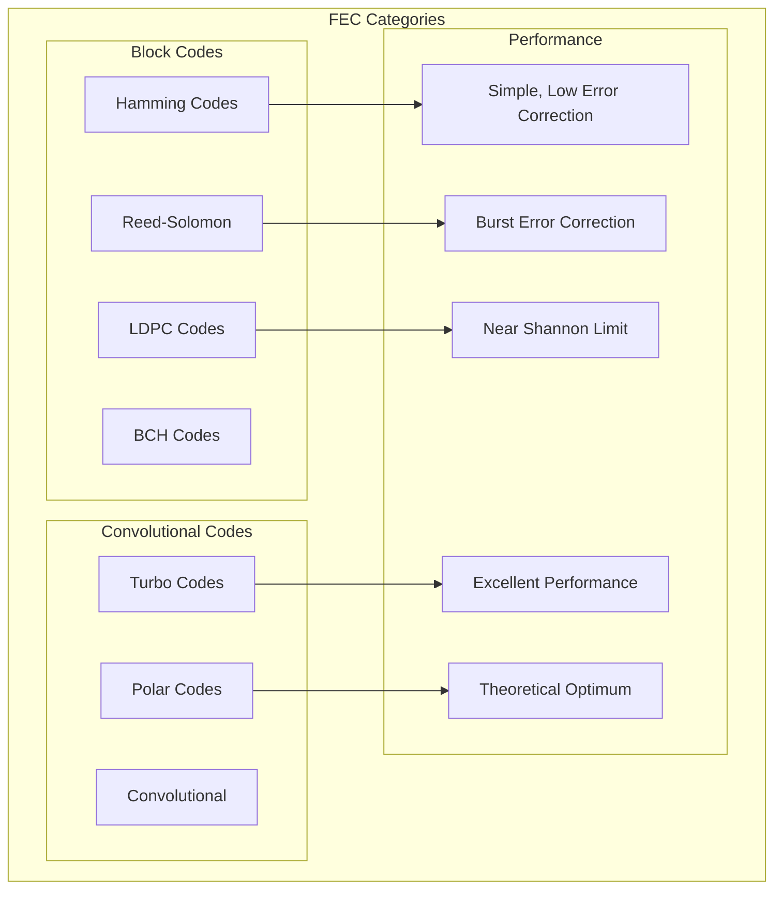

**หลักการทำงานของ FEC:**

1. **การเข้ารหัส (Encoding):**
```mermaid
   flowchart LR
       K[k Information Bits] --> ENC[FEC Encoder]
       ENC --> N[n Coded Bits<br/>n > k]
       
    %%    style K fill:#99ff99
    %%    style N fill:#99ccff
   ```
   - เพิ่มบิตซ้ำซ้อน (redundancy bits) เข้าไปในข้อมูล
   - อัตราส่วน code rate = k/n (เช่น 1/2, 2/3, 3/4)

2. **การถอดรหัส (Decoding):**
```mermaid
   flowchart LR
       R[Received n Bits<br/>with Errors] --> DEC[FEC Decoder]
       DEC --> EST[Estimated k Bits]
       DEC --> ERR[Error Detection<br/>& Correction]
       
    %%    style R fill:#ff9999
    %%    style EST fill:#99ff99
    %%    style ERR fill:#99ccff
   ```
   - ใช้ redundancy เพื่อระบุและแก้ไขข้อผิดพลาด
   - สามารถกู้คืนข้อมูลต้นฉบับได้โดยไม่ต้อง retransmission

**Reed-Solomon Codes:**

Reed-Solomon เป็น FEC ชนิดหนึ่งที่มีประสิทธิภาพสูงในการแก้ไข burst errors

```
RS(n, k) Code:
- n = total codeword length
- k = information symbols  
- t = (n-k)/2 = maximum correctable errors

ตัวอย่าง RS(255, 239):
- สามารถแก้ไข 8 symbol errors
- Code rate = 239/255 ≈ 0.94
```

**LDPC (Low-Density Parity-Check) Codes:**

LDPC เป็น FEC ที่มีประสิทธิภาพใกล้เคียงขีดจำกัดของ Shannon theorem

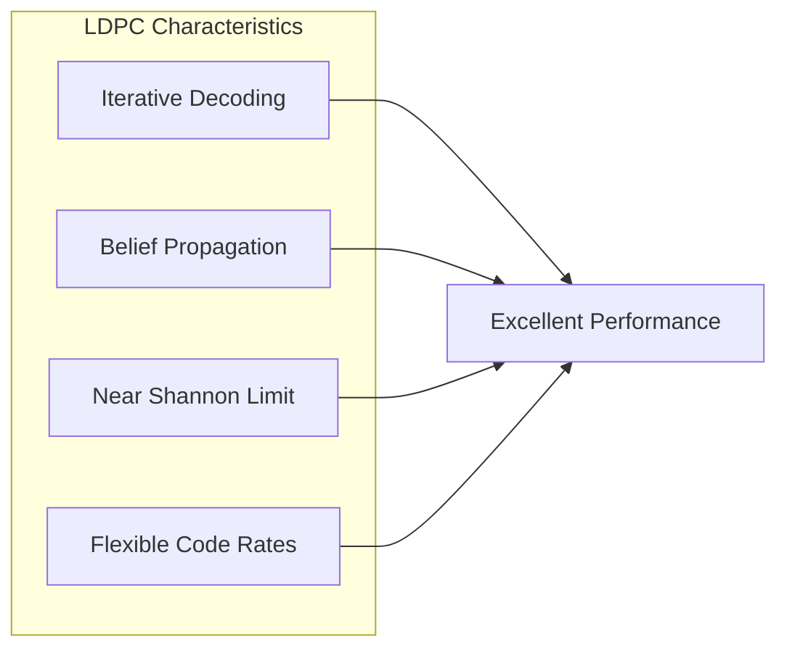

**Turbo Codes:**

Turbo codes ใช้หลักการ iterative decoding และ interleaving

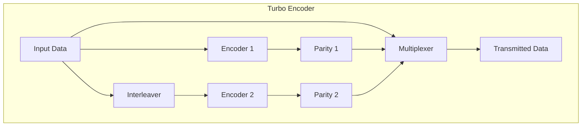

#### 5.2.3 ความสำคัญของ CRC และ FEC ในระบบ 5G

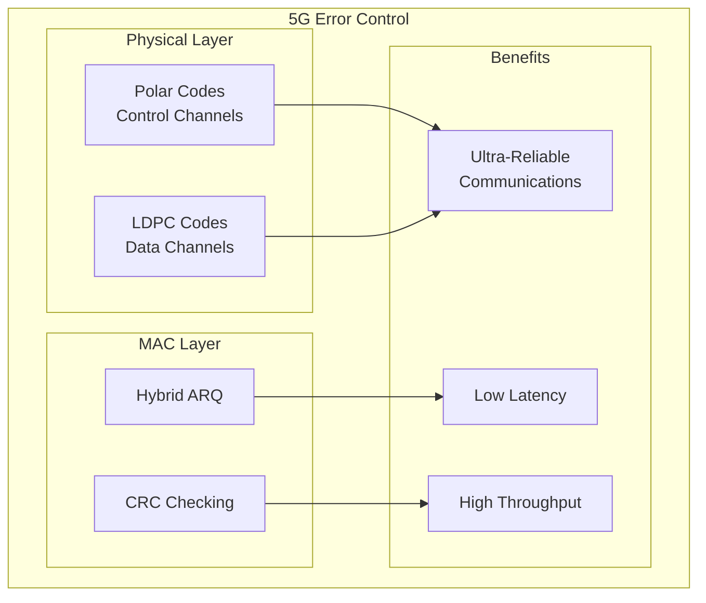

**การใช้งานใน 5G:**

1. **Polar Codes สำหรับ Control Channels:**
   - ใช้สำหรับการส่งข้อมูลควบคุม (control information)
   - มีประสิทธิภาพสูงมากที่ block length สั้น
   - เหมาะกับข้อมูลที่ต้องการความน่าเชื่อถือสูง

2. **LDPC Codes สำหรับ Data Channels:**
   - ใช้สำหรับการส่งข้อมูลผู้ใช้
   - มีประสิทธิภาพสูงที่ block length ยาว
   - รองรับ code rate ที่หลากหลาย (1/3 ถึง 8/9)

3. **Hybrid ARQ (HARQ):**
   ```mermaid
   sequenceDiagram
       participant TX as Transmitter
       participant RX as Receiver
       
       TX->>RX: Data + FEC
       RX->>RX: FEC Decoding
       alt Decoding Success
           RX->>TX: ACK
       else Decoding Failure
           RX->>TX: NACK
           TX->>RX: Additional Redundancy
           RX->>RX: Combine & Decode
       end
   ```
   - ผสมผสาน FEC และ ARQ
   - ส่งข้อมูลเพิ่มเติมแทนการส่งใหม่ทั้งหมด
   - ลดการใช้ทรัพยากรและเวลา

4. **ประโยชน์ในระบบ 5G:**

   **Ultra-Reliable Low Latency Communications (URLLC):**
   - ต้องการ reliability 99.999% และ latency < 1 ms
   - FEC ช่วยลดจำนวนครั้งในการ retransmission
   - CRC ช่วยตรวจจับข้อผิดพลาดอย่างรวดเร็ว

   **Enhanced Mobile Broadband (eMBB):**
   - ต้องการ throughput สูงถึง 20 Gbps
   - FEC ช่วยรักษาคุณภาพสัญญาณในสภาพแวดล้อมที่มี interference
   - Adaptive code rate ช่วยปรับตามสภาพช่องสัญญาณ

   **Massive Machine-Type Communications (mMTC):**
   - รองรับอุปกรณ์จำนวนมาก (1 ล้านอุปกรณ์/ตร.กม.)
   - FEC ช่วยลดการรบกวนระหว่างอุปกรณ์
   - CRC ช่วยตรวจจับ collision และ interference

#### 5.2.4 ความสำคัญของ CRC และ FEC ในระบบการสื่อสารดาวเทียม

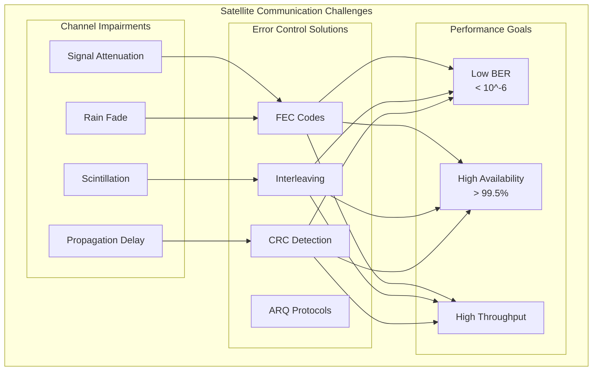

**ความท้าทายในการสื่อสารดาวเทียม:**

1. **การลดทอนสัญญาณ (Signal Attenuation):**
   - สัญญาณอ่อนลงมากเนื่องจากระยะทางไกล (35,786 km สำหรับ GEO)
   - Path loss สูงมาก (> 200 dB)

2. **Rain Fade:**
   - ฝนดูดซับสัญญาณโดยเฉพาะที่ความถี่สูง (Ku, Ka band)
   - อาจทำให้สัญญาณอ่อนลงมากกว่า 20 dB

3. **Scintillation:**
   - การเปลี่ยนแปลงของสัญญาณเนื่องจากชั้นบรรยากาศ
   - ทำให้สัญญาณไม่เสถียร

4. **Propagation Delay:**
   - ความหน่วงสูง (250-280 ms แบบไป-กลับ)
   - ทำให้ ARQ ไม่มีประสิทธิภาพ

**การใช้ FEC ในระบบดาวเทียม:**

1. **Reed-Solomon + Convolutional Codes:**
```mermaid
   graph LR
       DATA[Data] --> RS[Reed-Solomon<br/>Outer Code]
       RS --> INT[Interleaver]
       INT --> CONV[Convolutional<br/>Inner Code]
       CONV --> MOD[Modulation]
       
    %%    style RS fill:#ff9999
    %%    style CONV fill:#99ccff
   ```
   - Reed-Solomon แก้ไข burst errors จาก fading
   - Convolutional codes แก้ไข random errors
   - Interleaving กระจาย burst errors

2. **Modern FEC:**
   - **LDPC:** ใช้ใน DVB-S2/S2X
   - **Turbo Codes:** ใช้ในระบบ mobile satellite
   - **Polar Codes:** กำลังพัฒนาสำหรับ satellite 6G

3. **Adaptive Coding and Modulation (ACM):**
```mermaid
   graph TB
       subgraph "ACM System"
           SNR[SNR Measurement] --> COD[Code Rate Selection]
           COD --> MOD[Modulation Selection]
           
           subgraph "Code Rates"
               CR1[1/4 - Very Low SNR]
               CR2[1/2 - Low SNR]
               CR3[3/4 - Good SNR]
               CR4[8/9 - Excellent SNR]
           end
           
           subgraph "Modulations"
               QPSK[QPSK]
               PSK8[8-PSK]
               QAM16[16-QAM]
               QAM32[32-QAM]
           end
       end
       
    %%    style CR1 fill:#ff9999
    %%    style CR4 fill:#99ff99
   ```
   - ปรับ code rate และ modulation ตามคุณภาพสัญญาณ
   - เพิ่มประสิทธิภาพการใช้ทรัพยากร

**การใช้ CRC ในระบบดาวเทียม:**

1. **Packet-level Error Detection:**
   - ตรวจจับข้อผิดพลาดในระดับ packet
   - ใช้ร่วมกับ FEC เป็น outer protection

2. **Go-Back-N ARQ with Long Delay:**
```mermaid
   sequenceDiagram
       participant SAT as Satellite
       participant GND as Ground Station
       
       Note over SAT,GND: Round-trip delay ≈ 500ms
       
       SAT->>GND: Packet 1
       SAT->>GND: Packet 2
       SAT->>GND: Packet 3
       Note over GND: CRC Error in Packet 2
       GND->>SAT: NACK for Packet 2
       Note over SAT: After 500ms delay
       SAT->>GND: Retransmit from Packet 2
   ```
   - ต้องมี large buffer เพื่อรอ ACK/NACK
   - Window size ใหญ่เพื่อใช้ช่องสัญญาณอย่างมีประสิทธิภาพ

3. **Selective Repeat with CRC:**
   - ส่งซ้ำเฉพาะ packet ที่มีข้อผิดพลาด
   - ประหยัดแบนด์วิดท์มากกว่า Go-Back-N

**ประโยชน์ในระบบดาวเทียม:**

1. **เพิ่มประสิทธิภาพและความน่าเชื่อถือ:**
   - FEC ลดจำนวนการ retransmission
   - CRC ให้การตรวจจับข้อผิดพลาดที่แม่นยำ
   - ร่วมกันเพิ่ม link availability จาก 95% เป็น 99.5%+

2. **ลดผลกระทบของ Rain Fade:**
   - FEC ทำให้ระบบทำงานได้แม้ SNR ต่ำ
   - ลด link margin ที่ต้องการ ประหยัดพลังงาน

3. **เพิ่มความจุ (Capacity):**
   - ACM ช่วยใช้ทรัพยากรได้อย่างมีประสิทธิภาพ
   - เพิ่ม spectral efficiency ได้มากกว่า 30%

4. **รองรับบริการหลากหลาย:**
   - Video broadcasting: ต้องการ low BER
   - Internet access: ต้องการ packet error recovery
   - IoT communications: ต้องการ reliable delivery

#### 5.2.5 การเปรียบเทียบและสรุป

```mermaid
graph TB
    subgraph "CRC vs FEC Comparison"
        subgraph "CRC Advantages"
            CA1[Fast Detection]
            CA2[Low Overhead]
            CA3[Simple Implementation]
            CA4[100% Error Detection<br/>for certain patterns]
        end
        
        subgraph "FEC Advantages"
            FA1[Error Correction]
            FA2[No Retransmission]
            FA3[Better for High Error Channels]
            FA4[Suitable for Real-time]
        end
        
        subgraph "Combined Benefits"
            CB1[Comprehensive Protection]
            CB2[Optimized Performance]
            CB3[Adaptive to Channel Conditions]
        end
    end
    
    CA1 & CA2 & FA1 & FA2 --> CB1
    CA3 & FA3 --> CB2
    CA4 & FA4 --> CB3
    
    %% style CB1 fill:#99ff99
    %% style CB2 fill:#99ff99
    %% style CB3 fill:#99ff99
```

| ลักษณะ                        | CRC                  | FEC                  | CRC + FEC  |
| ---------------------------- | -------------------- | -------------------- | ---------- |
| **Error Detection**          | ممتاز                | ดี                    | ممتาز      |
| **Error Correction**         | ไม่มี                  | ممتاز                | ممتาز      |
| **Latency**                  | ต่ำ                    | ปานกลาง              | ปานกลาง    |
| **Bandwidth Overhead**       | น้อยมาก (1-2%)        | ปานกลาง-สูง (50-300%) | สูง         |
| **Implementation Cost**      | ต่ำ                    | สูง                   | สูงสุด       |
| **Real-time Suitability**    | ดีสำหรับ retransmission | ممتاز                | ممتاز      |
| **High Error Rate Channels** | ไม่เหมาะสม            | เหมาะสม              | เหมาะสมที่สุด |

**กลยุทธ์การใช้งานที่เหมาะสม:**

1. **CRC เพียงอย่างเดียว:**
   - ช่องสัญญาณที่มี error rate ต่ำ (< 10^-6)
   - ไม่มีข้อจำกัดด้าน latency สำหรับ retransmission
   - ต้องการ overhead น้อยที่สุด

2. **FEC เพียงอย่างเดียว:**
   - Real-time applications
   - ช่องสัญญาณที่มี error rate สูง
   - ไม่สามารถ retransmit ได้ (เช่น broadcasting)

3. **CRC + FEC (แนะนำสำหรับระบบสมัยใหม่):**
   - ระบบ 5G และการสื่อสารดาวเทียม
   - ต้องการความน่าเชื่อถือสูงสุด
   - มีทรัพยากรเพียงพอสำหรับ comprehensive protection

---

## สรุป

การเข้ารหัสสัญญาณและการตรวจสอบแก้ไขข้อผิดพลาดเป็นองค์ประกอบสำคัญในระบบการสื่อสารสมัยใหม่:

### เทคนิคการเข้ารหัสสัญญาณ:
- **NRZ** เหมาะสำหรับการใช้แบนด์วิดท์อย่างมีประสิทธิภาพในระยะทางสั้น
- **Manchester Coding** เหมาะสำหรับการสื่อสารที่ต้องการ self-synchronization และความทนทานต่อสัญญาณรบกวน
- การเลือกใช้ขึ้นกับข้อจำกัดของแบนด์วิดท์, ระยะทาง, และความต้องการด้านความน่าเชื่อถือ

### CRC และ FEC ในระบบ 5G และดาวเทียม:
- **CRC** ให้การตรวจจับข้อผิดพลาดที่รวดเร็วและมีประสิทธิภาพ
- **FEC** ช่วยแก้ไขข้อผิดพลาดโดยไม่ต้อง retransmission
- การใช้ร่วมกันช่วยเพิ่มประสิทธิภาพและความน่าเชื่อถือของระบบการสื่อสารสมัยใหม่

ทั้งสองเทคโนโลยีมีบทบาทสำคัญในการทำให้ระบบการสื่อสารสามารถรองรับความต้องการที่เพิ่มขึ้นในด้านความเร็ว ความน่าเชื่อถือ และคุณภาพการบริการ