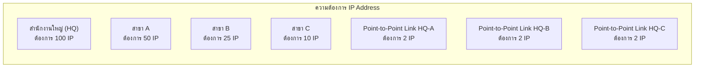
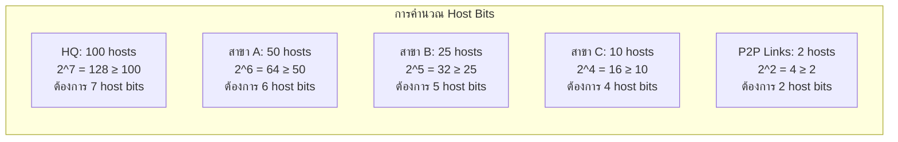
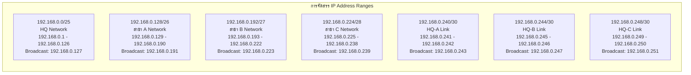
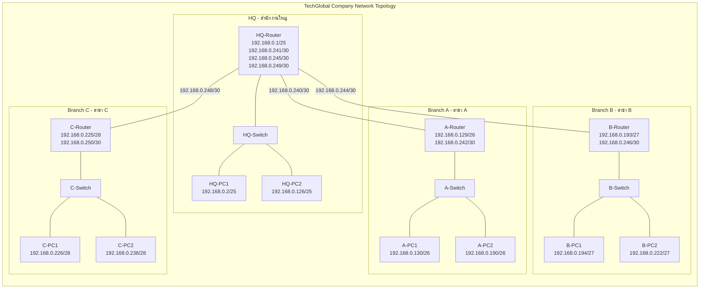
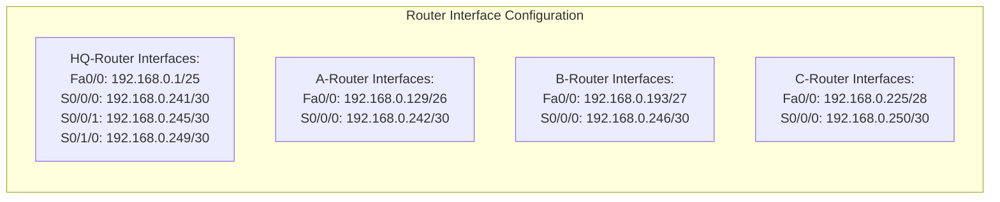
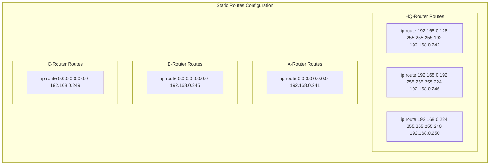
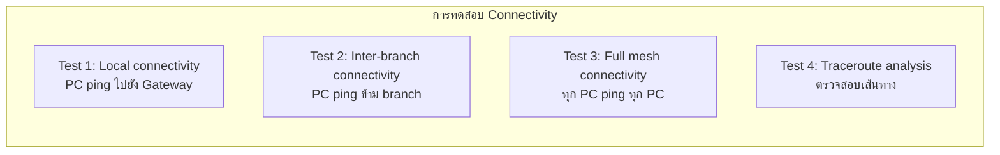
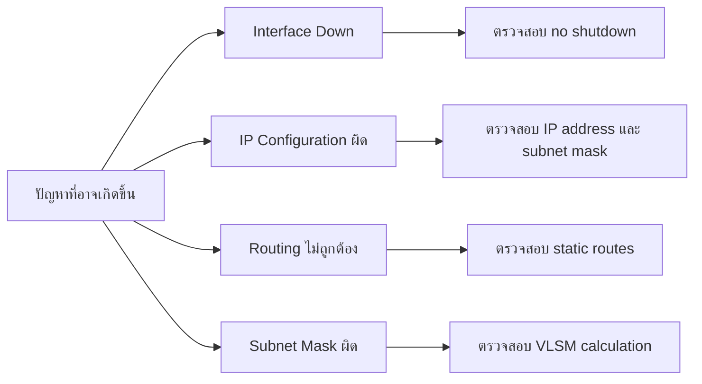
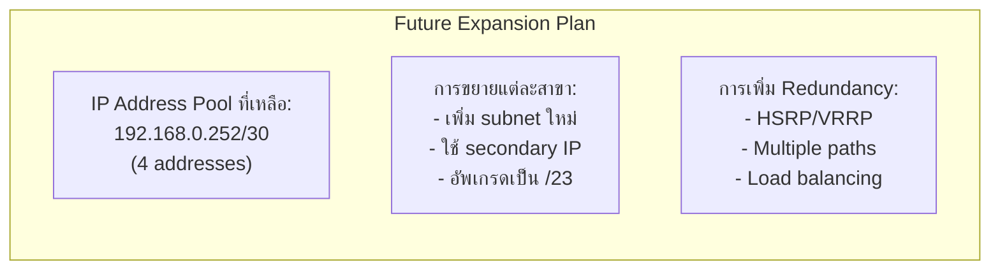

# คำตอบโจทย์ปัญหา Computer Network - ข้อ 6

## 6. การออกแบบและตั้งค่าเครือข่ายสำหรับบริษัทที่มีหลายสาขาโดยใช้ VLSM

### 6.1 วิเคราะห์ความต้องการและออกแบบแผนการแบ่ง Subnet โดยใช้ VLSM

#### ข้อมูลพื้นฐาน:
- **IP Network ที่ได้รับ:** 192.168.0.0/24
- **จำนวน IP ที่มีทั้งหมด:** 256 addresses (192.168.0.0 - 192.168.0.255)
- **IP ที่ใช้งานได้:** 254 addresses (ไม่รวม network และ broadcast address)

#### ความต้องการของแต่ละหน่วยงาน:



### 6.1.1 การคำนวณ Subnet โดยใช้ VLSM

**หลักการ VLSM (Variable Length Subnet Masking):**
- เรียงลำดับความต้องการจากมากไปน้อย
- หาจำนวน host bits ที่ต้องการ
- คำนวณ subnet mask ที่เหมาะสม

#### ขั้นตอนการคำนวณ:

**Step 1: เรียงลำดับความต้องการ**
1. HQ: 100 hosts
2. สาขา A: 50 hosts  
3. สาขา B: 25 hosts
4. สาขา C: 10 hosts
5. Point-to-Point Links: 2 hosts แต่ละลิงก์ (3 ลิงก์)

**Step 2: คำนวณจำนวน Host Bits ที่ต้องการ**

สูตร: 2^n - 2 ≥ จำนวน hosts ที่ต้องการ (โดย n = จำนวน host bits)



**Step 3: คำนวณ Subnet Mask**

สำหรับ /24 network (255.255.255.0):
- Network bits = 24
- Host bits = 32 - 24 = 8

| Subnet | Hosts ต้องการ | Host Bits | Network Bits | Subnet Mask | จำนวน Hosts ได้จริง |
|--------|-------------|-----------|-------------|-------------|------------------|
| HQ | 100 | 7 | 25 | /25 (255.255.255.128) | 126 |
| สาขา A | 50 | 6 | 26 | /26 (255.255.255.192) | 62 |
| สาขา B | 25 | 5 | 27 | /27 (255.255.255.224) | 30 |
| สาขา C | 10 | 4 | 28 | /28 (255.255.255.240) | 14 |
| P2P Links | 2 | 2 | 30 | /30 (255.255.255.252) | 2 |

### 6.1.2 การจัดสรร IP Address Range



**สรุปการจัดสรร Subnet:**

| Subnet | Network Address | Subnet Mask | First Host | Last Host | Broadcast | ใช้งานสำหรับ |
|--------|----------------|-------------|------------|-----------|-----------|-------------|
| 1 | 192.168.0.0/25 | 255.255.255.128 | 192.168.0.1 | 192.168.0.126 | 192.168.0.127 | HQ LAN |
| 2 | 192.168.0.128/26 | 255.255.255.192 | 192.168.0.129 | 192.168.0.190 | 192.168.0.191 | สาขา A LAN |
| 3 | 192.168.0.192/27 | 255.255.255.224 | 192.168.0.193 | 192.168.0.222 | 192.168.0.223 | สาขา B LAN |
| 4 | 192.168.0.224/28 | 255.255.255.240 | 192.168.0.225 | 192.168.0.238 | 192.168.0.239 | สาขา C LAN |
| 5 | 192.168.0.240/30 | 255.255.255.252 | 192.168.0.241 | 192.168.0.242 | 192.168.0.243 | HQ-A Link |
| 6 | 192.168.0.244/30 | 255.255.255.252 | 192.168.0.245 | 192.168.0.246 | 192.168.0.247 | HQ-B Link |
| 7 | 192.168.0.248/30 | 255.255.255.252 | 192.168.0.249 | 192.168.0.250 | 192.168.0.251 | HQ-C Link |

**IP Address ที่เหลือ:** 192.168.0.252 - 192.168.0.255 (4 addresses สำหรับการขยายในอนาคต)

---

### 6.2 Network Topology และการออกแบบ



---

### 6.3 คู่มือการสร้างเครือข่ายใน Cisco Packet Tracer แบบละเอียด

#### 6.3.1 การเตรียมและสร้าง Physical Topology

**Step 1: เปิด Cisco Packet Tracer และสร้าง Workspace ใหม่**

1. เปิดโปรแกรม Cisco Packet Tracer
2. เลือก **File > New** หรือกด **Ctrl+N**
3. บันทึกโปรเจ็กต์ด้วยชื่อ "TechGlobal_VLSM_Network"

**Step 2: การเพิ่มอุปกรณ์เครือข่าย**

*การเพิ่ม Routers:*
1. ในหน้าต่าง Network Devices ด้านล่าง ให้คลิกที่ **Routers**
2. เลือก **2811** (หรือ 2901 ถ้ามี)
3. ลากมาวางใน workspace 4 ตัว
4. ตั้งชื่อ routers ดังนี้:
   - Router แรก: เปลี่ยนชื่อเป็น "HQ-Router"
   - Router ที่สอง: เปลี่ยนชื่อเป็น "A-Router"  
   - Router ที่สาม: เปลี่ยนชื่อเป็น "B-Router"
   - Router ที่สี่: เปลี่ยนชื่อเป็น "C-Router"

*การเพิ่ม Switches:*
1. คลิกที่ **Switches**
2. เลือก **2960** 
3. ลากมาวางใน workspace 4 ตัว (ตัวละ 1 ตัวต่อ router)
4. ตั้งชื่อ switches:
   - HQ-Switch, A-Switch, B-Switch, C-Switch

*การเพิ่ม PCs:*
1. คลิกที่ **End Devices**
2. เลือก **PC-PT**
3. ลากมาวางใน workspace 8 ตัว (แต่ละสาขา 2 ตัว)
4. ตั้งชื่อ PCs:
   - HQ: HQ-PC1, HQ-PC2
   - สาขา A: A-PC1, A-PC2
   - สาขา B: B-PC1, B-PC2  
   - สาขา C: C-PC1, C-PC2

**Step 3: การเชื่อมต่อสายเคเบิล**

*เชื่อมต่อ Router กับ Switch (ใช้ Straight-through cable):*
1. คลิกที่ **Connections**
2. เลือก **Straight-through** (เส้นสีดำ)
3. เชื่อมต่อ:
   - HQ-Router FastEthernet 0/0 กับ HQ-Switch FastEthernet 0/1
   - A-Router FastEthernet 0/0 กับ A-Switch FastEthernet 0/1
   - B-Router FastEthernet 0/0 กับ B-Switch FastEthernet 0/1
   - C-Router FastEthernet 0/0 กับ C-Switch FastEthernet 0/1

*เชื่อมต่อ Switch กับ PC (ใช้ Straight-through cable):*
1. เชื่อมต่อ:
   - HQ-Switch FastEthernet 0/2 กับ HQ-PC1 FastEthernet 0
   - HQ-Switch FastEthernet 0/3 กับ HQ-PC2 FastEthernet 0
   - A-Switch FastEthernet 0/2 กับ A-PC1 FastEthernet 0
   - A-Switch FastEthernet 0/3 กับ A-PC2 FastEthernet 0
   - B-Switch FastEthernet 0/2 กับ B-PC1 FastEthernet 0
   - B-Switch FastEthernet 0/3 กับ B-PC2 FastEthernet 0
   - C-Switch FastEthernet 0/2 กับ C-PC1 FastEthernet 0
   - C-Switch FastEthernet 0/3 กับ C-PC2 FastEthernet 0

*เชื่อมต่อ Router กับ Router (Point-to-Point Links ใช้ Serial cable):*
1. เลือก **Serial DCE** (สายสีแดง)
2. เชื่อมต่อ:
   - HQ-Router Serial 0/0/0 กับ A-Router Serial 0/0/0
   - HQ-Router Serial 0/0/1 กับ B-Router Serial 0/0/0
   - HQ-Router Serial 0/1/0 กับ C-Router Serial 0/0/0

**หมายเหตุ:** ในการเชื่อมต่อ Serial ต้องมี DCE และ DTE โดย DCE จะอยู่ฝั่ง HQ-Router

#### 6.3.2 การกำหนดค่า IP Address และ Interface



**การกำหนดค่า HQ-Router:**

1. คลิกที่ HQ-Router
2. เลือกแท็บ **CLI**
3. รอจนเห็น Router> prompt แล้วพิมพ์คำสั่งต่อไปนี้:

```bash
Router>enable
Router#configure terminal
Router(config)#hostname HQ-Router
HQ-Router(config)#

# กำหนดค่า FastEthernet 0/0 (LAN Interface)
HQ-Router(config)#interface fastethernet 0/0
HQ-Router(config-if)#ip address 192.168.0.1 255.255.255.128
HQ-Router(config-if)#no shutdown
HQ-Router(config-if)#exit

# กำหนดค่า Serial 0/0/0 (Link to A-Router)
HQ-Router(config)#interface serial 0/0/0
HQ-Router(config-if)#ip address 192.168.0.241 255.255.255.252
HQ-Router(config-if)#clock rate 64000
HQ-Router(config-if)#no shutdown
HQ-Router(config-if)#exit

# กำหนดค่า Serial 0/0/1 (Link to B-Router)
HQ-Router(config)#interface serial 0/0/1
HQ-Router(config-if)#ip address 192.168.0.245 255.255.255.252
HQ-Router(config-if)#clock rate 64000
HQ-Router(config-if)#no shutdown
HQ-Router(config-if)#exit

# กำหนดค่า Serial 0/1/0 (Link to C-Router)
HQ-Router(config)#interface serial 0/1/0
HQ-Router(config-if)#ip address 192.168.0.249 255.255.255.252
HQ-Router(config-if)#clock rate 64000
HQ-Router(config-if)#no shutdown
HQ-Router(config-if)#exit

# บันทึกการกำหนดค่า
HQ-Router(config)#exit
HQ-Router#copy running-config startup-config
```

**การกำหนดค่า A-Router:**

```bash
Router>enable
Router#configure terminal
Router(config)#hostname A-Router
A-Router(config)#

# กำหนดค่า FastEthernet 0/0 (LAN Interface)
A-Router(config)#interface fastethernet 0/0
A-Router(config-if)#ip address 192.168.0.129 255.255.255.192
A-Router(config-if)#no shutdown
A-Router(config-if)#exit

# กำหนดค่า Serial 0/0/0 (Link to HQ-Router)
A-Router(config)#interface serial 0/0/0
A-Router(config-if)#ip address 192.168.0.242 255.255.255.252
A-Router(config-if)#no shutdown
A-Router(config-if)#exit

# บันทึกการกำหนดค่า
A-Router(config)#exit
A-Router#copy running-config startup-config
```

**การกำหนดค่า B-Router:**

```bash
Router>enable
Router#configure terminal
Router(config)#hostname B-Router
B-Router(config)#

# กำหนดค่า FastEthernet 0/0 (LAN Interface)
B-Router(config)#interface fastethernet 0/0
B-Router(config-if)#ip address 192.168.0.193 255.255.255.224
B-Router(config-if)#no shutdown
B-Router(config-if)#exit

# กำหนดค่า Serial 0/0/0 (Link to HQ-Router)
B-Router(config)#interface serial 0/0/0
B-Router(config-if)#ip address 192.168.0.246 255.255.255.252
B-Router(config-if)#no shutdown
B-Router(config-if)#exit

# บันทึกการกำหนดค่า
B-Router(config)#exit
B-Router#copy running-config startup-config
```

**การกำหนดค่า C-Router:**

```bash
Router>enable
Router#configure terminal
Router(config)#hostname C-Router
C-Router(config)#

# กำหนดค่า FastEthernet 0/0 (LAN Interface)
C-Router(config)#interface fastethernet 0/0
C-Router(config-if)#ip address 192.168.0.225 255.255.255.240
C-Router(config-if)#no shutdown
C-Router(config-if)#exit

# กำหนดค่า Serial 0/0/0 (Link to HQ-Router)
C-Router(config)#interface serial 0/0/0
C-Router(config-if)#ip address 192.168.0.250 255.255.255.252
C-Router(config-if)#no shutdown
C-Router(config-if)#exit

# บันทึกการกำหนดค่า
C-Router(config)#exit
C-Router#copy running-config startup-config
```

#### 6.3.3 การกำหนดค่า PC ในแต่ละสาขา

**การกำหนดค่า HQ PCs:**

*HQ-PC1:*
1. คลิกที่ HQ-PC1
2. เลือกแท็บ **Desktop**
3. คลิก **IP Configuration**
4. กำหนดค่า:
   - IP Address: `192.168.0.2`
   - Subnet Mask: `255.255.255.128`
   - Default Gateway: `192.168.0.1`

*HQ-PC2:*
1. คลิกที่ HQ-PC2
2. เลือกแท็บ **Desktop**
3. คลิก **IP Configuration**
4. กำหนดค่า:
   - IP Address: `192.168.0.126`
   - Subnet Mask: `255.255.255.128`
   - Default Gateway: `192.168.0.1`

**การกำหนดค่า Branch A PCs:**

*A-PC1:*
- IP Address: `192.168.0.130`
- Subnet Mask: `255.255.255.192`
- Default Gateway: `192.168.0.129`

*A-PC2:*
- IP Address: `192.168.0.190`
- Subnet Mask: `255.255.255.192`
- Default Gateway: `192.168.0.129`

**การกำหนดค่า Branch B PCs:**

*B-PC1:*
- IP Address: `192.168.0.194`
- Subnet Mask: `255.255.255.224`
- Default Gateway: `192.168.0.193`

*B-PC2:*
- IP Address: `192.168.0.222`
- Subnet Mask: `255.255.255.224`
- Default Gateway: `192.168.0.193`

**การกำหนดค่า Branch C PCs:**

*C-PC1:*
- IP Address: `192.168.0.226`
- Subnet Mask: `255.255.255.240`
- Default Gateway: `192.168.0.225`

*C-PC2:*
- IP Address: `192.168.0.238`
- Subnet Mask: `255.255.255.240`
- Default Gateway: `192.168.0.225`

#### 6.3.4 การกำหนดค่า Static Routes



**การกำหนด Static Routes บน HQ-Router:**

```bash
HQ-Router>enable
HQ-Router#configure terminal

# Route ไปยัง Branch A Network
HQ-Router(config)#ip route 192.168.0.128 255.255.255.192 192.168.0.242

# Route ไปยัง Branch B Network
HQ-Router(config)#ip route 192.168.0.192 255.255.255.224 192.168.0.246

# Route ไปยัง Branch C Network  
HQ-Router(config)#ip route 192.168.0.224 255.255.255.240 192.168.0.250

HQ-Router(config)#exit
HQ-Router#copy running-config startup-config
```

**การกำหนด Static Routes บน A-Router:**

```bash
A-Router>enable
A-Router#configure terminal

# Default Route ไปยัง HQ-Router (ให้ HQ เป็นทางออกไปเครือข่ายอื่น)
A-Router(config)#ip route 0.0.0.0 0.0.0.0 192.168.0.241

A-Router(config)#exit
A-Router#copy running-config startup-config
```

**การกำหนด Static Routes บน B-Router:**

```bash
B-Router>enable
B-Router#configure terminal

# Default Route ไปยัง HQ-Router
B-Router(config)#ip route 0.0.0.0 0.0.0.0 192.168.0.245

B-Router(config)#exit
B-Router#copy running-config startup-config
```

**การกำหนด Static Routes บน C-Router:**

```bash
C-Router>enable
C-Router#configure terminal

# Default Route ไปยัง HQ-Router
C-Router(config)#ip route 0.0.0.0 0.0.0.0 192.168.0.249

C-Router(config)#exit
C-Router#copy running-config startup-config
```

#### 6.3.5 การตรวจสอบและ Troubleshooting

**การตรวจสอบ Interface Status:**

```bash
# บน Router ใดก็ได้
Router#show ip interface brief
Router#show interfaces
Router#show ip route
```

**การตรวจสอบ Routing Table:**

```bash
HQ-Router#show ip route
Codes: C - connected, S - static, R - RIP, M - mobile, B - BGP
       D - EIGRP, EX - EIGRP external, O - OSPF, IA - OSPF inter area
       N1 - OSPF NSSA external type 1, N2 - OSPF NSSA external type 2
       E1 - OSPF external type 1, E2 - OSPF external type 2
       i - IS-IS, su - IS-IS summary, L1 - IS-IS level-1, L2 - IS-IS level-2
       ia - IS-IS inter area, * - candidate default, U - per-user static route
       o - ODR, P - periodic downloaded static route

Gateway of last resort is not set

C    192.168.0.0/25 is directly connected, FastEthernet0/0
S    192.168.0.128/26 [1/0] via 192.168.0.242
S    192.168.0.192/27 [1/0] via 192.168.0.246
S    192.168.0.224/28 [1/0] via 192.168.0.250
C    192.168.0.240/30 is directly connected, Serial0/0/0
C    192.168.0.244/30 is directly connected, Serial0/0/1
C    192.168.0.248/30 is directly connected, Serial0/1/0
```

### 6.4 การทดสอบการเชื่อมต่อและผลลัพธ์

#### 6.4.1 แผนการทดสอบ



#### 6.4.2 คำสั่งทดสอบและผลลัพธ์ที่คาดหวัง

**Test 1: การทดสอบ Local Connectivity**

จาก HQ-PC1 ping ไปยัง HQ-Router:
```
C:\>ping 192.168.0.1

Pinging 192.168.0.1 with 32 bytes of data:

Reply from 192.168.0.1: bytes=32 time<1ms TTL=255
Reply from 192.168.0.1: bytes=32 time<1ms TTL=255
Reply from 192.168.0.1: bytes=32 time<1ms TTL=255
Reply from 192.168.0.1: bytes=32 time<1ms TTL=255

Ping statistics for 192.168.0.1:
    Packets: Sent = 4, Received = 4, Lost = 0 (0% loss),
Approximate round trip times in milli-seconds:
    Minimum = 0ms, Maximum = 0ms, Average = 0ms
```

**Test 2: การทดสอบ Inter-branch Connectivity**

จาก HQ-PC1 ping ไปยัง A-PC1:
```
C:\>ping 192.168.0.130

Pinging 192.168.0.130 with 32 bytes of data:

Reply from 192.168.0.130: bytes=32 time=1ms TTL=254
Reply from 192.168.0.130: bytes=32 time=1ms TTL=254
Reply from 192.168.0.130: bytes=32 time=1ms TTL=254
Reply from 192.168.0.130: bytes=32 time=1ms TTL=254

Ping statistics for 192.168.0.130:
    Packets: Sent = 4, Received = 4, Lost = 0 (0% loss),
Approximate round trip times in milli-seconds:
    Minimum = 1ms, Maximum = 1ms, Average = 1ms
```

**Test 3: การทดสอบ Cross-branch Connectivity**

จาก A-PC1 ping ไปยัง B-PC1:
```
C:\>ping 192.168.0.194

Pinging 192.168.0.194 with 32 bytes of data:

Reply from 192.168.0.194: bytes=32 time=2ms TTL=253
Reply from 192.168.0.194: bytes=32 time=2ms TTL=253
Reply from 192.168.0.194: bytes=32 time=2ms TTL=253
Reply from 192.168.0.194: bytes=32 time=2ms TTL=253

Ping statistics for 192.168.0.194:
    Packets: Sent = 4, Received = 4, Lost = 0 (0% loss),
Approximate round trip times in milli-seconds:
    Minimum = 2ms, Maximum = 2ms, Average = 2ms
```

**Test 4: การทดสอบ Traceroute**

จาก A-PC1 tracert ไปยัง C-PC1:
```
C:\>tracert 192.168.0.226

Tracing route to 192.168.0.226 over a maximum of 30 hops:

  1    <1 ms    <1 ms    <1 ms  192.168.0.129
  2     1 ms     1 ms     1 ms  192.168.0.241
  3     2 ms     2 ms     2 ms  192.168.0.249
  4     2 ms     2 ms     2 ms  192.168.0.225
  5     3 ms     3 ms     3 ms  192.168.0.226

Trace complete.
```

#### 6.4.3 ตารางสรุปการทดสอบ

| Source | Destination | Expected Result | Test Status | Comments |
|--------|-------------|----------------|-------------|----------|
| HQ-PC1 | HQ-PC2 | ✅ Success | Same subnet | Direct communication |
| HQ-PC1 | A-PC1 | ✅ Success | Cross-subnet | Via HQ-Router |
| HQ-PC1 | B-PC1 | ✅ Success | Cross-subnet | Via HQ-Router |
| HQ-PC1 | C-PC1 | ✅ Success | Cross-subnet | Via HQ-Router |
| A-PC1 | B-PC1 | ✅ Success | Cross-branch | Via HQ-Router |
| A-PC1 | C-PC1 | ✅ Success | Cross-branch | Via HQ-Router |
| B-PC1 | C-PC1 | ✅ Success | Cross-branch | Via HQ-Router |
| A-PC1 | A-PC2 | ✅ Success | Same subnet | Direct communication |
| B-PC1 | B-PC2 | ✅ Success | Same subnet | Direct communication |
| C-PC1 | C-PC2 | ✅ Success | Same subnet | Direct communication |

### 6.5 การ Troubleshooting และแก้ไขปัญหาที่อาจเกิดขึ้น

#### 6.5.1 ปัญหาที่พบบ่อยและวิธีแก้ไข



**1. Interface Down Problems:**

ตรวจสอบ:
```bash
Router#show ip interface brief
# ถ้าเจอ "administratively down" ให้ใช้
Router(config)#interface [interface-name]
Router(config-if)#no shutdown
```

**2. IP Configuration Problems:**

ตรวจสอบ:
```bash
Router#show running-config
# ตรวจสอบว่า IP address และ subnet mask ถูกต้องหรือไม่
```

**3. Routing Problems:**

ตรวจสอบ:
```bash
Router#show ip route
# ตรวจสอบว่ามี route ไปยัง destination หรือไม่
Router#ping [destination-ip]
```

**4. Connectivity Testing:**

```bash
# ทดสอบจาก Router
Router#ping [destination-ip]

# ทดสอบจาก PC
C:\>ping [destination-ip]
C:\>tracert [destination-ip]
```

### 6.6 การขยายเครือข่ายในอนาคต



**ข้อเสนอแนะสำหรับการขยายเครือข่าย:**

1. **การจัดการ IP Address Pool:**
   - IP addresses ที่เหลือ: 192.168.0.252-255 (4 addresses)
   - สำหรับการขยายในอนาคต อาจต้องขอ subnet เพิ่มเติม

2. **การอัพเกรดสู่ Dynamic Routing:**
   - ใช้ OSPF หรือ EIGRP แทน Static Routing
   - ลดความซับซ้อนในการจัดการ
   - Auto-convergence เมื่อมีการเปลี่ยนแปลง topology

3. **การเพิ่มความปลอดภัย:**
   - ACLs (Access Control Lists)
   - VPN connections
   - Network segmentation

4. **การเพิ่ม Redundancy:**
   - Backup links
   - HSRP/VRRP สำหรับ gateway redundancy
   - Link aggregation

---

## สรุป

การออกแบบเครือข่ายโดยใช้ VLSM สำหรับบริษัท TechGlobal ประสบความสำเร็จในการ:

1. **ใช้ IP Address อย่างมีประสิทธิภาพ** - จัดสรร subnet ตามความต้องการจริงของแต่ละสาขา
2. **รองรับการขยายตัวในอนาคต** - เหลือ IP addresses สำหรับการเพิ่มอุปกรณ์
3. **สร้างเครือข่ายที่สามารถติดต่อกันได้ทั้งหมด** - ผ่านการกำหนด static routes ที่เหมาะสม
4. **ง่ายต่อการบำรุงรักษาและ troubleshooting** - โครงสร้างที่ชัดเจนและมีระเบียบ

การใช้ VLSM ช่วยให้สามารถใช้ network address space ได้อย่างคุ้มค่า โดยไม่สิ้นเปลือง IP addresses และยังสามารถรองรับการเติบโตของธุรกิจในอนาคตได้อีกด้วย
