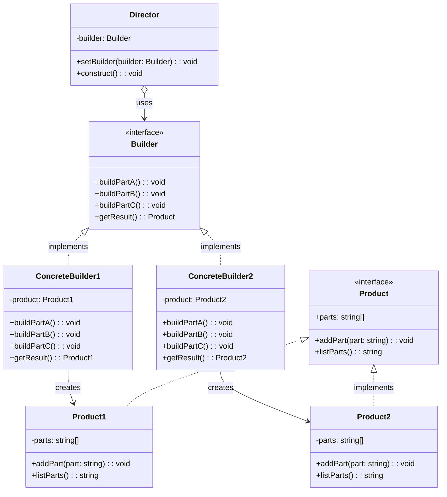

# Builder Design Pattern (Creational)

## Definition and Intent

The Builder pattern is a creational design pattern that separates the construction of a complex object from its representation, allowing the same construction process to create various representations. This pattern helps to solve the problem of constructing a complex object step by step and allows construction of different types of objects using the same construction process.

**Intent**:
- To separate the construction of a complex object from its representation
- To allow the same construction process to create different representations
- To provide a clear step-by-step creation process for creating complex objects
- To encapsulate code for construction and representation

## UML Diagram



## Participants and Their Roles

1. **Director**
   - Constructs objects using the Builder interface
   - Controls the order in which construction steps are executed
   - Optional in some implementations, as clients can directly work with builders

2. **Builder (Interface)**
   - Defines an abstract interface for creating parts of a Product
   - Declares construction steps that all concrete builders must implement
   - May include a method to retrieve the constructed object

3. **ConcreteBuilder**
   - Implements the Builder interface to construct and assemble parts of the product
   - Defines and keeps track of the representation it creates
   - Provides a method for retrieving the product
   - May provide an interface for retrieving the final product

4. **Product**
   - Represents the complex object under construction
   - Includes classes that define the constituent parts
   - ConcreteBuilder builds the product's internal representation and defines the assembly process

## Real-world Examples with Code Snippets

### Example 1: Vehicle Builder

This example demonstrates a Builder pattern for constructing different types of vehicles (cars and motorcycles) with various configurations.

```typescript
// Simplified excerpt from the complete implementation
interface VehicleBuilder {
  reset(): void;
  buildFrame(): void;
  buildEngine(): void;
  buildWheels(): void;
  buildInterior(): void;
  getVehicle(): Vehicle;
}

class CarBuilder implements VehicleBuilder {
  private car: Car = new Car();
  
  buildEngine(): void {
    this.car.addPart('V8 Engine');
  }
  
  // Other methods implementation...
  
  getVehicle(): Vehicle {
    const result = this.car;
    this.reset();
    return result;
  }
}

// Using the builder with a director
const director = new VehicleDirector();
const carBuilder = new CarBuilder();
director.setBuilder(carBuilder);
director.constructFullFeaturedVehicle();
const car = carBuilder.getVehicle();
```

### Example 2: Query Builder

A real-world example is a SQL query builder that allows constructing complex queries step by step:

```typescript
class SQLQueryBuilder {
  private query: string = '';
  private conditions: string[] = [];
  private tables: string[] = [];
  private fields: string[] = [];
  private orderBy: string = '';
  
  select(fields: string[]): SQLQueryBuilder {
    this.fields = fields;
    return this;
  }
  
  from(tables: string[]): SQLQueryBuilder {
    this.tables = tables;
    return this;
  }
  
  where(condition: string): SQLQueryBuilder {
    this.conditions.push(condition);
    return this;
  }
  
  orderBy(field: string, direction: 'ASC' | 'DESC'): SQLQueryBuilder {
    this.orderBy = `ORDER BY ${field} ${direction}`;
    return this;
  }
  
  build(): string {
    this.query = `SELECT ${this.fields.join(', ')} FROM ${this.tables.join(', ')}`;
    
    if (this.conditions.length > 0) {
      this.query += ` WHERE ${this.conditions.join(' AND ')}`;
    }
    
    if (this.orderBy) {
      this.query += ` ${this.orderBy}`;
    }
    
    return this.query;
  }
}

// Usage
const query = new SQLQueryBuilder()
  .select(['id', 'name', 'email'])
  .from(['users'])
  .where('status = "active"')
  .orderBy('created_at', 'DESC')
  .build();

console.log(query); 
// Output: SELECT id, name, email FROM users WHERE status = "active" ORDER BY created_at DESC
```

## Use Cases and Benefits

### Use Cases:
1. **Complex object creation**: When an object needs to be constructed with numerous parameters or steps
2. **Different representations**: When you need to create different variants of an object
3. **Immutable objects**: When building immutable objects that require a lot of data
4. **Multi-step construction**: When construction requires multiple steps in a specific sequence
5. **Parameter validation**: When you need to validate parameters during construction

### Benefits:
1. **Separation of concerns**: Separates the complex construction code from the object's business logic
2. **Step-by-step construction**: Allows fine control over the construction process
3. **Reusable code**: Construction code can be reused for building various representations
4. **Clean client code**: Client code doesn't need to handle the details of object construction
5. **Improved readability**: Makes the intent of the code more clear
6. **Encapsulation**: Encapsulates how a complex object is constructed

## Common Implementations and Variations

### 1. Fluent Builder
A variation of the Builder pattern that uses method chaining to create a more readable, fluent interface:

```typescript
class EmailBuilder {
  private email: Email = new Email();
  
  from(address: string): EmailBuilder {
    this.email.setFromAddress(address);
    return this;
  }
  
  to(address: string): EmailBuilder {
    this.email.addToAddress(address);
    return this;
  }
  
  subject(subject: string): EmailBuilder {
    this.email.setSubject(subject);
    return this;
  }
  
  body(body: string): EmailBuilder {
    this.email.setBody(body);
    return this;
  }
  
  build(): Email {
    return this.email;
  }
}

// Usage
const email = new EmailBuilder()
  .from('sender@example.com')
  .to('recipient@example.com')
  .subject('Meeting')
  .body('Let\'s meet tomorrow')
  .build();
```

### 2. Inner Static Builder
A common implementation in Java/TypeScript where the Builder is a static inner class of the product:

```typescript
class Person {
  private name: string;
  private age: number;
  private address: string;
  
  private constructor(builder: Person.Builder) {
    this.name = builder.name;
    this.age = builder.age;
    this.address = builder.address;
  }
  
  static Builder = class {
    name: string;
    age: number;
    address: string;
    
    setName(name: string): Person.Builder {
      this.name = name;
      return this;
    }
    
    setAge(age: number): Person.Builder {
      this.age = age;
      return this;
    }
    
    setAddress(address: string): Person.Builder {
      this.address = address;
      return this;
    }
    
    build(): Person {
      return new Person(this);
    }
  }
}

// Usage
const person = new Person.Builder()
  .setName('John')
  .setAge(30)
  .setAddress('123 Main St')
  .build();
```

### 3. Director-less Builder
In many modern implementations, the Director class is omitted and the client code directly uses the Builder:

```typescript
const car = new CarBuilder()
  .buildFrame()
  .buildEngine()
  .buildWheels()
  .getVehicle();
```

### 4. Recursive Generics (for TypeScript)
Using TypeScript's recursive generics to enforce type safety in fluent interfaces:

```typescript
class FormBuilder<T = {}> {
  private data: T;
  
  constructor(data: T = {} as T) {
    this.data = data;
  }
  
  field<K extends string, V>(key: K, value: V): FormBuilder<T & Record<K, V>> {
    return new FormBuilder({
      ...this.data,
      [key]: value
    });
  }
  
  build(): T {
    return this.data;
  }
}

// Usage with type safety
const form = new FormBuilder()
  .field('name', 'John')
  .field('age', 30)
  .field('isAdmin', true)
  .build();
```

## Anti-Patterns to Avoid

1. **Telescoping Constructor Pattern**
   This is an anti-pattern that the Builder pattern helps to solve. It involves creating multiple constructors with an increasing number of parameters:

   ```typescript
   // Anti-pattern: Telescoping Constructor
   class Pizza {
     constructor(size: string);
     constructor(size: string, cheese: boolean);
     constructor(size: string, cheese: boolean, pepperoni: boolean);
     constructor(size: string, cheese: boolean, pepperoni: boolean, mushrooms: boolean);
     constructor(size: string, cheese?: boolean, pepperoni?: boolean, mushrooms?: boolean) {
       // implementation with many parameters
     }
   }
   ```

2. **Builder Overuse**
   Using the Builder pattern for simple objects that don't require complex construction:

   ```typescript
   // Anti-pattern: Overusing Builder for simple objects
   const user = new UserBuilder()
     .setName('John')
     .setEmail('john@example.com')
     .build();
     
   // Better approach for simple cases
   const user = { name: 'John', email: 'john@example.com' };
   ```

3. **Mutable Builders**
   Creating builders that can be modified after the object is built:

   ```typescript
   // Anti-pattern: Mutable builder
   const builder = new CarBuilder();
   const car1 = builder.setColor('red').build();
   const car2 = builder.setColor('blue').build(); // car1 is now also blue
   ```

## Comparison with Other Patterns

### Builder vs Factory Method
- **Builder**: Focuses on constructing complex objects step by step
- **Factory Method**: Creates objects in a single step through inheritance

### Builder vs Abstract Factory
- **Builder**: Constructs complex objects step by step, focusing on how an object is created
- **Abstract Factory**: Creates families of related objects without specifying concrete classes

### Builder vs Prototype
- **Builder**: Creates different types of objects using the same construction process
- **Prototype**: Creates new objects by copying existing ones

### Builder vs Fluent Interface
- **Builder**: A design pattern for object creation
- **Fluent Interface**: A design pattern for API design that often uses method chaining (Builder can implement a fluent interface)

## Conclusion

The Builder pattern is a powerful tool for creating complex objects with numerous parameters and configuration options. It provides a clear, step-by-step approach to object construction that improves code readability and maintainability. By separating the construction process from the representation, it allows for creating different types of objects using the same building process, making it highly flexible and adaptable to changing requirements.

When implementing the Builder pattern, consider whether you need a Director class or if a fluent interface would be more appropriate for your use case. Be mindful not to overuse the pattern for simple objects that don't require complex construction steps.
