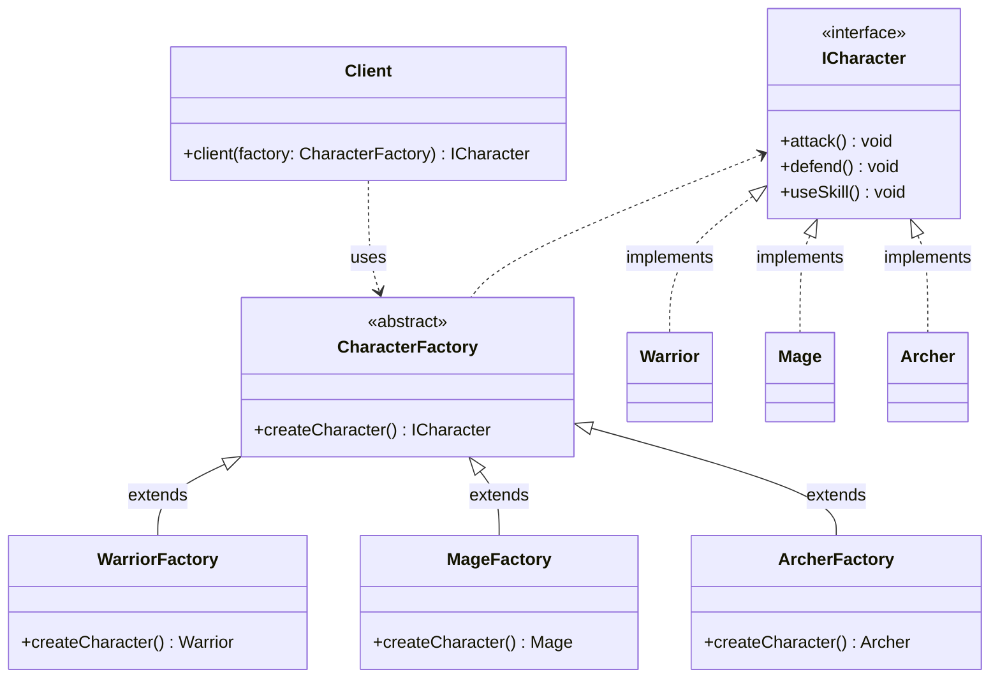

## Geme Character Creation Factory Method

```mermaid
classDiagram
    class Client{
        +client(factory: CharacterFactory) ICharacter
    }
    Client ..> CharacterFactory:uses
    class ICharacter {
        <<interface>>
        +attack() void
        +defend() void
        +useSkill() void
    }
    class Warrior {
    }
    class Mage {
    }
    class Archer {
    }
    class CharacterFactory {
        <<abstract>>
        +createCharacter() ICharacter
    }
    class WarriorFactory {
        +createCharacter() Warrior
    }
    class MageFactory {
        +createCharacter() Mage
    }
    class ArcherFactory {
        +createCharacter() Archer
    }
    ICharacter <|.. Warrior:implements
    ICharacter <|.. Mage:implements
    ICharacter <|.. Archer:implements
    CharacterFactory <|-- WarriorFactory:extends
    CharacterFactory <|-- MageFactory:extends
    CharacterFactory <|-- ArcherFactory:extends
    ICharacter <.. CharacterFactory
```