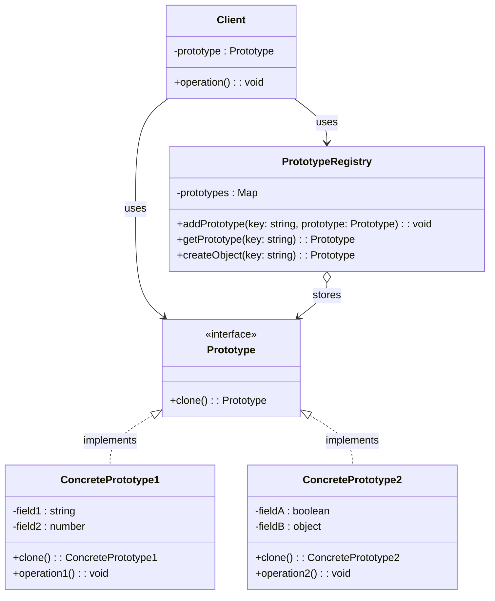

# Prototype Design Pattern (Creational)

## Definition and Intent

The Prototype design pattern is a creational pattern that allows you to copy existing objects without making your code dependent on their classes. It enables the creation of new objects by copying existing instances, known as prototypes, instead of creating new instances from scratch.

**Intent**:
- To specify the kinds of objects to create using a prototypical instance
- To create new objects by copying this prototype
- To avoid the inherent cost of creating a new object in the standard way
- To create objects without coupling to their concrete classes

The primary motivation for the Prototype pattern is to hide the complexity of creating new instances from the client. The concept is to copy an existing object rather than creating a new instance from scratch, something that may include costly operations. The existing object acts as a prototype and contains the state of the object. The newly copied object may change same properties only if required.

## UML Diagram



## Participants and Their Roles

1. **Prototype (Interface)**
   - Declares an interface for cloning itself
   - Usually includes a single method called `clone()`
   - Acts as the blueprint for cloneable objects

2. **ConcretePrototype**
   - Implements the cloning method defined by the Prototype interface
   - Creates a copy of itself with the same field values
   - May need to perform deep copying of complex objects or references
   - Can customize the cloning process to handle special cases

3. **Client**
   - Creates new objects by asking the prototype to clone itself
   - Works with any concrete prototype that implements the Prototype interface
   - Doesn't need to know the concrete class of the objects it's cloning

4. **PrototypeRegistry** (optional)
   - Provides a way to access frequently used prototypes
   - Stores a set of pre-built objects ready for cloning
   - Allows clients to retrieve prototypes by a simple key or identifier
   - Serves as a catalog or factory of prototypes

## Real-world Examples with Code Snippets

### Example 1: Shape Cloning System

This example demonstrates a prototype system for shapes where different shapes can be cloned and customized:

```typescript
// Base Shape prototype
abstract class Shape implements Prototype<Shape> {
  private x: number;
  private y: number;
  private color: Color;

  constructor(source?: Shape) {
    if (source) {
      this.x = source.x;
      this.y = source.y;
      this.color = source.color.clone(); // Deep copy
    }
  }

  abstract clone(): Shape;

  // Other methods and properties...
}

// Concrete Rectangle prototype
class Rectangle extends Shape {
  private width: number;
  private height: number;

  constructor(source?: Rectangle) {
    super(source);
    if (source) {
      this.width = source.width;
      this.height = source.height;
    }
  }

  clone(): Rectangle {
    return new Rectangle(this);
  }

  // Other rectangle-specific methods...
}

// Usage example
const originalRect = new Rectangle();
originalRect.setPosition(10, 10);
originalRect.setColor(new Color(255, 0, 0));
originalRect.setDimensions(20, 30);

// Clone and modify
const clonedRect = originalRect.clone();
clonedRect.setPosition(100, 100);
```

### Example 2: Document Template System

A real-world example of the Prototype pattern can be seen in document templates:

```typescript
interface DocumentPrototype {
  clone(): DocumentPrototype;
  getContent(): string;
}

class DocumentTemplate implements DocumentPrototype {
  private title: string;
  private headerImage: Image;
  private footerText: string;
  private sections: Section[];

  constructor(source?: DocumentTemplate) {
    if (source) {
      this.title = source.title;
      this.headerImage = source.headerImage.clone();
      this.footerText = source.footerText;
      this.sections = source.sections.map(section => section.clone());
    }
  }

  clone(): DocumentTemplate {
    return new DocumentTemplate(this);
  }

  getContent(): string {
    // Return formatted document content
    return `Title: ${this.title}\nSections: ${this.sections.length}`;
  }

  // Other methods for template customization
  setTitle(title: string): void {
    this.title = title;
  }

  addSection(section: Section): void {
    this.sections.push(section);
  }
}

// Client code
const invoiceTemplate = new DocumentTemplate();
invoiceTemplate.setTitle("Invoice Template");
invoiceTemplate.addSection(new Section("Company Information"));
invoiceTemplate.addSection(new Section("Client Details"));
invoiceTemplate.addSection(new Section("Invoice Items"));

// Create a new invoice from template
const clientInvoice = invoiceTemplate.clone();
clientInvoice.setTitle("Client XYZ Invoice #12345");
// Customize sections as needed...
```

## Use Cases and Benefits

### Use Cases:
1. **Object initialization is resource-intensive**
   - When objects are expensive to create (database connections, large data structures)
   - When object creation requires complex setup or configuration

2. **Class instantiation is controlled or prohibited**
   - When working with third-party libraries where you can't directly instantiate classes
   - In plugin or module systems where you need to create objects without knowing their classes

3. **Object variations with similar state**
   - When you need many objects with similar state but small variations
   - For handling objects with complex configurations

4. **Reducing subclassing**
   - When class hierarchies are complex and you need to reduce the number of subclasses
   - To create different combinations of state without numerous subclasses

5. **Dynamic loading**
   - When you need to load objects at runtime from different sources
   - For systems with plugin architecture

### Benefits:
1. **Reduced object creation cost**
   - Cloning can be faster than creating and initializing a new instance from scratch
   - Avoids repeating expensive initialization routines

2. **Dynamic object creation**
   - Allows adding and removing products at runtime
   - Enables the creation of objects without knowing their concrete types

3. **Configurable object creation**
   - Reduces the need for factory classes with parallel class hierarchies
   - Provides an alternative to using complex inheritance hierarchies

4. **Reduced repeating initialization code**
   - Eliminates duplicate initialization code across the application
   - Pre-built objects can encapsulate complex initialization logic

5. **Producing complex objects more conveniently**
   - Simplifies the creation of complex objects with many interrelated parts
   - Makes it easier to create variations of complex objects

## Common Implementations and Variations

### 1. Shallow vs Deep Copy

The most fundamental variation in the Prototype pattern is the choice between shallow and deep copying:

```typescript
// Shallow copy (simply copies references to nested objects)
shallowClone(): Shape {
  const clone = new Shape();
  clone.x = this.x;
  clone.y = this.y;
  clone.color = this.color; // Just copies the reference!
  return clone;
}

// Deep copy (creates new instances of nested objects)
deepClone(): Shape {
  const clone = new Shape();
  clone.x = this.x;
  clone.y = this.y;
  clone.color = this.color.clone(); // Creates a new Color object
  return clone;
}
```

### 2. Clone Method Implementation Approaches

There are several ways to implement the clone method:

#### Using Constructor Copying

```typescript
class Person implements Prototype {
  constructor(
    public name: string,
    public age: number,
    public addresses: Address[] = [],
    source?: Person
  ) {
    if (source) {
      this.name = source.name;
      this.age = source.age;
      this.addresses = source.addresses.map(addr => addr.clone());
    }
  }

  clone(): Person {
    return new Person(this.name, this.age, this.addresses, this);
  }
}
```

#### Using Object.assign() (Shallow copy)

```typescript
class SimplePrototype implements Prototype {
  constructor(public id: number, public name: string) {}

  clone(): SimplePrototype {
    // Creates a shallow copy (fine for primitive properties)
    return Object.assign(new SimplePrototype(0, ""), this);
  }
}
```

#### Using Serialization (Deep copy)

```typescript
class SerializablePrototype implements Prototype {
  // Properties...

  clone(): SerializablePrototype {
    // Deep copy via serialization
    return JSON.parse(JSON.stringify(this));
  }
}
```

### 3. Prototype Registry / Prototype Manager

A common variation includes a registry to manage prototypes:

```typescript
class PrototypeRegistry {
  private prototypes: Map<string, Prototype> = new Map();
  
  register(key: string, prototype: Prototype): void {
    this.prototypes.set(key, prototype);
  }
  
  unregister(key: string): void {
    this.prototypes.delete(key);
  }
  
  getPrototype(key: string): Prototype | undefined {
    return this.prototypes.get(key)?.clone();
  }
}

// Usage
const registry = new PrototypeRegistry();

// Register some prototypes
registry.register("basicUser", new User("User", false));
registry.register("adminUser", new User("Admin", true));

// Clone from registry
const newAdmin = registry.getPrototype("adminUser") as User;
newAdmin.name = "John Admin";
```

### 4. Prototype Inheritance

In JavaScript/TypeScript, prototype inheritance offers a natural way to implement the pattern:

```typescript
// Using JavaScript's prototype chain
function Animal(name) {
  this.name = name;
}

Animal.prototype.clone = function() {
  return new Animal(this.name);
};

// Create an instance
const sheep = new Animal("Dolly");
// Clone it
const clonedSheep = sheep.clone();
```

## Anti-Patterns to Avoid

1. **Not Handling Deep Copy Properly**
   A common mistake is failing to properly deep copy nested objects:

   ```typescript
   // Anti-pattern: Incomplete deep copying
   class ComplexObject implements Prototype {
     public nestedObject: NestedObject;
     
     clone(): ComplexObject {
       const clone = new ComplexObject();
       clone.nestedObject = this.nestedObject; // Just copying the reference!
       return clone;
     }
   }
   ```

2. **Over-reliance on Serialization**
   While JSON serialization can work for simple cases, it has limitations:

   ```typescript
   // Anti-pattern: Relying on JSON serialization
   clone(): ComplexObject {
     // Will lose methods, functions, and non-serializable properties
     // Also breaks circular references
     return JSON.parse(JSON.stringify(this)); 
   }
   ```

3. **Not Considering Performance**
   Cloning large objects without considering performance implications:

   ```typescript
   // Anti-pattern: Blindly cloning everything
   clone(): HugeDataObject {
     const clone = new HugeDataObject();
     // Cloning thousands of items when maybe only a few needed to change
     clone.massiveArray = this.massiveArray.map(item => item.clone());
     return clone;
   }
   ```

4. **Forgetting to Reset Unique Identifiers**
   Not handling unique identifiers or stateful properties during cloning:

   ```typescript
   // Anti-pattern: Not resetting unique identifiers
   clone(): Entity {
     const clone = new Entity();
     clone.id = this.id; // Should generate a new ID
     clone.name = this.name;
     return clone;
   }
   ```

## Comparison with Other Patterns

### Prototype vs Factory Method
- **Prototype**: Creates new objects by copying existing ones
- **Factory Method**: Creates objects through inheritance and virtual constructors
- **Key Difference**: Prototype focuses on cloning existing instances, while Factory Method relies on inheritance to delegate object creation

### Prototype vs Abstract Factory
- **Prototype**: Creates new objects by cloning a prototype
- **Abstract Factory**: Creates families of related objects through an interface
- **Key Difference**: Prototype uses an existing instance as a template, while Abstract Factory uses a concrete factory class

### Prototype vs Builder
- **Prototype**: Creates new objects by copying an existing object
- **Builder**: Constructs complex objects step by step through a separate builder object
- **Key Difference**: Prototype is about copying, while Builder is about constructing objects piece by piece

### Prototype vs Memento
- **Prototype**: Creates a complete duplicate of an object
- **Memento**: Captures and externalizes an object's internal state for later restoration
- **Key Difference**: Prototype creates independent clones, while Memento preserves state history for a single object

### Prototype vs Singleton
- **Prototype**: Creates multiple instances by cloning
- **Singleton**: Ensures only one instance of a class exists
- **Key Difference**: They have opposite goals - Prototype promotes multiple instances, while Singleton restricts to a single instance

## Conclusion

The Prototype design pattern provides a powerful mechanism for creating objects by copying existing ones, avoiding the complexity and cost of traditional object creation. It's particularly valuable when object initialization is expensive, when you need dynamic object creation, or when you need to produce variations of complex objects efficiently.

When implementing the Prototype pattern, carefully consider whether shallow or deep copying is appropriate for your specific use case. For objects with nested structures, ensure proper handling of deep copying to avoid unexpected behavior. Consider using a Prototype Registry when you need to manage a collection of frequently used prototypes.

While powerful, the Prototype pattern isn't always the right choice. For simple objects with inexpensive initialization, traditional instantiation may be clearer and more straightforward. As with all design patterns, understanding the specific problem you're trying to solve is key to determining whether the Prototype pattern is the right solution.
        -type string
        -specific_field string
        +clone() Furniture
    }
    class Table {
        -default_field string
        -type string
        -specific_field string
        +clone() Furniture
    }
    Furniture <|-- Chair
    Furniture <|-- Table
