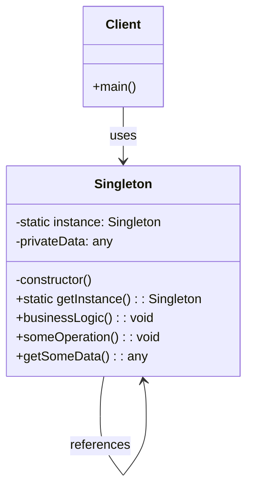

# Singleton Design Pattern (Creational)

## Definition and Intent

The Singleton design pattern is a creational pattern that ensures a class has only one instance and provides a global point of access to that instance. This pattern is particularly useful when exactly one object is needed to coordinate actions across a system.

**Intent**:
- To ensure that a class has only one instance
- To provide a global point of access to that instance
- To control concurrent access to shared resources
- To ensure that certain classes have exactly one instance

The primary motivation for the Singleton pattern is to restrict the instantiation of a class to a single object, which is useful when exactly one object is needed to coordinate actions across the system.

## UML Diagram



## Participants and Their Roles

1. **Singleton Class**
   - Contains a static private instance variable that holds the single instance
   - Has a private constructor to prevent direct instantiation via the `new` operator
   - Provides a static method (typically named `getInstance()`) that returns the single instance
   - May include initialization code that runs only once
   - Contains business logic methods that can be accessed through the singleton instance
   - Handles thread safety if required (in multi-threaded environments)

2. **Client**
   - Accesses the singleton instance exclusively through the `getInstance()` method
   - Uses the singleton's methods to perform operations
   - Never creates the singleton directly (and cannot, due to the private constructor)
   - Multiple clients share the same singleton instance

## Real-world Examples with Code Snippets

### Example 1: Configuration Manager

A configuration manager that maintains application settings is a classic example of a Singleton:

```typescript
class ConfigManager {
  private static instance: ConfigManager;
  private settings: Map<string, any>;

  private constructor() {
    console.log('Initializing ConfigManager');
    // Load settings from storage
    this.settings = new Map();
    this.settings.set('theme', 'light');
    this.settings.set('fontSize', 14);
    this.settings.set('language', 'en');
  }

  public static getInstance(): ConfigManager {
    if (!ConfigManager.instance) {
      ConfigManager.instance = new ConfigManager();
    }
    return ConfigManager.instance;
  }

  public getSetting(key: string): any {
    return this.settings.get(key);
  }

  public setSetting(key: string, value: any): void {
    this.settings.set(key, value);
    // In a real application, this might also save to persistent storage
    console.log(`Setting updated: ${key} = ${value}`);
  }

  public getAllSettings(): Map<string, any> {
    return new Map(this.settings);
  }
}

// Usage example
function configExample(): void {
  // Get the singleton instance
  const config = ConfigManager.getInstance();
  
  // Read a setting
  console.log(`Theme: ${config.getSetting('theme')}`);
  
  // Update a setting
  config.setSetting('theme', 'dark');
  
  // In another part of the application
  const sameConfig = ConfigManager.getInstance();
  console.log(`Theme (from another reference): ${sameConfig.getSetting('theme')}`);
}
```

### Example 2: Database Connection Pool

A database connection pool is another common use case for a Singleton:

```typescript
class DatabaseConnectionPool {
  private static instance: DatabaseConnectionPool;
  private connections: Connection[] = [];
  private maxConnections: number = 10;

  private constructor() {
    console.log('Initializing DatabaseConnectionPool');
    // Initialize the connection pool
    for (let i = 0; i < this.maxConnections; i++) {
      this.connections.push(new Connection(`conn_${i}`));
    }
  }

  public static getInstance(): DatabaseConnectionPool {
    if (!DatabaseConnectionPool.instance) {
      DatabaseConnectionPool.instance = new DatabaseConnectionPool();
    }
    return DatabaseConnectionPool.instance;
  }

  public getConnection(): Connection | null {
    // Find an available connection
    const availableConnection = this.connections.find(conn => !conn.isInUse);
    
    if (availableConnection) {
      availableConnection.isInUse = true;
      return availableConnection;
    }
    
    return null; // No available connections
  }

  public releaseConnection(connection: Connection): void {
    connection.isInUse = false;
    console.log(`Connection ${connection.id} released back to pool`);
  }
}

// Simple Connection class for the example
class Connection {
  public isInUse: boolean = false;

  constructor(public id: string) {}
  
  public query(sql: string): any {
    console.log(`Executing query on connection ${this.id}: ${sql}`);
    // Simulate query execution
    return { result: "Simulated result" };
  }
}

// Usage example
function databaseExample(): void {
  // Get the connection pool
  const pool = DatabaseConnectionPool.getInstance();
  
  // Get a connection
  const connection = pool.getConnection();
  
  if (connection) {
    // Use the connection
    connection.query('SELECT * FROM users');
    
    // Return it to the pool
    pool.releaseConnection(connection);
  }
}
```

## Use Cases and Benefits

### Use Cases:
1. **Resource Management**
   - When managing shared resources like database connections, thread pools, or caches
   - For controlling access to hardware devices (like printers or scanners)

2. **Configuration Management**
   - For storing application settings and configurations
   - When the same configuration needs to be accessible throughout the application

3. **Coordination Points**
   - As a central registry or controller that coordinates system-wide actions
   - For logging services where log entries need to go to a single location

4. **State Management**
   - For managing application state that needs to be consistent across the application
   - As a manager for services that maintain state during the application lifecycle

5. **Factory Provider**
   - When a single factory is needed to produce objects throughout an application
   - For implementing service locators that return registered service instances

### Benefits:
1. **Controlled Access**
   - Provides a single point of access to an instance, making it easier to control
   - Ensures consistent state across all clients using the singleton

2. **Reduced Memory Footprint**
   - Only one instance exists, reducing memory overhead
   - Avoids redundant instantiation of resource-intensive objects

3. **Global Access**
   - Provides a global access point without polluting the global namespace
   - Makes it easier to share data across different parts of an application

4. **Lazy Initialization**
   - Supports on-demand creation of resources, creating the instance only when needed
   - Improves startup performance by deferring initialization

5. **Eliminates Duplicate Objects**
   - Prevents the creation of duplicate instances that could cause inconsistent state
   - Guarantees that all components use the same instance

## Common Implementations and Variations

### 1. Basic Lazy Initialization (Not Thread-Safe)

The simplest form of Singleton uses lazy initialization but is not thread-safe:

```typescript
class SimpleSingleton {
  private static instance: SimpleSingleton;
  
  private constructor() { }
  
  public static getInstance(): SimpleSingleton {
    if (!SimpleSingleton.instance) {
      SimpleSingleton.instance = new SimpleSingleton();
    }
    return SimpleSingleton.instance;
  }
}
```

### 2. Thread-Safe Singleton with Eager Initialization

Creates the instance when the class is loaded, ensuring thread safety:

```typescript
class EagerSingleton {
  private static readonly instance: EagerSingleton = new EagerSingleton();
  
  private constructor() { }
  
  public static getInstance(): EagerSingleton {
    return EagerSingleton.instance;
  }
}
```

### 3. Double-Checked Locking Pattern (Thread-Safe Lazy Initialization)

A more complex pattern that combines lazy initialization with thread safety:

```typescript
class ThreadSafeSingleton {
  private static instance: ThreadSafeSingleton;
  private static lockObj: object = {};
  
  private constructor() { }
  
  public static getInstance(): ThreadSafeSingleton {
    // First check (not thread-safe, but avoids locking in most cases)
    if (!ThreadSafeSingleton.instance) {
      // Conceptual "lock" - actual implementation would be language-specific
      const lock = ThreadSafeSingleton.lockObj;
      
      // Double-check after acquiring the "lock"
      if (!ThreadSafeSingleton.instance) {
        ThreadSafeSingleton.instance = new ThreadSafeSingleton();
      }
    }
    return ThreadSafeSingleton.instance;
  }
}
```

### 4. Module-Based Singleton (ES Modules)

In JavaScript/TypeScript, ES modules provide a natural singleton behavior:

```typescript
// singleton.ts
class DatabaseService {
  // Service implementation
  public query(sql: string): any {
    console.log(`Executing: ${sql}`);
    return { result: [] };
  }
}

// Create and export a single instance
export const database = new DatabaseService();

// Usage in other files:
// import { database } from './singleton';
// database.query('SELECT * FROM users');
```

### 5. Registry of Singletons

A pattern that manages multiple singleton instances:

```typescript
class Registry {
  private static instances: Map<string, any> = new Map();
  
  public static getInstance<T>(key: string, factory: () => T): T {
    if (!Registry.instances.has(key)) {
      Registry.instances.set(key, factory());
    }
    return Registry.instances.get(key) as T;
  }
}

// Usage
class UserService {
  private constructor() { }
  
  public static getInstance(): UserService {
    return Registry.getInstance('UserService', () => new UserService());
  }
}

class ProductService {
  private constructor() { }
  
  public static getInstance(): ProductService {
    return Registry.getInstance('ProductService', () => new ProductService());
  }
}
```

## Anti-Patterns to Avoid

1. **Global State Overuse**
   The Singleton pattern creates a form of global state, which can lead to tight coupling if overused:

   ```typescript
   // Anti-pattern: Using singletons everywhere, creating tight coupling
   class UserManager {
     public processUser(user: User): void {
       // Directly depends on these singletons
       Logger.getInstance().log(`Processing user ${user.id}`);
       Database.getInstance().save(user);
       EmailService.getInstance().sendWelcomeEmail(user.email);
       // Hard to test, hard to change dependencies
     }
   }
   ```

2. **Hard-coded Singleton Dependencies**
   Directly referencing singletons makes code harder to test and maintain:

   ```typescript
   // Anti-pattern: Hard-coded singleton dependency
   class PaymentProcessor {
     public processPayment(payment: Payment): boolean {
       // Direct dependency on a singleton
       const config = ConfigManager.getInstance();
       // Hard to mock for testing
       return true;
     }
   }
   
   // Better approach: Dependency injection
   class PaymentProcessor {
     constructor(private config: ConfigManager) {}
     
     public processPayment(payment: Payment): boolean {
       // Use injected config, easier to mock
       return true;
     }
   }
   ```

3. **Singleton Proliferation**
   Creating too many singletons can lead to a fragmented design:

   ```typescript
   // Anti-pattern: Too many small singletons
   const LoggerSingleton = { /* ... */ };
   const ConfigSingleton = { /* ... */ };
   const DbSingleton = { /* ... */ };
   const CacheSingleton = { /* ... */ };
   const UserStoreSingleton = { /* ... */ };
   const ProductStoreSingleton = { /* ... */ };
   // Application becomes a web of singleton dependencies
   ```

4. **Hidden Singleton Dependencies**
   Not explicitly documenting singleton dependencies creates maintenance problems:

   ```typescript
   // Anti-pattern: Hidden dependencies
   class OrderProcessor {
     public processOrder(order: Order): void {
       // Hidden dependency, not clear from the interface
       const settings = AppSettings.getInstance();
       // Process using settings...
     }
   }
   ```

## Comparison with Other Patterns

### Singleton vs Static Class
- **Singleton**: Uses an instance with state and can implement interfaces, be passed as parameters
- **Static Class**: Just a collection of static members, cannot implement interfaces
- **Key Difference**: Singleton supports object-oriented features like inheritance and polymorphism

### Singleton vs Factory Method
- **Singleton**: Ensures only one instance exists and provides global access to it
- **Factory Method**: Creates objects without specifying exact class, possibly multiple instances
- **Key Difference**: Singleton controls instance count (one), Factory creates new instances

### Singleton vs Monostate
- **Singleton**: One instance, private constructor, static getInstance method
- **Monostate**: Multiple instances sharing static state, public constructor
- **Key Difference**: Singleton restricts instantiation, Monostate allows many instances with shared state

### Singleton vs Dependency Injection
- **Singleton**: Class controls its own instantiation and lifecycle
- **Dependency Injection**: External system controls instantiation and provides dependencies
- **Key Difference**: Singleton is self-managed; Dependency Injection promotes loose coupling

### Singleton vs Multiton
- **Singleton**: Exactly one instance total
- **Multiton**: One instance per key (registry of named instances)
- **Key Difference**: Singleton has one global instance; Multiton has multiple named instances

## Conclusion

The Singleton pattern provides a powerful way to ensure that a class has only one instance while offering a global point of access to that instance. It's particularly valuable for managing shared resources, providing coordination points, and maintaining consistent application state.

When implementing a Singleton, consider the trade-offs between lazy and eager initialization, thread safety requirements, and the level of coupling that the global access point introduces. While the pattern offers benefits like controlled access and reduced memory overhead, be cautious about overusing it, as it can lead to tight coupling and testing difficulties.

For modern applications, consider alternatives like dependency injection when appropriate, which can provide the benefits of shared instances without the drawbacks of global state. If you do use the Singleton pattern, document the singleton dependencies clearly and consider providing mechanisms to replace the singleton implementation for testing purposes.
    Client --> WashingMachine : uses
```