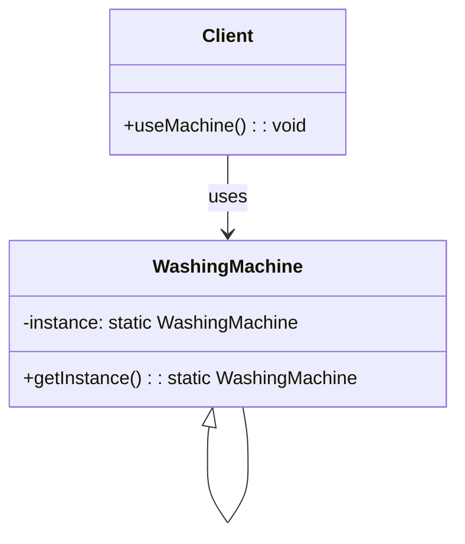

```mermaid
classDiagram
    class WashingMachine {
        -instance: static WashingMachine
        +getInstance(): static WashingMachine
    }
    class Client {
        +useMachine(): void
    }
    WashingMachine <|-- WashingMachine
    Client --> WashingMachine : uses
```