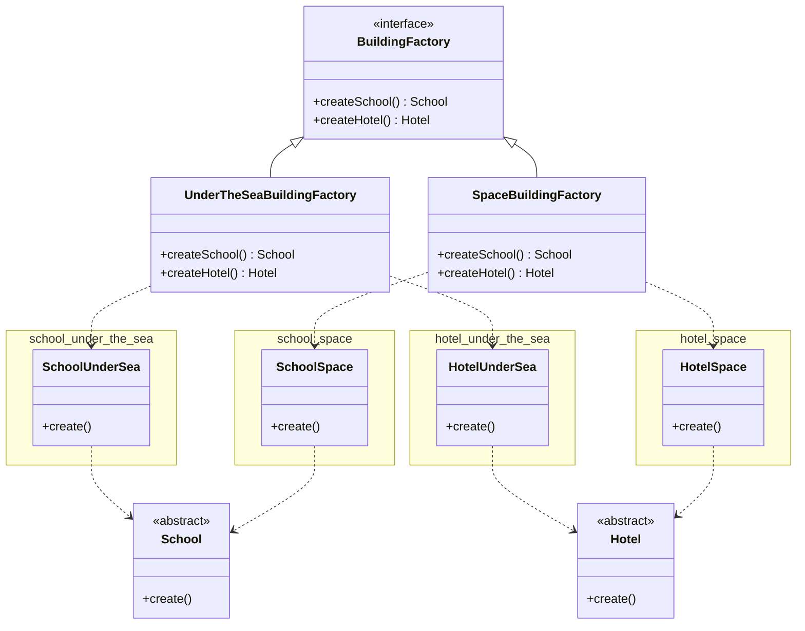

```mermaid
classDiagram
    direction TD

    class School{
        <<abstract>>
        +create()
    }
    class Hotel{
        <<abstract>>
        +create()
    }
   
    namespace school_under_the_sea{
        class SchoolUnderSea{
            +create()
        }
    }
    namespace hotel_under_the_sea{
        class HotelUnderSea{
            +create()
        }
    }
    namespace school_space{
        class SchoolSpace{
            +create()
        }
    }
    namespace hotel_space{
        class HotelSpace{
            +create()
        }
    }
    
    SchoolUnderSea ..> School
    SchoolSpace ..> School
    HotelUnderSea ..> Hotel
    HotelSpace ..> Hotel

    class BuildingFactory{
        <<interface>>
        +createSchool() School
        +createHotel() Hotel
    }
    
    class UnderTheSeaBuildingFactory{
        +createSchool() School
        +createHotel() Hotel
    }
    class SpaceBuildingFactory{
        +createSchool() School
        +createHotel() Hotel
    }
    
    BuildingFactory <|-- UnderTheSeaBuildingFactory
    BuildingFactory <|-- SpaceBuildingFactory
    
    UnderTheSeaBuildingFactory ..> SchoolUnderSea
    UnderTheSeaBuildingFactory ..> HotelUnderSea
    SpaceBuildingFactory ..> SchoolSpace
    SpaceBuildingFactory ..> HotelSpace
```