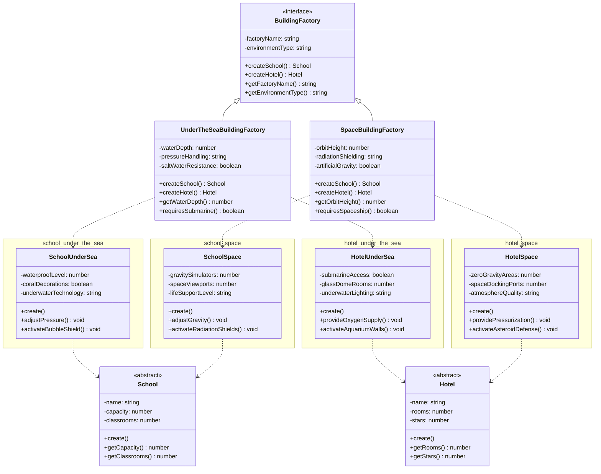

```mermaid
classDiagram
    direction TD

    class School{
        <<abstract>>
        -name: string
        -capacity: number
        -classrooms: number
        +create()
        +getCapacity() number
        +getClassrooms() number
    }
    class Hotel{
        <<abstract>>
        -name: string
        -rooms: number
        -stars: number
        +create()
        +getRooms() number
        +getStars() number
    }
   
    namespace school_under_the_sea{
        class SchoolUnderSea{
            -waterproofLevel: number
            -coralDecorations: boolean
            -underwaterTechnology: string
            +create()
            +adjustPressure() void
            +activateBubbleShield() void
        }
    }
    namespace hotel_under_the_sea{
        class HotelUnderSea{
            -submarineAccess: boolean
            -glassDomeRooms: number
            -underwaterLighting: string
            +create()
            +provideOxygenSupply() void
            +activateAquariumWalls() void
        }
    }
    namespace school_space{
        class SchoolSpace{
            -gravitySimulators: number
            -spaceViewports: number
            -lifeSupportLevel: string
            +create()
            +adjustGravity() void
            +activateRadiationShields() void
        }
    }
    namespace hotel_space{
        class HotelSpace{
            -zeroGravityAreas: number
            -spaceDockingPorts: number
            -atmosphereQuality: string
            +create()
            +providePressurization() void
            +activateAsteroidDefense() void
        }
    }
    
    SchoolUnderSea ..> School
    SchoolSpace ..> School
    HotelUnderSea ..> Hotel
    HotelSpace ..> Hotel

    class BuildingFactory{
        <<interface>>
        -factoryName: string
        -environmentType: string
        +createSchool() School
        +createHotel() Hotel
        +getFactoryName() string
        +getEnvironmentType() string
    }
    
    class UnderTheSeaBuildingFactory{
        -waterDepth: number
        -pressureHandling: string
        -saltWaterResistance: boolean
        +createSchool() School
        +createHotel() Hotel
        +getWaterDepth() number
        +requiresSubmarine() boolean
    }
    class SpaceBuildingFactory{
        -orbitHeight: number
        -radiationShielding: string
        -artificialGravity: boolean
        +createSchool() School
        +createHotel() Hotel
        +getOrbitHeight() number
        +requiresSpaceship() boolean
    }
    
    BuildingFactory <|-- UnderTheSeaBuildingFactory
    BuildingFactory <|-- SpaceBuildingFactory
    
    UnderTheSeaBuildingFactory ..> SchoolUnderSea
    UnderTheSeaBuildingFactory ..> HotelUnderSea
    SpaceBuildingFactory ..> SchoolSpace
    SpaceBuildingFactory ..> HotelSpace
```