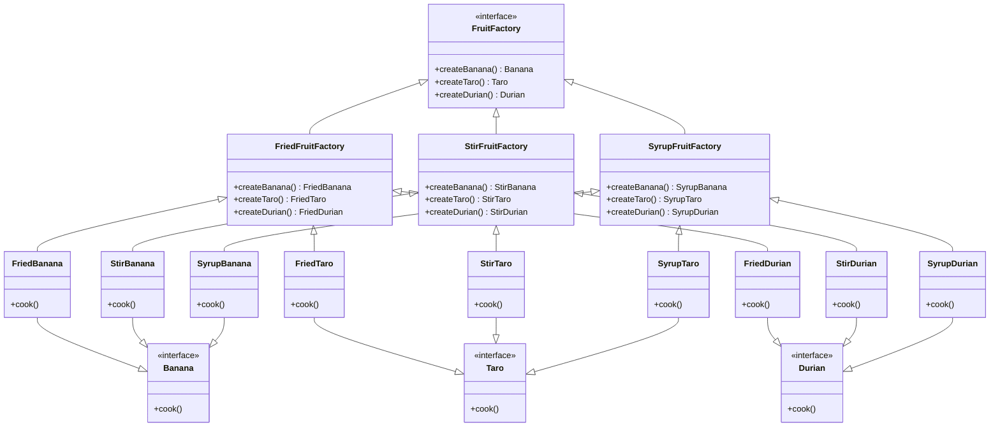

|          |        |      |        |
| -------- | ------ | ---- | ------ |
|          | banane | taro | durian |
| fry      |        |      |        |
| stir     |        |      |        |
| in-syrup |        |      |        |

#

