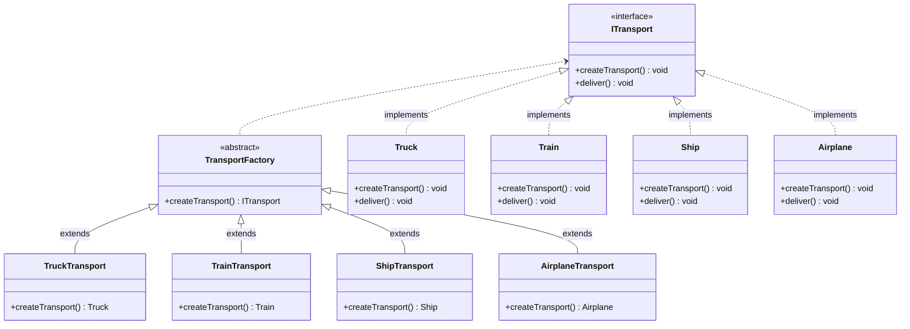

## Transportation Factory Method

```mermaid
classDiagram 
    ITransport <.. TransportFactory
    ITransport <|.. Truck:implements
    ITransport <|.. Train:implements
    ITransport <|.. Ship:implements
    ITransport <|.. Airplane:implements
    TransportFactory <|-- TruckTransport:extends
    TransportFactory <|-- TrainTransport:extends
    TransportFactory <|-- ShipTransport:extends
    TransportFactory <|-- AirplaneTransport:extends
    class ITransport {
        <<interface>>
        +createTransport() void
        +deliver() void
    }
    class Truck{
        +createTransport() void
        +deliver() void
    }
    class Train{
        +createTransport() void
        +deliver() void
    }
    class Ship{
        +createTransport() void
        +deliver() void
    }
    class Airplane{
        +createTransport() void
        +deliver() void
    }
    class TransportFactory {
        <<abstract>>
        +createTransport() ITransport
    }
    class TruckTransport{
        +createTransport() Truck
    }
    class TrainTransport{
        +createTransport() Train
    }
    class ShipTransport{
        +createTransport() Ship
    }
    class AirplaneTransport{
        +createTransport() Airplane
    }
```