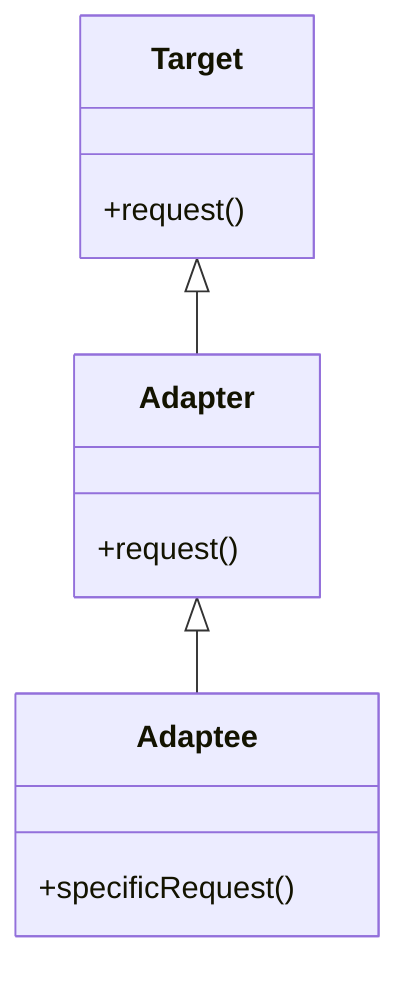
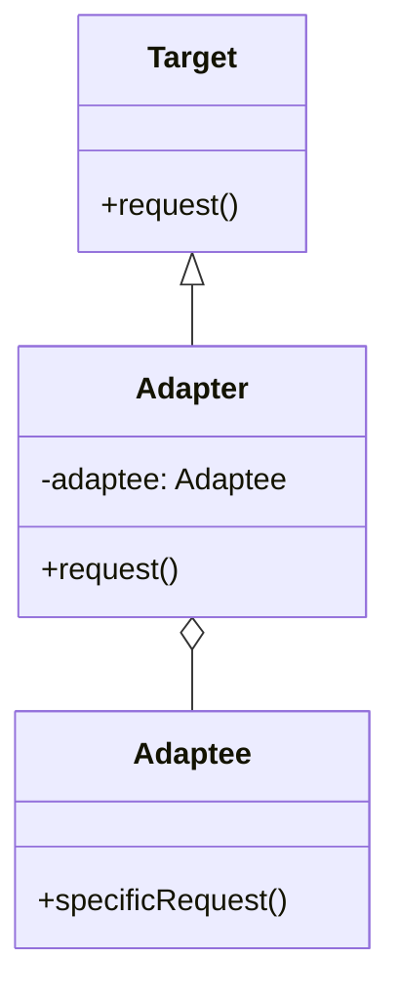
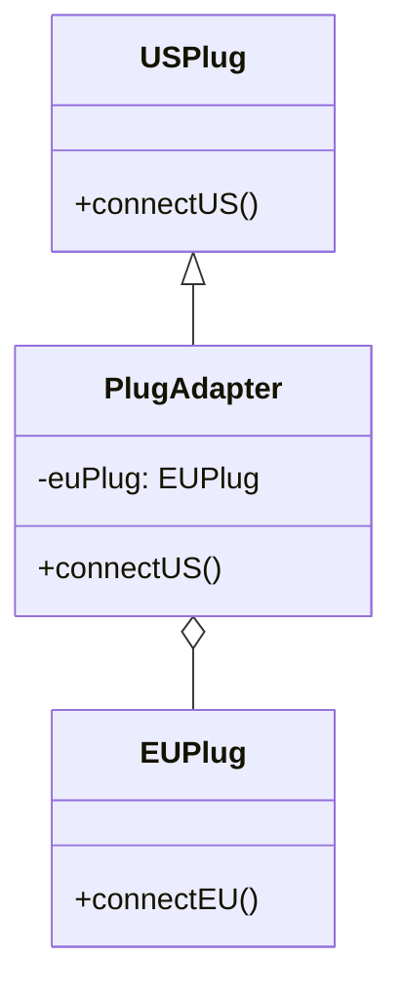
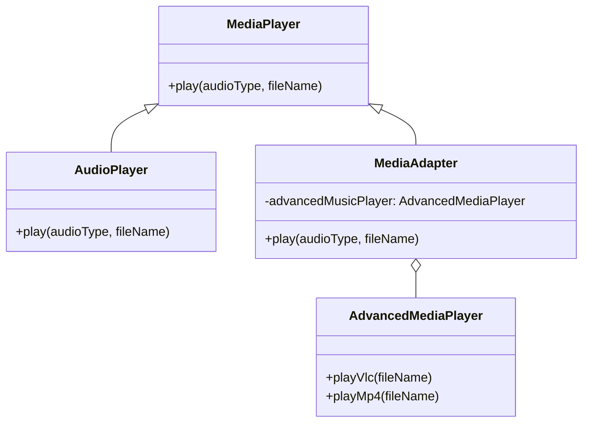

# Adapter Design Pattern - Mermaid Diagram Samples

Below are 4 different samples of the Adapter Design Pattern using Mermaid diagrams.

---

## Sample 1: Basic Adapter Structure (Class Adapter)



---

## Sample 2: Object Adapter



---

## Sample 3: Power Plug Adapter Example



---

## Sample 4: Media Player Adapter Example


```mermaid
classDiagram
    direction TD
    class Box{
        -width: int
        -height: int
        -length: int
        +Box(int width, int height, int length)
        +getCC(): int
        +canContain(Water) int
    }
    Box <|-- Water
    class Water{
        <<interface>>
        +getCC(): int
    }
   Water <|.. GlassAdapter
   Water <|.. BottleAdapter
   Glass <|-- GlassAdapter
   Bottle <|-- BottleAdapter

   namespace Adapters {
       class GlassAdapter{
            -adaptee Glass
            +GlassAdapter(adaptee)
            +getCC() int
        }
        class BottleAdapter{
            -adaptee Bottle
            +BottleAdapter(adaptee)
            +getCC() int
        }
    }
    namespace Adaptees {
        class Glass{
            -ounce int
            +Glass(ounce)
            +getOunce() int
        }
        class Bottle{
            -liter int
            +Bottle(liter)
            +getLiter() int
        }
    }