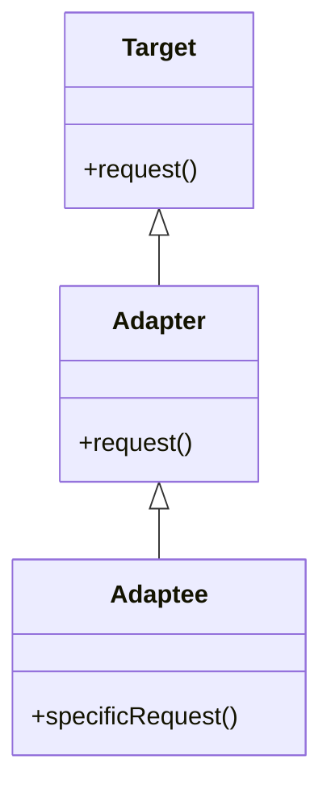
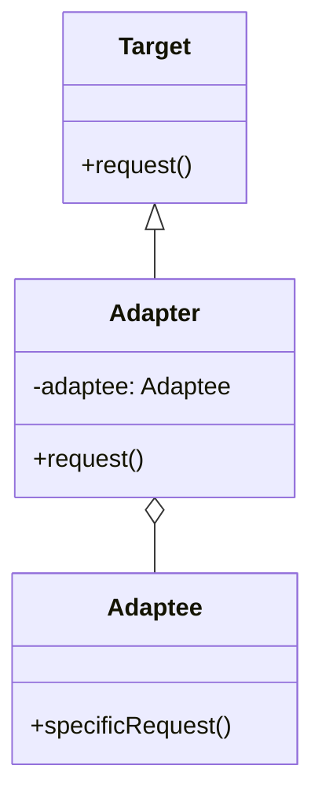
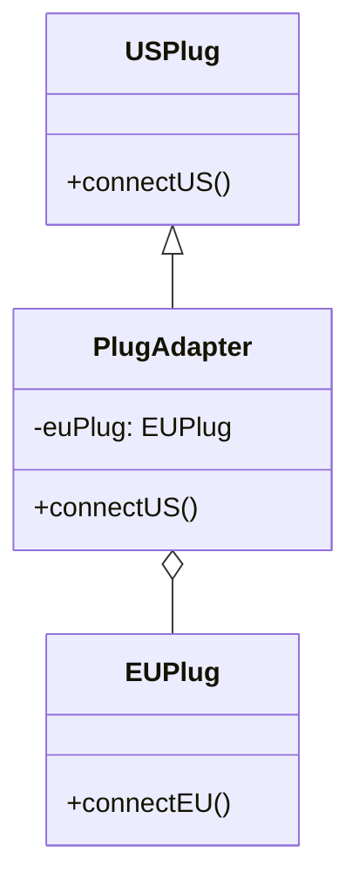
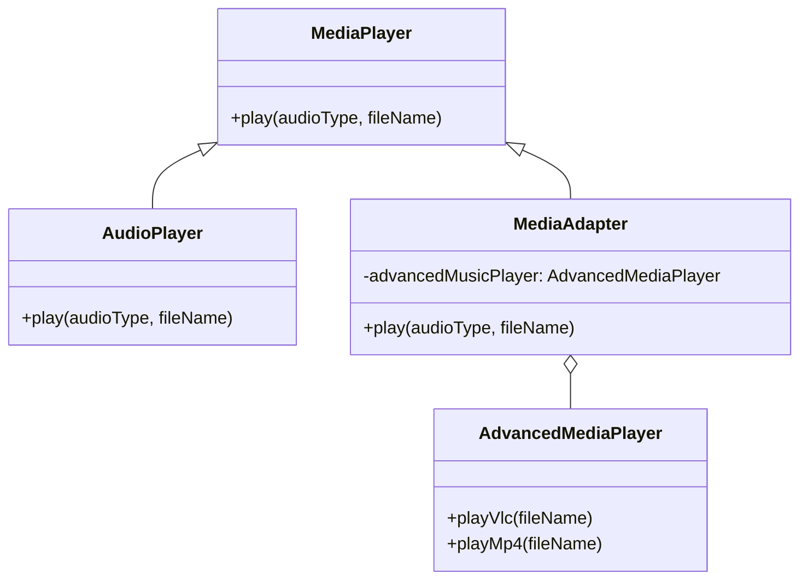
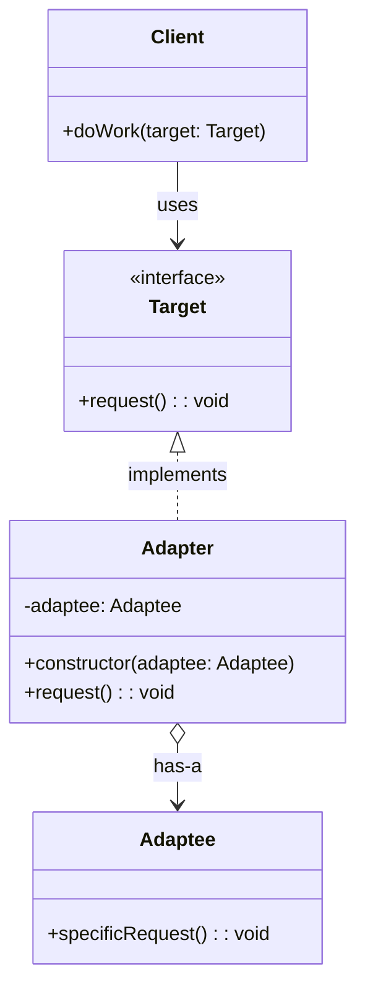
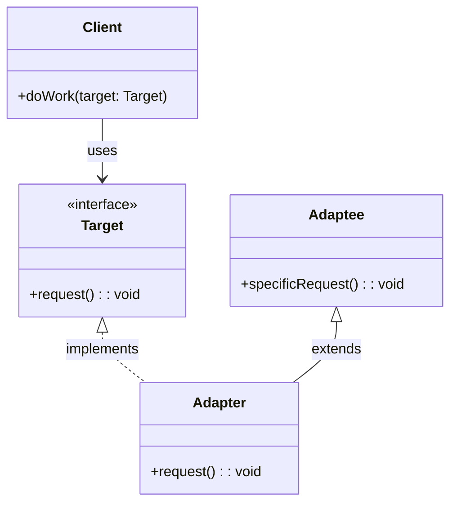

<<<<<<< HEAD
# Adapter Design Pattern - Mermaid Diagram Samples

Below are 4 different samples of the Adapter Design Pattern using Mermaid diagrams.

---

## Sample 1: Basic Adapter Structure (Class Adapter)



---

## Sample 2: Object Adapter



---

## Sample 3: Power Plug Adapter Example



---

## Sample 4: Media Player Adapter Example


=======
# Adapter Design Pattern (Structural)

## Definition and Intent

The Adapter pattern is a structural design pattern that allows objects with incompatible interfaces to work together. It acts as a bridge between two incompatible interfaces by wrapping an instance of one class into an adapter class that presents the expected interface to the client.

**Intent**:
- To convert the interface of a class into another interface clients expect
- To allow classes with incompatible interfaces to work together
- To provide a unified interface to a set of interfaces in a subsystem
- To wrap an existing class with a new interface

The Adapter pattern enables the collaboration between objects that couldn't otherwise work together due to incompatible interfaces, essentially acting as a translator between them.

## UML Diagram

>>>>>>> AI


### Class Adapter (Using Inheritance)



## Participants and Their Roles

1. **Client**
   - Works with objects that implement the Target interface
   - Collaborates with objects conforming to the Target interface
   - Unaware of the adapter's existence - it calls methods on the Target interface without knowing it's dealing with an adapter

2. **Target (Interface)**
   - Defines the domain-specific interface that the Client uses
   - Declares methods that the Client expects and invokes
   - This is often an abstract class or interface

3. **Adapter**
   - Implements the Target interface that the Client expects to see
   - Maintains a reference to the Adaptee instance (object adapter)
   - Translates calls from the Target interface to the Adaptee interface
   - Handles any necessary data formatting or conversion
   - In the class adapter variant, it inherits from both the Target and Adaptee

4. **Adaptee**
   - Defines an existing interface that needs adapting
   - Contains useful functionality, but its interface is incompatible with the existing client code
   - The class that requires adaptation to work with the client

## Real-world Examples with Code Snippets

### Example 1: Payment Gateway Adapter

This example shows how different payment gateways with incompatible interfaces can be unified behind a common interface:

```typescript
// Target interface that our application expects
interface PaymentProcessor {
  processPayment(amount: number, currency: string): boolean;
}

// First Adaptee: Stripe payment service with a different interface
class StripePaymentService {
  charge(options: { amount: number, currency: string, source: string }): { success: boolean } {
    console.log(`Stripe charging ${options.amount} ${options.currency}`);
    // Call to Stripe API would go here
    return { success: true };
  }
}

// Second Adaptee: PayPal with another interface
class PayPalService {
  makePayment(sum: number, currencyCode: string, accountId: string): { status: string } {
    console.log(`PayPal payment of ${sum} ${currencyCode}`);
    // Call to PayPal API would go here
    return { status: 'COMPLETED' };
  }
}

// Adapter for Stripe
class StripeAdapter implements PaymentProcessor {
  private stripeService: StripePaymentService;
  private sourceToken: string;

  constructor(stripeService: StripePaymentService, sourceToken: string) {
    this.stripeService = stripeService;
    this.sourceToken = sourceToken;
  }

  processPayment(amount: number, currency: string): boolean {
    const result = this.stripeService.charge({
      amount,
      currency,
      source: this.sourceToken
    });
    
    return result.success;
  }
}

// Adapter for PayPal
class PayPalAdapter implements PaymentProcessor {
  private paypalService: PayPalService;
  private accountId: string;

  constructor(paypalService: PayPalService, accountId: string) {
    this.paypalService = paypalService;
    this.accountId = accountId;
  }

  processPayment(amount: number, currency: string): boolean {
    const result = this.paypalService.makePayment(amount, currency, this.accountId);
    return result.status === 'COMPLETED';
  }
}

// Client code uses a unified interface
function processOrder(processor: PaymentProcessor, amount: number, currency: string): void {
  const success = processor.processPayment(amount, currency);
  console.log(`Payment ${success ? 'approved' : 'declined'}`);
}

// Using the adapters
const stripeService = new StripePaymentService();
const stripeAdapter = new StripeAdapter(stripeService, 'tok_visa_12345');
processOrder(stripeAdapter, 99.99, 'USD');

const paypalService = new PayPalService();
const paypalAdapter = new PayPalAdapter(paypalService, 'customer@example.com');
processOrder(paypalAdapter, 49.99, 'EUR');
```

### Example 2: Legacy Data Format Adapter

An adapter can also be used to convert between different data formats:

```typescript
// Target interface for modern system
interface DataProvider {
  getData(): Record<string, any>;
}

// Adaptee: Legacy system that provides XML
class LegacyXmlSystem {
  getXmlData(): string {
    return '<data><item id="1">Value 1</item><item id="2">Value 2</item></data>';
  }
}

// Adapter to convert XML to JSON
class XmlToJsonAdapter implements DataProvider {
  private legacySystem: LegacyXmlSystem;

  constructor(legacySystem: LegacyXmlSystem) {
    this.legacySystem = legacySystem;
  }

  getData(): Record<string, any> {
    const xmlData = this.legacySystem.getXmlData();
    // In a real application, use a proper XML parser
    // This is a simplified conversion for the example
    return {
      data: {
        items: [
          { id: 1, value: 'Value 1' },
          { id: 2, value: 'Value 2' }
        ]
      }
    };
  }
}

// Client expects JSON data
function displayData(provider: DataProvider): void {
  const data = provider.getData();
  console.log('Displaying data:');
  console.log(JSON.stringify(data, null, 2));
}

// Using the adapter
const legacySystem = new LegacyXmlSystem();
const adapter = new XmlToJsonAdapter(legacySystem);
displayData(adapter);
```

## Use Cases and Benefits

### Use Cases:
1. **Integrating Legacy Code**
   - When you need to use an existing class but its interface doesn't match what you need
   - For integrating legacy systems with modern code without modifying the legacy codebase

2. **Third-party Library Integration**
   - When you need to integrate a third-party library but can't modify its code
   - To shield your code from changes in external libraries by creating custom adapters

3. **Multiple Implementations**
   - When you need to support multiple backend services with similar functionality but different interfaces
   - For example, supporting multiple payment gateways, storage providers, or authentication services

4. **API Versioning**
   - When you need to maintain backward compatibility with older versions of your API
   - To create adapters for older client code to work with newer interfaces

5. **Data Format Conversion**
   - When systems need to exchange data in different formats (XML, JSON, CSV, etc.)
   - For transforming data between incompatible formats

### Benefits:
1. **Enhanced Reusability**
   - Makes it possible to reuse existing classes with incompatible interfaces
   - Allows the reuse of legacy code in modern applications

2. **Increased Flexibility**
   - Enables working with multiple classes without changing their code
   - Makes it easier to swap implementations or add new ones

3. **Separation of Concerns**
   - The adapter handles interface translation separately from business logic
   - Core code doesn't need to worry about interface incompatibilities

4. **Open/Closed Principle**
   - Follows the open/closed principle by allowing new adapters to be added without modifying existing code
   - Extends system functionality without changing the client or adaptee code

5. **Simplified Client Code**
   - Clients work with a single interface, simplifying their implementation
   - Reduces conditional code in the client based on service types

## Common Implementations and Variations

### 1. Object Adapter (Composition)

The most common implementation uses composition to adapt one interface to another:

```typescript
class ObjectAdapter implements Target {
  private adaptee: Adaptee;

  constructor(adaptee: Adaptee) {
    this.adaptee = adaptee;
  }

  request(): void {
    // Convert the call to the adaptee's interface
    this.adaptee.specificRequest();
  }
}
```

### 2. Class Adapter (Inheritance)

Uses multiple inheritance (where available) or interface implementation plus inheritance:

```typescript
// In languages supporting multiple inheritance
class ClassAdapter extends Adaptee implements Target {
  request(): void {
    // Use inherited methods from Adaptee
    this.specificRequest();
  }
}
```

### 3. Two-Way Adapter

Adapters that can translate in both directions, making two incompatible classes work with each other:

```typescript
class TwoWayAdapter implements InterfaceA, InterfaceB {
  private a: ClassA;
  private b: ClassB;

  constructor(a: ClassA, b: ClassB) {
    this.a = a;
    this.b = b;
  }

  // InterfaceA methods
  methodA(): void {
    this.b.methodB();
  }

  // InterfaceB methods
  methodB(): void {
    this.a.methodA();
  }
}
```

### 4. Default Adapter (Null Object Pattern)

Provides default implementations for all interface methods, allowing subclasses to override only what they need:

```typescript
interface ComplexInterface {
  method1(): void;
  method2(): void;
  method3(): void;
  method4(): void;
}

// Default adapter implements all methods with empty bodies
class DefaultAdapter implements ComplexInterface {
  method1(): void {}
  method2(): void {}
  method3(): void {}
  method4(): void {}
}

// Concrete adapter only needs to override methods it cares about
class ConcreteAdapter extends DefaultAdapter {
  method2(): void {
    console.log("Only implementing method2");
  }
}
```

### 5. Pluggable Adapter

An adapter that dynamically determines how to adapt at runtime:

```typescript
class PluggableAdapter implements Target {
  private adaptee: any;
  private methodMap: Map<string, string>;

  constructor(adaptee: any, methodMap: Map<string, string>) {
    this.adaptee = adaptee;
    this.methodMap = methodMap;
  }

  request(): void {
    const adapteeMethod = this.methodMap.get('request');
    if (adapteeMethod && typeof this.adaptee[adapteeMethod] === 'function') {
      this.adaptee[adapteeMethod]();
    }
  }
}

// Usage
const adaptee = new SomeClass();
const adapter = new PluggableAdapter(adaptee, new Map([
  ['request', 'someMethod']
]));
```

## Anti-Patterns to Avoid

1. **Excessive Adaptation**
   When adapters are overused, leading to a complex network of adapter classes:

   ```typescript
   // Anti-pattern: Adapter Chain
   const adaptee = new LegacySystem();
   const adapter1 = new LegacyToModernAdapter(adaptee);
   const adapter2 = new ModernToNewerAdapter(adapter1);
   const adapter3 = new NewerToLatestAdapter(adapter2);
   // Too many layers of adaptation
   ```

2. **Fat Adapter**
   When an adapter does more than just interface translation, taking on business logic responsibilities:

   ```typescript
   // Anti-pattern: Adapter with business logic
   class PaymentAdapter implements PaymentProcessor {
     private paymentService: ThirdPartyPayment;
     
     processPayment(amount: number): boolean {
       // Simple adaptation is fine
       const result = this.paymentService.makePayment(amount);
       
       // But this business logic belongs elsewhere
       if (result.status === 'success') {
         this.updateInventory();
         this.sendConfirmationEmail();
         this.updateAccountingSystem();
       }
       
       return result.status === 'success';
     }
   }
   ```

3. **Over-adaptation**
   Adapting interfaces that are already compatible or could be made compatible more simply:

   ```typescript
   // Anti-pattern: Unnecessary adapter
   interface Target {
     process(data: string): void;
   }
   
   class Service {
     // Already has compatible interface
     process(data: string): void {
       console.log(`Processing: ${data}`);
     }
   }
   
   // Unnecessary adapter
   class ServiceAdapter implements Target {
     private service: Service;
     
     constructor(service: Service) {
       this.service = service;
     }
     
     process(data: string): void {
       this.service.process(data); // Just passing through
     }
   }
   ```

4. **Concealing Poor Design**
   Using adapters to mask fundamental design problems:

   ```typescript
   // Anti-pattern: Masking poor design with adapters
   class PoorlyDesignedClass {
     // Inconsistent, messy API
     doThingOne(a: number, b: number, c: boolean): void {}
     performSecondOperation(x: string[], y: Map<string, any>): void {}
     execute_third_function(config: object): void {}
   }
   
   // Instead of fixing the core design, plastering over with an adapter
   class ConsistencyAdapter {
     // ...adapter implementation...
   }
   ```

## Comparison with Other Patterns

### Adapter vs Facade
- **Adapter**: Makes incompatible interfaces work together by wrapping an existing interface
- **Facade**: Simplifies a complex subsystem by providing a simpler interface
- **Key Difference**: Adapter changes an interface to match what client expects; Facade creates a new, simpler interface for a subsystem

### Adapter vs Bridge
- **Adapter**: Focuses on making incompatible interfaces compatible
- **Bridge**: Separates an abstraction from its implementation to allow them to vary independently
- **Key Difference**: Adapter works with existing interfaces, often retrofitting; Bridge is designed upfront for flexibility

### Adapter vs Decorator
- **Adapter**: Changes the interface of an object
- **Decorator**: Enhances an object without changing its interface
- **Key Difference**: Adapter focuses on interface translation; Decorator focuses on adding behavior

### Adapter vs Proxy
- **Adapter**: Provides a different interface to the wrapped object
- **Proxy**: Provides the same interface as the wrapped object
- **Key Difference**: Adapter changes the interface; Proxy keeps the same interface but controls access

### Adapter vs Strategy
- **Adapter**: Makes existing classes work with others without modifying them
- **Strategy**: Defines a family of algorithms, encapsulates each one, and makes them interchangeable
- **Key Difference**: Adapter focuses on compatibility; Strategy focuses on behavior selection

## Conclusion

The Adapter pattern is a powerful tool for integrating components with incompatible interfaces. It acts as a translator or bridge, enabling collaboration between objects that wouldn't otherwise work together. This pattern is particularly valuable in systems that evolve over time or that need to integrate with external libraries and services.

When implementing an Adapter pattern, consider whether the Object Adapter (composition) or Class Adapter (inheritance) approach is more appropriate for your specific situation. The Object Adapter is generally more flexible and promotes composition over inheritance, while the Class Adapter can sometimes be more compact.

Be cautious of overusing adapters, as a proliferation of adapter classes can indicate underlying architectural issues. When possible, consider if the interfaces could be designed to be compatible from the start, potentially eliminating the need for adapters altogether.

In modern software development, the Adapter pattern remains essential for integrating disparate systems, maintaining backward compatibility, and creating flexible, modular architectures that can evolve over time.
    }
    Box <|-- Water
    class Water{
        <<interface>>
        +getCC(): int
    }
   Water <|.. GlassAdapter
   Water <|.. BottleAdapter
   Glass <|-- GlassAdapter
   Bottle <|-- BottleAdapter

   namespace Adapters {
       class GlassAdapter{
            -adaptee Glass
            +GlassAdapter(adaptee)
            +getCC() int
        }
        class BottleAdapter{
            -adaptee Bottle
            +BottleAdapter(adaptee)
            +getCC() int
        }
    }
    namespace Adaptees {
        class Glass{
            -ounce int
            +Glass(ounce)
            +getOunce() int
        }
        class Bottle{
            -liter int
            +Bottle(liter)
            +getLiter() int
        }
    }