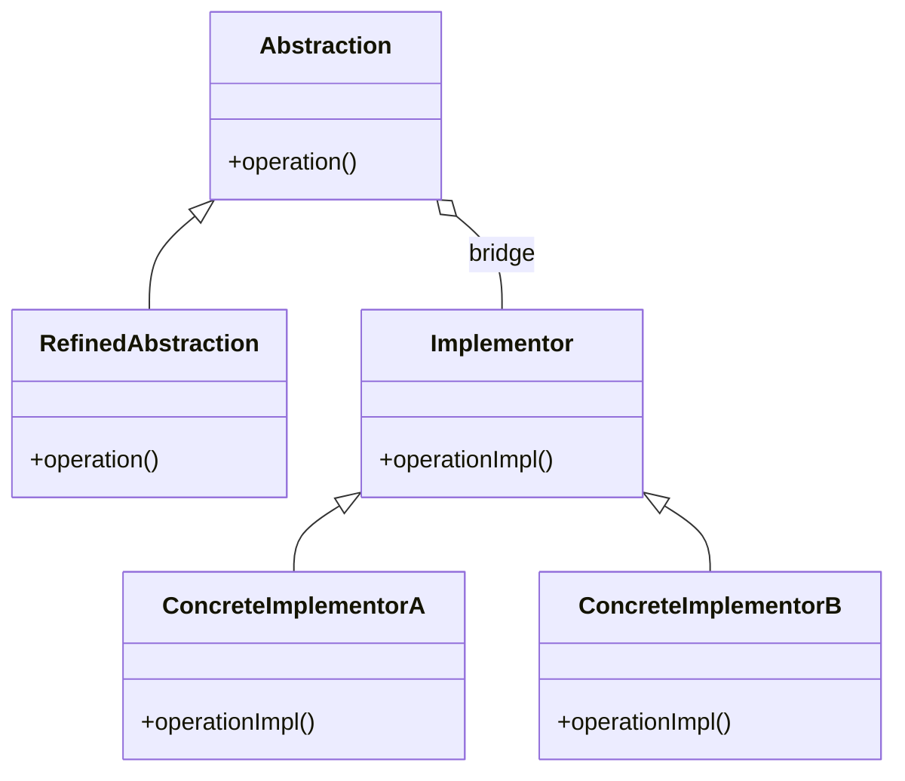
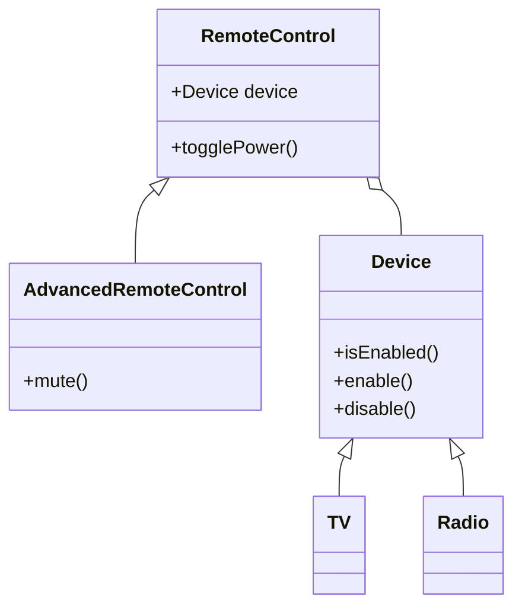
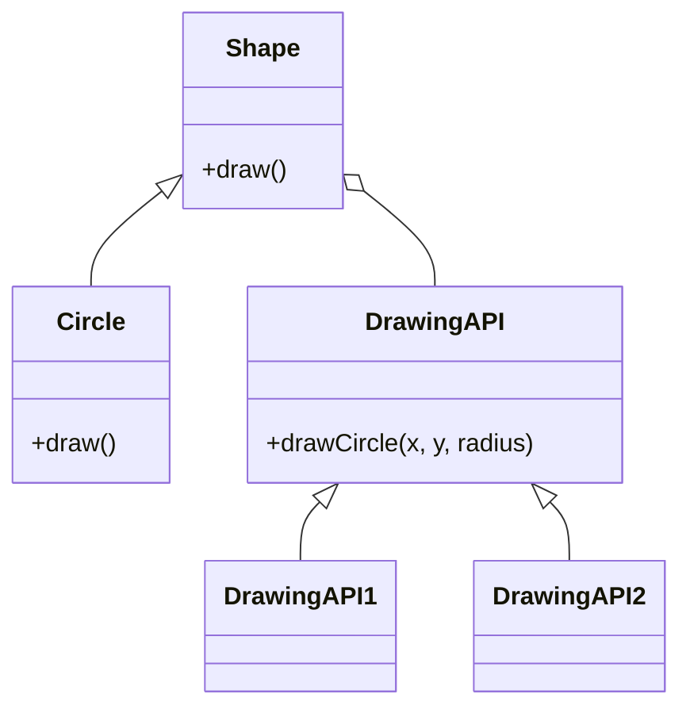
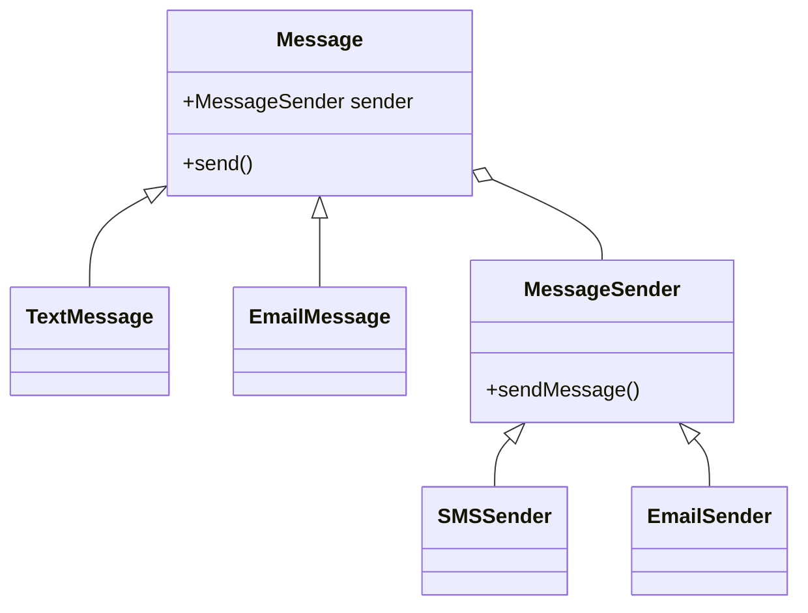

# Bridge Design Pattern - Mermaid Diagram Samples

Below are 4 different samples of the Bridge Design Pattern using Mermaid diagrams.

---

## Sample 1: Basic Bridge Structure



---

## Sample 2: Remote Control and Devices



---

## Sample 3: Shape and Drawing API



---

## Sample 4: Message and MessageSender


# Bridge Design Pattern

## Intent
Bridge is a structural design pattern that lets you split a large class or a set of closely related classes into two separate hierarchies—abstraction and implementation—which can be developed independently of each other.

## Problem
Imagine you have a geometric Shape class with a pair of subclasses: Circle and Square. You want to extend this class hierarchy to incorporate colors, so you plan to create Red and Blue shape subclasses. However, since you already have two subclasses, you'd need to create four class combinations: RedCircle, RedSquare, BlueCircle, and BlueSquare.

Adding new shape types and colors to the hierarchy will cause a combinatorial explosion of subclasses. For instance, to add a Triangle shape and a Yellow color, you'd need to introduce five new classes: Triangle, RedTriangle, BlueTriangle, YellowCircle, YellowSquare, and YellowTriangle.

## Solution
The Bridge pattern addresses this problem by switching from inheritance to composition. It extracts one of the dimensions into a separate class hierarchy, so that the original classes will reference an object of the new hierarchy, instead of having all its state and behaviors within one class.

Following this approach, we can extract the color-related code into its own class with subclasses representing different colors. The original Shape class then gets a reference field pointing to a color object. Now the shape can delegate any color-related work to the linked color object.

## Structure


- **Abstraction**: Defines the interface for the "control" part of the two class hierarchies. It maintains a reference to an object of the Implementation hierarchy and delegates all of the real work to this object.

- **Refined Abstraction**: Extends the interface defined by Abstraction.

- **Implementation**: Defines the interface for all implementation classes. It doesn't have to match the Abstraction interface. In fact, the two interfaces can be entirely different. Typically the Implementation interface provides only primitive operations, while the Abstraction defines higher-level operations based on those primitives.

- **Concrete Implementation**: Contains platform-specific code.

## Participants

- **Abstraction (e.g., Device, Remote Control, Shape)** 
  - Defines the abstract interface
  - Maintains reference to an Implementation object

- **RefinedAbstraction (e.g., Advanced Remote Control, Circle, Square)**
  - Extends the interface defined by Abstraction
  - Implements higher-level operations based on primitives defined by Implementation

- **Implementation (e.g., Device Interface, Renderer Interface)** 
  - Defines the interface for implementation classes
  - This interface doesn't have to correspond to the Abstraction's interface

- **ConcreteImplementation (e.g., TV, Radio, VectorRenderer, RasterRenderer)**
  - Implements the Implementation interface and defines concrete implementation

## When to Use

Use the Bridge pattern when:

1. You want to avoid a permanent binding between an abstraction and its implementation. For example, when the implementation must be selected or switched at run-time.

2. Both the abstractions and their implementations should be extensible by subclassing. In this case, the Bridge pattern lets you combine the different abstractions and implementations and extend them independently.

3. Changes in the implementation of an abstraction should have no impact on clients; that is, their code should not have to be recompiled.

4. You have a proliferation of classes. Such a class hierarchy indicates the need for splitting an object into two parts.

5. You want to share an implementation among multiple objects, and this fact should be hidden from the client.

## Advantages

1. **Decoupling interface and implementation**: The pattern decouples an abstraction from its implementation so that the two can vary independently.

2. **Improved extensibility**: You can extend the Abstraction and Implementation hierarchies independently.

3. **Hiding implementation details from clients**: Clients only see the Abstraction, so you can change the Implementation without affecting them.

## Disadvantages

1. **Increased complexity**: The pattern introduces a certain level of complexity to the code.

2. **May be overkill for simple applications**: If your application doesn't need flexibility in changing implementations, using the Bridge pattern might be unnecessary.

## Related Patterns

- **Abstract Factory** can create and configure a particular Bridge.
- **Adapter** is geared toward making unrelated classes work together. It is usually applied after the system is designed. Bridge, on the other hand, is used up-front in a design to let abstractions and implementations vary independently.

## Real-World Examples

1. **Device-Remote Control**: 
   - Abstraction: Remote Control
   - Refined Abstraction: Advanced Remote Control
   - Implementation: Device Interface
   - Concrete Implementations: TV, Radio

2. **Shape-Rendering**:
   - Abstraction: Graphic
   - Refined Abstraction: CircleShape, SquareShape, TriangleShape
   - Implementation: GraphicsRenderer Interface
   - Concrete Implementations: VectorRenderer, RasterRenderer

## Implementation in TypeScript

See the [Bridge.ts](../../code/Structural/Bridge.ts) implementation file for a complete example in TypeScript.

### Basic Structure:

```typescript
// Implementation Interface
interface Implementation {
  operationImpl(): string;
}

// Concrete Implementations
class ConcreteImplementationA implements Implementation {
  operationImpl(): string {
    return 'ConcreteImplementationA: Implementation result';
  }
}

// Abstraction
abstract class Abstraction {
  protected implementation: Implementation;

  constructor(implementation: Implementation) {
    this.implementation = implementation;
  }

  public operation(): string {
    const result = this.implementation.operationImpl();
    return `Abstraction: Base operation with:\n${result}`;
  }
}
```

## Comparison with Other Patterns

### Bridge vs. Adapter

- **Bridge** is designed up-front to let abstractions and implementations vary independently.
- **Adapter** makes unrelated classes work together after they're designed.

### Bridge vs. Strategy

- **Bridge** separates an abstraction from its implementation.
- **Strategy** usually focuses on changing the guts of a single object.

### Bridge vs. Abstract Factory

- **Bridge** can use the Abstract Factory to create and configure a bridge at runtime.
- **Abstract Factory** creates families of related objects without specifying their concrete classes.

## References

- Design Patterns: Elements of Reusable Object-Oriented Software by Gamma, Helm, Johnson, Vlissides (GoF)
- Head First Design Patterns by Eric Freeman, Elisabeth Robson, Bert Bates, Kathy Sierra
>>>>>>> AI
