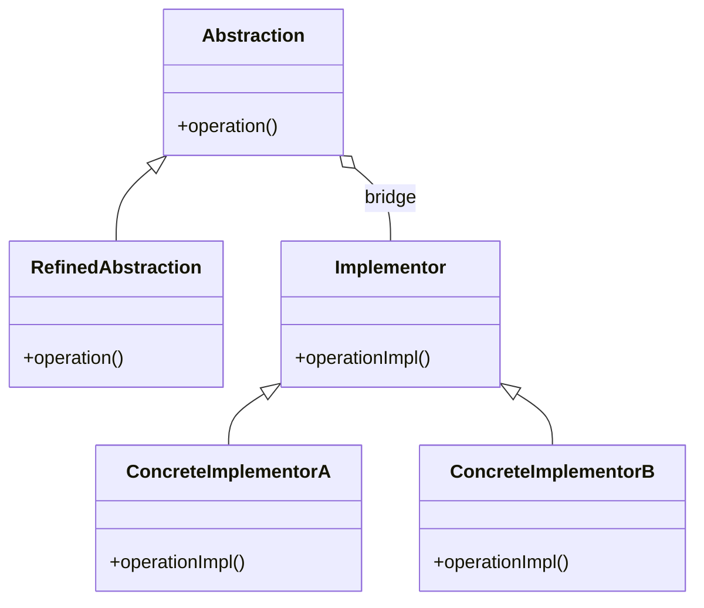
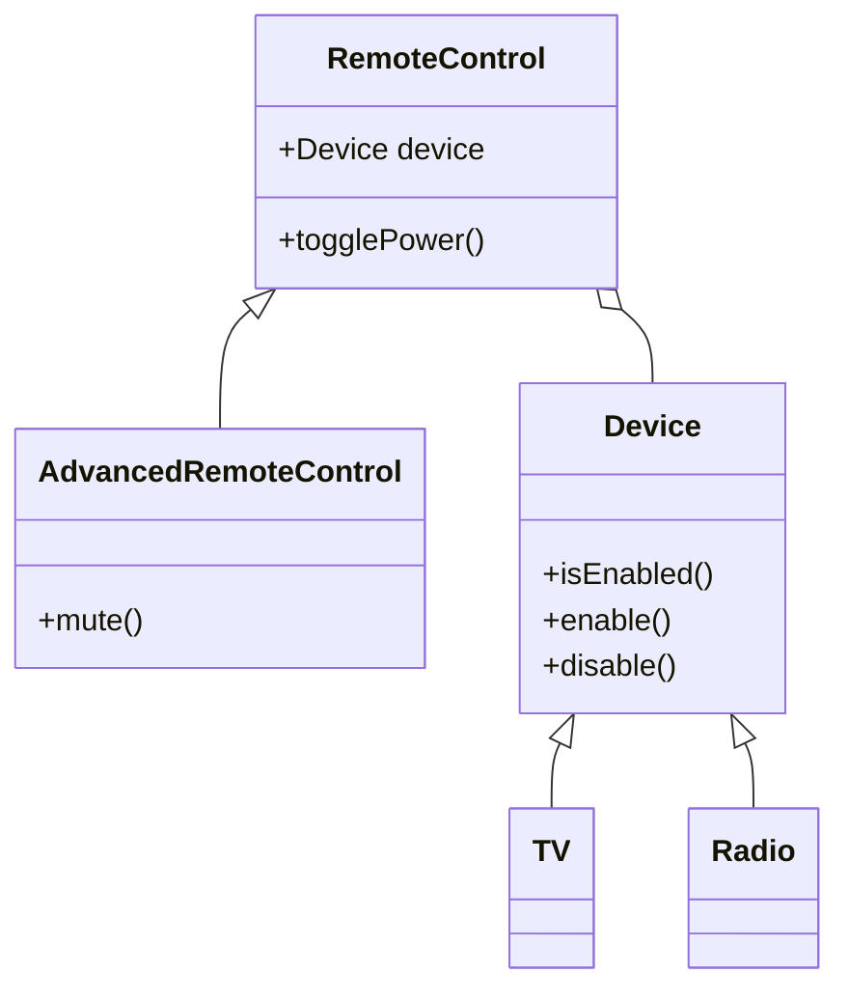
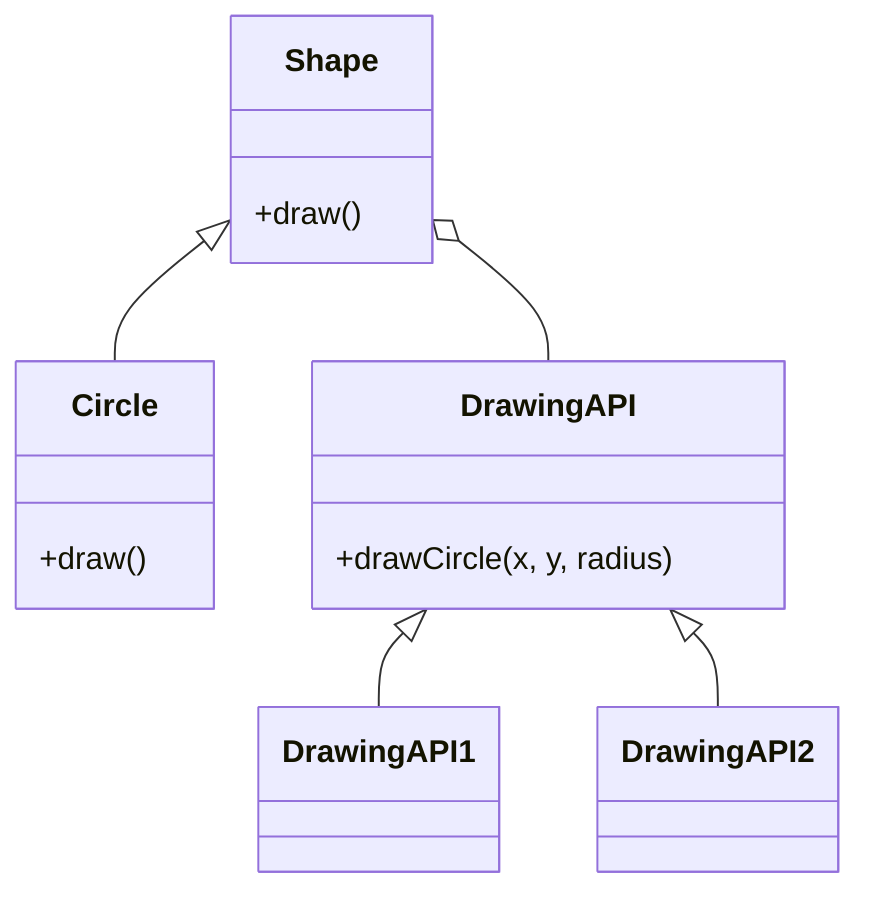
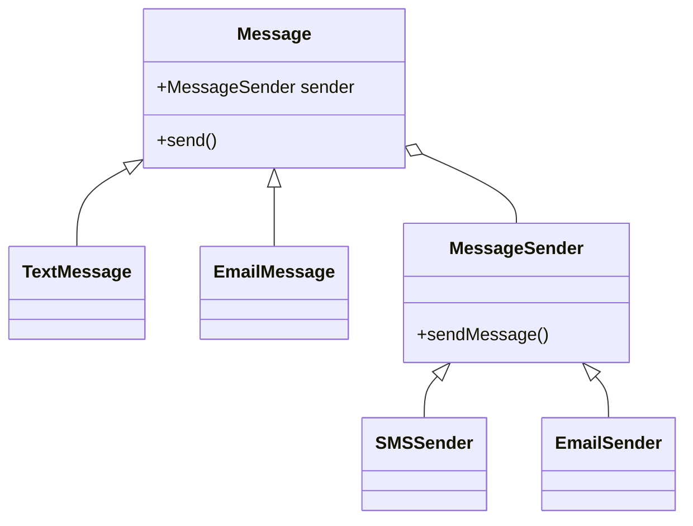

# Bridge Design Pattern - Mermaid Diagram Samples

Below are 4 different samples of the Bridge Design Pattern using Mermaid diagrams.

---

## Sample 1: Basic Bridge Structure

---

## Sample 2: Remote Control and Devices

---

## Sample 3: Shape and Drawing API

---

## Sample 4: Message and MessageSender

