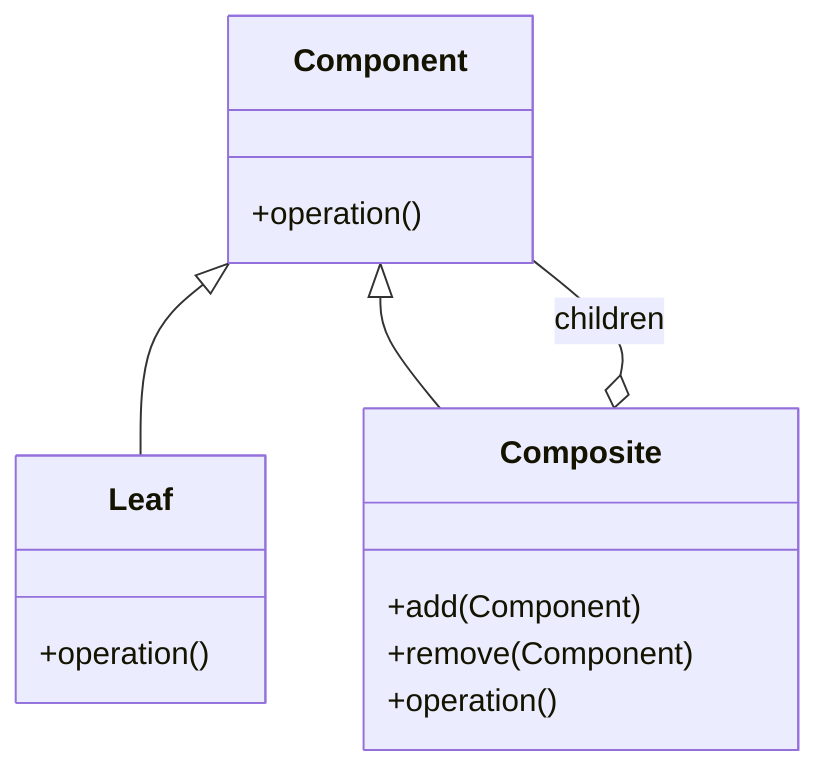
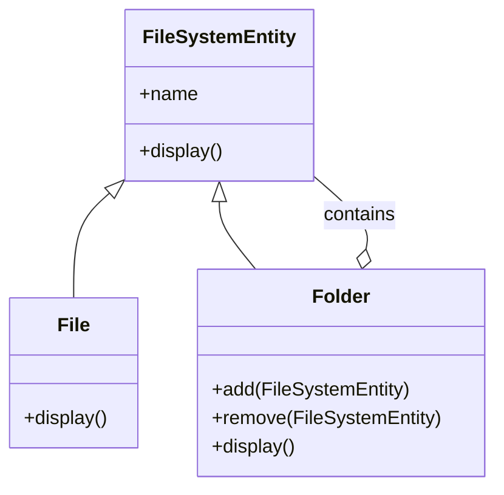
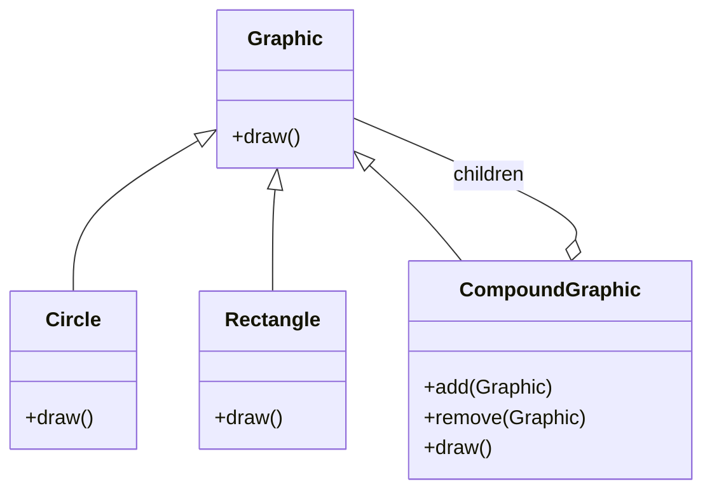
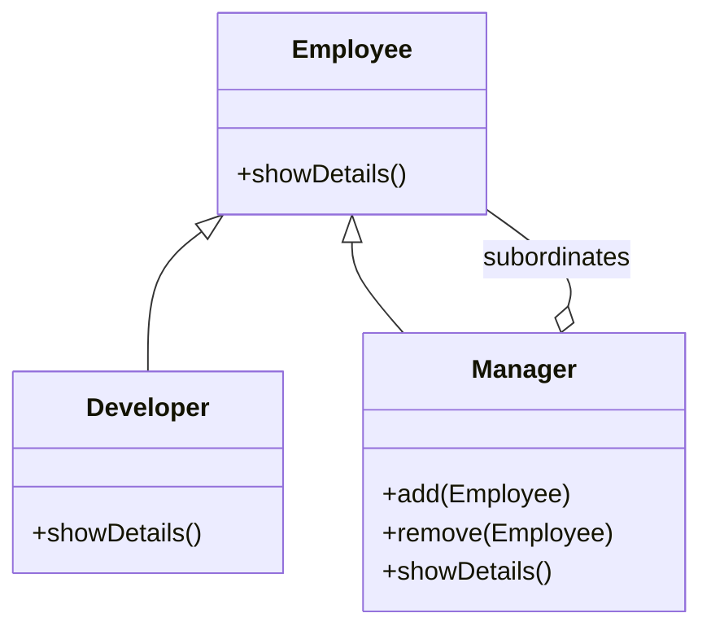

# Decomposite (Composite) Design Pattern - Mermaid Diagram Samples

Below are 4 different samples of the Composite (Decomposite) Design Pattern using Mermaid diagrams.

---

## Sample 1: Basic Composite Structure

---

## Sample 2: File System (Folder & File)

---

## Sample 3: Graphic Objects

---

## Sample 4: Organization Structure

