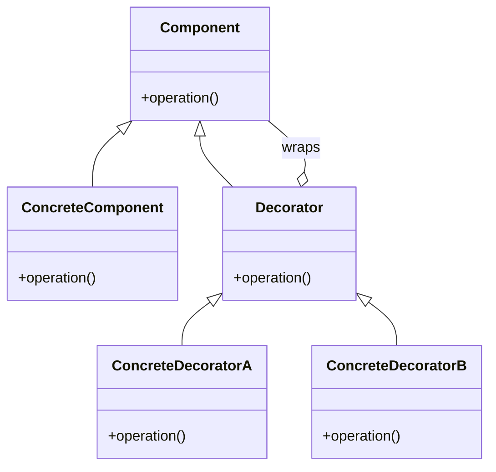
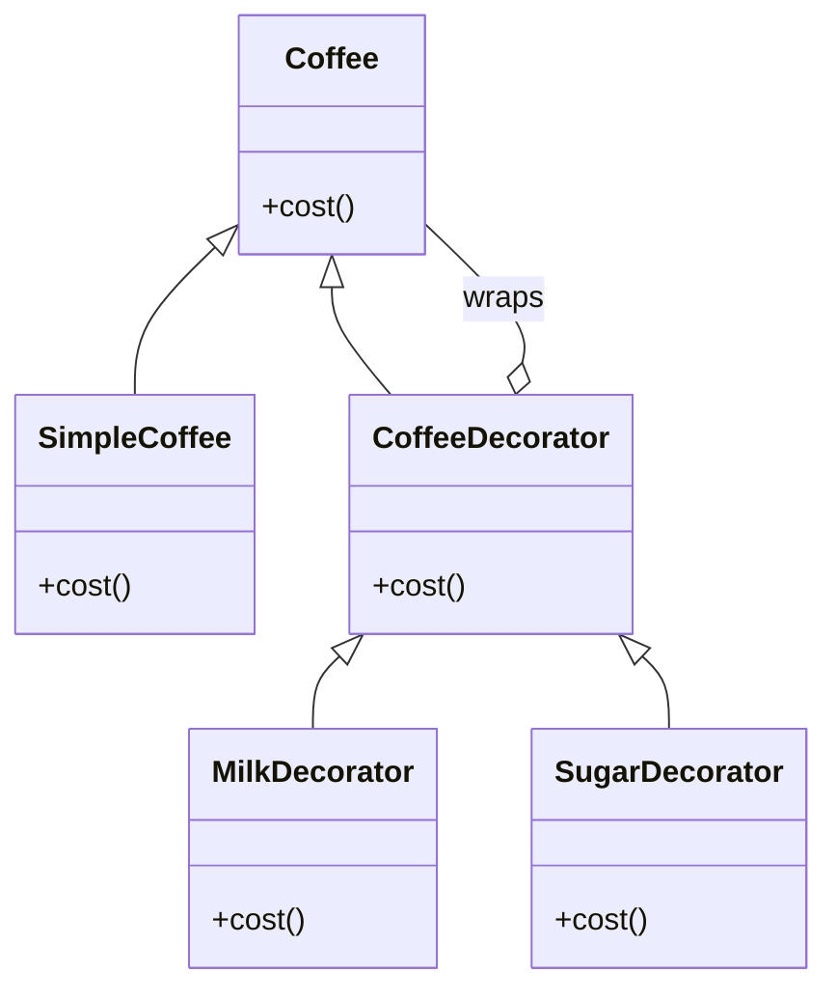
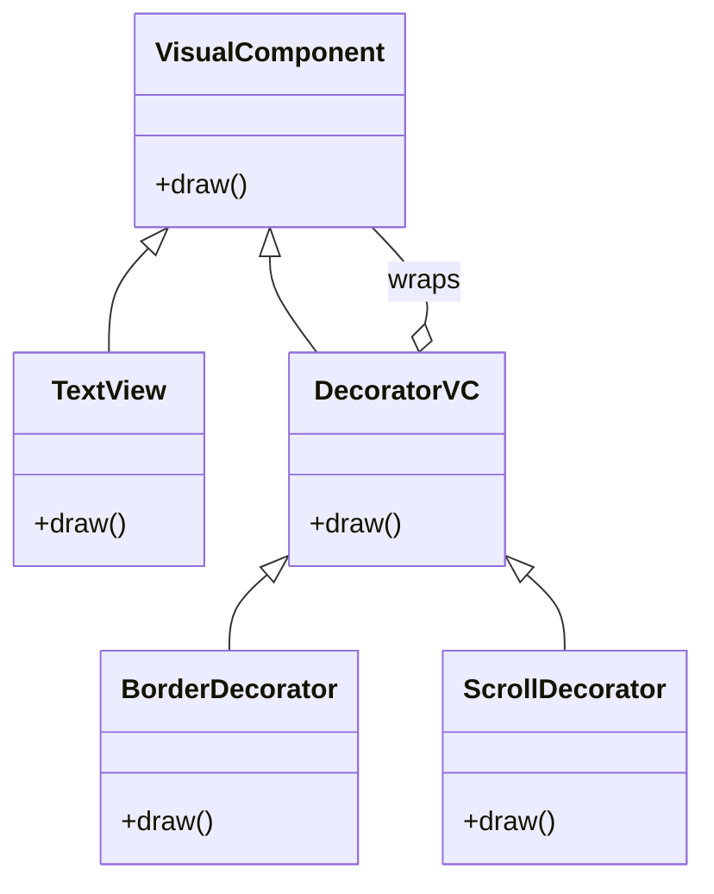
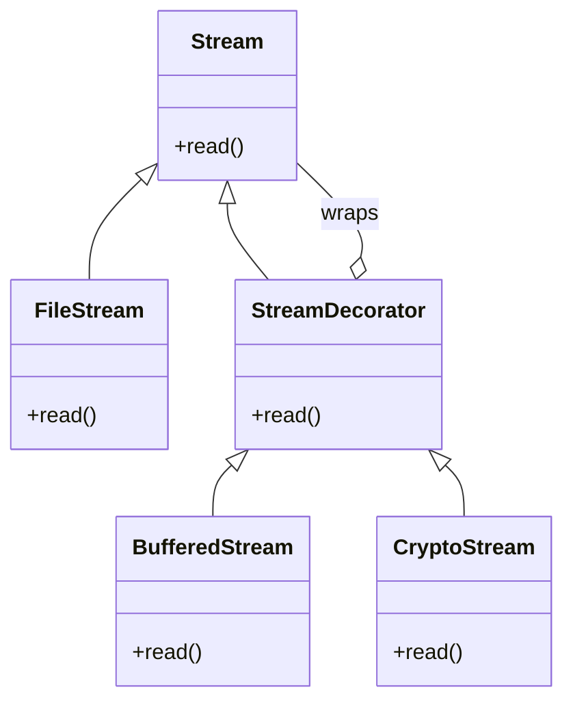

# Decorator Design Pattern - Mermaid Diagram Samples

Below are 4 different samples of the Decorator Design Pattern using Mermaid diagrams.

---

## Sample 1: Basic Decorator Structure

---

## Sample 2: Coffee Example

---

## Sample 3: Visual Component Example

---

## Sample 4: Data Stream Example

