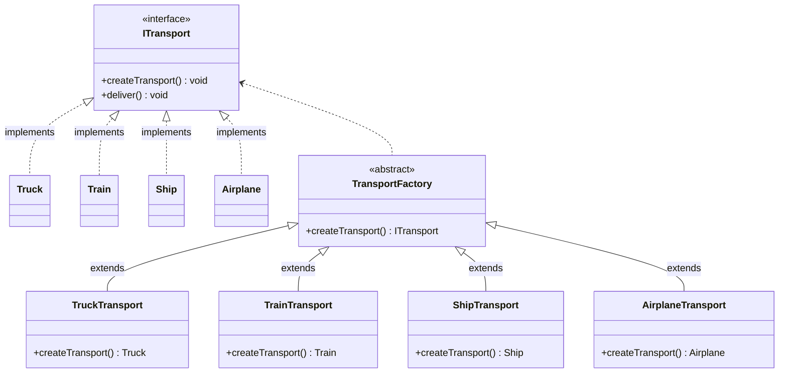
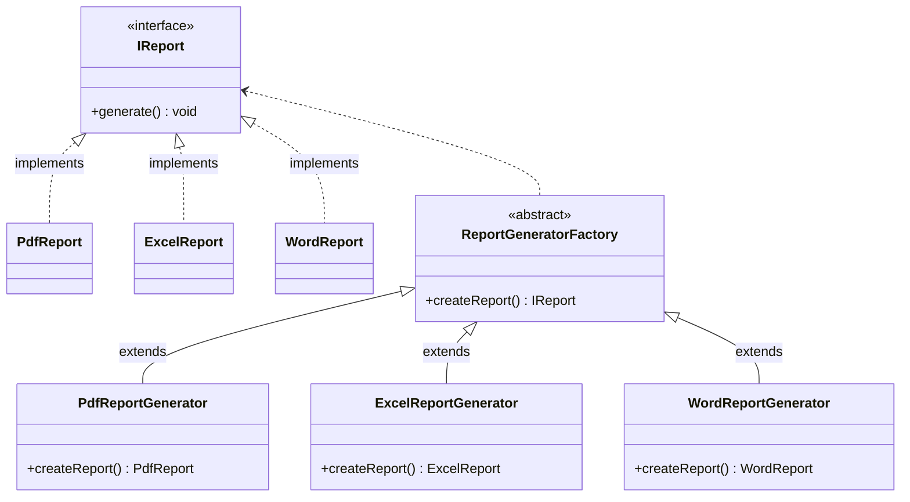
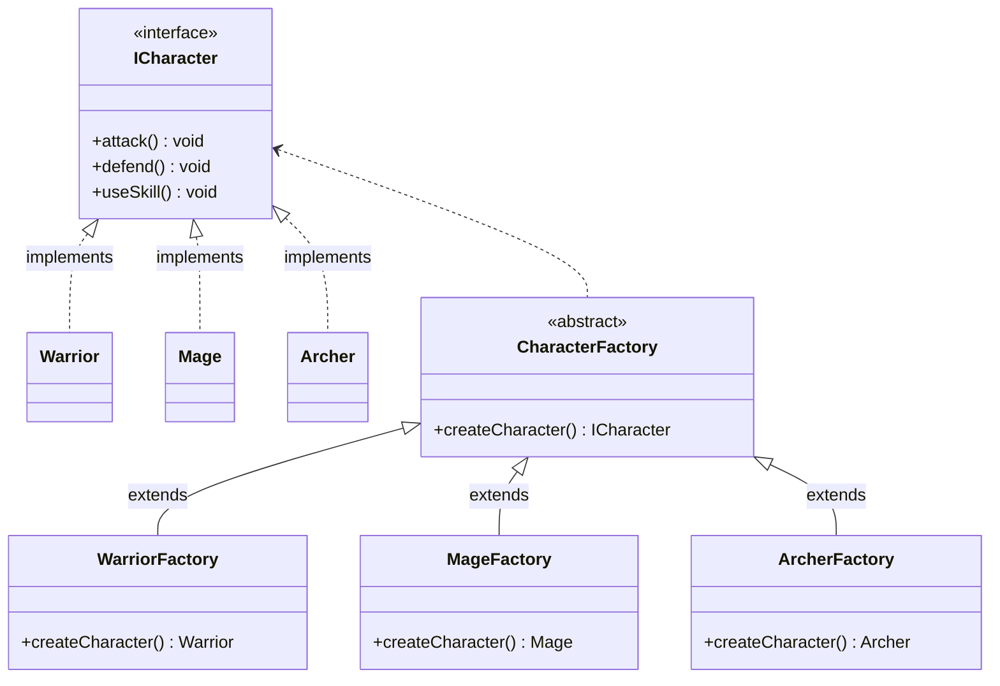
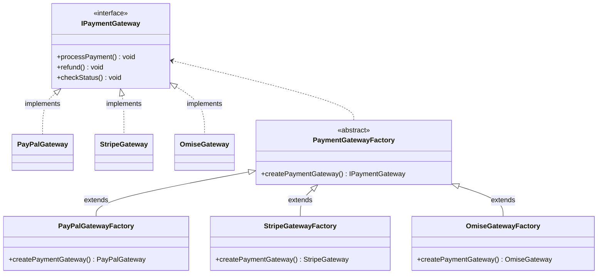
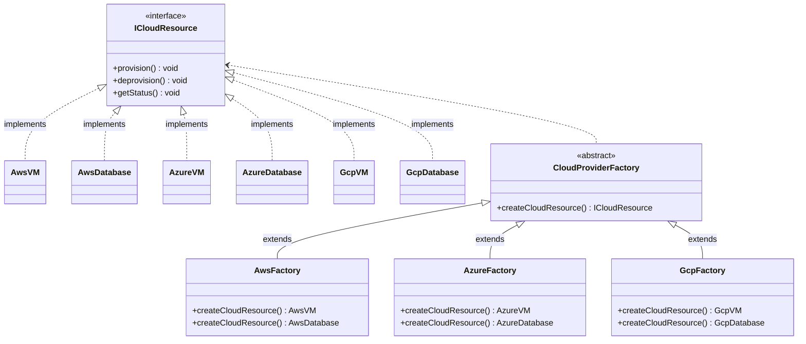

## Transportation Factory Method

## Report Generator Factory Method

## Geme Character Creation Factory Method

## Payment Gateway Integration Factory Method

## Cloud Resource Provisioning Factory Method
