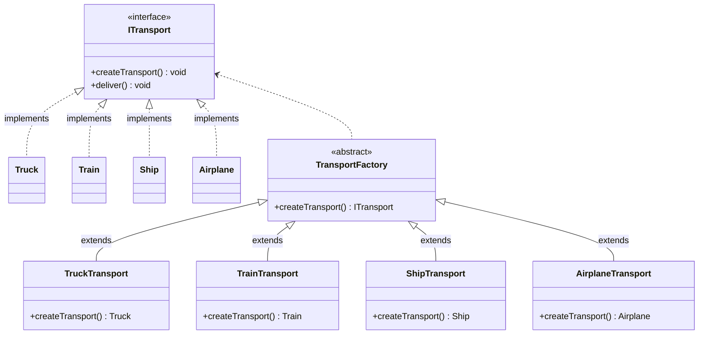

## Transportation Factory Method



## Report Generator Factory Method
```mermaid
classDiagram
    class IReport{
        <<interface>>
        +generate() void
    }
    class PdfReport{
    }
    class ExcelReport{
    }
    class WordReport{
    }
    class ReportGeneratorFactory {
        <<abstract>>
        +createReport() IReport
    }
    class PdfReportGenerator{
        +createReport() PdfReport
    }
    class ExcelReportGenerator{
        +createReport() ExcelReport
    }
    class WordReportGenerator{
        +createReport() WordReport
    }
    IReport <|.. PdfReport:implements
    IReport <|.. ExcelReport:implements
    IReport <|.. WordReport:implements
    ReportGeneratorFactory <|-- PdfReportGenerator:extends
    ReportGeneratorFactory <|-- ExcelReportGenerator:extends
    ReportGeneratorFactory <|-- WordReportGenerator:extends
    IReport <.. ReportGeneratorFactory