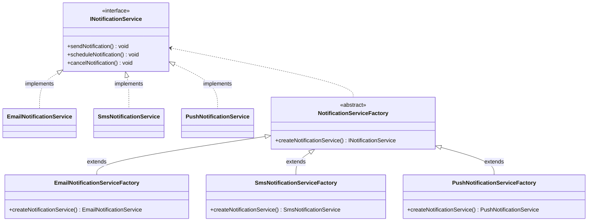
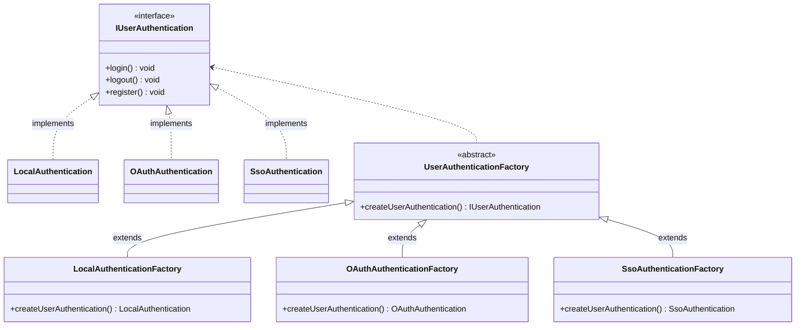
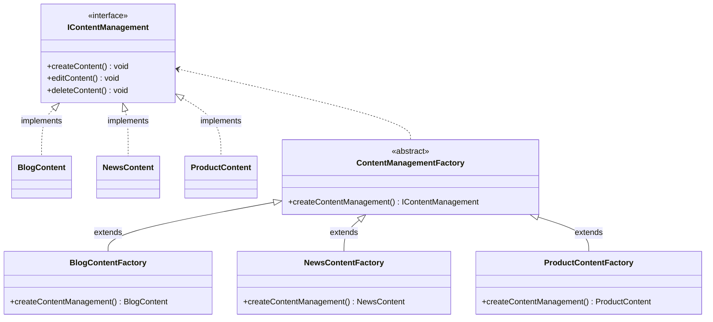

## Transportation Factory Method

## Report Generator Factory Method

## Geme Character Creation Factory Method

## Payment Gateway Integration Factory Method

## Cloud Resource Provisioning Factory Method

## Notification Service Factory Method

## User Authentication Factory Method

## Content Management System Factory Method

