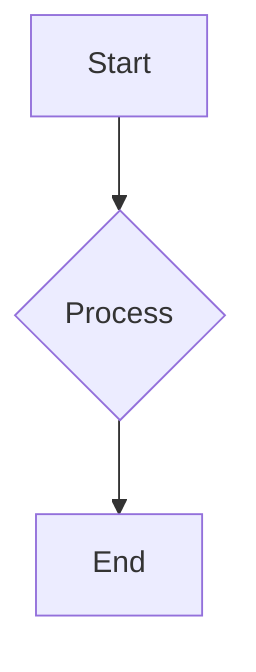
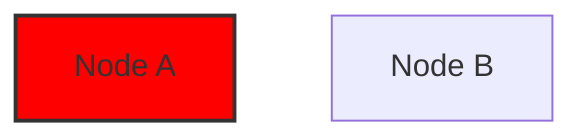
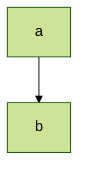

**2. Basic Formatting within Diagrams:**

*   **Text Formatting:** Mermaid supports basic Markdown-like text formatting within labels and text elements of diagrams, including:
    *   **Bold:** Use double asterisks (`**text**`)
    *   *Italics:* Use single asterisks (`*text*`)
*   **Automatic Text Wrapping:** Mermaid automatically wraps text within labels to fit the diagram's layout.
*   **Unicode Text:** Enclose Unicode text within double quotes (`"This ❤ Unicode"`).

**3. Diagram-Specific Formatting Options:**

*   **Direction:** Many diagram types (e.g., flowcharts, ER diagrams) allow you to specify the direction of the diagram (e.g., `TD` for Top-Down, `LR` for Left-Right).
*   **Styling with `classDef`:** For more advanced styling, you can define custom CSS classes within your Mermaid code using `classDef` and apply them to specific elements (e.g., nodes in a flowchart, states in a state diagram).

        graph LR
            A[Node A]:::myClass
            B[Node B]:::myClass

