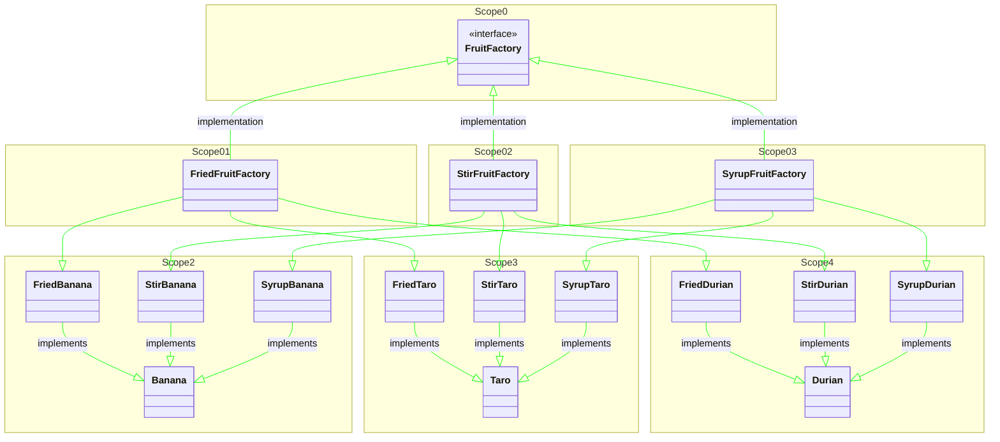

```mermaid
classDiagram
%%{
    init: {
    'themeVariables': {
      'lineColor': '#0f0'
    }
  }
}%%
    direction TD
    namespace Scope0 {
        class FruitFactory { <<interface>> }
    }
    namespace Scope01 {
        class FriedFruitFactory
    }
    namespace Scope02 {
        class StirFruitFactory
    }
    namespace Scope03 {
        class SyrupFruitFactory
    }
    FruitFactory <|-- FriedFruitFactory : implementation
    FruitFactory <|-- StirFruitFactory : implementation
    FruitFactory <|-- SyrupFruitFactory : implementation

    namespace Scope2 {
        class FriedBanana
        class StirBanana
        class SyrupBanana
        class Banana
    }
    FriedBanana --|> Banana: implements
    StirBanana --|> Banana: implements
    SyrupBanana --|> Banana: implements
    FriedFruitFactory --|> FriedBanana
    StirFruitFactory --|> StirBanana
    SyrupFruitFactory --|> SyrupBanana
    
    namespace Scope3 {
        class FriedTaro
        class SyrupTaro
        class StirTaro
        class Taro
    }
    FriedTaro --|> Taro: implements
    StirTaro --|> Taro: implements
    SyrupTaro --|> Taro: implements
    FriedFruitFactory --|> FriedTaro
    StirFruitFactory --|> StirTaro
    SyrupFruitFactory --|> SyrupTaro

    namespace Scope4 {
        class FriedDurian
        class StirDurian
        class SyrupDurian
        class Durian

    }
    FriedDurian --|> Durian: implements
    StirDurian --|> Durian: implements
    SyrupDurian --|> Durian: implements
    FriedFruitFactory --|> FriedDurian
    StirFruitFactory --|> StirDurian
    SyrupFruitFactory --|> SyrupDurian

```