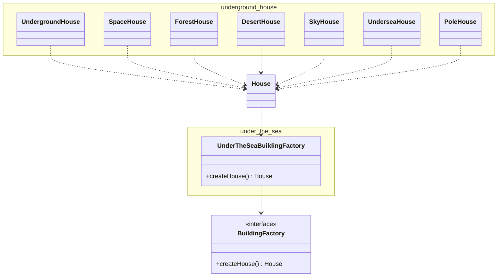

```mermaid
classDiagram
    direction TD
    class BuildingFactory{
        <<interface>>
        +createHouse() House
    }
    namespace under_the_sea{
        class UnderTheSeaBuildingFactory{
            +createHouse() House
        }
    }
    %% UnderTheSeaBuildingFactory ..> BuildingFactory
    %% UnderTheSeaBuildingFactory ..> House
    House ..> UnderTheSeaBuildingFactory
    UnderTheSeaBuildingFactory ..> BuildingFactory
    
    class House{
    }
    namespace underground_house{
        class UndergroundHouse{
        }
        class SpaceHouse{
        }
        class ForestHouse{
        }
        class DesertHouse{
        }
        class SkyHouse{
        }
        class UnderseaHouse{
        }
        class PoleHouse{
        }

    }
    UndergroundHouse ..> House
    SpaceHouse ..> House
    ForestHouse ..> House
    DesertHouse ..> House
    SkyHouse ..> House
    UnderseaHouse ..> House
    PoleHouse ..> House

    %% class Hospital{
    %% }
    %% namespace space_hospital{
    %%     class SpaceHospital{
    %%     }
    %% }
    %% class Canteen{
    %% }
    %% namespace canteen_in_the_forest{
    %%     class CanteenInTheForest{
    %%     }
    %% }
    %% class School{
    %% }
    %% namespace school_in_the_sky{
    %%     class SchoolInTheSky{
    %%     }
    %% }
    %% class Hotel{
    %% }
    %% namespace hotel_in_the_desert{
    %%     class HotelInTheDesert{
    %%     }
    %% }
    %% class University{
    %% }
    %% namespace under_the_sea_university{
    %%     class UnderseaUniversity{
    %%     }
    %% }
    %% %% House <|-- UndergroundHouse
    %% %% Hospital <|-- SpaceHospital
    %% %% Canteen <|-- CanteenInTheForest
    %% %% School <|-- SchoolInTheSky
    %% %% Hotel <|-- HotelInTheDesert
    %% %% University <|-- UnderseaUniversity
    %% UndergroundHouse ..> House
    %% SpaceHospital ..> Hospital
    %% CanteenInTheForest ..> Canteen
    %% SchoolInTheSky ..> School
    %% HotelInTheDesert ..> Hotel
    %% UnderseaUniversity ..> University

    %% class BuildingFactory{
    %%     <<interface>>
    %%     +createHouse() House
    %%     +createHospital() Hospital
    %%     +createCanteen() Canteen
    %%     +createSchool() School
    %%     +createHotel() Hotel
    %%     +createUniversity() University
    %% }
    %% namespace under_the_sea{
    %%     class UnderTheSeaBuildingFactory{
    %%         +createHouse() House
    %%         +createHospital() Hospital
    %%         +createCanteen() Canteen
    %%         +createSchool() School
    %%         +createHotel() Hotel
    %%         +createUniversity() University
    %%     }
    %% }
    %% UnderTheSeaBuildingFactory ..> UnderseaUniversity
    %% namespace in_the_sky{
    %%     class InTheSkyBuildingFactory{
    %%         +createHouse() House
    %%         +createHospital() Hospital
    %%         +createCanteen() Canteen
    %%         +createSchool() School
    %%         +createHotel() Hotel
    %%         +createUniversity() University
    %%     }
    %% }
    %% InTheSkyBuildingFactory ..> SchoolInTheSky
    %% namespace underground{
    %%     class UndergroundBuildingFactory{
    %%         +createHouse() House
    %%         +createHospital() Hospital
    %%         +createCanteen() Canteen
    %%         +createSchool() School
    %%         +createHotel() Hotel
    %%         +createUniversity() University
    %%     }
    %% }
    %% UndergroundBuildingFactory ..> UndergroundHouse
    %% namespace desert{
    %%     class DesertBuildingFactory{
    %%         +createHouse() House
    %%         +createHospital() Hospital
    %%         +createCanteen() Canteen
    %%         +createSchool() School
    %%         +createHotel() Hotel
    %%         +createUniversity() University
    %%     }
    %% }
    %% DesertBuildingFactory ..> HotelInTheDesert
    %% namespace forest{
    %%     class ForestBuildingFactory{
    %%         +createHouse() House
    %%         +createHospital() Hospital
    %%         +createCanteen() Canteen
    %%         +createSchool() School
    %%         +createHotel() Hotel
    %%         +createUniversity() University
    %%     }
    %% }
    %% ForestBuildingFactory ..> CanteenInTheForest
    %% namespace space{
    %%     class SpaceBuildingFactory{
    %%         +createHouse() House
    %%         +createHospital() Hospital
    %%         +createCanteen() Canteen
    %%         +createSchool() School
    %%         +createHotel() Hotel
    %%         +createUniversity() University
    %%     }
    %% }
    %% SpaceBuildingFactory ..> SpaceHospital
    %% namespace pole_building{
    %%     class PoleBuildingFactory{
    %%         +createHouse() House
    %%         +createHospital() Hospital
    %%         +createCanteen() Canteen
    %%         +createSchool() School
    %%         +createHotel() Hotel
    %%         +createUniversity() University
    %%     }
    %% }
    %% %% BuildingFactory <.. UnderTheSeaBuildingFactory
    %% %% BuildingFactory <.. InTheSkyBuildingFactory
    %% %% BuildingFactory <.. UndergroundBuildingFactory
    %% %% BuildingFactory <.. DesertBuildingFactory
    %% %% BuildingFactory <.. ForestBuildingFactory
    %% %% BuildingFactory <.. SpaceBuildingFactory
    %% %% BuildingFactory <.. PoleBuildingFactory
    %% UnderTheSeaBuildingFactory ..> BuildingFactory
    %% InTheSkyBuildingFactory ..> BuildingFactory
    %% UndergroundBuildingFactory ..> BuildingFactory
    %% DesertBuildingFactory ..> BuildingFactory
    %% ForestBuildingFactory ..> BuildingFactory
    %% SpaceBuildingFactory ..> BuildingFactory
    %% PoleBuildingFactory ..> BuildingFactory
```
