1. จากตาราง Process ดังต่อไปนี้ จงเขียน Gantt Chart โดยใช้ CPU Scheduling แบบ First-Come, First-Served (FCFS)

| Process | Arrival Time | Burst Time |
| :------ | :----------- | :--------- |
| P1      | 0            | 10         |
| P2      | 1            | 2          |
| P3      | 3            | 3          |
| P4      | 5            | 6          |

1. First-Come, First-Served (FCFS):
- P1 มาถึงที่เวลา 0 จึงได้ทำงานก่อน (10 หน่วย)
- P2 มาถึงที่เวลา 1 ต้องรอ P1 เสร็จก่อน
- P3 มาถึงที่เวลา 3 ต้องรอ P2 เสร็จก่อน
- P4 มาถึงที่เวลา 5 ต้องรอ P3 เสร็จก่อน

```mermaid
gantt
    title FCFS CPU Scheduling
    dateFormat s
    axisFormat %S
    section CPU
    P1 :0, 10
    P2 :10, 12
    P3 :12, 15
    P4 :15, 21
```

  
2. จากตาราง Process ดังต่อไปนี้ จงเขียน Gantt Chart โดยใช้ CPU Scheduling แบบ Shortest-Job-First (SJF)

| Process | Arrival Time | Burst Time |
| :------ | :----------- | :--------- |
| P1      | 0            | 10         |
| P2      | 0            | 2          |
| P3      | 0            | 3          |
| P4      | 0            | 6          |

2. Shortest-Job-First (SJF) ที่ทุก process มาถึงพร้อมกัน:
- เรียงตาม Burst Time จากน้อยไปมาก: P2(2) -> P3(3) -> P4(6) -> P1(10)

```mermaid
gantt
    title SJF CPU Scheduling (Case 1)
    dateFormat s
    axisFormat %S
    section CPU
    P2 :0, 2
    P3 :2, 5
    P4 :5, 11
    P1 :11, 21
```

3. จากตาราง Process ดังต่อไปนี้ จงเขียน Gantt Chart โดยใช้ CPU Scheduling แบบ Shortest-Job-First (SJF)

| Process | Arrival Time | Burst Time |
| :------ | :----------- | :--------- |
| P1      | 0            | 3          |
| P2      | 1            | 5          |
| P3      | 2            | 7          |
| P4      | 6            | 2          |

3. Shortest-Job-First (SJF) แบบมี Arrival Time ต่างกัน:
- P1 มาถึงที่เวลา 0 (Burst=3)
- P2 มาถึงที่เวลา 1 แต่ต้องรอ P1
- P3 มาถึงที่เวลา 2
- P4 มาถึงที่เวลา 6 และมี Burst Time น้อยที่สุด (2) จึงได้ทำงานทันที

```mermaid
gantt
    title SJF CPU Scheduling (Case 2)
    dateFormat s
    axisFormat %S
    section CPU
    P1 :0, 3
    P2 :3, 8
    P4 :8, 10
    P3 :10, 17
```

4. จากตาราง Process ดังต่อไปนี้ จงเขียน Gantt Chart โดยใช้ CPU Scheduling แบบ Shortest Remaining Time First (SRTF) 

| Process | Arrival Time | Burst Time |
| :------ | :----------- | :--------- |
| P1      | 0            | 3          |
| P2      | 2            | 5          |
| P3      | 4            | 7          |
| P4      | 5            | 2          |

4. Shortest Remaining Time First (SRTF):
- P1 เริ่มที่เวลา 0 (เหลือ 3)
- P2 มาที่เวลา 2 แต่ burst time = 5 > 1 (P1 เหลือ 1) จึงให้ P1 ทำต่อ
- P4 มาที่เวลา 5 และมี burst time = 2 จึงได้ทำงานก่อน
- ตามด้วย P2 และ P3 ตามลำดับ

```mermaid
gantt
    title SRTF CPU Scheduling
    dateFormat s
    axisFormat %S
    section CPU
    P1 :0, 3
    P2 :3, 5
    P4 :5, 7
    p2 :7,10
    P3 :10, 17
```

5. จากตาราง Process ดังต่อไปนี้ จงเขียน Gantt Chart โดยใช้ CPU Scheduling แบบ Round Robin โดยมีเวลา quantum เท่ากับ 3 หน่วยเวลา

| Process | Arrival Time | Burst Time |
| :------ | :----------- | :--------- |
| P1      | 0            | 3          |
| P2      | 2            | 5          |
| P3      | 4            | 7          |
| P4      | 5            | 2          |

5. Round Robin (Quantum = 3):
- P1 ทำงาน 3 หน่วย (หมด burst time พอดี)
- P2 ทำงาน 3 หน่วย (เหลือ 2)
- P3 ทำงาน 3 หน่วย (เหลือ 4)
- P4 ทำงาน 2 หน่วย (หมด burst time)
- P2 ทำงาน 2 หน่วย (หมด burst time)
- P3 ทำงาน 4 หน่วย (หมด burst time)

```mermaid
gantt
    title Round Robin CPU Scheduling (Q=3)
    dateFormat s
    axisFormat %S
    section CPU
    P1 :0, 3
    P2 :3, 6
    P3 :6, 9
    P4 :9, 11
    P2 :11, 13
    P3 :13, 17
```

ในแต่ละ scheduling algorithm จะมีข้อดีและข้อเสียต่างกัน:

- FCFS: ง่าย แต่อาจทำให้ process ที่ใช้เวลาน้อยต้องรอนาน
- SJF: ลดเวลารอเฉลี่ย แต่อาจทำให้ process ที่ใช้เวลามากถูกเลื่อนออกไปเรื่อยๆ
- SRTF: เหมาะกับการลดเวลารอโดยรวม แต่มีoverhead จากการสลับ process
- Round Robin: ยุติธรรมที่สุด ทุก process ได้ใช้ CPU แต่อาจมี context switching overhead สูง