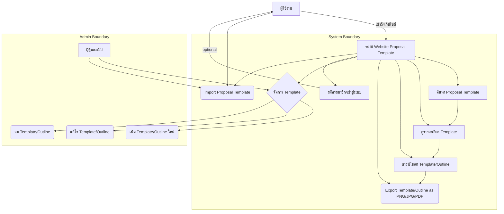
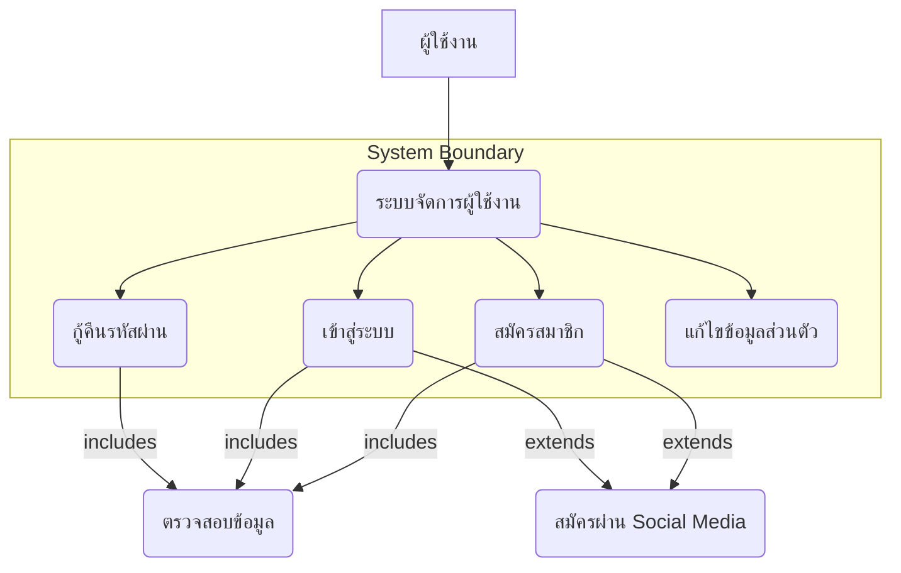
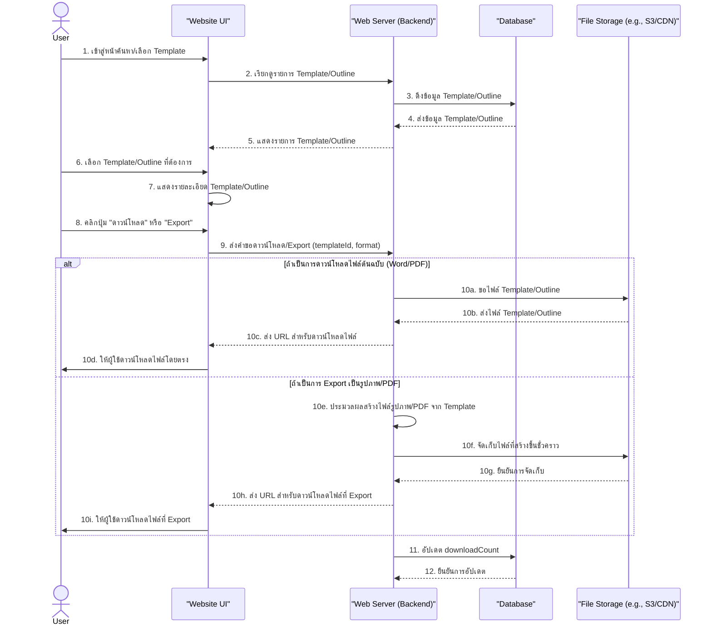
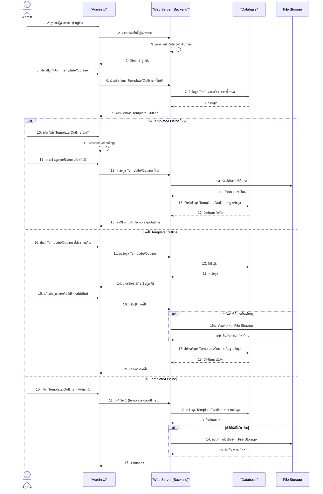

# Website Proposal Template - Detailed Project Proposal

## วัตถุประสงค์ของระบบใหม่

**วัตถุประสงค์หลัก:**
- เพื่อพัฒนาแพลตฟอร์มเว็บไซต์ที่รวบรวม proposal template ที่หลากหลายและใช้งานง่าย
- เพื่อช่วยประหยัดเวลาและลดความยุ่งยากในการเริ่มต้นเขียน proposal สำหรับผู้ใช้งาน
- เพื่อยกระดับคุณภาพและมาตรฐานของ proposal ให้ดูเป็นมืออาชีพและน่าเชื่อถือมากขึ้น

**วัตถุประสงค์รอง (ผลลัพธ์):**
- ผู้ใช้งานสามารถเลือก template ที่เหมาะสมกับความต้องการและปรับแต่งได้สะดวก
- ลดระยะเวลาในการจัดทำ proposal ได้อย่างน้อย 30%
- เพิ่มโอกาสที่ proposal จะได้รับการอนุมัติหรือประสบความสำเร็จเนื่องจากความชัดเจนและคุณภาพ
- สร้างแหล่งรวมความรู้และแนวทางเกี่ยวกับการเขียน proposal ที่เป็นประโยชน์
- ส่งเสริมให้การจัดทำเอกสารสำคัญมีมาตรฐานและประสิทธิภาพมากขึ้น

## ขอบเขตการดำเนินงานโครงงาน

**สิ่งที่ระบบจะทำ (ขอบเขตงาน):**
- **การวิเคราะห์และออกแบบ:** ศึกษาประเภทของ proposal ที่พบบ่อย, วิเคราะห์องค์ประกอบสำคัญที่ควรมีใน template แต่ละประเภท, ออกแบบ User Interface (UI) และ User Experience (UX) ของเว็บไซต์ให้ใช้งานง่ายและน่าดึงดูด
- **การพัฒนาเว็บไซต์:** สร้างแพลตฟอร์มเว็บไซต์สำหรับแสดงและดาวน์โหลด template
- **การสร้างและรวบรวม Template:** พัฒนา template ตัวอย่างหลากหลายรูปแบบ (เช่น template สำหรับโครงการ, ธุรกิจ, การศึกษา, การวิจัย) พร้อมคำแนะนำการใช้งานเบื้องต้น
- **ฟังก์ชันการค้นหาและกรอง:** มีระบบค้นหาและกรอง template ตามประเภท, หัวข้อ, หรือคีย์เวิร์ด
- **ระบบดาวน์โหลดและ Export:** ผู้ใช้งานสามารถดาวน์โหลด template ได้ในรูปแบบที่ใช้งานได้ง่าย (Word, PDF, Google Docs) และ Export/Save Template หรือ Outline ในรูปแบบไฟล์ภาพ (.png, .jpg) และ PDF ได้ด้วย
- **ระบบ Import Template:** ผู้ดูแลระบบสามารถ Import Template หรือ Outline ที่สร้างจากแหล่งภายนอกเข้ามาในระบบได้ (เช่น อัปโหลดไฟล์ Word/PDF เพื่อแปลงเป็น Template ของระบบ)
- **ระบบจัดการผู้ใช้งาน:** การสมัครสมาชิก (Register), การเข้าสู่ระบบ (Login), การกู้คืนรหัสผ่าน, การจัดการโปรไฟล์ของผู้ใช้งาน

**สิ่งที่ระบบอาจจะไม่ทำในเฟสแรก (ขอบเขตนอกงาน):**
- จะยังไม่มีระบบการสร้าง proposal ออนไลน์ (Online Proposal Builder) ที่ผู้ใช้สามารถพิมพ์หรือแก้ไขเนื้อหาได้โดยตรงบนเว็บไซต์ (เน้นให้ดาวน์โหลดไปใช้)
- จะยังไม่มีฟังก์ชันสำหรับการตรวจสอบไวยากรณ์ หรือการตรวจเนื้อหาอัตโนมัติ
- จะยังไม่มีการเชื่อมต่อกับฐานข้อมูลภายนอกอื่น ๆ ที่ซับซ้อน

## System Architecture Diagrams

### User Flow Diagram

### User Management System

### Template Download Sequence

### Admin Template Management Sequence

## ประโยชน์ที่คาดว่าจะได้รับจากโครงการ

โครงการ Website Proposal Template นี้คาดว่าจะส่งมอบประโยชน์ที่สำคัญและจับต้องได้ต่อผู้ใช้งานและต่อกระบวนการจัดทำเอกสารข้อเสนอโครงการโดยรวม ดังนี้:

### ประหยัดเวลาและลดภาระงาน (Time and Effort Saving)
- **ลดเวลาเริ่มต้นจากศูนย์:** ผู้ใช้งานไม่จำเป็นต้องเสียเวลาในการคิดโครงสร้างหรือรูปแบบของ Proposal ตั้งแต่ต้น ทำให้สามารถเริ่มเขียนเนื้อหาได้ทันที
- **เพิ่มประสิทธิภาพในการทำงาน:** กระบวนการจัดทำ Proposal จะรวดเร็วขึ้นอย่างเห็นได้ชัด ทำให้สามารถนำเสนอโครงการได้เร็วขึ้น และมีเวลาไปโฟกัสกับเนื้อหาและกลยุทธ์สำคัญได้มากขึ้น

### ยกระดับคุณภาพและมาตรฐานของ Proposal (Enhanced Quality and Professionalism)
- **เพิ่มความเป็นมืออาชีพ:** Template และ Outline ที่จัดเตรียมไว้จะช่วยให้ Proposal มีโครงสร้างที่ชัดเจน เป็นระเบียบ และดูน่าเชื่อถือมากขึ้น
- **ลดข้อผิดพลาด:** การมีแนวทางที่ชัดเจนช่วยลดโอกาสในการตกหล่นข้อมูลสำคัญ หรือการนำเสนอที่ผิดพลาด
- **สร้างความสม่ำเสมอ:** ช่วยให้องค์กรหรือบุคคลสามารถรักษามาตรฐานการนำเสนอเอกสารได้อย่างสม่ำเสมอ

### เพิ่มโอกาสในการบรรลุเป้าหมายโครงการ (Increased Success Rate)
- **ดึงดูดความสนใจ:** Proposal ที่จัดทำอย่างมืออาชีพและมีโครงสร้างที่ดี ย่อมมีโอกาสสูงกว่าในการดึงดูดความสนใจและสร้างความประทับใจให้กับผู้พิจารณา
- **เพิ่มอัตราการอนุมัติ:** เมื่อ Proposal ชัดเจน ตรงประเด็น และน่าเชื่อถือ โอกาสในการได้รับการอนุมัติโครงการ การลงทุน หรือการว่าจ้างย่อมสูงขึ้น

### ส่งเสริมการเรียนรู้และพัฒนา (Learning and Development Promotion)
- **เป็นแหล่งความรู้:** เว็บไซต์จะทำหน้าที่เป็นแหล่งรวมแนวทางและตัวอย่างการเขียน Proposal ที่ดี ช่วยให้ผู้ใช้งานได้เรียนรู้และพัฒนาทักษะในการนำเสนอโครงการ
- **เข้าถึงความรู้ได้ง่าย:** ทุกคนสามารถเข้าถึงเครื่องมือและแนวทางเหล่านี้ได้จากทุกที่ทุกเวลา

### เพิ่มความยืดหยุ่นในการใช้งาน (Increased Flexibility)
- **รองรับการใช้งานหลากหลาย:** ด้วย Template และ Outline ที่หลากหลายประเภท (โครงการ, ธุรกิจ, การศึกษา) รวมถึงความสามารถในการ Export เป็นไฟล์หลายรูปแบบ (Word, PDF, รูปภาพ)
- **ตอบสนองพฤติกรรมยุคดิจิทัล:** การเป็นแพลตฟอร์มออนไลน์และรองรับ E-document สอดคล้องกับพฤติกรรมการทำงานและการนำเสนอในยุคปัจจุบัน
