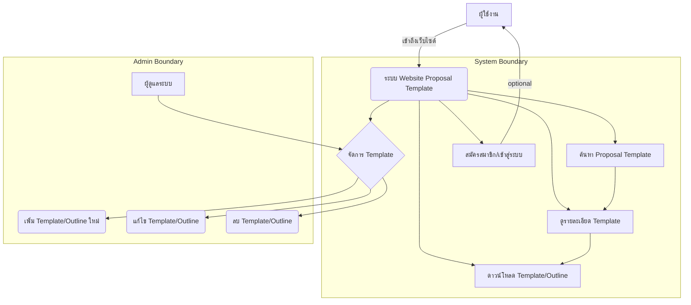
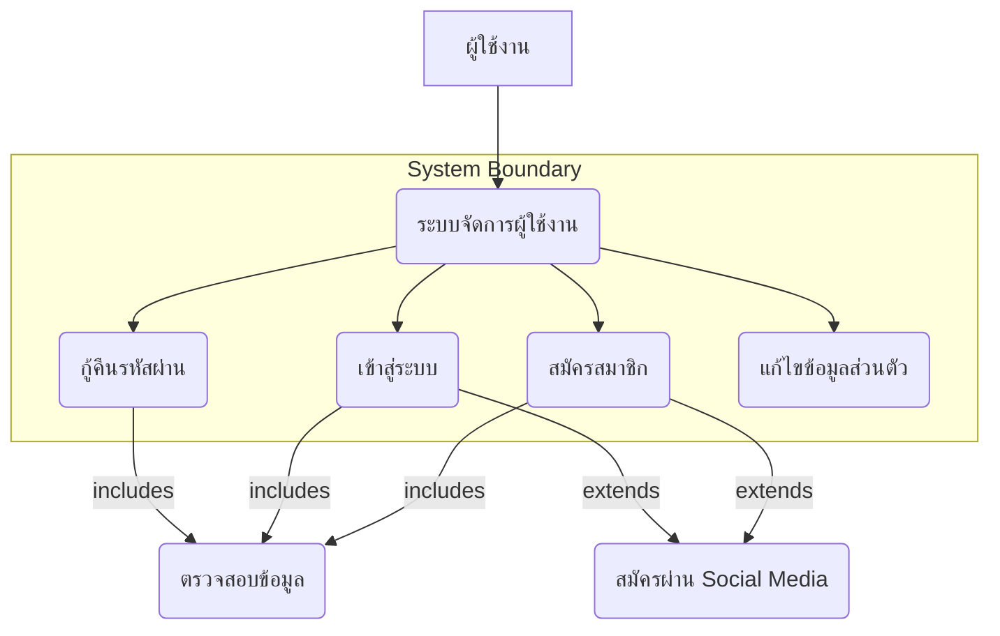
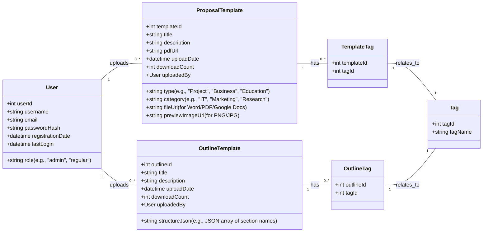

# โครงการ: [ชื่อโครงการของคุณ]

---

## 1. เรื่องราว/บทนำ

**[ปรับแก้/เพิ่มเติม]:**
* **จากเดิม:** แค่การอธิบายภาพรวมของโครงการ
* **ปรับแก้:** เน้นให้ผู้ใช้งานอธิบายบริบทของปัญหาและคุณค่าที่โซลูชันจะมอบให้ ชี้ให้เห็นถึง "Pain Point" ที่โครงการจะเข้ามาแก้ และประโยชน์ที่ชัดเจน

**คำแนะนำ:**
ส่วนนี้คือการแนะนำภาพรวมของโครงการของคุณ อธิบายถึงบริบทของปัญหาหรือความท้าทายที่คุณต้องการแก้ไข รวมถึงแนวคิดและคุณค่าหลักของโซลูชันที่คุณจะนำเสนอให้กระชับและน่าสนใจ เพื่อดึงดูดความสนใจตั้งแต่แรกเริ่ม

**ตัวอย่างแนวคิด:**
"ในโลกปัจจุบันที่ [ระบุสถานการณ์/บริบทปัจจุบันที่เกี่ยวข้องกับปัญหา]... หลายคน/องค์กรกำลังเผชิญกับปัญหา [ระบุปัญหาหลักที่พบเจอ] ซึ่งส่งผลให้เกิด [ผลกระทบจากปัญหา]... โครงการ [ชื่อโครงการของคุณ] ของเราจึงมุ่งมั่นที่จะพัฒนา [ประเภทของโซลูชัน เช่น ระบบ/แอปพลิเคชัน/เว็บไซต์] เพื่อเป็น [อธิบายคุณค่า/ประโยชน์หลัก] ที่จะเข้ามาแก้ไขปัญหาข้างต้น ช่วยให้ [ผลลัพธ์เชิงบวกที่คาดหวัง]..."

---

## 2. ความสำคัญและขอบเขตของปัญหา

**[ปรับแก้/เพิ่มเติม]:**
* **จากเดิม:** แค่ให้ระบุปัญหา
* **ปรับแก้:** เน้นการระบุปัญหาที่ **เจาะจง** และ **เป็นรูปธรรม** พร้อมระบุ **ผลกระทบ** ของปัญหานั้น ๆ และ **กลุ่มเป้าหมาย** ที่ได้รับผลกระทบ โดยใช้แนวทางการลิสต์เป็นข้อ ๆ แบบตัวอย่างของเพื่อนคุณ

**คำแนะนำ:**
ในส่วนนี้ ให้ระบุและอธิบายปัญหาหลักที่โครงการของคุณต้องการแก้ไขอย่างชัดเจน โดยบอกถึงผลกระทบของปัญหา และความจำเป็นในการแก้ไข อาจระบุเป็นข้อ ๆ เพื่อความชัดเจนและเข้าใจง่าย

**ตัวอย่าง (ดัดแปลงจากเพื่อนของคุณ):**
* **ปัญหาด้านการเข้าถึง/การตัดสินใจ:**
    * ลูกค้าไม่สามารถ [การกระทำที่สำคัญที่ทำไม่ได้ เช่น ทดลองใช้งาน, เข้าถึงข้อมูลที่จำเป็น] ซึ่งทำให้ [ผลกระทบ เช่น การตัดสินใจซื้อยาก, ขาดความมั่นใจ, เสียโอกาส]
* **ปัญหาด้านประสิทธิภาพ/การจัดการ:**
    * การดำเนินการ [กระบวนการปัจจุบัน] เป็นไปอย่าง [ลักษณะปัญหา เช่น ล่าช้า, ซับซ้อน, มีข้อผิดพลาดบ่อย] ทำให้ [ผลกระทบ เช่น เสียเวลา, สิ้นเปลืองทรัพยากร, เกิดความผิดพลาด]
* **ปัญหาด้านการแข่งขัน/โอกาสทางธุรกิจ:**
    * [บริษัท/องค์กร/บุคคล] ไม่สามารถ [ความสามารถที่ขาดไป เช่น แข่งขันกับคู่แข่ง, ตอบสนองความต้องการใหม่ของตลาด, ขยายบริการได้] เนื่องจาก [สาเหตุของปัญหา] ซึ่งส่งผลต่อ [ผลกระทบ เช่น สูญเสียส่วนแบ่งการตลาด, โอกาสทางธุรกิจที่ลดลง]

---

## 3. วัตถุประสงค์ของระบบใหม่

**[ปรับแก้/เพิ่มเติม]:**
* **จากเดิม:** แค่ให้คิดไอเดียวัตถุประสงค์
* **ปรับแก้:** เน้นการระบุวัตถุประสงค์ที่ **แก้ไขปัญหาโดยตรง** และ **วัดผลได้** โดยมีตัวอย่างที่เป็นรูปธรรมจาก Project Proposal ของเพื่อนคุณ

**คำแนะนำ:**
กำหนดเป้าหมายหลักและเป้าหมายรองที่เฉพาะเจาะจง วัดผลได้ และสอดคล้องกับปัญหาที่ระบุไว้ก่อนหน้า วัตถุประสงค์ควรแสดงให้เห็นถึงสิ่งที่โครงการของคุณจะทำให้สำเร็จ

**ตัวอย่าง (ดัดแปลงจากเพื่อนของคุณ):**
* **เพื่อแก้ปัญหาการเข้าถึง/การตัดสินใจ:**
    * เพื่อให้ผู้ใช้งานสามารถ [การกระทำที่ต้องการให้เกิดขึ้น เช่น ทดลองใช้งานสินค้า/บริการ, เข้าถึงข้อมูลสำคัญ] ก่อนตัดสินใจ [การตัดสินใจที่เกี่ยวข้อง]
* **เพื่อเพิ่มประสิทธิภาพ/การจัดการ:**
    * ลด [ปัญหาด้านประสิทธิภาพ เช่น ระยะเวลา, ความผิดพลาด] ในการ [กระบวนการ] ลงได้ [ระบุเป็นตัวเลขหรือ % ถ้าทำได้]
    * เพื่อให้ [ผู้ที่เกี่ยวข้อง] สามารถ [การกระทำที่ต้องการ เช่น ตรวจสอบข้อมูล, จัดการกระบวนการ] ได้อย่าง [ลักษณะที่ต้องการ เช่น รวดเร็ว, ถูกต้อง, มีประสิทธิภาพ]
* **เพื่อเพิ่มความสามารถในการแข่งขัน/โอกาส:**
    * เพิ่ม [ความสามารถ/คุณสมบัติ] ให้กับระบบ/บริการ เพื่อ [ผลลัพธ์ที่ต้องการ เช่น ตอบสนองความต้องการของลูกค้า, เพิ่มความสามารถในการแข่งขัน, ขยายฐานผู้ใช้งาน]
* **เพื่อความสะดวกและประสบการณ์ผู้ใช้:**
    * ให้ผู้ใช้งานสามารถ [การกระทำที่ทำได้ตลอดเวลา/หลากหลายช่องทาง เช่น ใช้งานได้ตลอดเวลา, ชำระเงินได้หลายช่องทาง, สมัครสมาชิกได้หลากหลายช่องทาง] เพื่อเพิ่มความสะดวกสบายและประสบการณ์ที่ดีขึ้น

---

## 4. ขอบเขตการดำเนินงานโครงการ

**[ปรับแก้/เพิ่มเติม]:**
* **จากเดิม:** แค่ให้คิดไอเดียขอบเขต
* **ปรับแก้:** นำแนวคิด **การแบ่งขอบเขตตามบทบาทของผู้ใช้งาน (User Roles)** ของเพื่อนคุณมาเป็นโครงสร้างหลัก พร้อมระบุฟังก์ชันที่แต่ละบทบาทสามารถทำได้ และอาจเสริมด้วยสิ่งที่ **"ไม่ทำ"** ในเฟสแรก

**คำแนะนำ:**
ระบุขอบเขตการทำงานของโครงการและฟังก์ชันหลักของระบบให้ชัดเจน โดยแยกตามบทบาทของผู้ใช้งาน (User Roles) เพื่อให้เห็นภาพว่าใคร (เช่น ผู้ดูแลระบบ, พนักงาน, ลูกค้า) สามารถเข้าถึงและทำอะไรได้บ้างในระบบนี้ นอกจากนี้ ควรกำหนดขอบเขตที่ชัดเจนเพื่อป้องกันการบานปลายของโครงการ

**โครงสร้างและตัวอย่างการระบุ (ดัดแปลงจากเพื่อนของคุณ):**

* **4.1 บทบาทและสิทธิ์การเข้าถึง (User Roles and Permissions)**
    * **ผู้ดูแลระบบ (Administrator):**
        * สามารถ [การกระทำ เช่น จัดการผู้ใช้งาน (เพิ่ม/แก้ไข/ลบสิทธิ์), กำหนดค่าระบบ, ดูบันทึกการทำงาน, จัดการความปลอดภัยของข้อมูล]
        * [ระบุรายละเอียดเพิ่มเติม เช่น กำหนด Data control, System control, System security]
    * **ผู้จัดการ (Manager):**
        * สามารถ [การกระทำ เช่น จัดการข้อมูลหลักของระบบ (สินค้า/บริการ, โปรโมชั่น), ดูรายงานสรุป (ยอดขาย, รายรับ), อนุมัติ/ยกเลิกรายการสำคัญ]
        * [ระบุรายละเอียดเพิ่มเติม เช่น เรียกดู/เพิ่ม/แก้ไข/ลบ ข้อมูลสินค้า/บริการ, ดูเงินรายรับรายวัน/เดือน/ปี]
    * **พนักงาน (Staff/Employee):**
        * สามารถ [การกระทำ เช่น จัดการคำสั่งซื้อ, ตรวจสอบสถานะ, เพิ่ม/แก้ไขข้อมูลบางส่วนที่ได้รับมอบหมาย, ติดต่อประสานงานกับลูกค้า]
        * [ระบุรายละเอียดเพิ่มเติม เช่น เรียกดู/เพิ่ม ข้อมูลสินค้าบางประเภท, เรียกดูข้อมูลคำสั่งซื้อและสถานะ]
    * **ลูกค้า/ผู้ใช้งานทั่วไป (Customer/General User):**
        * สามารถ [การกระทำ เช่น สมัครสมาชิก/เข้าสู่ระบบ, แก้ไขข้อมูลส่วนตัว, เรียกดู/ค้นหาสินค้า/บริการ, ทำรายการสั่งซื้อ/ชำระเงิน, ดูประวัติการทำรายการ, ดูตัวอย่าง/เนื้อหาบางส่วน]
        * [ระบุรายละเอียดเพิ่มเติม เช่น สามารถเรียกดู/แก้ไขข้อมูลบัญชี, ดูตัวอย่างสินค้า/บริการได้, เพิ่ม/แก้ไข/ลบข้อมูลใบสั่งซื้อก่อนชำระเงิน]
        * **ข้อจำกัดพิเศษ (ถ้ามี):** [เช่น ไม่สามารถจับภาพหน้าจอ/บันทึกวิดีโอระหว่างใช้งานเนื้อหาลิขสิทธิ์]

* **4.2 ฟังก์ชันหลักของระบบ (Core System Functions)**
    * **ระบบจัดการผู้ใช้งาน:** การสมัครสมาชิก, การเข้าสู่ระบบ, การกู้คืนรหัสผ่าน, การจัดการโปรไฟล์
    * **ระบบจัดการสินค้า/บริการ:** การเพิ่ม/แก้ไข/ลบข้อมูลสินค้า/บริการ, การจัดหมวดหมู่, การแสดงผลสินค้า
    * **ระบบตะกร้าสินค้า/คำสั่งซื้อ:** การเพิ่ม/ลบสินค้าในตะกร้า, การยืนยันคำสั่งซื้อ, การดูประวัติคำสั่งซื้อ
    * **ระบบชำระเงิน:** รองรับการชำระเงินหลายช่องทาง (เช่น บัตรเครดิต, โอนเงิน, E-wallet), การตรวจสอบสถานะการชำระเงิน
    * **ระบบการแสดงตัวอย่าง/เนื้อหา:** การแสดงเนื้อหาตัวอย่าง, การเข้าถึงเนื้อหาฉบับเต็มหลังการชำระเงิน
    * **ระบบโปรโมชั่น/ส่วนลด:** การจัดการและแสดงโปรโมชั่น
    * **ระบบค้นหาและกรอง:** การค้นหาสินค้า/บริการด้วยคีย์เวิร์ด, การกรองตามหมวดหมู่/ราคา

* **4.3 สิ่งที่ไม่อยู่ในขอบเขตการดำเนินงาน (Out of Scope for this Project)**
    * [ระบุฟังก์ชันหรือขอบเขตที่ไม่รวมอยู่ในโปรเจกต์นี้ในเฟสแรก เพื่อจำกัดขอบเขตและหลีกเลี่ยงการบานปลาย]
    * **ตัวอย่าง:** "การพัฒนาระบบหลังบ้านสำหรับ [ฟังก์ชันซับซ้อนบางอย่าง เช่น การจัดการคลังสินค้าแบบละเอียด], การเชื่อมต่อกับระบบภายนอกที่ไม่จำเป็นในเฟสแรก, การพัฒนาแอปพลิเคชันบนแพลตฟอร์มอื่นที่ไม่ใช่ [ที่กำหนดไว้]"

---

### ข้อแนะนำเพิ่มเติมสำหรับผู้ใช้ Template

* **ควรศึกษาข้อมูลและวิเคราะห์ความต้องการให้ละเอียด:** ก่อนจะกรอกข้อมูลในแต่ละส่วน ควรมีการศึกษาและทำความเข้าใจถึงปัญหาและความต้องการที่แท้จริงของกลุ่มเป้าหมายหรือองค์กร
* **ใช้ภาษาที่กระชับและเข้าใจง่าย:** หลีกเลี่ยงศัพท์เทคนิคที่ไม่จำเป็น เพื่อให้ทุกคนสามารถเข้าใจ proposal ของคุณได้
* **ปรับแก้ตัวอย่างให้เข้ากับโครงการของคุณ:** ตัวอย่างที่ให้มาเป็นแนวทางเท่านั้น คุณควรร่างและปรับแก้ให้เข้ากับรายละเอียดเฉพาะของโครงการของคุณมากที่สุด

---

การปรับใช้โครงสร้างและแนวคิดจาก Project Proposal ของเพื่อนคุณจะช่วยให้ Website Proposal Template ของคุณมีประสิทธิภาพและใช้งานได้จริงมากขึ้นอย่างแน่นอนค่ะ ผู้ใช้งานจะได้รับประโยชน์จากการมีแนวทางที่ชัดเจนและตัวอย่างที่เป็นรูปธรรม ทำให้การเขียน Proposal ไม่ใช่เรื่องยากอีกต่อไป! หากมีคำถามเพิ่มเติม ถามได้เลยนะคะ 😊






Use Case Description
Use Case Name: สมัครสมาชิก (Register)
Actor: ผู้ใช้งาน (User)

Goal: ผู้ใช้งานสามารถสร้างบัญชีผู้ใช้ใหม่บน Website Proposal Template ได้สำเร็จ

Preconditions (เงื่อนไขก่อนหน้า):

ผู้ใช้งานยังไม่ได้เข้าสู่ระบบ (Guest User)

ผู้ใช้งานมีอุปกรณ์ที่เชื่อมต่ออินเทอร์เน็ตและเข้าถึงเว็บไซต์ได้

Flow of Events (ลำดับเหตุการณ์):

ผู้ใช้งาน (User): คลิกปุ่ม "สมัครสมาชิก" บนหน้าเว็บไซต์

ระบบ (System): แสดงหน้าฟอร์มสำหรับสมัครสมาชิก พร้อมช่องกรอกข้อมูล (เช่น ชื่อผู้ใช้งาน, อีเมล, รหัสผ่าน, ยืนยันรหัสผ่าน)

ผู้ใช้งาน (User): กรอกข้อมูลที่จำเป็นในฟอร์ม

ผู้ใช้งาน (User): คลิกปุ่ม "ยืนยันการสมัคร"

ระบบ (System): ตรวจสอบความถูกต้องและครบถ้วนของข้อมูลที่ผู้ใช้งานกรอกเข้ามา (เช่น รูปแบบอีเมลถูกต้อง, รหัสผ่านตรงกัน, ชื่อผู้ใช้งาน/อีเมลยังไม่ถูกใช้ในระบบ)

ระบบ (System): หากข้อมูลถูกต้องและไม่ซ้ำกับข้อมูลที่มีอยู่ ระบบจะสร้างบัญชีผู้ใช้ใหม่ในฐานข้อมูล

ระบบ (System): แสดงข้อความยืนยันการสมัครสมาชิกสำเร็จ และอาจส่งอีเมลยืนยันไปยังอีเมลของผู้ใช้งาน

ระบบ (System): นำผู้ใช้งานไปยังหน้าหลักหรือหน้า Login เพื่อเข้าสู่ระบบต่อไป

Alternative Flow (ลำดับเหตุการณ์ทางเลือก):

A1: ข้อมูลไม่ถูกต้อง/ไม่ครบถ้วน:

5a.1 ระบบ (System): ตรวจพบว่าข้อมูลไม่ถูกต้องหรือไม่ครบถ้วน

5a.2 ระบบ (System): แสดงข้อความแจ้งเตือนข้อผิดพลาดที่ช่องข้อมูลนั้นๆ

5a.3 ระบบ (System): ผู้ใช้งานกลับไปแก้ไขข้อมูล (ย้อนกลับไปที่ Step 3)

A2: อีเมล/ชื่อผู้ใช้งานซ้ำ:

5b.1 ระบบ (System): ตรวจพบว่าอีเมลหรือชื่อผู้ใช้งานที่กรอกมามีอยู่ในระบบแล้ว

5b.2 ระบบ (System): แสดงข้อความแจ้งเตือนว่าอีเมลหรือชื่อผู้ใช้งานนี้ถูกใช้ไปแล้ว

5b.3 ระบบ (System): ผู้ใช้งานกลับไปแก้ไขข้อมูล (ย้อนกลับไปที่ Step 3)

A3: สมัครผ่าน Social Media (Extend):

1a.1 ผู้ใช้งาน (User): คลิกปุ่ม "สมัครด้วย Google/Apple" แทน

1a.2 ระบบ (System): นำผู้ใช้งานไปยังหน้าล็อกอินของ Social Media นั้นๆ

1a.3 ระบบ (System): เมื่อผู้ใช้งานอนุญาต ระบบจะดึงข้อมูลที่จำเป็นจาก Social Media มาสร้างบัญชี

1a.4 ระบบ (System): ดำเนินการตาม Step 6-8

Postconditions (เงื่อนไขภายหลัง):

บัญชีผู้ใช้ใหม่ถูกสร้างขึ้นในระบบสำเร็จ

ผู้ใช้งานได้รับอีเมลยืนยันการสมัคร (ถ้ามี)

Non-Functional Requirements (ข้อกำหนดที่ไม่เกี่ยวกับฟังก์ชัน):

ระบบควรตอบสนองการสมัครสมาชิกภายใน 3 วินาที

ข้อมูลผู้ใช้งานที่ละเอียดอ่อน (เช่น รหัสผ่าน) ควรถูกเข้ารหัสอย่างปลอดภัย

ระบบควรมีการป้องกัน Spam Bot ในหน้าสมัครสมาชิก



```mermaid
sequenceDiagram
    actor User
    participant WebsiteUI as "Website UI"
    participant Server as "Web Server (Backend)"
    participant Database as "Database"
    participant FileStorage as "File Storage (e.g., S3/CDN)"

    User->>WebsiteUI: 1. เข้าสู่หน้าค้นหา/เลือก Template
    WebsiteUI->>Server: 2. เรียกดูรายการ Template/Outline
    Server->>Database: 3. ดึงข้อมูล Template/Outline
    Database-->>Server: 4. ส่งข้อมูล Template/Outline
    Server-->>WebsiteUI: 5. แสดงรายการ Template/Outline

    User->>WebsiteUI: 6. เลือก Template/Outline ที่ต้องการ
    WebsiteUI->>WebsiteUI: 7. แสดงรายละเอียด Template/Outline

    User->>WebsiteUI: 8. คลิกปุ่ม "ดาวน์โหลด" หรือ "Export"
    WebsiteUI->>Server: 9. ส่งคำขอดาวน์โหลด/Export (templateId, format)

    alt ถ้าเป็นการดาวน์โหลดไฟล์ต้นฉบับ (Word/PDF)
        Server->>FileStorage: 10a. ขอไฟล์ Template/Outline
        FileStorage-->>Server: 10b. ส่งไฟล์ Template/Outline
        Server-->>WebsiteUI: 10c. ส่ง URL สำหรับดาวน์โหลดไฟล์
        WebsiteUI->>User: 10d. ให้ผู้ใช้ดาวน์โหลดไฟล์โดยตรง
    else ถ้าเป็นการ Export เป็นรูปภาพ/PDF
        Server->>Server: 10e. ประมวลผลสร้างไฟล์รูปภาพ/PDF จาก Template
        Server->>FileStorage: 10f. จัดเก็บไฟล์ที่สร้างขึ้นชั่วคราว
        FileStorage-->>Server: 10g. ยืนยันการจัดเก็บ
        Server-->>WebsiteUI: 10h. ส่ง URL สำหรับดาวน์โหลดไฟล์ที่ Export
        WebsiteUI->>User: 10i. ให้ผู้ใช้ดาวน์โหลดไฟล์ที่ Export
    end

    Server->>Database: 11. อัปเดต downloadCount
    Database-->>Server: 12. ยืนยันการอัปเดต