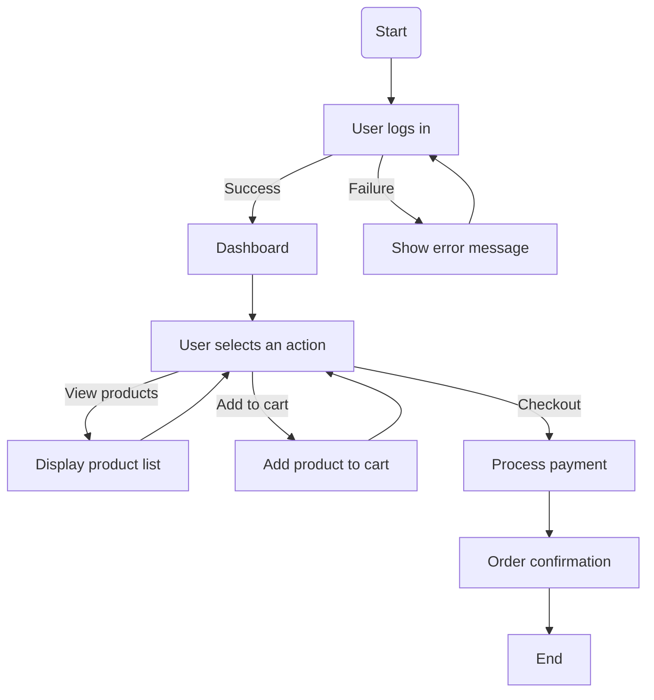
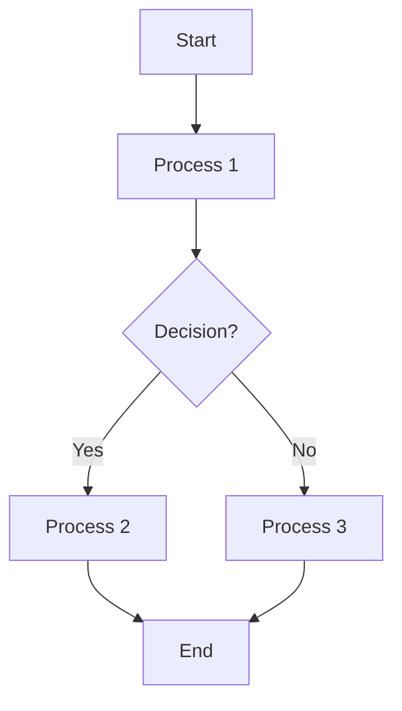
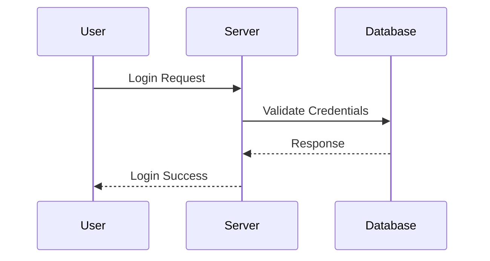
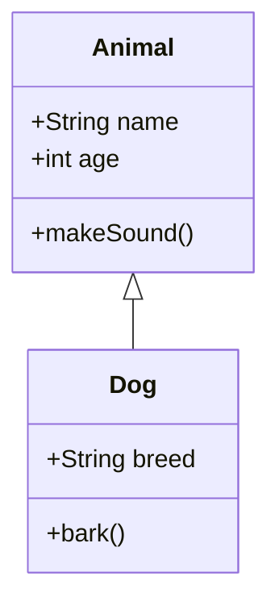
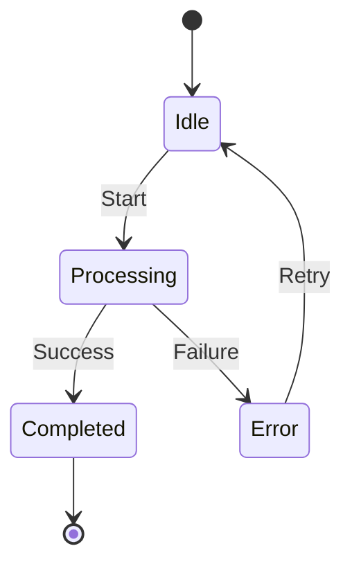
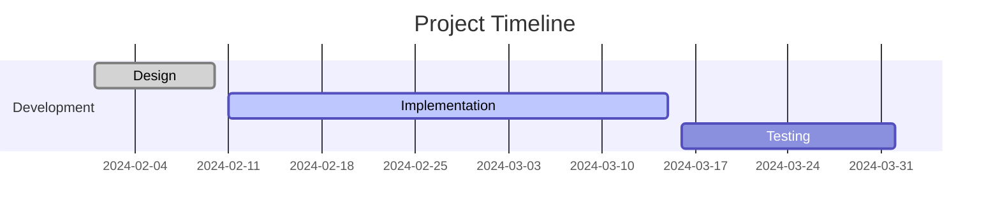
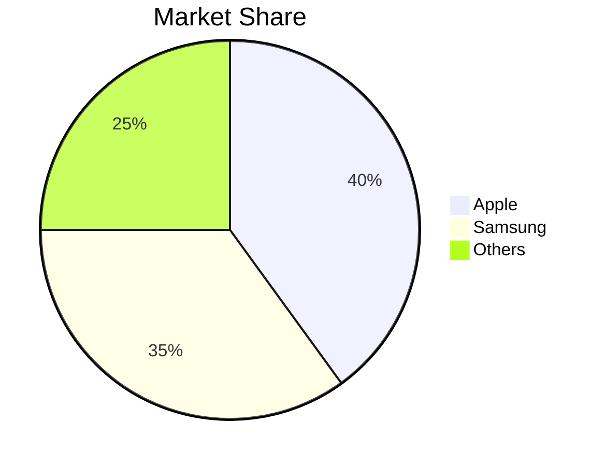
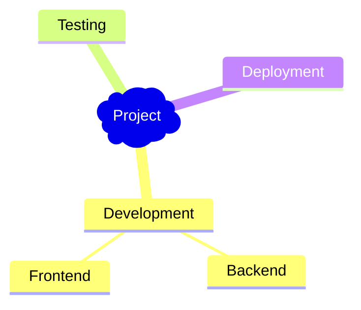

**Activity diagram**

```mermaid
graph TD;
    A(Start) --> B[User logs in]
    B -->|Success| C[Dashboard]
    B -->|Failure| D[Show error message]
    C --> E[User selects an action]
    E -->|View products| F[Display product list]
    E -->|Add to cart| G[Add product to cart]
    E -->|Checkout| H[Process payment]
    H --> I[Order confirmation]
    I --> J[End]
    F --> E
    G --> E
    D --> B
```

**Flowchart Diagram**

```mermaid
graph TD;
    A[Start] --> B[Process 1]
    B --> C{Decision?}
    C -->|Yes| D[Process 2]
    C -->|No| E[Process 3]
    D --> F[End]
    E --> F
```

**Sequence diagram**

```mermaid
sequenceDiagram
    participant User
    participant Server
    participant Database

    User->>Server: Login Request
    Server->>Database: Validate Credentials
    Database-->>Server: Response
    Server-->>User: Login Success
```

**Class diagram**

```mermaid
classDiagram
    class Animal {
        +String name
        +int age
        +makeSound()
    }
    class Dog {
        +String breed
        +bark()
    }
    Animal <|-- Dog

```

**State Diagram**

```mermaid
stateDiagram
    [*] --> Idle
    Idle --> Processing : Start
    Processing --> Completed : Success
    Processing --> Error : Failure
    Error --> Idle : Retry
    Completed --> [*]
```

**Gantt Chart**

```mermaid
gantt
    title Project Timeline
    dateFormat  YYYY-MM-DD
    section Development
    Design :done, d1, 2024-02-01, 2024-02-10
    Implementation :active, i1, 2024-02-11, 2024-03-15
    Testing : t1, 2024-03-16, 2024-04-01
```

**Pie Chart**

```mermaid
pie
    title Market Share
    "Apple" : 40
    "Samsung" : 35
    "Others" : 25
```

**Mind Map**

```mermaid
mindmap root)Project(
        Development
            Backend
            Frontend
        Testing
        Deployment
```

 