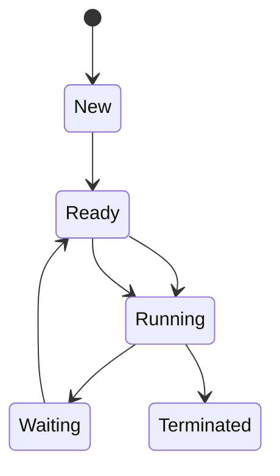

# Operating System: Full-Detail Knowledge Base

## Overview & Importance
An Operating System (OS) is system software that manages computer hardware, software resources, and provides common services for computer programs. It acts as an intermediary between users and the computer hardware, ensuring efficient, secure, and fair resource allocation. The OS is fundamental for usability, security, and performance of all computing devices, from servers to smartphones.

**Importance:**
- Enables user interaction with hardware
- Manages resources (CPU, memory, storage, I/O)
- Provides security and access control
- Supports multitasking and multi-user environments
- Foundation for application software

---

## Key Concepts
- **Process & Thread Management:** Creation, scheduling, and termination of processes and threads
- **Memory Management:** Allocation, protection, and swapping of memory
- **File System:** Organization, storage, and access of data
- **Device Management:** Control and communication with hardware devices
- **User Interface:** CLI, GUI, and APIs for user interaction
- **Security & Protection:** Authentication, authorization, and data integrity
- **Networking:** Communication between devices and over the Internet
- **System Calls:** Interface for user programs to request OS services
- **Virtualization:** Abstraction of hardware for multiple environments
- **Multitasking & Multiprocessing:** Running multiple tasks or processes concurrently

**Exploration Questions:**
- How does the OS manage multiple processes?
- What is the difference between a process and a thread?
- How does virtual memory work?

---

## Subfields / Categories
- **Desktop OS:** Windows, macOS, Linux
- **Mobile OS:** Android, iOS
- **Embedded OS:** RTOS, VxWorks, FreeRTOS
- **Server OS:** Windows Server, Linux Server, UNIX
- **Distributed OS:** Amoeba, Plan 9
- **Real-Time OS:** QNX, RTEMS

**Exploration Questions:**
- What are the unique challenges of embedded OS?
- How do server OS differ from desktop OS?

---

## Theories / Models
- **Process Scheduling Algorithms:** FCFS, SJF, Round Robin, Priority Scheduling
- **Memory Management Models:** Paging, Segmentation, Virtual Memory
- **File System Models:** FAT, NTFS, ext4, HFS+
- **Synchronization Models:** Semaphores, Mutexes, Monitors
- **Deadlock Theories:** Coffman conditions, Deadlock prevention/avoidance/detection
- **Security Models:** Access Control Lists (ACL), Role-Based Access Control (RBAC)

**Example: Round Robin Scheduling (Pseudo-code)**
```pseudo
while (processes in ready queue):
    run process for time quantum
    if process not finished:
        move to end of queue
```

**Mermaid Diagram: Process State Transition**


**Exploration Questions:**
- How does paging differ from segmentation?
- What are the trade-offs of different scheduling algorithms?

---

## Processes / Workflows
1. **Process Lifecycle:**
   - New → Ready → Running → Waiting → Terminated
2. **Memory Allocation:**
   - Request memory → Allocate (paging/segmentation) → Access → Release
3. **File Access:**
   - Open file → Read/Write → Close file
4. **Device I/O:**
   - Request I/O → OS schedules → Device driver executes → Completion interrupt
5. **User Authentication:**
   - User login → Credential verification → Access granted/denied

**Exploration Questions:**
- What happens when a process requests more memory than available?
- How does the OS handle device interrupts?

---

## Applications / Real-world Examples
- **Desktop Computing:** Windows, macOS, Linux for personal computers
- **Mobile Devices:** Android, iOS for smartphones and tablets
- **Servers:** Linux Server, Windows Server for web hosting, databases
- **Embedded Systems:** RTOS in automotive, medical devices
- **Cloud Computing:** Virtualization and containerization (VMware, Docker)
- **Supercomputing:** Custom OS for high-performance clusters

**Case Study:**
- **Android OS:** Built on Linux kernel, optimized for mobile devices, supports millions of apps, manages power and security for mobile hardware.

**Project Ideas:**
- Build a simple shell (command interpreter)
- Simulate a process scheduler
- Implement a basic file system in code

**Exploration Questions:**
- How does the OS ensure security in multi-user environments?
- What are the main differences between Linux and Windows file systems?

---

## Challenges / Limitations
- **Resource Contention:** Multiple processes competing for limited resources
- **Security Threats:** Malware, privilege escalation, data breaches
- **Scalability:** Supporting more users, devices, or cores
- **Real-time Constraints:** Meeting strict timing requirements
- **Legacy Support:** Maintaining compatibility with old hardware/software
- **Energy Efficiency:** Especially in mobile and embedded systems

**Exploration Questions:**
- How do OS designers balance performance and security?
- What are the challenges in supporting legacy hardware?

---

## Trends / Research Directions
- **Microkernel Architectures:** Minimal core, more services in user space
- **Containerization & Virtualization:** Docker, Kubernetes, lightweight VMs
- **Security Enhancements:** Sandboxing, secure boot, trusted execution
- **AI-driven Resource Management:** Predictive scheduling, anomaly detection
- **Edge & IoT OS:** Lightweight, secure, real-time for edge devices
- **Quantum Operating Systems:** Research into OS for quantum computers

**Exploration Questions:**
- What are the benefits of microkernel vs. monolithic kernel?
- How is AI changing OS resource management?

---

## Comparison: Operating System vs. Bare Metal Programming
| Aspect         | Operating System                | Bare Metal Programming           |
|----------------|--------------------------------|----------------------------------|
| Abstraction    | High (APIs, services)          | Low (direct hardware access)     |
| Ease of Use    | Easier for developers/users    | Complex, error-prone             |
| Flexibility    | General-purpose                | Highly specialized               |
| Security       | Built-in mechanisms            | Must be implemented manually     |
| Example        | Linux, Windows, Android        | Arduino, microcontroller code    |

---

## Resources
- **Books:**
  - "Operating System Concepts" by Silberschatz, Galvin, Gagne
  - "Modern Operating Systems" by Andrew S. Tanenbaum
  - "Linux Kernel Development" by Robert Love
- **Websites:**
  - https://www.geeksforgeeks.org/operating-systems/
  - https://www.tutorialspoint.com/operating_system/index.htm
  - https://www.kernel.org/
- **Videos:**
  - Operating System Full Course (YouTube, freeCodeCamp)
  - Operating System Tutorials (Neso Academy)

---

## Case Studies & Project Ideas
- **Case Study:** Linux kernel evolution and its impact on cloud computing
- **Project:** Simulate a memory manager with paging and segmentation
- **Project:** Build a multi-threaded file server

---

## Key Insights
- The OS is the backbone of all modern computing.
- Understanding OS internals is crucial for system programmers, security experts, and advanced developers.
- OS research is rapidly evolving with new hardware and security demands.
