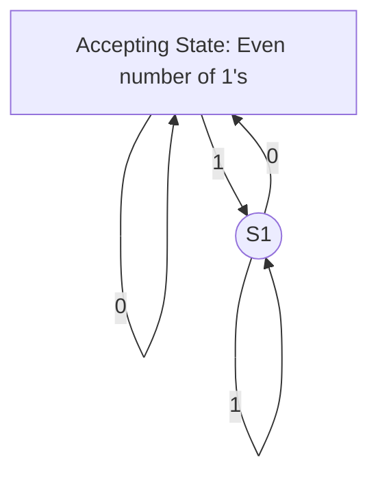

# Theory of Computation: Full-Detail Knowledge Base (English)

## Overview & Importance
The Theory of Computation is a branch of computer science that studies the fundamental capabilities and limitations of computers. It explores what problems can be solved by algorithms, how efficiently they can be solved, and the inherent complexity of computational tasks. This field forms the mathematical foundation for programming languages, compilers, cryptography, and artificial intelligence.

**Importance:**
- Defines the boundaries of what computers can and cannot do
- Provides tools for analyzing algorithmic efficiency and complexity
- Underpins the design of programming languages and compilers
- Essential for cryptography, AI, and formal verification

---

## Key Concepts
- **Automata:** Abstract machines (Finite Automata, Pushdown Automata, Turing Machines) for modeling computation
- **Formal Languages:** Sets of strings defined by rules (regular, context-free, context-sensitive, recursively enumerable)
- **Grammars:** Rules for generating languages (Chomsky hierarchy)
- **Decidability:** Whether a problem can be solved algorithmically
- **Reducibility:** Transforming one problem into another
- **Complexity Classes:** P, NP, NP-complete, NP-hard, PSPACE, etc.
- **Regular Expressions:** Patterns for describing regular languages
- **Halting Problem:** The question of whether a program will finish running or continue forever
- **Church-Turing Thesis:** The equivalence of different models of computation

**Exploration Questions:**
- What is the difference between regular and context-free languages?
- Why is the Halting Problem undecidable?
- How do complexity classes relate to real-world problems?

---

## Subfields / Categories
- **Automata Theory:** Study of abstract machines and their computational power
- **Formal Language Theory:** Study of language classes and grammars
- **Computability Theory:** What can be computed in principle
- **Complexity Theory:** How efficiently problems can be solved
- **Algorithmic Information Theory:** Quantifying information content

**Exploration Questions:**
- How do pushdown automata differ from finite automata?
- What is the significance of the Chomsky hierarchy?

---

## Theories / Models
- **Finite Automata (DFA/NFA):** Recognize regular languages
- **Pushdown Automata (PDA):** Recognize context-free languages
- **Turing Machines:** Model general computation
- **Chomsky Hierarchy:** Classification of languages and grammars
- **P vs NP Problem:** Central open question in complexity theory
- **Reductions:** Proving problem hardness

**Example: DFA for Even Binary Strings**

**Exploration Questions:**
- How does a Turing machine differ from a real computer?
- What are the practical uses of regular expressions?

---

## Processes / Workflows
1. **Designing a Finite Automaton:**
   - Define the language to recognize
   - List all possible states
   - Specify transitions for each input symbol
   - Mark start and accepting states
2. **Proving Undecidability:**
   - Assume a solution exists
   - Construct a contradiction (e.g., Halting Problem)
3. **Complexity Analysis:**
   - Define input size
   - Analyze time/space requirements
   - Classify into complexity classes

**Exploration Questions:**
- What steps are needed to prove a language is not regular?
- How do reductions help in complexity theory?

---

## Applications / Real-world Examples
- **Compiler Design:** Lexical analysis (finite automata), parsing (pushdown automata)
- **Text Search:** Regular expressions in editors and search tools
- **Network Protocols:** State machines for protocol design
- **Cryptography:** Complexity theory for secure encryption
- **AI & Robotics:** Planning and decision-making models

**Case Study:**
- **Regex in Programming:** How regular expressions power search/replace in code editors

**Project Ideas:**
- Build a DFA simulator
- Write a parser for arithmetic expressions
- Explore the P vs NP problem with SAT solvers

**Exploration Questions:**
- How does automata theory apply to network security?
- What are the limitations of context-free grammars?

---

## Challenges / Limitations
- **Undecidability:** Some problems cannot be solved by any algorithm
- **Complexity Barriers:** Many problems are intractable (e.g., NP-complete)
- **Expressiveness vs. Decidability:** More expressive models are harder to analyze
- **Bridging Theory and Practice:** Applying abstract models to real systems

**Exploration Questions:**
- Why are NP-complete problems important?
- How do we deal with undecidable problems in practice?

---

## Trends / Research Directions
- **Quantum Computation:** Extending classical models
- **Parameterized Complexity:** Finer-grained analysis of hard problems
- **Automata for Infinite Words:** ω-automata, model checking
- **Interactive Proofs & Cryptography:** New complexity classes
- **Formal Verification:** Proving correctness of software/hardware

**Exploration Questions:**
- What is the impact of quantum computing on computability?
- How is automata theory used in software verification?

---

## Comparison: Theory of Computation vs. Algorithms
| Aspect         | Theory of Computation           | Algorithms                       |
|----------------|--------------------------------|----------------------------------|
| Focus          | What can be computed           | How to compute efficiently       |
| Abstraction    | High (models, classes)         | Concrete (step-by-step methods)  |
| Example        | Turing machine, DFA            | Sorting, searching algorithms    |

---

## Resources
- **Books:**
  - "Introduction to the Theory of Computation" by Michael Sipser
  - "Automata Theory, Languages, and Computation" by Hopcroft, Motwani, Ullman
  - "Computational Complexity" by Christos Papadimitriou
- **Websites:**
  - https://www.geeksforgeeks.org/theory-of-computation/
  - https://www.tutorialspoint.com/automata_theory/index.htm
- **Videos:**
  - Theory of Computation Full Course (YouTube, Neso Academy)
  - Automata Theory (YouTube, freeCodeCamp)

---

## Case Studies & Project Ideas
- **Case Study:** The Halting Problem and its implications for software
- **Project:** Implement a Turing machine simulator
- **Project:** Analyze the complexity of Sudoku solving

---

## Key Insights
- The Theory of Computation defines the ultimate limits of what computers can do.
- Understanding automata, languages, and complexity is essential for advanced computer science.
- The field continues to evolve with new models and applications.
