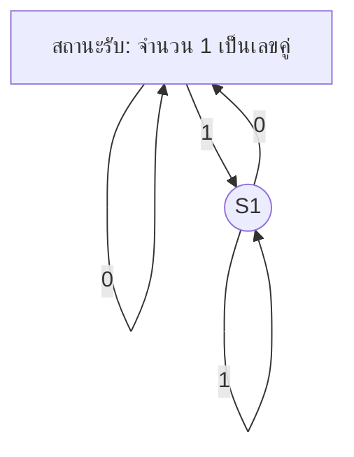

# ทฤษฎีการคำนวณ (Theory of Computation): ฐานความรู้ฉบับละเอียด

## ภาพรวมและความสำคัญ
ทฤษฎีการคำนวณเป็นสาขาหนึ่งของวิทยาการคอมพิวเตอร์ที่ศึกษาขีดจำกัดและศักยภาพของการคำนวณโดยใช้แบบจำลองทางคณิตศาสตร์ เช่น ออโตมาตา ภาษา รูปแบบไวยากรณ์ และเครื่องทัวริง เพื่อกำหนดว่าอะไรคำนวณได้ อะไรคำนวณไม่ได้ และคำนวณได้อย่างมีประสิทธิภาพเพียงใด เป็นรากฐานสำคัญของการออกแบบภาษาโปรแกรม คอมไพเลอร์ ความปลอดภัย และปัญญาประดิษฐ์

**ความสำคัญ:**
- กำหนดขอบเขตของสิ่งที่คอมพิวเตอร์สามารถทำได้และไม่ได้
- เป็นเครื่องมือวิเคราะห์ประสิทธิภาพและความซับซ้อนของอัลกอริทึม
- เป็นพื้นฐานของการออกแบบภาษาโปรแกรมและคอมไพเลอร์
- สำคัญต่อการเข้ารหัสลับ การตรวจสอบความถูกต้อง และ AI

---

## แนวคิดสำคัญ
- **ออโตมาตา (Automata):** เครื่องจักรนามธรรม เช่น Finite Automata, Pushdown Automata, Turing Machine สำหรับจำลองการคำนวณ
- **ภาษาแบบฟอร์มอล (Formal Languages):** กลุ่มของสตริงที่นิยามด้วยกฎ เช่น ภาษาเรกูลาร์ ภาษาไร้บริบท
- **ไวยากรณ์ (Grammars):** กฎการสร้างภาษา (Chomsky Hierarchy)
- **การตัดสินใจได้ (Decidability):** ปัญหาที่สามารถแก้ได้ด้วยอัลกอริทึมหรือไม่
- **การลดรูป (Reducibility):** การแปลงปัญหาหนึ่งเป็นอีกปัญหาหนึ่ง
- **คลาสความซับซ้อน (Complexity Classes):** P, NP, NP-complete, NP-hard, PSPACE ฯลฯ
- **นิพจน์เรกูลาร์ (Regular Expressions):** รูปแบบสำหรับอธิบายภาษาเรกูลาร์
- **ปัญหา Halting (Halting Problem):** ปัญหาว่าโปรแกรมจะหยุดทำงานหรือไม่
- **ทฤษฎี Church-Turing:** ความเท่าเทียมกันของแบบจำลองการคำนวณต่าง ๆ

**คำถามชวนสำรวจ:**
- ภาษาเรกูลาร์กับภาษาไร้บริบทต่างกันอย่างไร?
- ทำไมปัญหา Halting ถึงตัดสินใจไม่ได้?
- คลาสความซับซ้อนมีผลต่อปัญหาในชีวิตจริงอย่างไร?

---

## สาขาย่อย / หมวดหมู่
- **ทฤษฎีออโตมาตา:** ศึกษาเครื่องจักรนามธรรมและพลังการคำนวณ
- **ทฤษฎีภาษาแบบฟอร์มอล:** ศึกษากลุ่มภาษาและไวยากรณ์
- **ทฤษฎีการคำนวณได้:** อะไรคำนวณได้ในหลักการ
- **ทฤษฎีความซับซ้อน:** ศึกษาความยากง่ายของปัญหา
- **ทฤษฎีข้อมูลเชิงอัลกอริทึม:** วัดปริมาณข้อมูลในสตริง

**คำถามชวนสำรวจ:**
- Pushdown Automata ต่างจาก Finite Automata อย่างไร?
- Chomsky Hierarchy สำคัญอย่างไร?

---

## ทฤษฎี / แบบจำลอง
- **Finite Automata (DFA/NFA):** รับรู้ภาษาเรกูลาร์
- **Pushdown Automata (PDA):** รับรู้ภาษาไร้บริบท
- **Turing Machine:** แบบจำลองการคำนวณทั่วไป
- **Chomsky Hierarchy:** การจัดกลุ่มภาษาและไวยากรณ์
- **ปัญหา P vs NP:** ปัญหาสำคัญในทฤษฎีความซับซ้อน
- **การลดรูป:** การพิสูจน์ความยากของปัญหา

**ตัวอย่าง: DFA สำหรับสตริงไบนารีที่มีจำนวน 1 เป็นเลขคู่**

**คำถามชวนสำรวจ:**
- เครื่องทัวริงต่างจากคอมพิวเตอร์จริงอย่างไร?
- นิพจน์เรกูลาร์ใช้ประโยชน์อะไรในชีวิตจริง?

---

## กระบวนการ / เวิร์กโฟลว์
1. **ออกแบบ Finite Automaton:**
   - กำหนดภาษาที่ต้องการรับรู้
   - ระบุสถานะทั้งหมด
   - กำหนดการเปลี่ยนสถานะสำหรับแต่ละอินพุต
   - ระบุสถานะเริ่มต้นและสถานะรับ
2. **พิสูจน์ปัญหาตัดสินใจไม่ได้:**
   - สมมติว่ามีวิธีแก้
   - สร้างข้อขัดแย้ง (เช่น ปัญหา Halting)
3. **วิเคราะห์ความซับซ้อน:**
   - กำหนดขนาดอินพุต
   - วิเคราะห์เวลา/หน่วยความจำที่ใช้
   - จัดกลุ่มคลาสความซับซ้อน

**คำถามชวนสำรวจ:**
- ต้องทำอย่างไรจึงจะพิสูจน์ว่าภาษาไม่ใช่ภาษาเรกูลาร์?
- การลดรูปช่วยในทฤษฎีความซับซ้อนอย่างไร?

---

## การประยุกต์ใช้ / ตัวอย่างจริง
- **การออกแบบคอมไพเลอร์:** Lexical analysis (finite automata), parsing (pushdown automata)
- **ค้นหาข้อความ:** นิพจน์เรกูลาร์ในโปรแกรมแก้ไขข้อความ
- **โปรโตคอลเครือข่าย:** State machine สำหรับออกแบบโปรโตคอล
- **การเข้ารหัสลับ:** ทฤษฎีความซับซ้อนสำหรับความปลอดภัย
- **AI & Robotics:** แบบจำลองการวางแผนและตัดสินใจ

**กรณีศึกษา:**
- **Regex ในโปรแกรมมิ่ง:** นิพจน์เรกูลาร์กับการค้นหา/แทนที่ข้อความ

**ไอเดียโปรเจกต์:**
- สร้าง DFA simulator
- เขียน parser สำหรับนิพจน์คณิตศาสตร์
- สำรวจปัญหา P vs NP ด้วย SAT solver

**คำถามชวนสำรวจ:**
- ทฤษฎีออโตมาตาเกี่ยวข้องกับความปลอดภัยเครือข่ายอย่างไร?
- ข้อจำกัดของภาษาไร้บริบทคืออะไร?

---

## ข้อจำกัด / ความท้าทาย
- **ปัญหาตัดสินใจไม่ได้:** บางปัญหาไม่มีอัลกอริทึมแก้ไขได้
- **กำแพงความซับซ้อน:** หลายปัญหาแก้ไขไม่ได้ในเวลาจำกัด (NP-complete)
- **ความสามารถ vs. การวิเคราะห์:** แบบจำลองที่ทรงพลังมักวิเคราะห์ยาก
- **เชื่อมโยงทฤษฎีกับการปฏิบัติ:** การนำแบบจำลองนามธรรมไปใช้จริง

**คำถามชวนสำรวจ:**
- ทำไม NP-complete ถึงสำคัญ?
- เราจัดการกับปัญหาตัดสินใจไม่ได้อย่างไรในทางปฏิบัติ?

---

## แนวโน้ม / งานวิจัย
- **Quantum Computation:** ขยายแบบจำลองคลาสสิก
- **Parameterized Complexity:** วิเคราะห์ปัญหายากแบบละเอียด
- **Automata สำหรับคำอนันต์:** ω-automata, model checking
- **Interactive Proofs & Cryptography:** คลาสความซับซ้อนใหม่
- **Formal Verification:** พิสูจน์ความถูกต้องของซอฟต์แวร์/ฮาร์ดแวร์

**คำถามชวนสำรวจ:**
- Quantum computing มีผลต่อ computability อย่างไร?
- ทฤษฎีออโตมาตาใช้ใน software verification อย่างไร?

---

## เปรียบเทียบ: ทฤษฎีการคำนวณ vs. อัลกอริทึม
| ประเด็น         | ทฤษฎีการคำนวณ                | อัลกอริทึม                       |
|------------------|-------------------------------|-----------------------------------|
| โฟกัส            | อะไรคำนวณได้                 | วิธีคำนวณอย่างมีประสิทธิภาพ      |
| นามธรรม          | สูง (แบบจำลอง, คลาส)         | รูปธรรม (ขั้นตอน)                 |
| ตัวอย่าง         | เครื่องทัวริง, DFA            | การเรียงลำดับ, การค้นหา           |

---

## แหล่งเรียนรู้
- **หนังสือ:**
  - "Introduction to the Theory of Computation" โดย Michael Sipser
  - "Automata Theory, Languages, and Computation" โดย Hopcroft, Motwani, Ullman
  - "Computational Complexity" โดย Christos Papadimitriou
- **เว็บไซต์:**
  - https://www.geeksforgeeks.org/theory-of-computation/
  - https://www.tutorialspoint.com/automata_theory/index.htm
- **วิดีโอ:**
  - Theory of Computation Full Course (YouTube, Neso Academy)
  - Automata Theory (YouTube, freeCodeCamp)

---

## กรณีศึกษา & ไอเดียโปรเจกต์
- **กรณีศึกษา:** ปัญหา Halting และผลกระทบต่อซอฟต์แวร์
- **โปรเจกต์:** สร้าง Turing machine simulator
- **โปรเจกต์:** วิเคราะห์ความซับซ้อนของ Sudoku

---

## ข้อคิดสำคัญ
- ทฤษฎีการคำนวณกำหนดขีดจำกัดสูงสุดของสิ่งที่คอมพิวเตอร์ทำได้
- ความเข้าใจออโตมาตา ภาษา และความซับซ้อนสำคัญต่อวิทยาการคอมพิวเตอร์ขั้นสูง
- สาขานี้ยังคงพัฒนาอย่างต่อเนื่องด้วยแบบจำลองและการประยุกต์ใหม่ ๆ
