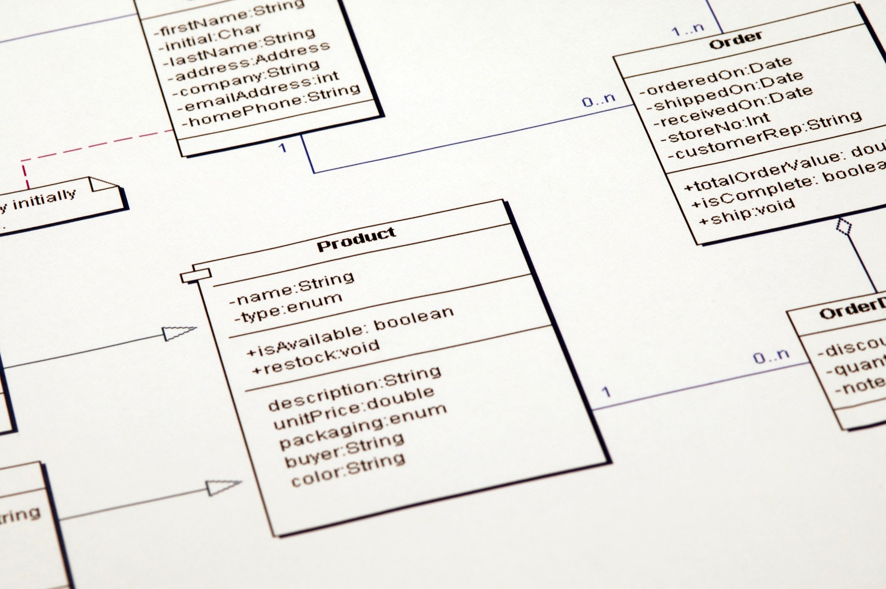

# **(Software Design Models) แบบจำลองการออกแบบซอฟต์แวร์** 

คือ แผนภาพหรือเครื่องมือที่ใช้ในการแสดงโครงสร้างและพฤติกรรมของระบบซอฟต์แวร์ ก่อนที่จะเริ่มเขียนโค้ดจริง ๆ ลองนึกภาพเหมือนสถาปนิกที่ต้องวาดแบบแปลนบ้านก่อนลงมือก่อสร้างจริง ๆ เพื่อให้เห็นภาพรวมและรายละเอียดต่าง ๆ ได้อย่างชัดเจน แบบจำลองเหล่านี้ช่วยให้นักพัฒนามองเห็นภาพเดียวกัน ลดความผิดพลาด และทำให้การสื่อสารระหว่างทีมเป็นไปอย่างราบรื่นมากขึ้น

- แบบจำลองการออกแบบซอฟต์แวร์แบ่งออกเป็นหลายประเภท แต่หลัก ๆ แล้วสามารถแบ่งตามมุมมองที่ใช้ในการนำเสนอได้ 2 ประเภทใหญ่ ๆ คือ

## 1. แบบจำลองเชิงโครงสร้าง **(Structural Models)**
แบบจำลองประเภทนี้จะเน้นไปที่ โครงสร้างของระบบ และความสัมพันธ์ระหว่างองค์ประกอบต่าง ๆ 

   - **Class Diagram**: เป็นแบบจำลองที่ใช้บ่อยที่สุด ใช้แสดงคลาส (Class) ต่าง ๆ ในระบบ คุณสมบัติ (Attributes) และการกระทำ (Methods) ของแต่ละคลาส รวมถึงความสัมพันธ์ระหว่างคลาสเหล่านั้น เช่น ความสัมพันธ์แบบสืบทอด (Inheritance) หรือการประกอบเข้าด้วยกัน (Composition)
   - **Component Diagram**: ใช้แสดงองค์ประกอบ (Component) ระดับสูงของระบบ เช่น โมดูลย่อยต่าง ๆ และความสัมพันธ์ระหว่างกัน แบบจำลองนี้เหมาะสำหรับการมองภาพรวมของระบบขนาดใหญ่
   - **Deployment Diagram**: ใช้แสดงว่าซอฟต์แวร์และฮาร์ดแวร์จะถูกติดตั้งและทำงานร่วมกันอย่างไรในสภาพแวดล้อมจริง เช่น Server และ Database อยู่ที่ไหน

## 2. แบบจำลองเชิงพฤติกรรม **(Behavioral Models)**
แบบจำลองประเภทนี้จะเน้นไปที่ การทำงานหรือพฤติกรรมของระบบ และวิธีการที่องค์ประกอบต่าง ๆ โต้ตอบกัน

   - **Use Case Diagram**: แสดงว่าผู้ใช้ (Actor) โต้ตอบกับระบบอย่างไร โดยจะระบุหน้าที่หลัก (Use Case) ที่ระบบต้องทำ
   - **Sequence Diagram**: แสดงลำดับการโต้ตอบของ Object ต่าง ๆ ในระบบในช่วงเวลาหนึ่ง แบบจำลองนี้เหมาะสำหรับการดูขั้นตอนการทำงานของฟังก์ชันเฉพาะเจาะจง
   - **Activity Diagram**: แสดงลำดับกิจกรรมหรือขั้นตอนการทำงานของกระบวนการใดกระบวนการหนึ่งในระบบ คล้ายกับ Flowchart

**ประโยชน์ของการใช้แบบจำลองการออกแบบซอฟต์แวร์**
   - **ช่วยให้เห็นภาพรวมของระบบ**: ช่วยให้ทุกคนในทีมเข้าใจภาพรวมของระบบตรงกันตั้งแต่เนิ่น ๆ
   - **ลดความผิดพลาดในการพัฒนา**: การออกแบบที่ดีตั้งแต่ต้นจะช่วยลดข้อผิดพลาดที่อาจเกิดขึ้นระหว่างการเขียนโค้ด
   - **ช่วยให้การสื่อสารระหว่างทีมดีขึ้น**: เป็นภาษาภาพที่ทุกคนเข้าใจร่วมกัน ไม่ว่าจะเป็นนักพัฒนา นักวิเคราะห์ หรือผู้จัดการโครงการ
   - **ง่ายต่อการบำรุงรักษาและปรับปรุง**: เมื่อระบบมีแบบจำลองที่ดี การแก้ไขหรือเพิ่มเติมส่วนต่าง ๆ ในอนาคตก็จะทำได้ง่ายขึ้น