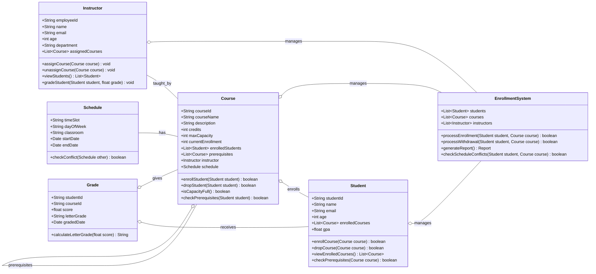
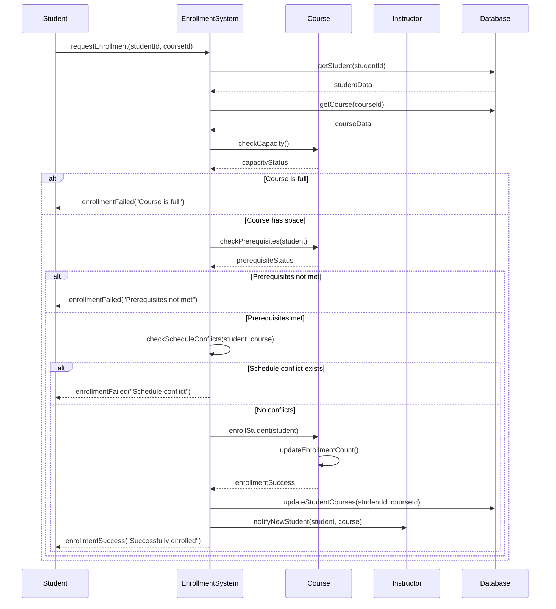
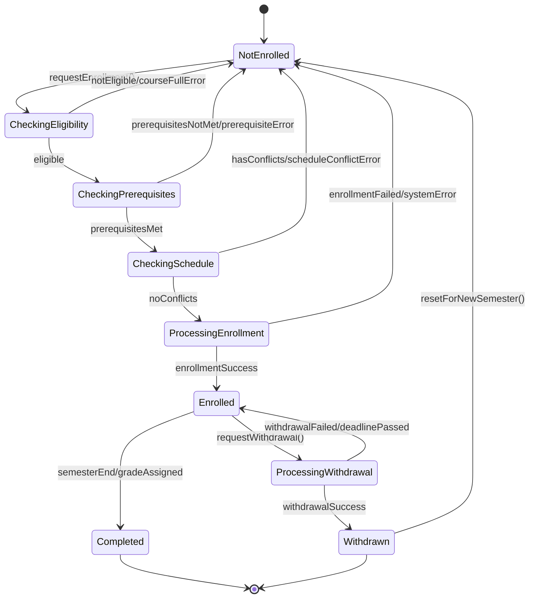
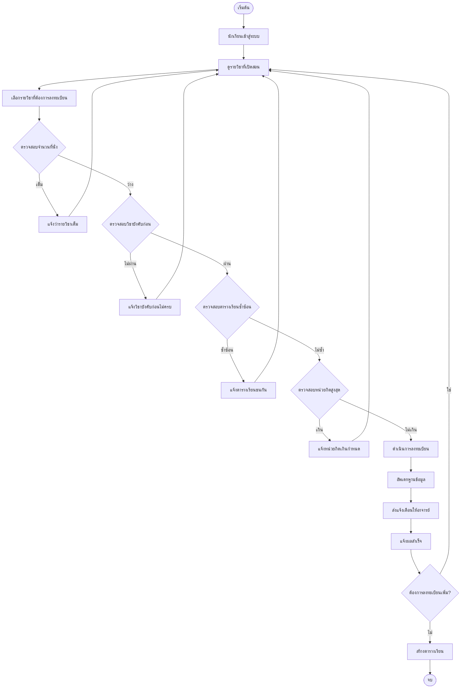
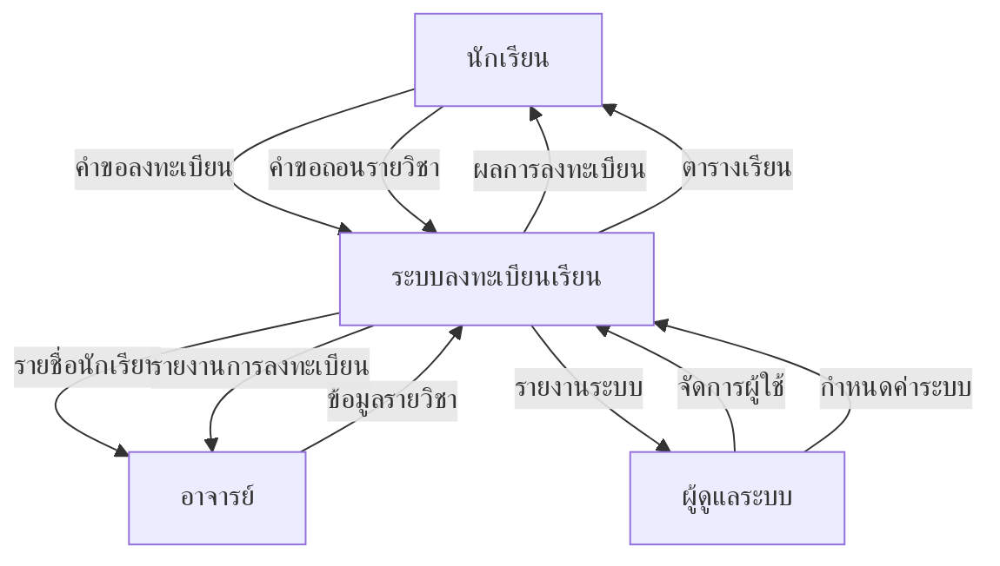
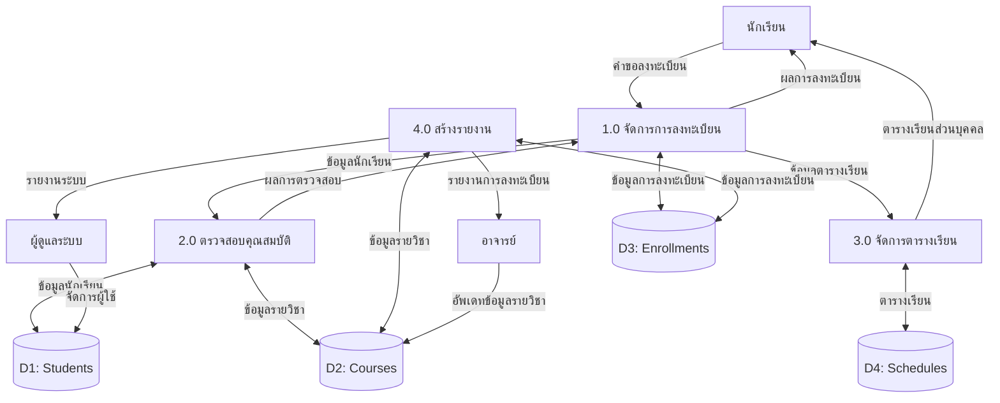
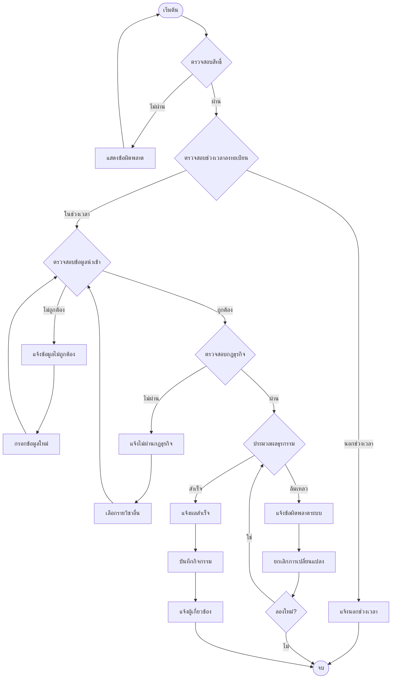
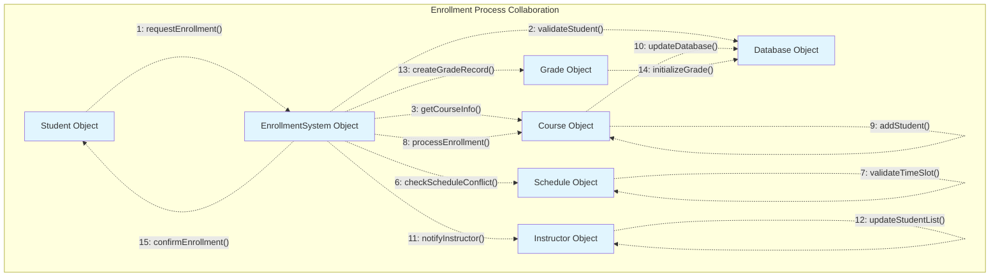

# ระบบการลงทะเบียนเรียน - Enrollment System Diagrams

## 1. Class Diagram

## 2. Sequence Diagram - การลงทะเบียนเรียน

## 3. State Diagram - สถานะของการลงทะเบียน

## 4. Activity Diagram - กระบวนการลงทะเบียนเรียน

## 5. Data Flow Diagram (DFD) - Level 0 & Level 1

### Level 0 (Context Diagram)

### Level 1 (Detailed DFD)

## 6. Control Flow Diagram - การควบคุมการลงทะเบียน

## 7. Collaboration Diagram - การทำงานร่วมกันของ Objects

## การอธิบายเพิ่มเติม

### ความเชื่อมโยงระหว่าง Diagrams
1. **Class Diagram** แสดงโครงสร้างของระบบ
2. **Sequence Diagram** แสดงลำดับการทำงานตามเวลา
3. **State Diagram** แสดงสถานะต่างๆ ของการลงทะเบียน
4. **Activity Diagram** แสดงขั้นตอนการทำงานแบบ parallel
5. **Data Flow Diagram** แสดงการไหลของข้อมูลในระบบ
6. **Control Flow Diagram** แสดงการควบคุมและการตัดสินใจ
7. **Collaboration Diagram** แสดงการทำงานร่วมกันของ objects

### การปรับปรุงจาก Class Diagram เดิม
- เพิ่ม **Schedule** class สำหรับจัดการตารางเรียน
- เพิ่ม **Grade** class สำหรับจัดการเกรด
- เพิ่ม **EnrollmentSystem** class เป็น controller หลัก
- เพิ่ม attributes และ methods ที่จำเป็นมากขึ้น
- เพิ่ม prerequisites และ capacity management
