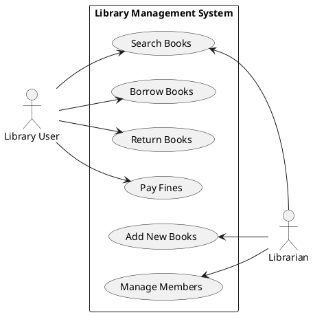
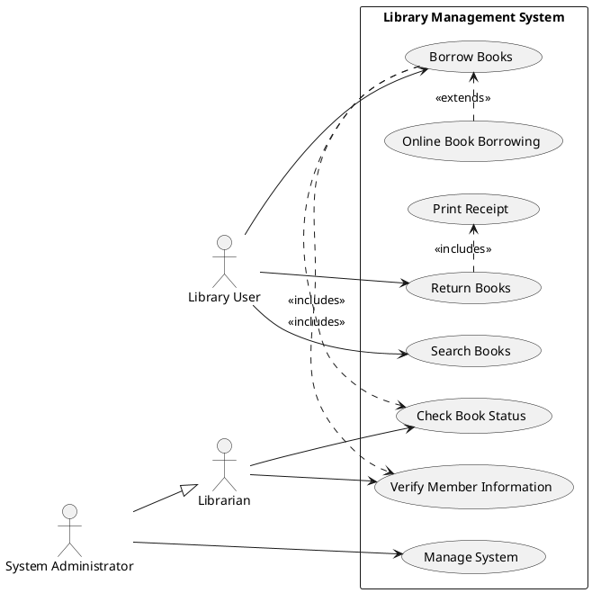
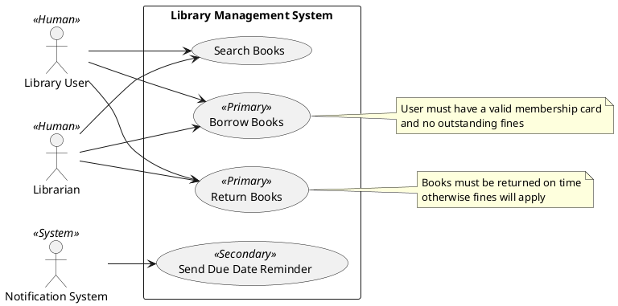
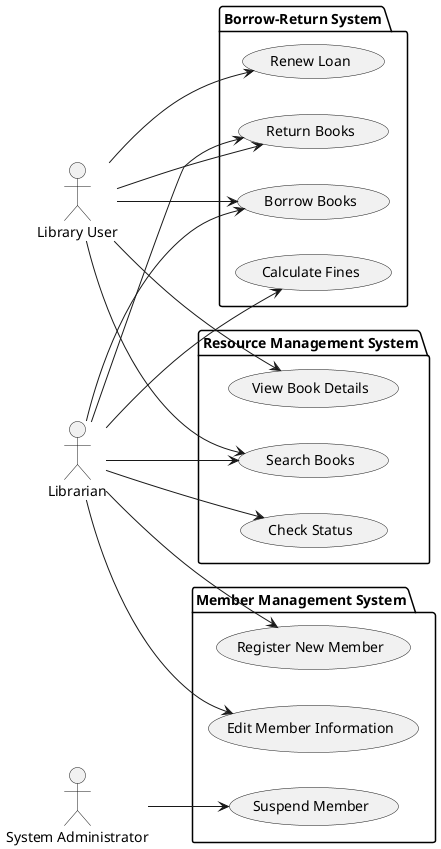
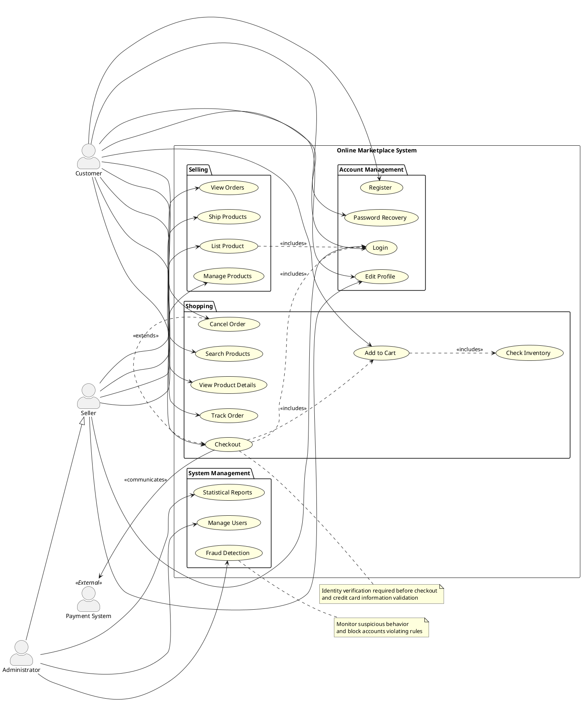
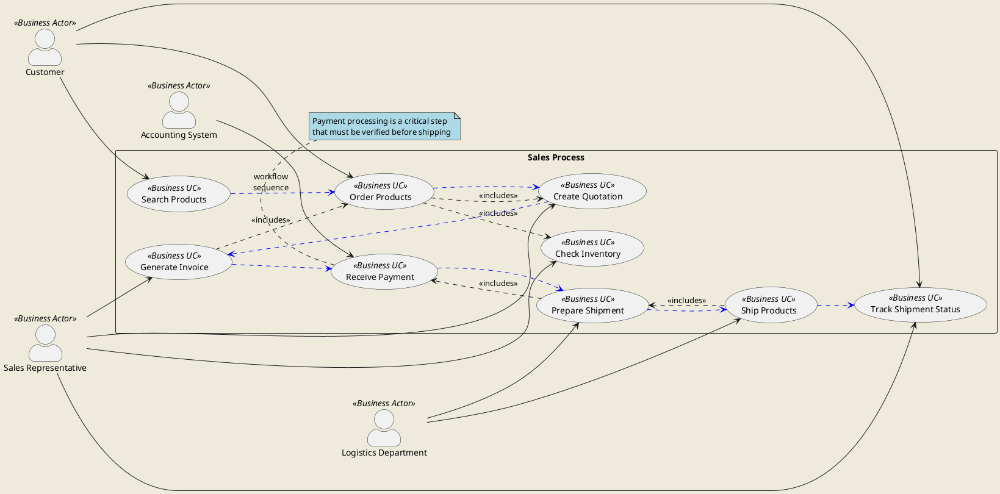

# Use Case Diagram Examples with PlantUML

This document showcases examples of creating Use Case Diagrams with PlantUML, covering various techniques commonly used in design.

## Example 1: Basic Use Case Diagram (with Balanced Actors)



## Example 2: Using Relationships



## Example 3: Using Stereotypes and Notes



## Example 4: Grouping Use Cases with Packages



## Example 5: Complex System with Multiple Relationships



## Example 6: Using Colors, Formatting, and Customization

```plantuml
@startuml "Movie Ticket Booking System"
left to right direction
!option handwritten true
skinparam actorStyle awesome
skinparam shadowing true
skinparam usecase {
  BackgroundColor lightblue
  BorderColor DarkSlateGray
  ArrowColor Maroon
  FontName Arial
  FontSize 12
}

' Using together to group related use cases before defining them
!pragma layout smetana
together {
  usecase "View Showtimes" as UC2
  usecase "Select Seats" as UC3
  usecase "Book Tickets" as UC4 #yellow
}

' Actors
:Viewer: as Viewer #pink
:Staff: as Staff #lightgreen
:Manager: as Manager #orange
:Payment Gateway: as PaymentGateway #lightgrey

rectangle "Movie Ticket Booking System" #AliceBlue {
  usecase "Login" as UC1 #white
  ' UC2, UC3, UC4 already defined above with together
  usecase "Make Payment" as UC5
  usecase "Cancel Booking" as UC6
  usecase "Manage Movies" as UC7
  usecase "Manage Showtimes" as UC8
  usecase "Print Revenue Reports" as UC9 #lightgreen
  usecase "Verify Customer Info" as UC10
}

' Relationships
Viewer --> UC1 #blue : access
Viewer --> UC2 #blue
Viewer --> UC3 #blue
Viewer --> UC4 #blue
Viewer --> UC5 #blue
Viewer --> UC6 #blue

Staff --> UC1
Staff --> UC7
Staff --> UC8
Staff --> UC10

Manager --> UC9

UC4 ..> UC1 : <<includes>> #red
UC4 ..> UC3 : <<includes>> #red
UC4 ..> UC5 : <<includes>> #red

UC5 --> PaymentGateway #green : <<communicates>>

' Using formatted note
note bottom of UC5 #lightyellow
  <b>Payment Methods</b>
  - Credit Card
  - Mobile Banking
  - Coupons/Promotions
end note

@enduml
```

**หมายเหตุเกี่ยวกับการใช้ together**: 
- `together` ใช้เพื่อจัดกลุ่มองค์ประกอบที่เกี่ยวข้องกันให้อยู่ใกล้กันในแผนภาพ
- ในตัวอย่างนี้ เราจัดกลุ่ม use case ที่เกี่ยวข้องกับกระบวนการจองตั๋ว (ดูรอบฉาย, เลือกที่นั่ง, จองตั๋ว)
- การใช้ together มักทำงานได้ดีกว่าเมื่อกำหนดก่อนการนิยามองค์ประกอบอื่นๆ
- คำสั่ง `!pragma layout smetana` ช่วยปรับปรุงอัลกอริทึมการจัดวางเพื่อให้ทำงานได้ดีกับ together

## Example 7: Using Business Use Case Diagram



## Summary of Techniques Used in Use Case Diagrams

1. **Basic Elements**
   - Actors
   - Use Cases
   - System Boundary

2. **Relationships**
   - Association (solid line): Relationship between Actor and Use Case
   - Include (<<includes>>): One use case includes another as part of its main process
   - Extend (<<extends>>): One use case extends the functionality of another
   - Generalization/Inheritance: Inheritance relationship (between actors or between use cases)

3. **Grouping and Structure**
   - Packages: Grouping use cases by category
   - System Boundary: Rectangle showing system scope

4. **Additional Notations**
   - Notes: Explanatory text
   - Stereotypes: <<stereotype>> to indicate element types
   - Colors & Formatting: Using colors and formatting to improve clarity

5. **Advanced Techniques**
   - Business Use Case Diagram: Showing business processes
   - Workflow Indication: Showing sequence of operations
   - Skinparams: Customizing diagram appearance
