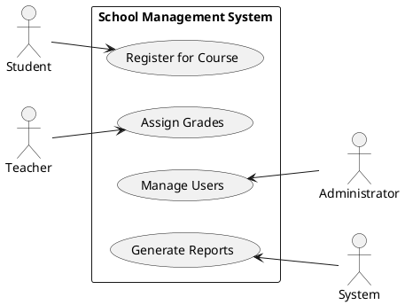
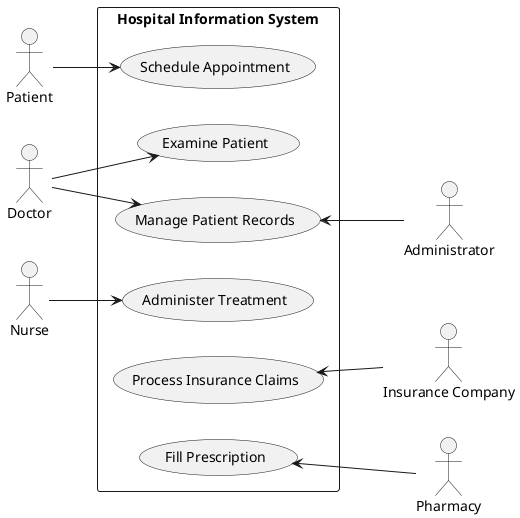
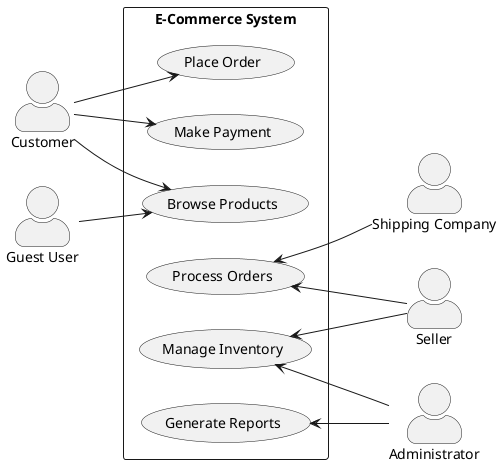
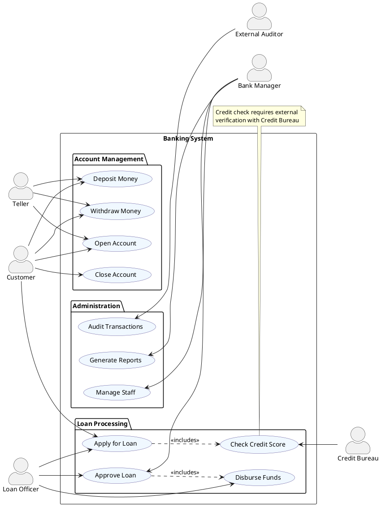
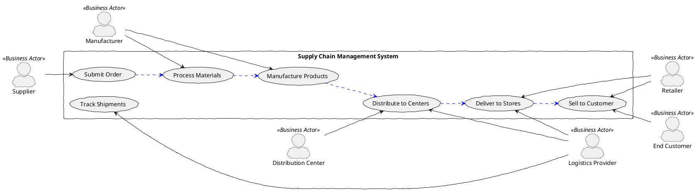

# Balanced Actor Positioning in Use Case Diagrams

PlantUML สามารถกำหนดให้ actor อยู่ทั้งฝั่งซ้ายและขวาของแผนภาพได้ เพื่อให้เกิดความสมดุลทางการออกแบบ มีหลายวิธีในการทำเช่นนี้:

## Example 1: Using left/right keywords

## Example 2: Explicit actor positioning

## Example 3: Using "left" and "right" in actor definition

## Example 4: Complex system with balanced actors

## Example 5: Business Process with Balanced Stakeholders

## ข้อแนะนำในการจัดวาง Actors ให้สมดุล

1. **ใช้ทิศทางความสัมพันธ์ที่ถูกต้อง**:
   - ใช้ `-->` สำหรับเชื่อมจาก actor ฝั่งซ้ายไปยัง use case
   - ใช้ `<--` สำหรับเชื่อมจาก use case ไปยัง actor ฝั่งขวา

2. **ใช้การจัดกลุ่ม actors ตามหน้าที่**:
   - ฝั่งซ้าย: มักใช้สำหรับ primary actors หรือ actors ที่เริ่มต้นใช้ระบบ
   - ฝั่งขวา: มักใช้สำหรับ secondary actors หรือ supporting actors

3. **ควรกำหนด** `left to right direction` เพื่อให้แผนภาพมีทิศทางที่ชัดเจน

4. **ระวังเรื่องการใช้สี** เพื่อให้แผนภาพอ่านง่ายเมื่อมี actors ทั้งสองฝั่ง