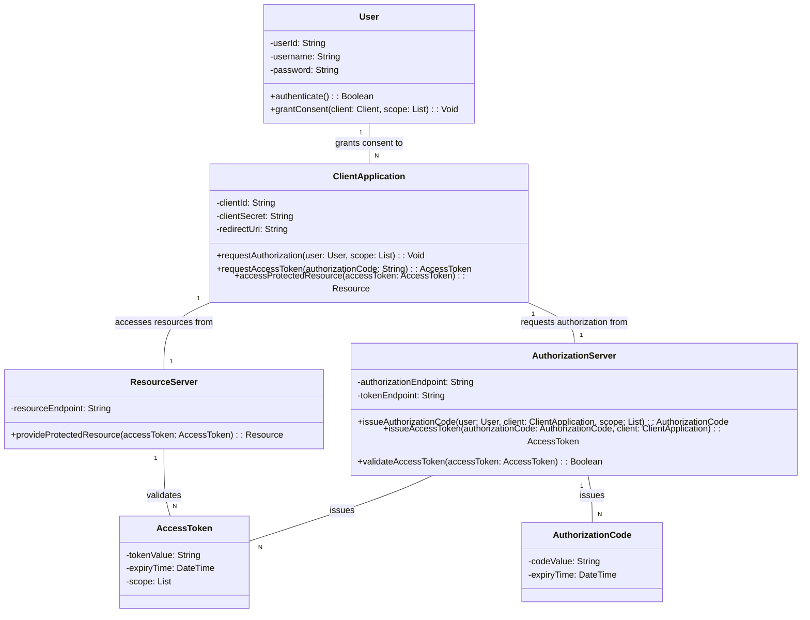

```mermaid
classDiagram
    class User {
        -userId: String
        -username: String
        -password: String
        +authenticate(): Boolean
        +grantConsent(client: Client, scope: List<String>): Void
    }

    class ClientApplication {
        -clientId: String
        -clientSecret: String
        -redirectUri: String
        +requestAuthorization(user: User, scope: List<String>): Void
        +requestAccessToken(authorizationCode: String): AccessToken
        +accessProtectedResource(accessToken: AccessToken): Resource
    }

    class AuthorizationServer {
        -authorizationEndpoint: String
        -tokenEndpoint: String
        +issueAuthorizationCode(user: User, client: ClientApplication, scope: List<String>): AuthorizationCode
        +issueAccessToken(authorizationCode: AuthorizationCode, client: ClientApplication): AccessToken
        +validateAccessToken(accessToken: AccessToken): Boolean
    }

    class ResourceServer {
        -resourceEndpoint: String
        +provideProtectedResource(accessToken: AccessToken): Resource
    }

    class AccessToken {
        -tokenValue: String
        -expiryTime: DateTime
        -scope: List<String>
    }

    class AuthorizationCode {
        -codeValue: String
        -expiryTime: DateTime
    }

    User "1" -- "N" ClientApplication : grants consent to
    ClientApplication "1" -- "1" AuthorizationServer : requests authorization from
    ClientApplication "1" -- "1" ResourceServer : accesses resources from
    AuthorizationServer "1" -- "N" AccessToken : issues
    AuthorizationServer "1" -- "N" AuthorizationCode : issues
    ResourceServer "1" -- "N" AccessToken : validates
```