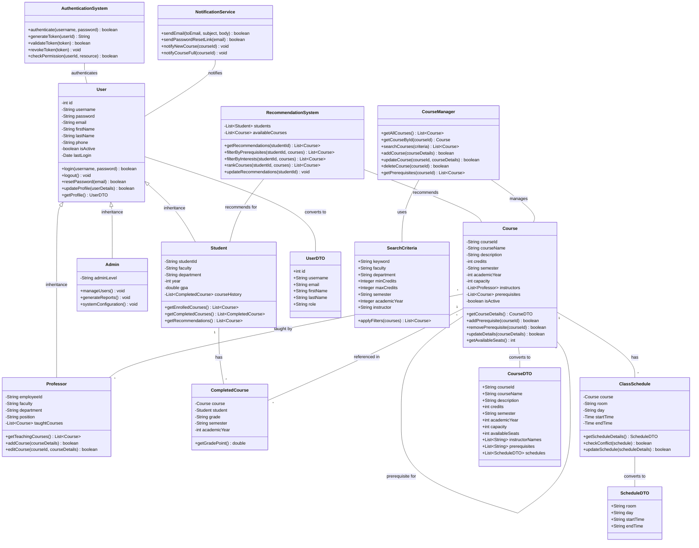

# Class Diagram สำหรับระบบแนะนำรายวิชา

Class Diagram นี้แสดงองค์ประกอบหลักและความสัมพันธ์ระหว่างคลาสต่างๆ ในระบบแนะนำรายวิชา ซึ่งถูกออกแบบตามความต้องการจาก Use Case Description และ Sequence Diagram

## Class Diagram หลักของระบบทั้งหมด

## Class Diagram สำหรับส่วนของผู้ใช้ (User Subsystem)

## Class Diagram สำหรับส่วนของรายวิชา (Course Subsystem)

## Class Diagram สำหรับส่วนของระบบแนะนำรายวิชา (Recommendation Subsystem)

## Class Diagram สำหรับส่วนของการจัดการระบบ (Management Subsystem)

## Class Diagram สำหรับ Data Transfer Objects และ Utility Classes

Class Diagram นี้แสดงให้เห็นถึงโครงสร้างของระบบแนะนำรายวิชาทั้งหมด ครอบคลุมความสัมพันธ์ระหว่างผู้ใช้ รายวิชา และระบบแนะนำ รวมถึงคลาสสนับสนุนต่างๆ ที่จำเป็นสำหรับการทำงานของระบบ