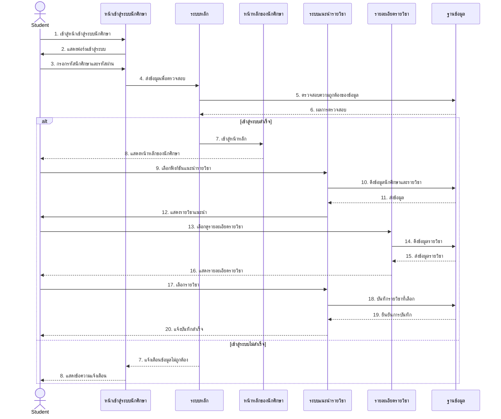
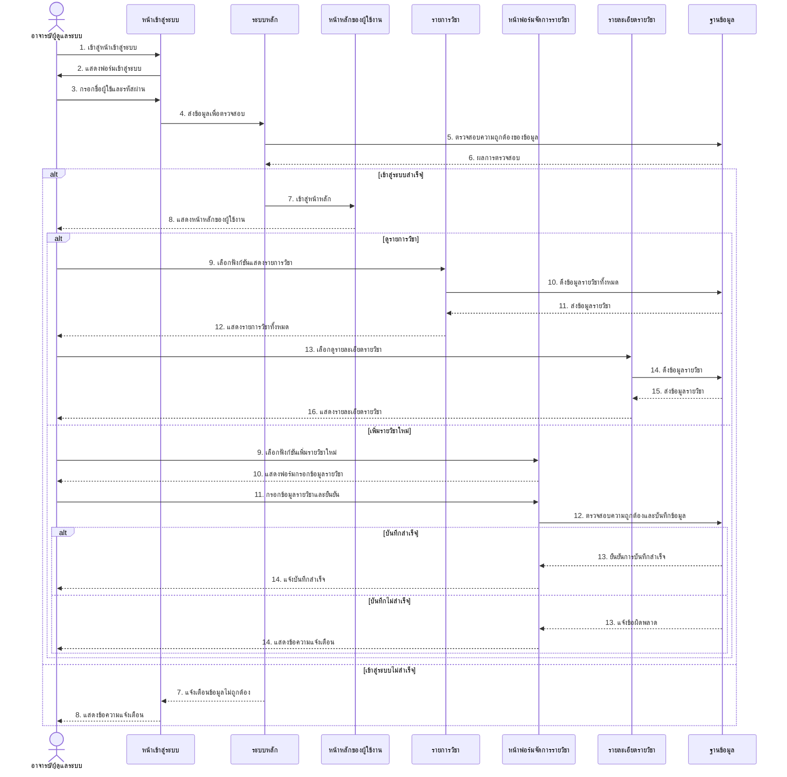
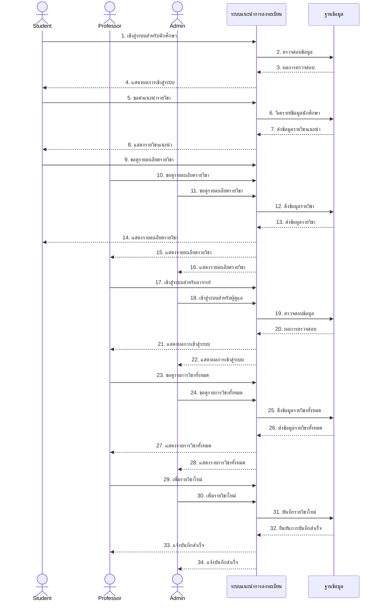

# Sequence Diagram สำหรับ UCD0: ระบบแนะนำการลงทะเบียนเรียน

ต่อไปนี้เป็น Sequence Diagram ที่แสดงภาพรวมของการทำงานของระบบแนะนำการลงทะเบียนเรียนตาม UCD0

## Sequence Diagram ของนักศึกษา (Student)

## Sequence Diagram ของอาจารย์และผู้ดูแลระบบ (Professor & Admin)

## Sequence Diagram ภาพรวมของระบบ (Overview)

