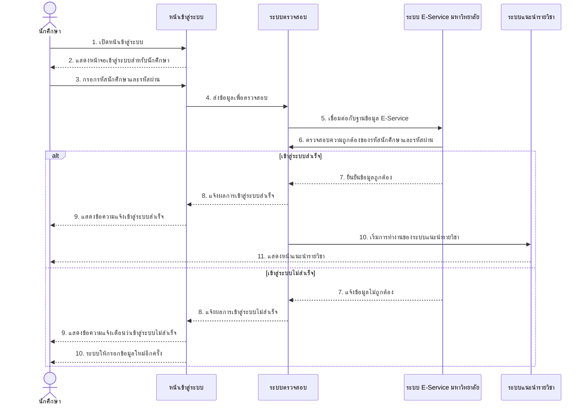
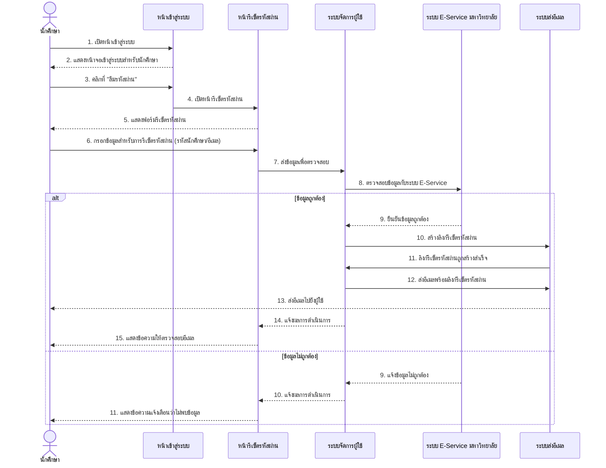
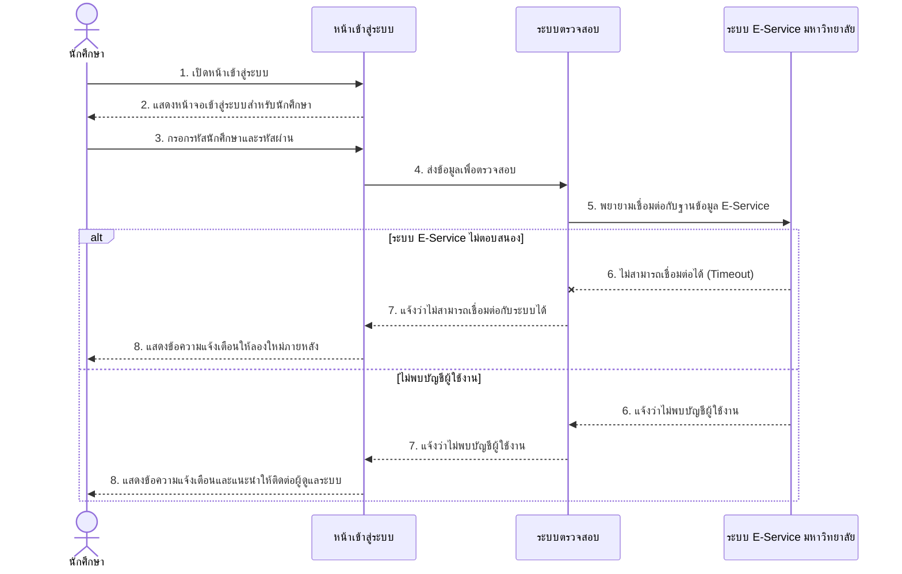
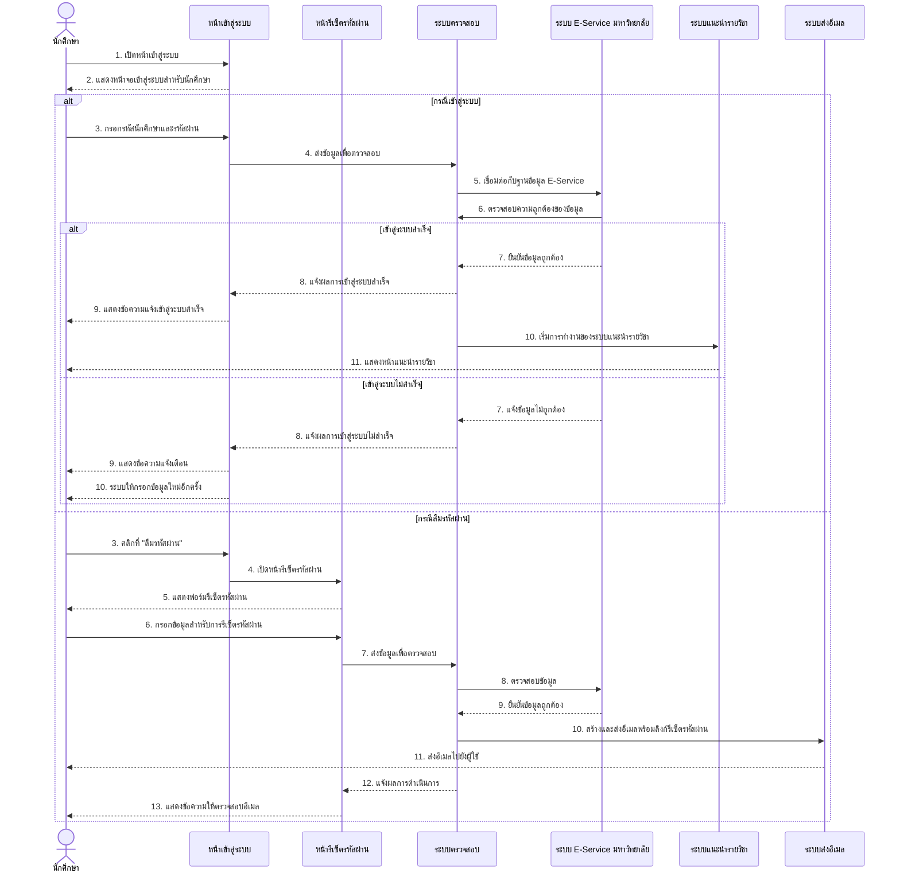

# Sequence Diagram สำหรับ UCD1: ระบบเข้าสู่ระบบสำหรับนักศึกษา

ต่อไปนี้เป็น Sequence Diagram ที่แสดงขั้นตอนการทำงานของระบบเข้าสู่ระบบสำหรับนักศึกษาตาม UCD1

## Sequence Diagram หลักของระบบเข้าสู่ระบบสำหรับนักศึกษา

## Sequence Diagram กรณีลืมรหัสผ่าน

## Sequence Diagram กรณีเกิดข้อผิดพลาดในการเชื่อมต่อ

## Sequence Diagram ภาพรวมของกระบวนการทั้งหมด

