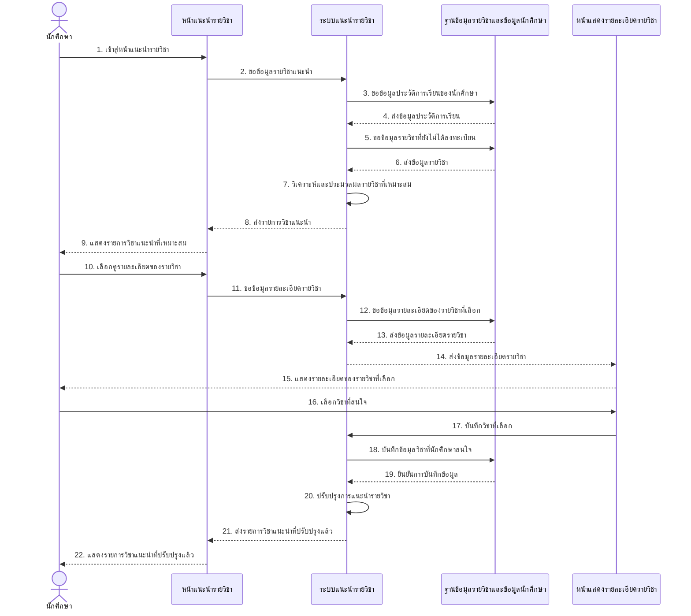
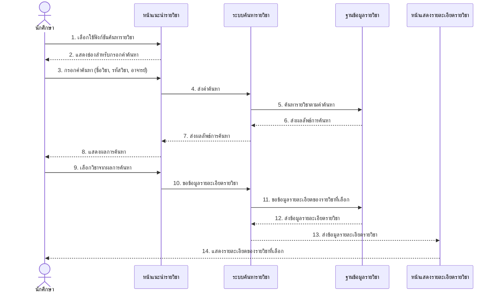
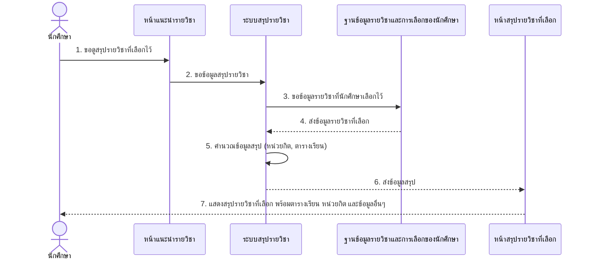
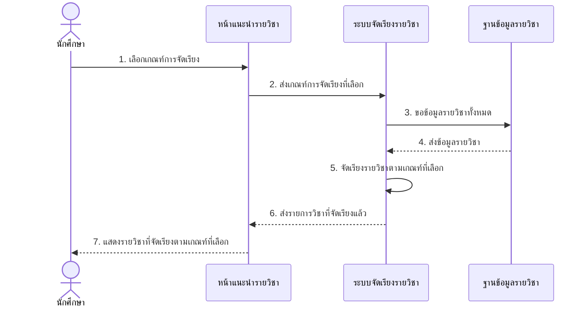
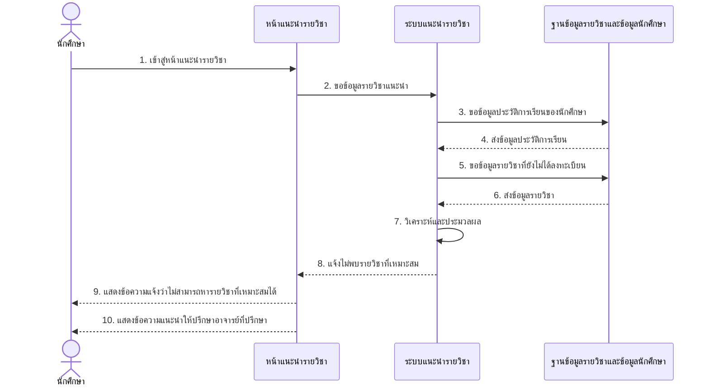
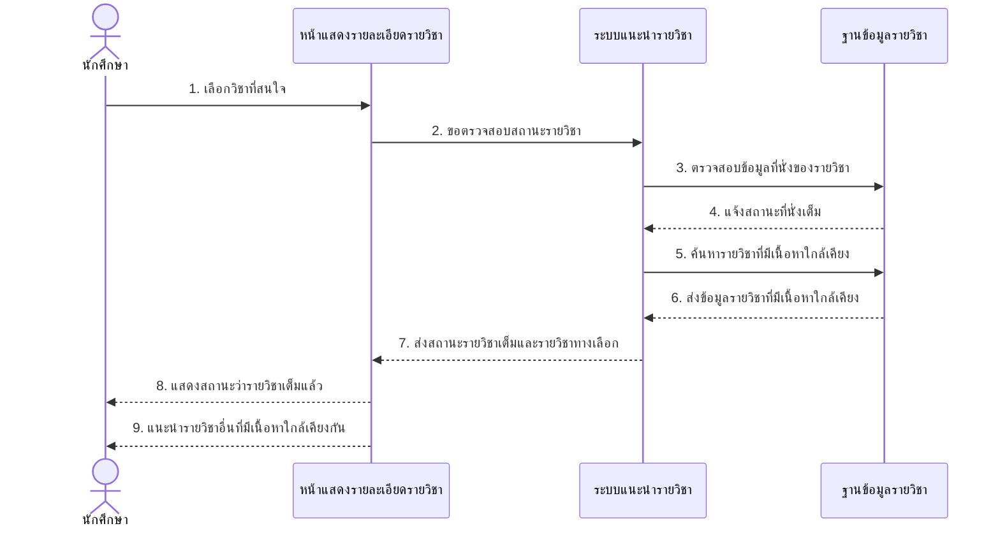

# Sequence Diagram สำหรับ UCD2: ระบบแนะนำรายวิชา

ต่อไปนี้เป็น Sequence Diagram ที่แสดงขั้นตอนการทำงานของระบบแนะนำรายวิชาตาม UCD2

## Sequence Diagram สำหรับการแนะนำรายวิชา (Recommend Course)

## Sequence Diagram สำหรับการค้นหารายวิชา (Search Course)

## Sequence Diagram สำหรับการดูสรุปรายวิชาที่เลือก (Summary)

## Sequence Diagram สำหรับการจัดเรียงรายวิชา (Sorting Ranking)

## Sequence Diagram กรณีไม่พบรายวิชาที่เหมาะสม (Exception)

## Sequence Diagram กรณีรายวิชามีจำนวนที่นั่งเต็ม (Exception)

