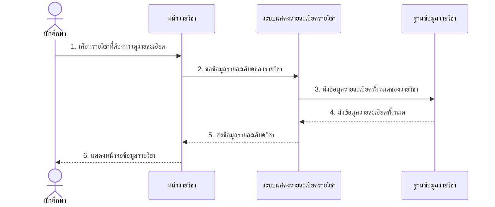
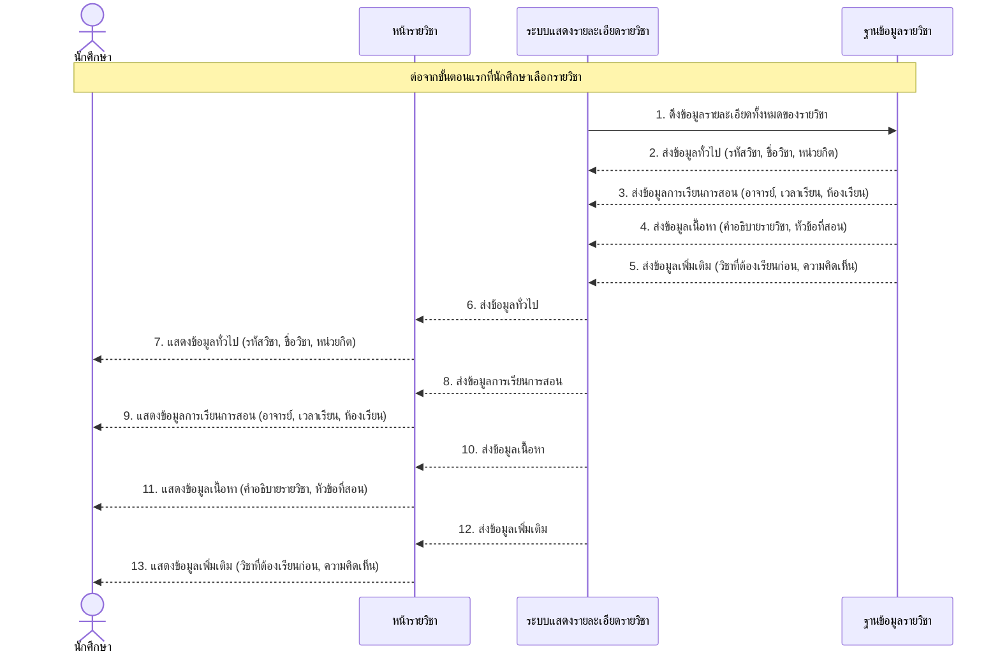
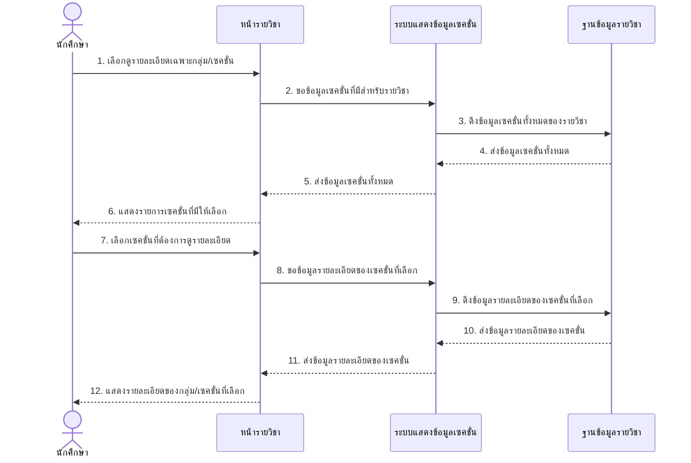
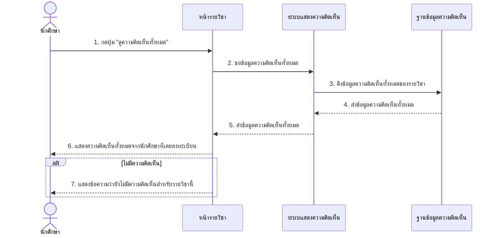
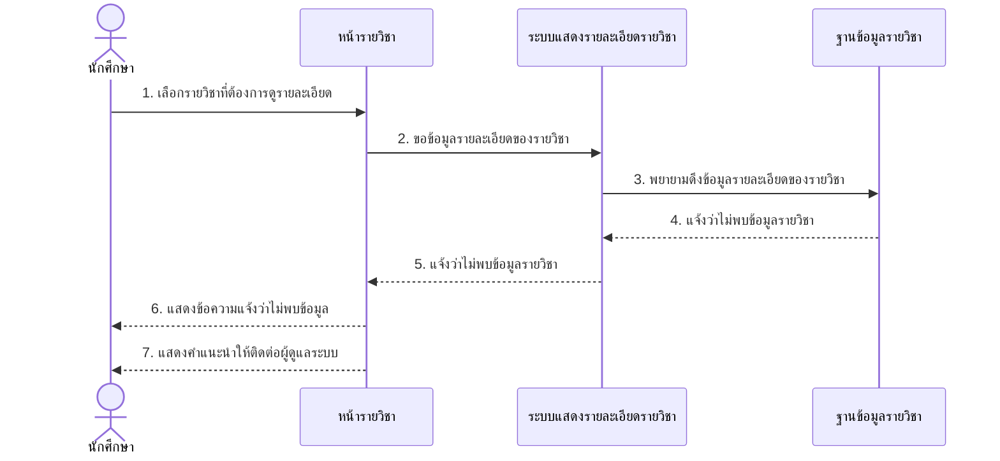
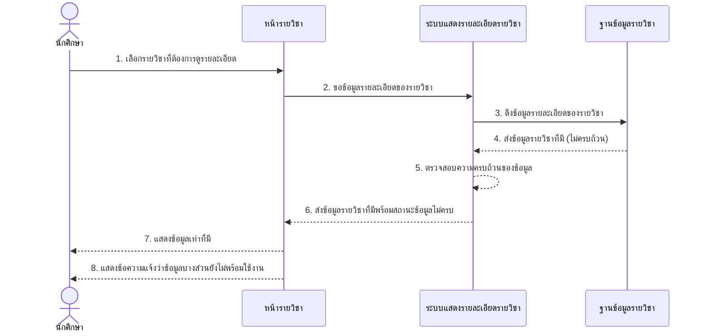

# Sequence Diagram สำหรับ UCD3: แสดงรายละเอียดรายวิชา

ต่อไปนี้เป็น Sequence Diagram ที่แสดงขั้นตอนการทำงานของระบบแสดงรายละเอียดรายวิชาตาม UCD3

## Sequence Diagram หลักสำหรับการแสดงรายละเอียดรายวิชา (Course Detail)

## Sequence Diagram การแสดงรายละเอียดรายวิชาแบบเต็ม (Show Detail Course)

## Sequence Diagram การดูรายละเอียดเฉพาะกลุ่ม/เซคชั่น (View Multiple Sections)

## Sequence Diagram การดูความคิดเห็นทั้งหมด (View All Comments)

## Sequence Diagram กรณีไม่พบข้อมูลรายวิชา (Exception)

## Sequence Diagram กรณีข้อมูลไม่ครบถ้วน (Exception)

