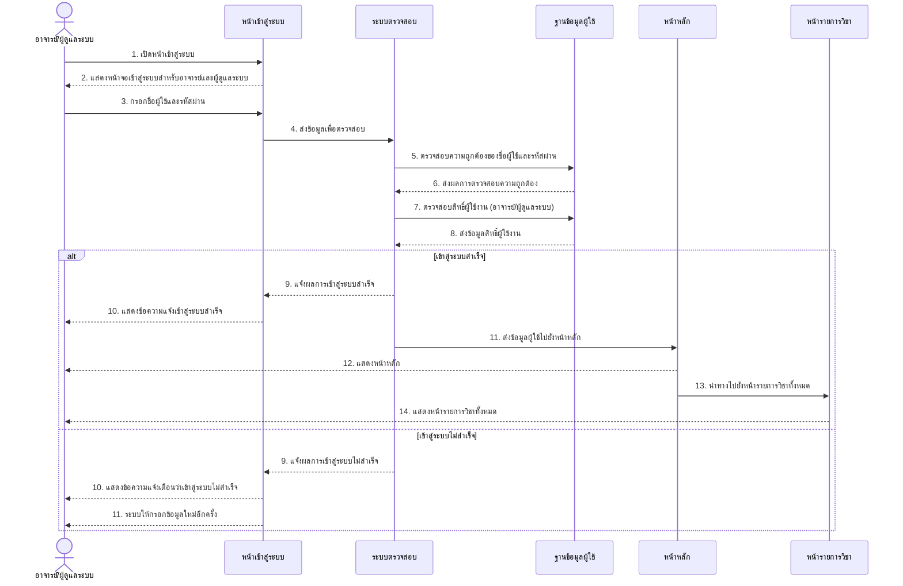
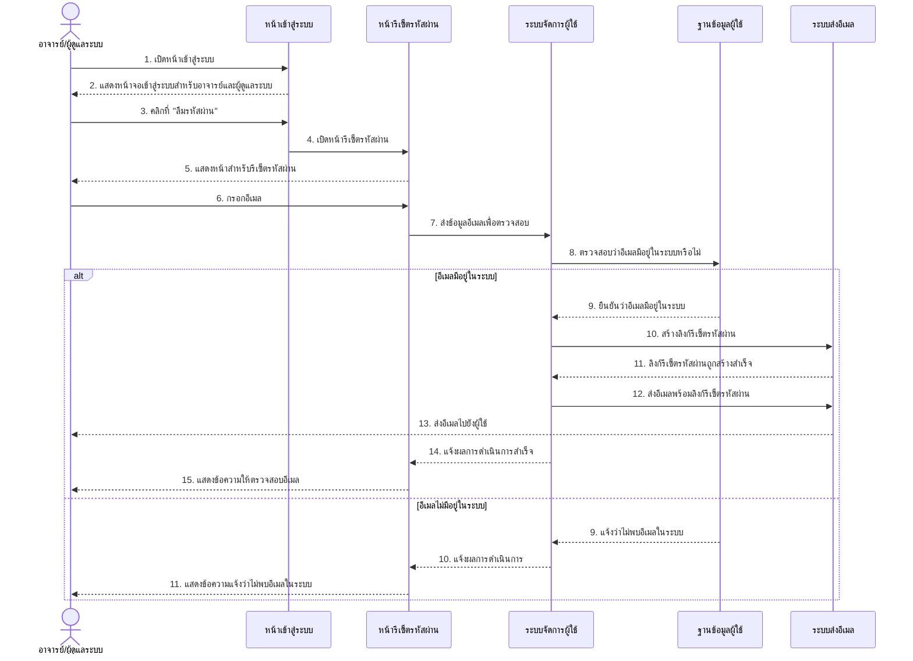
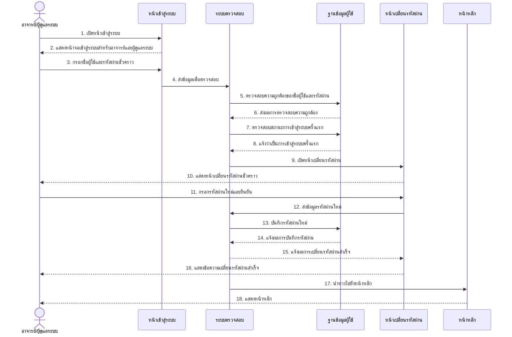
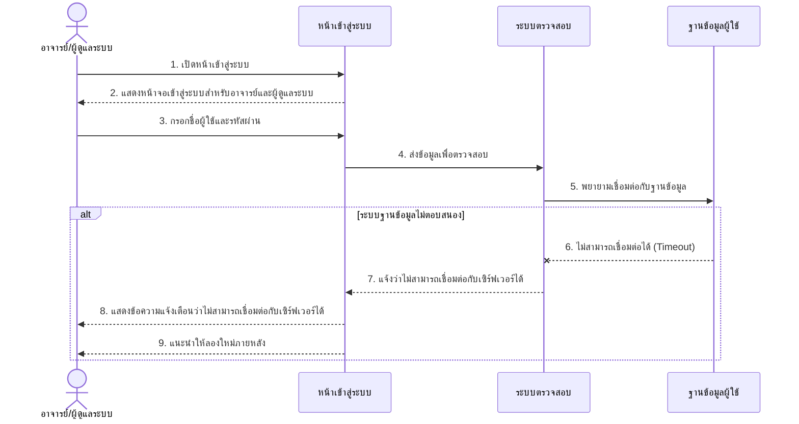
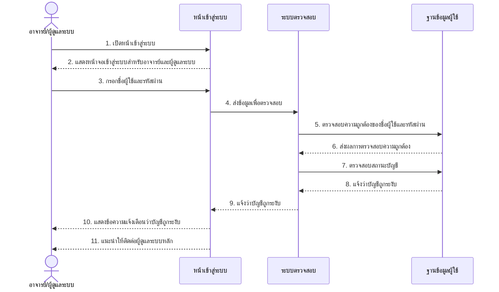
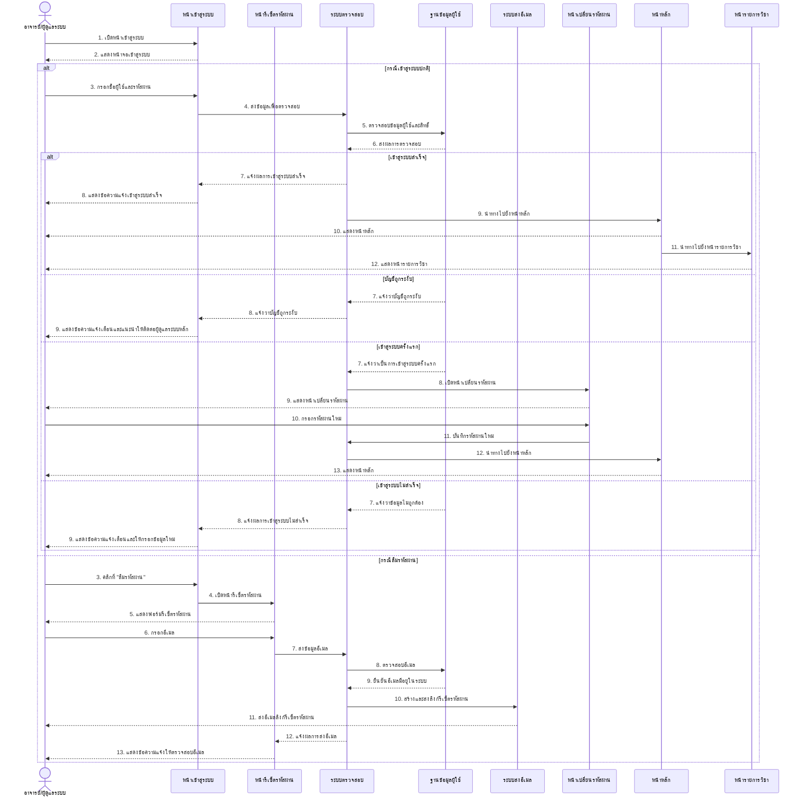

# Sequence Diagram สำหรับ UCD4: ระบบเข้าสู่ระบบสำหรับอาจารย์และผู้ดูแลระบบ

ต่อไปนี้เป็น Sequence Diagram ที่แสดงขั้นตอนการทำงานของระบบเข้าสู่ระบบสำหรับอาจารย์และผู้ดูแลระบบตาม UCD4

## Sequence Diagram หลักสำหรับการเข้าสู่ระบบของอาจารย์และผู้ดูแลระบบ

## Sequence Diagram กรณีลืมรหัสผ่าน

## Sequence Diagram กรณีเข้าสู่ระบบครั้งแรก

## Sequence Diagram กรณีระบบไม่ตอบสนอง (Exception)

## Sequence Diagram กรณีบัญชีถูกระงับ (Exception)

## Sequence Diagram ภาพรวมของระบบเข้าสู่ระบบสำหรับอาจารย์และผู้ดูแลระบบ

